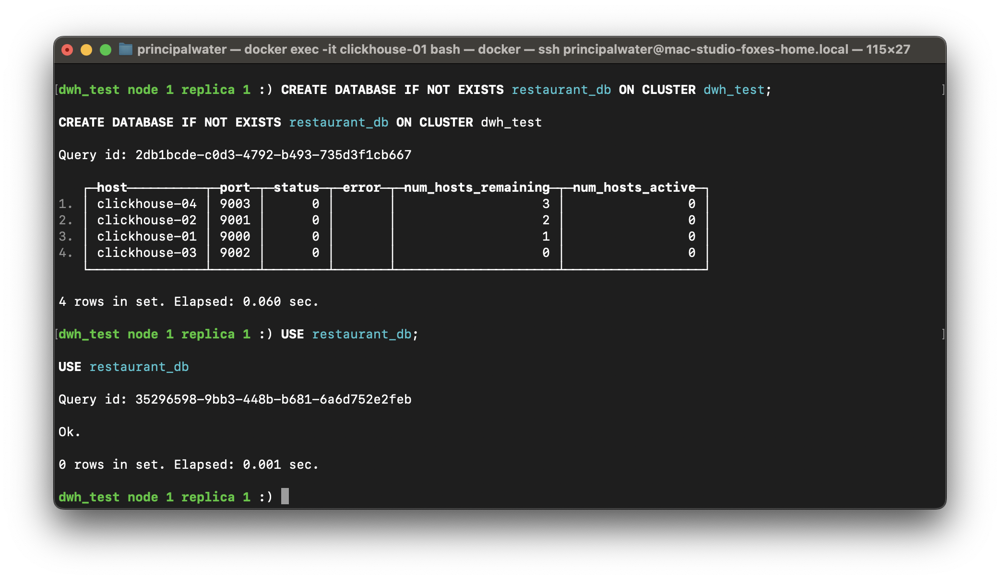
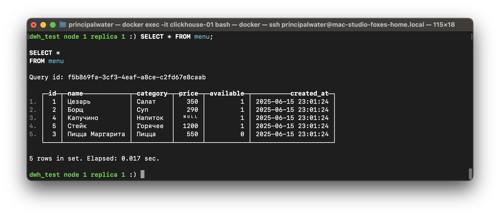

# Homework #3: Работа с SQL в ClickHouse

## Описание задания

В этом задании вы освоите базовые и продвинутые SQL-операции в ClickHouse на реальном бизнес-кейсе ("Меню ресторана"), а также познакомитесь с особенностями работы с данными в кластере ClickHouse.

В рамках задания вам предстоит:
- Создать новую базу данных.
- Разработать и наполнить данными таблицу с бизнес-логикой.
- Провести полный цикл операций CRUD.
- Изучить работу с партиционированием и дополнительными функциями ClickHouse.
- Познакомиться с материализацией таблиц и операциями с партициями (ATTACH, DETACH, DROP).
- Оценить работу с распределёнными и системными таблицами.

## Цель

В результате выполнения задания вы:
- Освоите основные SQL-операции в ClickHouse.
- Научитесь проектировать таблицы с учетом особенностей движка MergeTree, партиционирования и типов данных.
- Практически освоите работу с кластерами ClickHouse (репликация, ON CLUSTER).
- Получите навыки модификации структуры таблиц, управления данными и работы с партициями.

## Критерии сдачи

Задание считается выполненным, если:
- По каждому пункту задания представлен пошаговый отчёт, подтверждённый логами или скриншотами.
- Продемонстрировано корректное выполнение всех этапов (создание БД, работа с таблицей, CRUD, изменение схемы, выборки, материализация, операции с партициями).
- Отчёт (этот README) оформлен пошагово, содержит все необходимые команды, пояснения и результаты.
- Все скриншоты приложены согласно регламенту: `../screenshots/hw03_clickhouse-deployment/<имя_по_шагу>.png`

## Компетенции

В ходе выполнения вы отработаете навыки:
- Проектирования и управления структурой данных в ClickHouse.
- Написания и оптимизации SQL-запросов под особенности ClickHouse.
- Управления таблицами, партициями, репликацией в кластере.

---

## Шаг 1: Создание базы данных

```sql
CREATE DATABASE IF NOT EXISTS restaurant_db ON CLUSTER dwh_test;
USE restaurant_db;
```

**Database Creation**  


---

## Шаг 2: Создание таблицы для бизнес-кейса “Меню ресторана”

```sql
CREATE TABLE IF NOT EXISTS menu ON CLUSTER dwh_test (
    id UInt32 COMMENT 'Уникальный идентификатор блюда',
    name String COMMENT 'Название блюда',
    category LowCardinality(String) COMMENT 'Категория (салат, горячее и т.д.)',
    price Nullable(Float32) COMMENT 'Цена в рублях',
    available UInt8 COMMENT 'Наличие блюда (1 — да, 0 — нет)',
    created_at DateTime DEFAULT now() COMMENT 'Дата и время добавления'
) ENGINE = MergeTree()
PARTITION BY category
ORDER BY id;
```

Обоснование архитектурных решений:
- LowCardinality для category — часто повторяющиеся категории ускоряют работу.
- Nullable для price — иногда цена может быть неизвестна.
- Комментарии к каждому полю — для читаемости.
- created_at с default — полезно для анализа истории изменений.
- Партиционирование по category позволяет эффективно управлять данными по категориям и демонстрировать операции с партициями.

**Table Schema Creation**  


---

## Шаг 3: Вставка данных

```sql
INSERT INTO menu (id, name, category, price, available) VALUES
(1, 'Цезарь', 'Салат', 350.00, 1),
(2, 'Борщ', 'Суп', 290.00, 1),
(3, 'Пицца Маргарита', 'Пицца', 550.00, 0),
(4, 'Капучино', 'Напиток', NULL, 1),
(5, 'Стейк', 'Горячее', 1200.00, 1);
```

**Inserting Data**  


---

## Шаг 4: CRUD-операции

```sql
-- SELECT (Read)
SELECT * FROM menu;

-- UPDATE (ClickHouse: INSERT SELECT для overwrite, либо ALTER UPDATE)
ALTER TABLE menu ON CLUSTER dwh_test UPDATE price = 360 WHERE name = 'Цезарь';

-- DELETE (ClickHouse: ALTER DELETE)
ALTER TABLE menu ON CLUSTER dwh_test DELETE WHERE id = 3;
```

> ClickHouse не поддерживает стандартные UPDATE/DELETE, используется ALTER.

**CRUD Operations - SELECT**  


**CRUD Operations - UPDATE**  


---

## Шаг 5: Добавление/удаление полей

```sql
-- Добавим новые поля
ALTER TABLE menu ON CLUSTER dwh_test ADD COLUMN calories UInt16 DEFAULT 0 COMMENT 'Калорийность';
ALTER TABLE menu ON CLUSTER dwh_test ADD COLUMN is_vegan UInt8 DEFAULT 0 COMMENT 'Веганское блюдо';

-- Удалим ненужные поля
ALTER TABLE menu ON CLUSTER dwh_test DROP COLUMN available;
ALTER TABLE menu ON CLUSTER dwh_test DROP COLUMN created_at;
```

**Table Alteration - ADD COLUMN**  


**Table Alteration - DROP COLUMN**  


---

## Шаг 6: Выборка из sample dataset

```sql
-- Пример: выборка из nyc_taxi.trips_small
SELECT trip_id FROM nyc_taxi.trips_small WHERE payment_type = 1 LIMIT 10;
```

**Sample Dataset Select**  


---

## Шаг 7: Материализация таблицы

```sql
CREATE TABLE menu_copy ON CLUSTER dwh_test AS menu;
```

**Table Materialization**  


---

## Шаг 8: Операции с партициями

```sql
-- (Для демонстрации — если есть партиционирование по какому-то полю)

-- DETACH PARTITION
ALTER TABLE menu_copy ON CLUSTER dwh_test DETACH PARTITION 'Салат';

-- ATTACH PARTITION (локально, на одной реплике)
ALTER TABLE menu_copy ATTACH PARTITION 'Салат';

-- DROP PARTITION
ALTER TABLE menu_copy ON CLUSTER dwh_test DROP PARTITION 'Салат';
```
> Примечание:
Команда ATTACH PARTITION ... ON CLUSTER не поддерживается в большинстве версий ClickHouse. Используйте её только локально, на одной из реплик таблицы. Репликация восстановит партицию на остальных узлах автоматически.

> Для таблицы с партиционированием по category partition_expr — это значение категории (например, 'Салат').

**Partition Operations**  


---

## Шаг 9: Добавление новых данных

```sql
-- INSERT data
INSERT INTO menu (id, name, category, price, calories, is_vegan) VALUES
(6, 'Гаспачо', 'Суп', 310.00, 80, 1);

-- READ result
SELECT * FROM menu;
```

**Insert After Partition Operations**  
