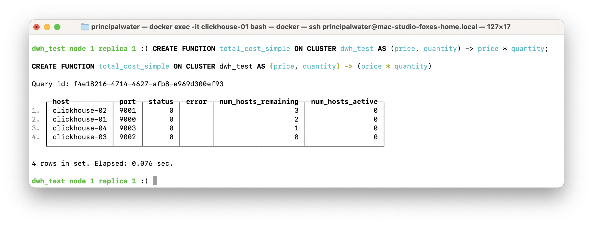

# Homework #4: Агрегатные функции, работа с типами данных и UDF в ClickHouse

## Общее описание задания

_Примечание: Все SELECT-запросы (не DDL) выполнялись из интерфейса Metabase, развернутого через Terraform-пайплайн из каталога [`../additional/bi-infra`](../additional/bi-infra). Metabase подключён к кластеру ClickHouse (`dwh_test`) по протоколу HTTP (порт 8123) через виртуальный хост (`host.docker.internal`). ClickHouse Keeper обеспечивает внутреннюю репликацию, а клиентские SQL-запросы отправляются напрямую на кластер через порт 8123._

_Такой подход позволяет выполнять запросы из удобного UI, оперативно видеть результаты и получать скриншоты непосредственно из интерфейса бизнес-аналитики._

**Варианты выполнения задания:**
- [Базовые агрегатные функции и типы данных ClickHouse](#1-агрегатные-функции)
- [Вариант 1. SQL User-Defined Functions (UDF)](#3-user-defined-functions-udfs) — создание пользовательских функций на SQL для обработки данных прямо в ClickHouse.  
- [Вариант 2. Executable User-Defined Functions (EUDF)](#4-executable-user-defined-functions-eudf) — использование внешних исполняемых функций на Python для расширения возможностей ClickHouse (см. ниже).  

**Суть:**
- Вариант 1 — только SQL UDF, встроенные выражения.
- Вариант 2 — Python-функции (исполняемые), развёртываемые в кластере через пайплайн.

Цель: Научиться работать с агрегатными функциями, типами данных и пользовательскими функциями (UDF) в ClickHouse.

Задачи:
- Создать базу данных и таблицу для хранения транзакций.
- Заполнить таблицу тестовыми данными с заданным распределением.
- Выполнить запросы с использованием агрегатных функций для анализа данных.
- Применить функции для работы с типами данных.
- Создать и использовать пользовательские функции (UDF) на примере Python.

Критерии оценки:
- Корректность и полнота выполнения всех пунктов задания.
- Использование всех требуемых SQL-конструкций и функций.
- Наличие скриншотов с результатами выполнения запросов.
- Правильное создание и применение UDF.

Детализированное описание задания и критериев оценки
- [Google Doc (онлайн)](https://docs.google.com/document/d/1hHqRv7lUUDmDkhzXrd0GIx7deF9Ez4mKpoYzHtDjoqQ/edit?tab=t.0)
- [PDF-версия из репозитория](../materials/hw04_clickhouse-functions/ClickHouse%20Homework.%20UDF,%20Aggregate%20Functions%20and%20working%20with%20data%20types.pdf)

---

## Предварительная подготовка

### Создание базы данных `otus_default`

_SQL:_  
```sql
CREATE DATABASE IF NOT EXISTS otus_default ON CLUSTER dwh_test;
```

_Комментарий:_ Создание базы данных с использованием кластера `dwh_test`.  

### Создание таблицы `transactions`

_SQL:_  
```sql
CREATE TABLE otus_default.transactions
ON CLUSTER dwh_test
(
    transaction_id   UInt32,
    user_id          UInt32,
    product_id       UInt32,
    quantity         UInt8,
    price            Float32,
    transaction_date Date
)
ENGINE = MergeTree()
ORDER BY (transaction_id);
```

_Комментарий:_ Создание таблицы с необходимой структурой и типами данных на кластере `dwh_test`.  

**Результат исполнения:**


---

### Заполнение таблицы тестовыми данными

### Для теста в задании испольузуется вставка 5 миллионов строк с распределением по user_id, product_id, quantity, price и дате

_SQL:_  
```sql
INSERT INTO otus_default.transactions
SELECT
    number + 1 AS transaction_id,
    -- С вероятностью 70% user_id от 101 до 120, с 30% — от 121 до 200
    if(rand() % 10 < 7, 101 + intDiv(rand(), 100000000) % 20, 121 + intDiv(rand(), 100000000) % 80) AS user_id,
    -- Чаще встречаются популярные продукты: с вероятностью 60% product_id от 501 до 510, иначе от 511 до 600
    if(rand() % 10 < 6, 501 + intDiv(rand(), 1000000) % 10, 511 + intDiv(rand(), 1000000) % 90) AS product_id,
    -- quantity: 70% — 1–2, 20% — 3–5, 10% — 6–10
    multiIf(rand() % 10 < 7, 1 + rand() % 2, rand() % 10 < 9, 3 + rand() % 3, 6 + rand() % 5) AS quantity,
    -- price: популярные товары дешевле, остальные дороже, немного шума
    if(product_id <= 510, 5 + rand() % 1000 / 100, 20 + rand() % 4000 / 100) + (rand() % 1000) / 10000.0 AS price,
    -- Даты транзакций распределены по июню 2024 г.
    toDate('2024-06-01') + intDiv(number, 166666) % 30 AS transaction_date
FROM numbers(5000000);
```

_Комментарий:_ Заполнение таблицы с распределением значений и смещением для имитации реальных данных.  

**Результат исполнения:**


---

## 1. Агрегатные функции

_SQL:_  
```sql
SELECT 
    sum(price * quantity) AS total_revenue,
    avg(price * quantity) AS avg_revenue_per_transaction,
    sum(quantity) AS total_quantity_sold,
    count(DISTINCT user_id) AS unique_buyers
FROM otus_default.transactions;
```

_Комментарий:_  
- Общий доход рассчитывается как сумма произведений цены и количества по всем транзакциям.  
- Средний доход с одной сделки — среднее значение произведения цены и количества.  
- Общее количество проданной продукции — сумма всех quantity по транзакциям.  
- Количество уникальных пользователей определяется подсчётом уникальных user_id.  

**Результат исполнения:**


---

## 2. Функции для работы с типами данных

_SQL:_
```sql
SELECT
  transaction_id,
  toString(transaction_date) AS transaction_date_str,
  substring(transaction_date_str, 1, 4) AS year_substring,
  substring(transaction_date_str, 6, 2) AS month_substring,
  splitByChar('-', transaction_date_str)[1] AS year_by_split,
  splitByChar('-', transaction_date_str)[2] AS month_by_split,
  toYear(transaction_date) AS year_func,
  toMonth(transaction_date) AS month_func,
  price,
  round(price) AS rounded_price,
  toString(transaction_id) AS transaction_id_str
FROM otus_default.transactions
LIMIT 5;
```

_Комментарий:_
- Преобразование даты в строку (YYYY-MM-DD) и дальнейшее извлечение года/месяца из этой строки.
- Год и месяц транзакции определяются несколькими способами:
    - **Извлечение подстрок:** `substring(transaction_date_str, 1, 4)` — год, `substring(transaction_date_str, 6, 2)` — месяц;
    - **Разделение строки по символу '-':** `splitByChar('-', transaction_date_str)[1]` — год, `[2]` — месяц;
    - **Встроенные функции ClickHouse:** `toYear(transaction_date)`, `toMonth(transaction_date)`.
- Округление цены и преобразование transaction_id в строку.
- Все операции демонстрируются в одном запросе для наглядности.

**Результат исполнения:**


---

## 3. User-Defined Functions (UDFs)

В ClickHouse поддерживается создание пользовательских функций (SQL UDF), что позволяет расширять функциональность без необходимости писать внешний код.

> **Примечание:**  
> В актуальных версиях ClickHouse (25.5.x и новее) для создания функции во всём кластере используется конструкция с `ON CLUSTER`.  
> Пример синтаксиса:
> ```sql
> CREATE FUNCTION [IF NOT EXISTS] name ON CLUSTER cluster AS (parameter0, ...) -> expression
> ```
> Это обеспечивает автоматическое создание функции на всех нодах кластера и корректную работу в распределённых запросах.

---

### 3.1. Создайте простую SQL UDF для расчёта общей стоимости транзакции

_SQL:_
```sql
CREATE FUNCTION IF NOT EXISTS total_cost_simple ON CLUSTER dwh_test AS (price, quantity) -> (price * quantity);
```

_Комментарий:_  
Функция `total_cost_simple` принимает цену и количество, возвращая произведение — общую стоимость транзакции.  
Создаётся сразу на всех нодах кластера.

**Результат исполнения:**



---

### 3.2. Используйте созданную SQL UDF для расчёта общей цены для каждой транзакции

_SQL:_
```sql
SELECT
    transaction_id,
    price,
    quantity,
    otus_default.total_cost_simple(price, quantity) AS total_transaction_cost
FROM otus_default.transactions
LIMIT 5;
```

**Результат исполнения:**


---

### 3.3. Создайте UDF для классификации транзакций на «высокоценные» и «малоценные» на основе порогового значения (например, 100)

_SQL:_
```sql
CREATE FUNCTION IF NOT EXISTS classify_transaction_simple ON CLUSTER dwh_test AS (total_cost) -> (
    CASE WHEN total_cost >= 100 THEN 'high_value'
         ELSE 'low_value'
    END
);
```

_Комментарий:_  
Функция возвращает строку-категорию на основе суммы транзакции.  
Создаётся сразу на всех нодах кластера.

**Результат исполнения:**


---

### 3.4. Примените обе UDF для категоризации каждой транзакции

_SQL:_
```sql
SELECT
    transaction_id,
    total_cost_simple(price, quantity) AS total_transaction_cost,
    classify_transaction_simple(total_cost_simple(price, quantity)) AS transaction_category
FROM otus_default.transactions
LIMIT 5;
```

**Результат исполнения:**


Теперь SQL UDF доступны во всех нодах кластера и используются в обычных запросах.

---


---

## 4. Executable User-Defined Functions (EUDF)

[К началу задания](#homework-4-агрегатные-функции-работа-с-типами-данных-и-udf-в-clickhouse)

### Описание

Вариант 2 задания посвящён работе с Executable User-Defined Functions (EUDF) — внешним функциям на Python, автоматически интегрируемым в ClickHouse-кластер пайплайном на базе Terraform (каталог [../additional/clickhouse/](../additional/clickhouse/)). Вся логика, конфигурация и развёртывание функций максимально автоматизированы.

⸻

### Автоматизация через пайплайн

Структура каталогов:
- `user_scripts/` — все Python-файлы-функции, например:
  - `total_cost.py`
  - `classify_transaction.py`
  - `detect_fraud.py`
  - `test_function.py`
- `samples/` — шаблоны и декларации:
  - `user_defined_functions.xml` — полный список функций для ClickHouse.
  - `patch_user_defined.py` — скрипт для автопатча конфигурации.
- основной пайплайн: `main.tf`

Как это работает (ключевые шаги):
- Копирование Python-скриптов во все контейнеры ClickHouse:  
  `/var/lib/clickhouse/user_scripts/`
- Копирование XML-декларации функций:  
  `/var/lib/clickhouse/user_defined/user_defined_functions.xml`
- Патчинг конфига clickhouse-server (`config.xml`):
  - Автоматически добавляет секции `<user_defined_executable_functions_config>` и `<user_scripts_path>`
  - Обеспечивает работу всех функций без ручного DDL.
- Установка прав на скрипты (`chmod +x`).
- Поддержка изменений: любые новые функции или изменения в XML/скриптах автоматически распространяются на все узлы.

**Результат деплоя Terraform пайплайна:**


### Декларация функций (`user_defined_functions.xml`)

<details>
<summary>Смотреть фактическое содержимое декларации</summary>

```xml
<functions>
    <function>
        <type>executable</type>
        <name>test_function_python</name>
        <return_type>String</return_type>
        <argument>
            <type>UInt64</type>
            <name>value</name>
        </argument>
        <format>TabSeparated</format>
        <command>test_function.py</command>
    </function>
    <function>
        <type>executable</type>
        <name>detect_fraud</name>
        <return_type>String</return_type>
        <argument>
            <type>Float64</type>
            <name>price</name>
        </argument>
        <argument>
            <type>UInt32</type>
            <name>product_id</name>
        </argument>
        <argument>
            <type>Date</type>
            <name>transaction_date</name>
        </argument>
        <format>TabSeparated</format>
        <command>detect_fraud.py</command>
    </function>
    <function>
        <type>executable</type>
        <name>classify_transaction</name>
        <return_type>String</return_type>
        <argument>
            <type>Float64</type>
            <name>price</name>
        </argument>
        <argument>
            <type>UInt32</type>
            <name>quantity</name>
        </argument>
        <argument>
            <type>UInt32</type>
            <name>product_id</name>
        </argument>
        <argument>
            <type>UInt32</type>
            <name>user_id</name>
        </argument>
        <format>TabSeparated</format>
        <command>classify_transaction.py</command>
    </function>
    <function>
        <type>executable</type>
        <name>total_cost</name>
        <return_type>Float64</return_type>
        <argument>
            <type>Float64</type>
            <name>price</name>
        </argument>
        <argument>
            <type>UInt32</type>
            <name>quantity</name>
        </argument>
        <format>TabSeparated</format>
        <command>total_cost.py</command>
    </function>
</functions>
```

</details>

### Примеры SQL и результаты (с скриншотами)

#### 4.1. Рассчитать общую цену для каждой транзакции

```sql
SELECT 
    transaction_id, 
    total_cost(price, quantity) AS total_price 
FROM otus_default.transactions 
LIMIT 5;
```

**Результат исполнения:**


#### 4.2. Категоризация транзакций

```sql
SELECT 
    transaction_id, 
    price, 
    quantity, 
    product_id, 
    user_id,
    classify_transaction(price, quantity, product_id, user_id) AS transaction_category
FROM otus_default.transactions 
LIMIT 5;
```

**Результат исполнения:**


#### 4.3. Детектирование мошенничества

```sql
SELECT 
    transaction_id, 
    price, 
    product_id,
    transaction_date,
    detect_fraud(price, product_id, transaction_date) AS fraud_status
FROM otus_default.transactions 
LIMIT 5;
```

**Результат исполнения:**


### Где смотреть исходники и пайплайн

- Все скрипты EUDF: [user_scripts/](../additional/clickhouse/user_scripts/)
- Декларация функций: [user_defined_functions.xml](../additional/clickhouse/samples/user_defined_functions.xml)
- Код пайплайна: [main.tf](../additional/clickhouse/main.tf)
- Скриншоты: [screenshots каталога](../screenshots/hw04_clickhouse-functions/)

### Важно

- Все функции управляются централизованно (добавление = скрипт + декларация + запуск пайплайна).
- Никакой ручной DDL не нужно: регистрация и обновление происходят автоматически на всех узлах.
- Права, структура, консистентность поддерживаются пайплайном.

---

## Итоги

- Оба варианта задания (SQL UDF и EUDF) реализованы в единой инфраструктуре ClickHouse, с автоматизацией деплоя и регистрацией функций на всех нодах кластера.
- Все SQL-запросы, скрипты и скриншоты представлены для проверки.
- Вопросы по настройке и расширению пайплайна — см. документацию и комментарии в исходных каталогах.
