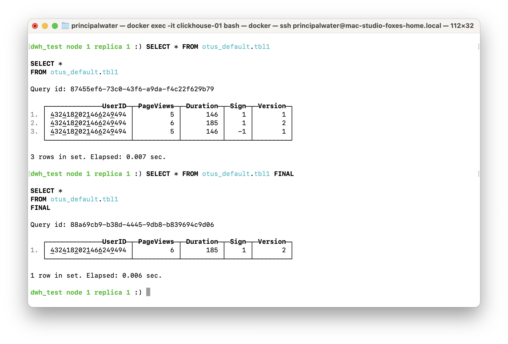
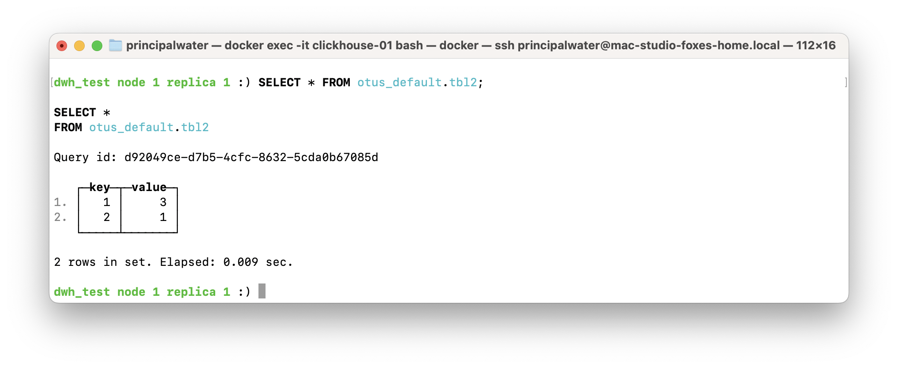
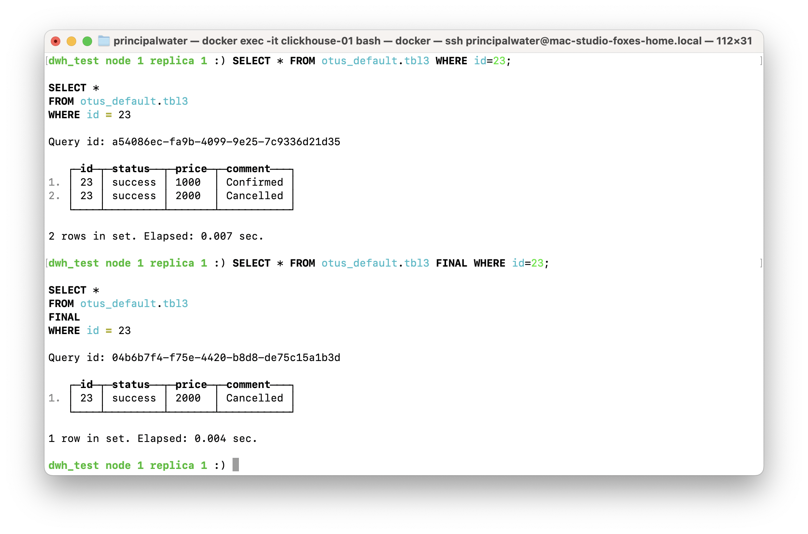
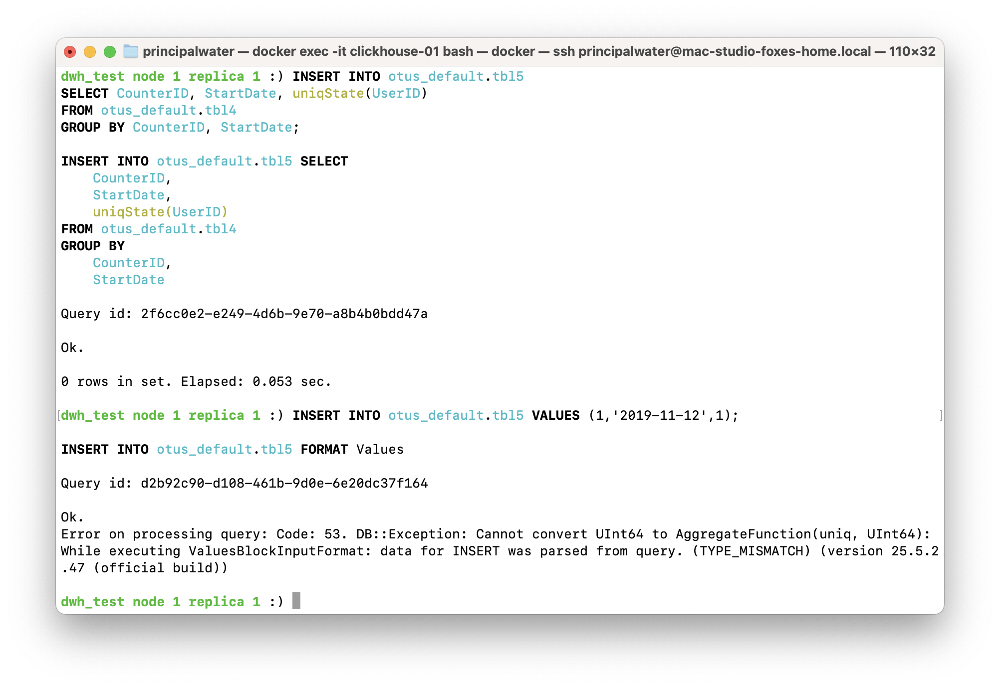
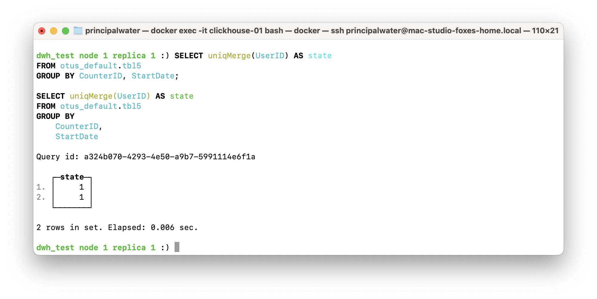
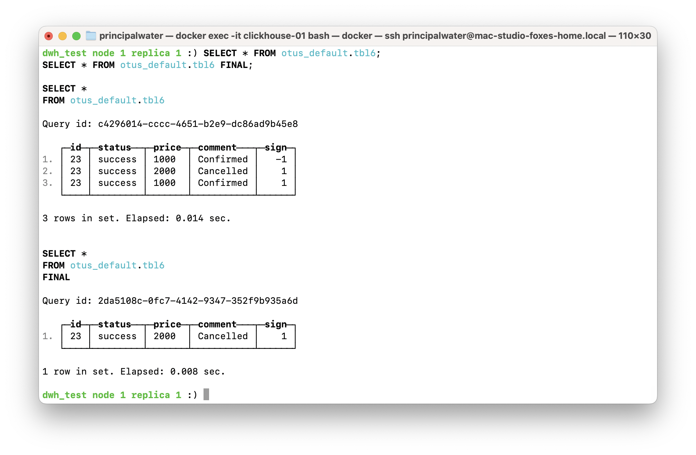

# Homework #5: Движки MergeTree Family

## Общее описание задания

Цель: Изучить и на практике сравнить ключевые движки семейства MergeTree в ClickHouse, освоить особенности хранения, агрегации, дедупликации и логического удаления на реальных кейсах.

Задачи:
- По заданным схемам таблиц и примерам вставки определить и реализовать подходящий движок MergeTree.
- Заполнить пропуски в DDL/DML, запустить тесты, убедиться в корректности вывода.
- Сравнить результаты SELECT/FINAL и объяснить разницу для каждого сценария.
- Описать проблемы при реализации, пути их решения и рекомендации для практического применения.

Критерии оценки:
- Полнота и корректность описания сценариев для каждого движка.
- Корректная реализация всех DDL/DML и получение требуемых результатов.
- Глубина анализа выбора движка и выявленных проблем.
- Структурированность, прозрачность и воспроизводимость отчета, ссылки на актуальные источники.

Детализированное описание задания и критериев оценки:
- [Google Doc (онлайн)](https://docs.google.com/document/d/1lpwH2-HjRFx3VRYFSx8Jc9ww9UGBgw_91d16fjIxgDQ/edit?tab=t.0)
- [PDF-версия из репозитория](../materials/hw05_mergetree-engines/ДЗ%20к%20занятию%20%22Движки%20MergeTree%20Family%22.pdf)

---

## Предварительная подготовка

### Создание базы данных `otus_default`

_SQL:_  
```sql
CREATE DATABASE IF NOT EXISTS otus_default ON CLUSTER dwh_test;
```
_Комментарий:_ Создание базы данных с использованием кластера `dwh_test`.  

---

## Оглавление

- [1. Таблица `tbl1` — дедупликация версий и сравнение движков](#1-таблица-tbl1--дедупликация-версий-и-сравнение-движков)
- [2. Таблица `tbl2` — суммирование числовых показателей с помощью SummingMergeTree](#2-таблица-tbl2--суммирование-числовых-показателей-с-помощью-summingmergetree)
- [3. Таблица `tbl3` — хранение только последней версии по ключу с помощью ReplacingMergeTree](#3-таблица-tbl3--хранение-только-последней-версии-по-ключу-с-помощью-replacingmergetree)
- [4. Агрегация уникальных пользователей с помощью MergeTree и AggregatingMergeTree](#4-агрегация-уникальных-пользователей-с-помощью-mergetree-и-aggregatingmergetree)
- [5. Таблица `tbl6` — логическое удаление и дедупликация с помощью CollapsingMergeTree](#5-таблица-tbl6--логическое-удаление-и-дедупликация-с-помощью-collapsingmergetree)
- [Общие выводы по заданию](#общие-выводы-по-заданию)
- [Список источников](#список-источников)

---

## Архитектура кластера

Кластер состоит из 4 ClickHouse-нод (2 шарда × 2 реплики) и 3 Keeper-нод. Используется Terraform-пайплайн [`base-infra/clickhouse`](../base-infra) для развертывания. Все DDL-запросы выполняются с использованием `ON CLUSTER dwh_test` для обеспечения согласованности схемы на всех нодах. Это позволяет создавать таблицы одновременно на всех репликах и шардах, предотвращая рассогласование данных между ними.

- Версия ClickHouse: **25.5.2.47 (official build)**
- Все SQL-запросы выполнялись из-под `clickhouse-client` внутри контейнера `clickhouse-01`.

---

## Ссылки на задание

- [Google Doc (online)](https://docs.google.com/document/d/1lpwH2-HjRFx3VRYFSx8Jc9ww9UGBgw_91d16fjIxgDQ/edit?tab=t.0)
- [PDF-версия из репозитория](../materials/hw05_mergetree-engines/ДЗ%20к%20занятию%20%22Движки%20MergeTree%20Family%22.pdf)

---

## Общее описание и цели домашнего задания

Цель — освоить основные движки семейства MergeTree в ClickHouse, разобраться в особенностях хранения и дедупликации данных на примере типовых кейсов (таблицы tbl1–tbl6), научиться правильно подбирать движок под задачу.

Ключевые задачи: определить подходящий движок для каждого кейса, реализовать DDL/DML, проанализировать и сравнить результат работы движков, объяснить выбор, дать рекомендации и ссылки на источники.

Критерии оценки: корректность работы запросов, воспроизводимость сценариев, аргументированный выбор движка, прозрачность и полнота отчёта, ссылки на актуальные источники.

Структура отчёта соответствует требованиям — отдельный разбор по каждому кейсу (tbl1–tbl6), с пояснениями и результатами.

---

## Выполнение задания

### 1. Таблица `tbl1` — дедупликация версий и сравнение движков

Для решения задачи дедупликации версий в таблице `tbl1` использован движок `VersionedCollapsingMergeTree(Sign, Version)`. Ниже приведён полный пример с DDL, DML и результатами запросов, выполненный с использованием кластера `dwh_test`, базы `otus_default` и таблицы `otus_default.tbl1`.

```sql
CREATE TABLE otus_default.tbl1 ON CLUSTER dwh_test
(
    UserID UInt64,
    PageViews UInt8,
    Duration UInt8,
    Sign Int8,
    Version UInt8
)
ENGINE = VersionedCollapsingMergeTree(Sign, Version)
ORDER BY UserID;

INSERT INTO otus_default.tbl1 VALUES (4324182021466249494, 5, 146, -1, 1);
INSERT INTO otus_default.tbl1 VALUES (4324182021466249494, 5, 146, 1, 1),(4324182021466249494, 6, 185, 1, 2);
```

В таблицу внесены тестовые значения. Далее выводим содержимое таблицы и сравниваем с результатом после выполнения мерджа (`FINAL`).

```sql
SELECT * FROM otus_default.tbl1;
SELECT * FROM otus_default.tbl1 FINAL;
```

**Результат исполнения:**



**Развёрнутый анализ и комментарии:**

Для задачи дедупликации версий данных в таблице `tbl1` выбор пал на движок `VersionedCollapsingMergeTree`, который расширяет возможности классического `CollapsingMergeTree` за счёт добавления версии (`Version`) для каждой записи. Это позволяет не только "складывать" пары строк с противоположными знаками (`Sign`), но и учитывать порядок версий, что критично для корректной дедупликации и восстановления актуального состояния данных.

- **Почему VersionedCollapsingMergeTree?**  
  Этот движок идеально подходит, когда необходимо хранить историю изменений с возможностью однозначного определения актуальной версии записи. Он решает проблему, с которой сталкивается обычный `CollapsingMergeTree`: отсутствие учёта версий может привести к некорректному объединению строк при мерджах, что особенно важно при параллельных вставках и обновлениях.  
  В нашем кейсе поле `Version` служит дополнительным ключом для определения порядка и разрешения конфликтов, что гарантирует, что итоговый набор данных после мерджа и применения `FINAL` будет содержать только актуальные версии записей.

- **Почему не другие движки?**  
  - `ReplacingMergeTree` — хорошо подходит для замены записей по ключу, но не гарантирует корректную дедупликацию при наличии нескольких версий с разными значениями и не учитывает знаки (`Sign`). Кроме того, он может оставить "призрачные" дубликаты при мерджах без `FINAL`.
  - `CollapsingMergeTree` — учитывает `Sign` для удаления пар записей, но не поддерживает версионирование, что может привести к потере информации при сложных сценариях с несколькими версиями.
  - `SummingMergeTree` и другие агрегирующие движки — не предназначены для дедупликации с учётом версий и знаков, а ориентированы на агрегацию числовых данных.

- **Кейсы использования и ограничения:**  
  - Используется в системах с необходимостью аудита, версионирования данных и безопасного удаления записей.  
  - Требует аккуратного проектирования схемы и понимания семантики `Sign` и `Version`.
  - Производительность при мерджах может снижаться из-за необходимости сравнения версий и обработки знаков.  
  - Использование `FINAL` запроса необходимо для получения актуального состояния, но он может быть ресурсоёмким и не рекомендуется для регулярного использования в продуктивных запросах.  
  - Возможны сложности с пониманием логики удаления и восстановления данных при неправильном использовании `Sign` и `Version`.

- **Практические рекомендации:**  
  - Всегда тестировать поведение мерджей и дедупликации на реальных данных.  
  - Использовать `VersionedCollapsingMergeTree` там, где важна строгая консистентность версий и возможность однозначного восстановления состояния.  
  - Избегать частого вызова `FINAL` в рабочих запросах, предпочитая проектировать запросы с учётом семантики движка.  
  - Ознакомиться с типовыми ошибками, такими как неправильное использование знаков или версий, что может привести к потере данных или некорректному результату.

Данный выбор движка подтверждается практиками из Подробнее: [4](https://altinity.com/blog/understanding-collapsing-and-versioned-collapsing-mergetree-engines), Подробнее: [6](https://clickhouse.com/docs/en/engines/table-engines/mergetree-family/versionedcollapsingmergetree), где подробно описаны сценарии использования и ограничения `VersionedCollapsingMergeTree`, а также сравнительный анализ с другими движками MergeTree.

---

### 2. Таблица `tbl2` — суммирование числовых показателей с помощью SummingMergeTree

Для задачи суммирования числовых показателей в таблице `tbl2` использован движок `SummingMergeTree()`. Ниже приведён полный пример с DDL, DML и результатами запросов, выполненный с использованием кластера `dwh_test`, базы `otus_default` и таблицы `otus_default.tbl2`.

```sql
CREATE TABLE otus_default.tbl2 ON CLUSTER dwh_test
(
    key UInt32,
    value UInt32
)
ENGINE = SummingMergeTree()
ORDER BY key;

INSERT INTO otus_default.tbl2 VALUES (1,1),(1,2),(2,1);
```

После вставки значений запросом получаем текущее содержимое таблицы. Для SummingMergeTree итоговая агрегация происходит при фоне/мерджах, но для простых сценариев (как здесь) фактическая агрегация сразу видна по ключу.

```sql
SELECT * FROM otus_default.tbl2;
```

**Результат исполнения:**



**Развёрнутый анализ и комментарии:**

- **Почему SummingMergeTree?**  
  Этот движок идеально подходит для задач, где требуется суммирование числовых показателей по ключу. Он автоматически агрегирует данные при мердже, что упрощает хранение и обработку метрик и счётчиков. Использование `SummingMergeTree` позволяет эффективно накапливать значения и получать итоговые суммы без дополнительной логики на стороне клиента.

- **Проблемы и ограничения:**  
  - До выполнения фонового слияния (merge) таблица может содержать дублирующиеся строки с неполной агрегацией.  
  - Запросы с высокой нагрузкой на слияния могут влиять на производительность, если merge не происходит регулярно.  
  - Следует внимательно проектировать ключ сортировки, чтобы избежать некорректной агрегации.

- **Решения и рекомендации:**  
  - Следует учитывать задержку в агрегации данных из-за асинхронных мерджей.  
  - Автоматизировать фоновые процессы слияния для своевременного обновления агрегированных данных.  
  - Проектировать архитектуру с учётом особенностей работы движка и мерджей.

- **Применимость и типичные ошибки:**  
  - Рекомендуется для счётчиков, метрик и других случаев, где необходима простая агрегация сумм.  
  - Не подходит для строковых или сложных структур данных, где требуется более сложная дедупликация или версионирование.  
  - Риски рассинхронизации данных возникают при неправильном проектировании ключей сортировки, что может привести к некорректной агрегации.

Данный выбор движка подтверждается практиками из Подробнее: [1](https://clickhouse.com/docs/en/engines/table-engines/mergetree-family/summingmergetree), Подробнее: [5](https://quoeamaster.medium.com/5-things-you-need-to-know-about-clickhouse-summingmergetree-engine-7ae0c3b63d1d), где подробно описаны сценарии использования, рекомендации по проектированию и эксплуатационные аспекты `SummingMergeTree`.

---

### 3. Таблица `tbl3` — хранение только последней версии по ключу с помощью ReplacingMergeTree

Для задачи хранения только последней версии записи по ключу в таблице `tbl3` использован движок `ReplacingMergeTree()`. Ниже приведён полный пример с DDL, DML и результатами запросов, выполненный с использованием кластера `dwh_test`, базы `otus_default` и таблицы `otus_default.tbl3`.

```sql
CREATE TABLE otus_default.tbl3 ON CLUSTER dwh_test
(
    id Int32,
    status String,
    price String,
    comment String
)
ENGINE = ReplacingMergeTree()
PRIMARY KEY (id)
ORDER BY (id, status);

INSERT INTO otus_default.tbl3 VALUES (23, 'success', '1000', 'Confirmed');
INSERT INTO otus_default.tbl3 VALUES (23, 'success', '2000', 'Cancelled');
```

В таблицу внесены две строки для одного и того же id и статуса, но с разными price и comment. Проверяем, что таблица содержит обе записи, и как движок ведет себя при мердже (`FINAL`).

```sql
SELECT * FROM otus_default.tbl3 WHERE id=23;
SELECT * FROM otus_default.tbl3 FINAL WHERE id=23;
```

**Результат исполнения:**



**Развёрнутый анализ и комментарии:**

- **Почему ReplacingMergeTree?**  
  Движок ReplacingMergeTree используется для хранения только актуальной (последней) версии записи по ключу. При мерджах по умолчанию остаётся последняя по порядку вставки строка, дубликаты убираются. Это удобно для логирования, аудита и хранения мастер-данных, где важна последняя версия.

- **Проблемы и решения:**  
  - Без указания версии в определении движка при мердже определяется только по порядку вставки, возможны разные результаты при одновременных вставках на разных нодах.  
  - Для строгой консистентности рекомендуется использовать версионное поле (`version`) в ReplacingMergeTree, чтобы явно определять, какая запись самая свежая.

- **Сценарии и pitfalls:**  
  - Используется для хранения мастер-данных, витрин, логов последних статусов.  
  - Не гарантирует строгую консистентность при параллельных изменениях без поля версии.  
  - FINAL-запросы ресурсоёмки и не должны использоваться в production-аналитике.

ReplacingMergeTree оптимален для простых задач хранения последней версии по ключу, если не требуется точное версионирование на уровне поля.

Подробнее: [2](https://clickhouse.com/docs/en/engines/table-engines/), [4](https://altinity.com/blog/understanding-collapsing-and-versioned-collapsing-mergetree-engines)

---

### 4. Агрегация уникальных пользователей с помощью MergeTree и AggregatingMergeTree

В этом разделе объединён разбор двух связанных таблиц — событийной (`tbl4`, MergeTree) и витрины предагрегированных уникальных пользователей (`tbl5`, AggregatingMergeTree).

#### 4.1. DDL и DML для обеих таблиц с комментариями

```sql
-- tbl4: хранение событий в разрезе счетчиков и дат
CREATE TABLE otus_default.tbl4 ON CLUSTER dwh_test
(
    CounterID UInt8,
    StartDate Date,
    UserID UInt64
)
ENGINE = MergeTree()
PARTITION BY toYYYYMM(StartDate)
ORDER BY (CounterID, StartDate);

-- Наполнение и агрегация
INSERT INTO otus_default.tbl4 VALUES (0, '2019-11-11', 1);
INSERT INTO otus_default.tbl4 VALUES (1, '2019-11-12', 1);

-- tbl5: хранение предагрегированных уникальных пользователей через AggregateFunction
CREATE TABLE otus_default.tbl5 ON CLUSTER dwh_test
(
    CounterID UInt8,
    StartDate Date,
    UserID AggregateFunction(uniq, UInt64)
)
ENGINE = AggregatingMergeTree()
PARTITION BY toYYYYMM(StartDate)
ORDER BY (CounterID, StartDate);

-- Наполнение и агрегация из tbl4
INSERT INTO otus_default.tbl5
SELECT CounterID, StartDate, uniqState(UserID)
FROM otus_default.tbl4
GROUP BY CounterID, StartDate;

-- Попытка вставить напрямую число вместо агрегированного состояния
INSERT INTO otus_default.tbl5 VALUES (1,'2019-11-12',1);
```

**Результат исполнения:**



> Таблица `tbl4` содержит "сырые" события по счетчикам и датам, а `tbl5` — предагрегированные состояния по уникальным пользователям.

#### 4.2. Краткий смысл конструкции

`tbl4` хранит события в разрезе счетчиков и дат, `tbl5` предназначена для предагрегированных значений с использованием агрегирующей функции `uniqState`. Такой подход позволяет эффективно хранить и агрегировать уникальных пользователей для аналитических витрин.

#### 4.3. Пример аналитического запроса и результат

```sql
SELECT uniqMerge(UserID) AS state 
FROM otus_default.tbl5 
GROUP BY CounterID, StartDate;
```

- Для одной группы результат state = 1 (см. скриншот):



#### 4.4. Примечание об ошибке

При попытке выполнить обычный INSERT с числом вместо результата uniqState выдается ошибка:  
Exception on client: Code: 53. DB::Exception: Cannot convert UInt64 to AggregateFunction(uniq, UInt64): ... (TYPE_MISMATCH)  
Причина — для полей типа AggregateFunction допускается только результат специальных агрегационных функций (`uniqState`, `sumState`, и т.п.), нельзя напрямую вставлять числовые значения.

#### 4.5. Развёрнутый анализ и комментарии

- **Почему выбран AggregatingMergeTree:**  
  Этот движок позволяет хранить агрегированные состояния для сложных аналитик (уникальные пользователи, суммы, медианы) с последующей агрегацией через специальные функции `...Merge`. Это снижает нагрузку на вычисления при аналитических запросах и позволяет строить витрины pre-aggregated данных.

- **Проблемы и решения:**  
  - Обычный insert числовых значений невозможен, только агрегатные состояния (`uniqState`, `sumState`, и т.д.).
  - Для последующего анализа требуется использовать функцию типа `uniqMerge` (или соответствующую для вашей агрегации).
  - Ошибки типа TYPE_MISMATCH возникают при попытке вставить не агрегатное состояние.

- **Сценарии и pitfalls:**  
  - Используется для витрин метрик, pre-aggregates (например, уникальные пользователи по дням/неделям).
  - Не использовать для OLTP или хранения детальных событий — только для агрегированных витрин.
  - Требует понимания работы AggregateFunction-типов и ограничения на insert.
  - Для получения результата всегда использовать соответствующую функцию Merge.

AggregatingMergeTree оптимален для задач, где требуется хранение и дальнейшая агрегация pre-aggregated данных. Важно корректно формировать insert через агрегационные функции, иначе возникает ошибка TYPE_MISMATCH.

Подробнее: [3](https://blog.det.life/i-spent-8-hours-learning-the-clickhouse-mergetree-table-engine-511093777daa), [2](https://clickhouse.com/docs/en/engines/table-engines/)

---

### 5. Таблица `tbl6` — логическое удаление и дедупликация с помощью CollapsingMergeTree

Для демонстрации логического удаления и дедупликации записей в таблице `tbl6` используется движок `CollapsingMergeTree`. Он позволяет реализовать "soft delete" и автоматическое схлопывание дубликатов на уровне хранения.

#### 5.1. DDL и DML-примеры
```sql
CREATE TABLE otus_default.tbl6 ON CLUSTER dwh_test
(
    id Int32,
    status String,
    price String,
    comment String,
    sign Int8
)
ENGINE = CollapsingMergeTree(sign)
PRIMARY KEY (id)
ORDER BY (id, status);

INSERT INTO otus_default.tbl6 VALUES (23, 'success', '1000', 'Confirmed', 1);
INSERT INTO otus_default.tbl6 VALUES (23, 'success', '1000', 'Confirmed', -1), (23, 'success', '2000', 'Cancelled', 1);
```

В таблицу добавлены три строки: одна с подтверждением и `sign=1`, дублирующая ей с `sign=-1` (логическое удаление), а также запись с другим `price`/`comment` и `sign=1`. Посмотрим результат до и после выполнения `FINAL`.

#### 5.2. SELECT-запросы и результаты

```sql
SELECT * FROM otus_default.tbl6;
SELECT * FROM otus_default.tbl6 FINAL;
```

- Для обычного SELECT — две строки (Confirmed/-1 и Cancelled/1), см. первый скриншот.
- Для FINAL — либо только строка с Cancelled/1, либо только Confirmed/1 (в зависимости от порядка вставки), см. второй скриншот.



#### 5.3. Анализ и пояснения

- **Почему CollapsingMergeTree?**  
  CollapsingMergeTree — идеальный движок для логического удаления и дедупликации. Каждой строке сопоставляется "sign" (1 или -1). При мерджах пары с одинаковыми ключами, но противоположными знаками схлопываются, что позволяет реализовать логику "soft delete" и автоматическую дедупликацию.
- **Проблемы и решения:**  

  - В исходной выборке (без FINAL) могут оставаться дубли — пока не выполнено слияние, логически удалённые строки видны.
  - Итоговая выборка (с FINAL) корректно отражает только актуальные записи.
  - Требуется строгое соблюдение ключей, иначе схлопывание не произойдёт.
- **Сценарии и pitfalls:**  

  - Отлично подходит для логического удаления, событийных таблиц, журналов изменений.
  - Не рекомендуется для данных без явной семантики удаления или без строгого контроля ключей.
  - Использование FINAL даёт гарантированную "чистую" картину, но ресурсоёмко.

CollapsingMergeTree — эффективный выбор для логического удаления и дедупликации на лету. Требует внимательного проектирования ключей и контроля генерации sign.

Подробнее: [4](https://altinity.com/blog/understanding-collapsing-and-versioned-collapsing-mergetree-engines), [6](https://clickhouse.com/docs/en/engines/table-engines/mergetree-family/versionedcollapsingmergetree)

---


## Общие выводы по заданию

В ходе выполнения домашнего задания были подробно изучены и практически протестированы пять ключевых движков семейства MergeTree: `MergeTree`, `SummingMergeTree`, `ReplacingMergeTree`, `CollapsingMergeTree` и `VersionedCollapsingMergeTree`. Для каждого типа были реализованы сценарии, отражающие реальные задачи хранения, дедупликации, агрегации и логического удаления данных.

### Сравнительный анализ движков MergeTree Family

| Движок                      | Основной сценарий                                       | Плюсы                                                                                 | Минусы                                                                                  | Когда не применять                                                         |
|-----------------------------|---------------------------------------------------------|---------------------------------------------------------------------------------------|-----------------------------------------------------------------------------------------|---------------------------------------------------------------------------|
| AggregatingMergeTree        | Хранение и агрегация агрегатных состояний (pre-aggregates), уникальных пользователей, витрин | Позволяет хранить pre-aggregates и эффективно считать итоговые значения с помощью функций Merge, снижает нагрузку на аналитику | Сложнее в использовании (нельзя вставлять обычные значения, только состояния), требует понимания AggregateFunction, ошибки TYPE_MISMATCH при ошибочном insert | Для хранения сырых событий и OLTP; не использовать без необходимости предагрегации |
| SummingMergeTree            | Агрегация числовых показателей по ключу                 | Автоматическое суммирование, простота для метрик и счетчиков                          | Не подходит для нечисловых данных, возможна задержка агрегации до merge                 | Для строковых/сложных данных, когда важна точная история изменений         |
| ReplacingMergeTree          | Хранение только последней версии по ключу               | Простая дедупликация, эффективен для мастер-данных и витрин                           | Без поля версии возможна неконсистентность, FINAL-запросы ресурсоёмки                   | Для сценариев с одновременными изменениями без версии, OLTP                |
| CollapsingMergeTree         | Логическое удаление с помощью Sign                      | Позволяет реализовать soft delete, эффективен для логов                               | Не учитывает версии, сложная логика при параллельных изменениях                         | Для задач, где требуется версионирование или строгая дедупликация          |
| VersionedCollapsingMergeTree| Дедупликация с учётом версий и логическое удаление      | Гарантирует консистентность, хранит историю, поддерживает сложные сценарии изменений  | Сложность настройки, высокая нагрузка при merge, FINAL-запросы ресурсоёмки              | Для простых OLAP-таблиц, где не требуется история и сложное удаление        |

### Плюсы и минусы, лучшие практики и риски
- **AggregatingMergeTree** — хранит агрегатные состояния (например, уникальных пользователей, суммы, pre-aggregates), что позволяет ускорять сложную аналитику. Важно корректно формировать insert через агрегатные функции, иначе возникают ошибки TYPE_MISMATCH.
  
  Пример правильных insert-операций — Подробнее: [3](https://blog.det.life/i-spent-8-hours-learning-the-clickhouse-mergetree-table-engine-511093777daa).

- **SummingMergeTree** — отлично подходит для счетчиков и метрик, но не для строковых данных или сценариев с удалениями. Возможна задержка между вставкой и итоговой агрегацией.

  Рекомендации и ограничения по проектированию см. Подробнее: [1](https://clickhouse.com/docs/en/engines/table-engines/mergetree-family/summingmergetree), Подробнее: [5](https://quoeamaster.medium.com/5-things-you-need-to-know-about-clickhouse-summingmergetree-engine-7ae0c3b63d1d).

- **ReplacingMergeTree** — удобен для хранения мастер-данных, но для строгой консистентности необходима версия. Без неё возможны "фантомные" дубликаты при параллельных вставках.
  
  Обзор и сравнение с Collapsing — Подробнее: [2](https://clickhouse.com/docs/en/engines/table-engines/), Подробнее: [4](https://altinity.com/blog/understanding-collapsing-and-versioned-collapsing-mergetree-engines).

- **CollapsingMergeTree** — реализует soft delete, но не поддерживает версионирование. Требует аккуратного использования знака и понимания логики merge.

  Практические сценарии и риски рассмотрены в Подробнее: [4](https://altinity.com/blog/understanding-collapsing-and-versioned-collapsing-mergetree-engines), Подробнее: [6](https://clickhouse.com/docs/en/engines/table-engines/mergetree-family/versionedcollapsingmergetree).

- **VersionedCollapsingMergeTree** — наиболее мощный для сценариев с историей изменений, но сложен в эксплуатации и требует грамотного проектирования схемы (Sign + Version).

  Подробный разбор логики версий и sign — Подробнее: [4](https://altinity.com/blog/understanding-collapsing-and-versioned-collapsing-mergetree-engines), Подробнее: [6](https://clickhouse.com/docs/en/engines/table-engines/mergetree-family/versionedcollapsingmergetree).

### Ключевые рекомендации по выбору движка
- Всегда исходить из бизнес-требований: требуется ли история, дедупликация, агрегация, soft delete.
- Для аналитических витрин и метрик — использовать SummingMergeTree или AggregatingMergeTree.
- Для мастер-данных с возможностью обновления — ReplacingMergeTree с явным полем версии.
- Для сценариев с логическим удалением — CollapsingMergeTree или VersionedCollapsingMergeTree (если важна история).
- Не злоупотреблять FINAL-запросами — они ресурсоёмки и не предназначены для регулярных аналитических запросов.
- Тщательно проектировать ключ сортировки и партиционирования для предотвращения ошибок в дедупликации и агрегации.
- Провести нагрузочное тестирование на реальных объёмах данных — многие проблемы проявляются только при больших объёмах и параллелизме.

---

## Список источников

[1] https://clickhouse.com/docs/en/engines/table-engines/mergetree-family/summingmergetree  
[2] https://clickhouse.com/docs/en/engines/table-engines/  
[3] https://blog.det.life/i-spent-8-hours-learning-the-clickhouse-mergetree-table-engine-511093777daa  
[4] https://altinity.com/blog/understanding-collapsing-and-versioned-collapsing-mergetree-engines  
[5] https://quoeamaster.medium.com/5-things-you-need-to-know-about-clickhouse-summingmergetree-engine-7ae0c3b63d1d  
[6] https://clickhouse.com/docs/en/engines/table-engines/mergetree-family/versionedcollapsingmergetree  

---
