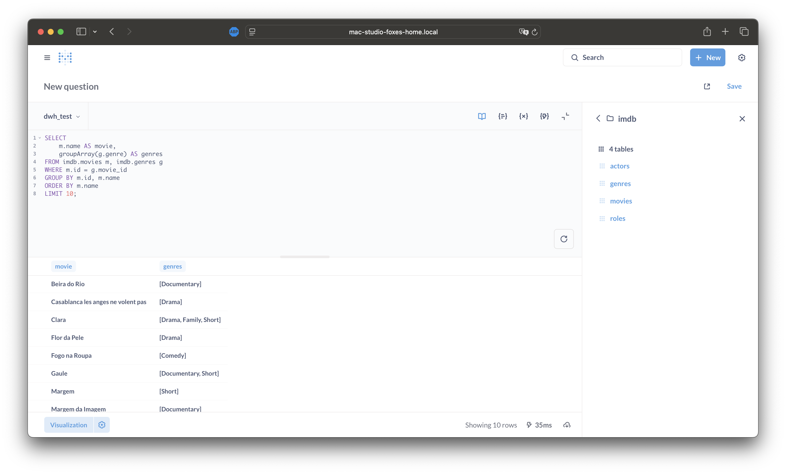

# Homework #6: Джойны и агрегации в ClickHouse

## Общее описание задания

**Цель:**  
- изучить синтаксис ClickHouse и базовые команды взаимодействия;
- освоить работу с джоинами, сложными типами данных и агрегацией;
- научиться создавать витрины данных.

**Задачи:**  
- создать базу данных и таблицы;
- загрузить данные из внешних источников;
- построить запросы с использованием JOIN, агрегаций и сложных типов данных;
- получить ответы на все поставленные запросы и представить результаты.

**Критерии оценки:**  
- задание считается выполненным, если:
    - создана БД и таблица, данные загружены;
    - представлены ответы на все запросы.

**Компетенции:**  
- управление и работа с данными;
- знать особенности хранения данных и формат запросов в ClickHouse;
- эффективно писать и оптимизировать запросы к ClickHouse для работы с большими объемами данных.

**Описание/Пошаговая инструкция выполнения домашнего задания:**  
Для выполнения домашнего задания используйте инструкцию по ссылке:  
- [Google Doc (online)](https://docs.google.com/document/d/1qIUv3RaRJ60boylxQF2rUdPcqNqAZa8V-yhGVbY6PBM/edit?usp=sharing)

На проверку отправьте текстовый документ, содержащий действия, вопросы и решение ДЗ. Рекомендуем размещать работы в отдельном Git-репозитории.

**Формат сдачи ДЗ:**  
Сделать отчет со всеми указанными запросами и результатами их выполнения.

---

## Архитектура кластера

Кластер состоит из 4 ClickHouse-нод (2 шарда × 2 реплики) и 3 Keeper-нод. Используется Terraform-пайплайн [`base-infra/clickhouse`](../base-infra) для развертывания. Все DDL-запросы выполняются с использованием `ON CLUSTER dwh_test` для обеспечения согласованности схемы на всех нодах.

- Версия ClickHouse: **25.5.2.47 (official build)**
- Все DDL-запросы выполнялись из-под `clickhouse-client` внутри контейнера `clickhouse-01`, SELECT-запросы в `Metabase`

_Примечание: Все SELECT-запросы (не DDL) выполнялись из интерфейса Metabase, развернутого через Terraform-пайплайн из каталога [`../additional/bi-infra`](../additional/bi-infra). Metabase подключён к кластеру ClickHouse (`dwh_test`) по протоколу HTTP (порт 8123) через виртуальный хост (`host.docker.internal`). ClickHouse Keeper обеспечивает внутреннюю репликацию, а клиентские SQL-запросы отправляются напрямую на кластер через порт 8123._

_Такой подход позволяет выполнять запросы из удобного UI, оперативно видеть результаты и получать скриншоты непосредственно из интерфейса бизнес-аналитики._

---

## Предварительная подготовка

### Создание базы данных `imdb`

_SQL:_  
```sql
CREATE DATABASE IF NOT EXISTS imdb ON CLUSTER dwh_test;
```
_Комментарий:_ Создание базы данных с использованием кластера `dwh_test`.

**IMDB Schema Diagram**  

> Диаграмма: связи между таблицами фильмов, жанров, актёров и ролей.

---

## Оглавление

- [Создание таблиц и загрузка данных](#создание-таблиц-и-загрузка-данных)
- [Жанры для каждого фильма](#найти-жанры-для-каждого-фильма)
- [Все фильмы, у которых нет жанра](#запросить-все-фильмы-у-которых-нет-жанра)
- [Полное пересечение таблицы “Фильмы” таблицей “Жанры”](#объединить-каждую-строку-из-таблицы-фильмы-с-каждой-строкой-из-таблицы-жанры)
- [Жанры для каждого фильма, НЕ используя INNER JOIN](#найти-жанры-для-каждого-фильма-не-используя-inner-join)
- [Все актеры и актрисы, снявшиеся в фильме в 2006 году](#найти-всех-актеров-и-актрис-снявшихся-в-фильме-в-2006-году)
- [Все фильмы, у которых нет жанра, определенные через ANTI JOIN](#запросить-все-фильмы-у-которых-нет-жанра-через-anti-join)
- [Дополнительно: Возможная проблема при импорте из S3](#возможная-проблема-при-импорте-из-s3)
- [Список источников](#список-источников)

---

## Создание таблиц и загрузка данных

```sql
CREATE TABLE IF NOT EXISTS imdb.actors ON CLUSTER dwh_test
(
    id         UInt32,
    first_name String,
    last_name  String,
    gender     FixedString(1)
)
ENGINE = MergeTree
ORDER BY (id, first_name, last_name, gender);

CREATE TABLE IF NOT EXISTS imdb.genres ON CLUSTER dwh_test
(
    movie_id  UInt32,
    genre     String
)
ENGINE = MergeTree
ORDER BY (movie_id, genre);

CREATE TABLE IF NOT EXISTS imdb.movies ON CLUSTER dwh_test
(
    id       UInt32,
    name     String,
    year     UInt32,
    rank     Float32 DEFAULT 0
)
ENGINE = MergeTree
ORDER BY (id, name, year);

CREATE TABLE IF NOT EXISTS imdb.roles ON CLUSTER dwh_test
(
    actor_id   UInt32,
    movie_id   UInt32,
    role       String,
    created_at DateTime DEFAULT now()
)
ENGINE = MergeTree
ORDER BY (actor_id, movie_id);
```

<details>
<summary>Смотреть скриншоты с результатами исполнения кода создания таблиц на кластере dwh_test</summary>

**Создание таблицы `imdb.actors`**


**Создание таблицы `imdb.genres`**


**Создание таблицы `imdb.movies`**


**Создание таблицы `imdb.roles`**


</details>

> Результат: успешное создание всех таблиц imdb в кластере.

**Загрузка данных из S3:**
```sql
INSERT INTO imdb.actors
SELECT *
FROM s3('https://datasets-documentation.s3.eu-west-3.amazonaws.com/imdb/imdb_ijs_actors.tsv.gz', 'TSVWithNames');

INSERT INTO imdb.genres
SELECT *
FROM s3('https://datasets-documentation.s3.eu-west-3.amazonaws.com/imdb/imdb_ijs_movies_genres.tsv.gz', 'TSVWithNames');

INSERT INTO imdb.movies
SELECT *
FROM s3('https://datasets-documentation.s3.eu-west-3.amazonaws.com/imdb/imdb_ijs_movies.tsv.gz', 'TSVWithNames');

INSERT INTO imdb.roles(actor_id, movie_id, role)
SELECT actor_id, movie_id, role
FROM s3('https://datasets-documentation.s3.eu-west-3.amazonaws.com/imdb/imdb_ijs_roles.tsv.gz', 'TSVWithNames');
```

<details>
<summary>Смотреть скриншоты с результатами исполнения кода загрузки и вставки данных IMDB из S3-файлов</summary>

**Загрузка данных `imdb.actors`**


**Загрузка данных `imdb.genres`**


**Загрузка данных `imdb.movies`**


**Загрузка данных `imdb.roles`**


</details>

> Результат: данные IMDB успешно загружены из S3-файлов.

_Примечание: в исходном файле задания указан неактуальный путь к s3 бакету для вставки данных в таблицу imdb.genres.
В настоящем отчете в коде указан актуальный доступный путь для получения данных - `imdb_ijs_genres` заменено на `imdb_ijs_movies_genres`._

---

## Найти жанры для каждого фильма

```sql
SELECT
    m.name AS movie,
    arrayJoin(arrayDistinct(groupArray(g.genre))) AS genre
FROM imdb.movies m
LEFT JOIN imdb.genres g ON m.id = g.movie_id
GROUP BY m.id, m.name
ORDER BY m.name
LIMIT 10;
```
**Описание происходящего на скриншоте**  

> Используется groupArray, arrayJoin, arrayDistinct — агрегируем жанры и превращаем в строку, нет дублей, работает быстро даже при множестве жанров для одного фильма.

_Примечание:_ Такой подход собирает все жанры фильма в массив, эффективно устраняя дубли, позволяет просто расширить до мультижанрового случая и хорошо масштабируется благодаря groupArray+arrayDistinct.

---

## Запросить все фильмы, у которых нет жанра

```sql
SELECT
    m.name AS movie
FROM imdb.movies m
LEFT JOIN imdb.genres g ON m.id = g.movie_id
WHERE NOT notEmpty(g.genre)
ORDER BY m.name
LIMIT 10;
```
**Описание происходящего на скриншоте**  

> Используется LEFT JOIN и ClickHouse-специфичная функция notEmpty(): так можно выбрать фильмы без жанра, включая случаи как с NULL, так и с пустой строкой. Если жанр есть (и он не пустой), строка не попадёт в результат.

> Достаточно условия по NOT notEmpty(), поскольку notEmpty в ClickHouse возвращает true только для непустых и не-NULL значений (одновременно проверяет и null, и ''). Это позволяет писать короче и эффективнее.

> **Оптимальнее всего** для больших таблиц использовать ANTI JOIN — см. далее в разделе [Все фильмы, у которых нет жанра, определенные через ANTI JOIN](#запросить-все-фильмы-у-которых-нет-жанра-через-anti-join)

---

## Объединить каждую строку из таблицы “Фильмы” с каждой строкой из таблицы “Жанры”

Для задачи полного декартова произведения (полного пересечения строк двух таблиц) используется следующий запрос:
```sql
SELECT
    m.name AS movie,
    g.genre
FROM imdb.movies m, imdb.genres g
ORDER BY m.name, g.genre
LIMIT 20;
```

- Такой запрос реализует декартово произведение — каждая строка из "Фильмы" сочетается с каждой строкой из "Жанры".
- Это стандартный синтаксис в ClickHouse для получения полной комбинации двух таблиц. Важно помнить, что ClickHouse сначала строит весь результат в памяти, а уже затем применяет LIMIT.
- Основная проблема — на больших таблицах такой запрос приведет к огромному количеству строк, быстро исчерпает выделенную память и завершится ошибкой "memory limit exceeded" (OOM), даже если LIMIT выставлен небольшим. Это ограничение архитектуры ClickHouse и большинства СУБД.
- На нашем кластере такой запрос приводит к ошибке OOM (скриншот ниже).

_Нагрузка на ноду ClickHouse во время исполнения запроса:_


_Код и текст ошибки ClickHouse по факту исполнения запроса:_


Для тестовых целей, чтобы проиллюстрировать работу пересечения, можно выполнить запрос с ограничением исходных таблиц (эмулируем сэмплирование), например:
```sql
SELECT
    m.name AS movie,
    g.genre
FROM
    (SELECT * FROM imdb.movies ORDER BY rand() LIMIT 10) m,
    (SELECT * FROM imdb.genres ORDER BY rand() LIMIT 5) g
ORDER BY m.name, g.genre
LIMIT 20;
```
- Важно: ClickHouse не поддерживает прямое сэмплирование для таких MergeTree-таблиц (SAMPLING_NOT_SUPPORTED), поэтому реальное сэмплирование возможно только через явное ограничение подзапроса.

_Скриншот результата выполнения такого запроса:_  


---

## Найти жанры для каждого фильма, НЕ используя INNER JOIN

```sql
SELECT
    m.name AS movie,
    groupArray(g.genre) AS genres
FROM imdb.movies m, imdb.genres g
WHERE m.id = g.movie_id
GROUP BY m.id, m.name
ORDER BY m.name
LIMIT 10;
```
**Описание происходящего на скриншоте**  

> Используется WHERE для соединения, что часто быстрее в ClickHouse (семантика равна inner join, но проще парсеру).

_Примечание:_ WHERE как альтернатива INNER JOIN — позволяет ClickHouse "распараллелить" фильтрацию, иногда такой синтаксис быстрее на больших таблицах.

---

## Найти всех актеров и актрис, снявшихся в фильме в 2006 году

**Оптимизация и особенности**  
- Использование `PREWHERE` вместо `WHERE` ускоряет выполнение при большом количестве строк, если таблица партиционирована по фильтруемому полю.
- Использование агрегатных функций (`groupArray`, `any`) позволяет получить все фильмы за год по каждому актёру или одну строку на актёра без дубликатов. Это быстрее, чем DISTINCT.
- Если требуется только список актёров, достаточно выбрать `a.first_name, a.last_name` (без агрегатных функций или дополнительных полей).

```sql
-- Вариант с PREWHERE (эффективно, если таблица movies партиционирована по году)
SELECT
    a.first_name,
    a.last_name,
    groupArray(m.name) AS movies
FROM imdb.actors a
INNER JOIN imdb.roles r ON a.id = r.actor_id
INNER JOIN imdb.movies m ON r.movie_id = m.id
PREWHERE m.year = 2006
GROUP BY a.first_name, a.last_name
ORDER BY a.last_name, a.first_name
LIMIT 20;
```
**Результат исполнения:**  


_Примечание:_ Использование PREWHERE позволяет ClickHouse сначала применить фильтр по году к таблице movies (если партиционирование по году), минимизируя количество обрабатываемых строк до JOIN'а. Это снижает нагрузку на память и ускоряет выполнение запроса при большом количестве данных.

```sql
-- Вариант с groupArray и any (видно все фильмы, any по году)
SELECT
    a.first_name,
    a.last_name,
    groupArray(m.name) AS movies,
    any(m.year) AS year
FROM imdb.actors a
INNER JOIN imdb.roles r ON a.id = r.actor_id
INNER JOIN imdb.movies m ON r.movie_id = m.id
WHERE m.year = 2006
GROUP BY a.first_name, a.last_name
ORDER BY a.last_name, a.first_name
LIMIT 20;
```
**Результат исполнения:**  


_Примечание:_ Такой подход позволяет агрегировать имена фильмов в массив (groupArray), а поле года — любой год из множества (any), что удобно для вывода одной строки на актёра.

_Для получения только уникальных имён и фамилий актёров, снявшихся в фильмах за нужный год, достаточно запроса:_

```sql
SELECT
    a.first_name,
    a.last_name
FROM imdb.actors a
INNER JOIN imdb.roles r ON a.id = r.actor_id
INNER JOIN imdb.movies m ON r.movie_id = m.id
WHERE m.year = 2006
GROUP BY a.first_name, a.last_name
ORDER BY a.last_name, a.first_name
LIMIT 20;
```
**Результат исполнения:**  


---

## Запросить все фильмы, у которых нет жанра, через ANTI JOIN

```sql
SELECT
    m.name AS movie
FROM imdb.movies m
ANTI JOIN imdb.genres g ON m.id = g.movie_id
ORDER BY m.name
LIMIT 10;
```
**Описание происходящего на скриншоте**  

> ANTI JOIN — наиболее эффективный способ найти строки без соответствия: ClickHouse реализует его через Semi Join pushdown, не строя промежуточные таблицы.

_Примечание:_ ANTI JOIN эффективнее LEFT JOIN+IS NULL на больших данных, потому что ClickHouse не создаёт дополнительные массивы под джойны — минимальная просадка по производительности.

---

## Возможная проблема при импорте из S3

При импорте данных из S3 в ClickHouse важно, чтобы схема таблицы строго соответствовала структуре и порядку колонок в исходном файле. Если количество и типы колонок совпадают, но порядок или названия отличаются, ClickHouse может заполнить данные значениями по умолчанию (0 для чисел, NULL для Nullable), что приведет к появлению "пустых" строк. Такие строки при последующих джойнах могут вызвать неконтролируемый рост потребления памяти и падение запроса с ошибкой out-of-memory (OOM), при этом на этапе вставки явной ошибки может не возникнуть. Рекомендуется внимательно проверять соответствие схемы и порядка колонок перед загрузкой данных.

---

## Список источников

1. [ClickHouse Documentation: SQL Reference](https://clickhouse.com/docs/en/sql-reference/)
2. [ClickHouse JOIN Syntax](https://clickhouse.com/docs/en/sql-reference/statements/select/join/)
3. [ClickHouse Aggregation Functions](https://clickhouse.com/docs/en/sql-reference/aggregate-functions/)