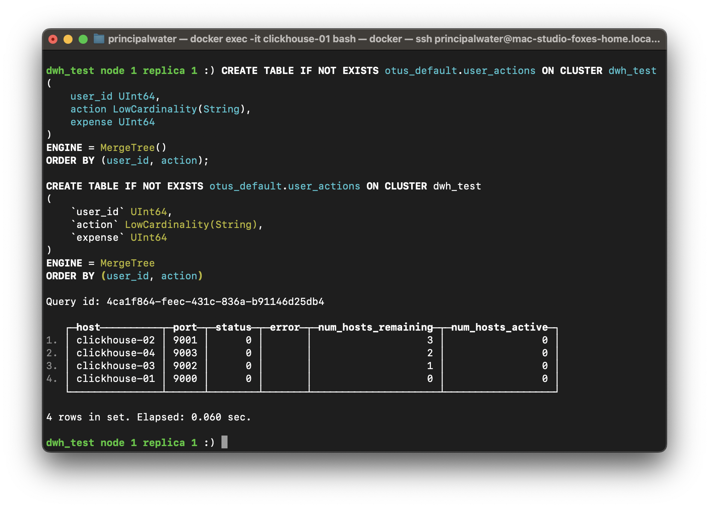
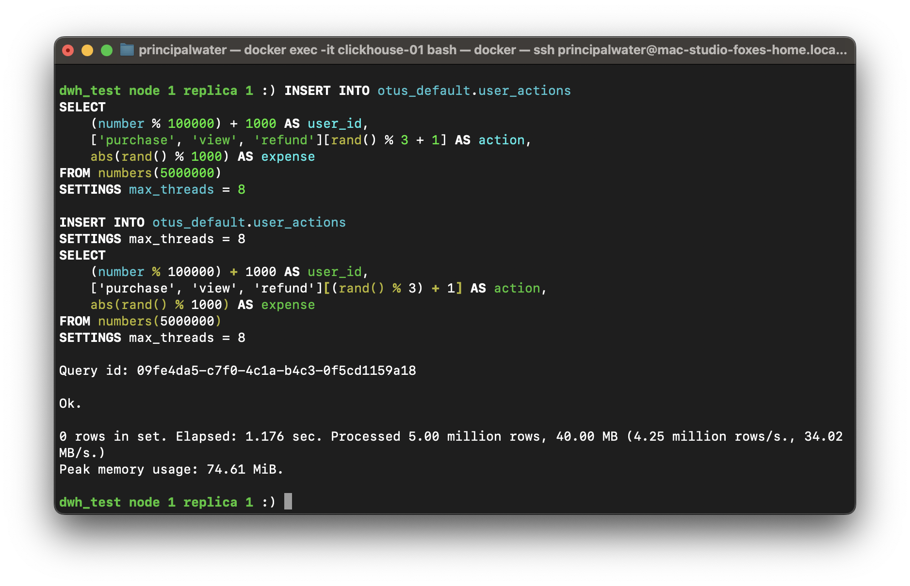
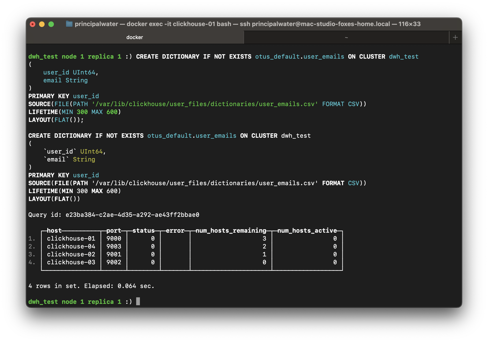
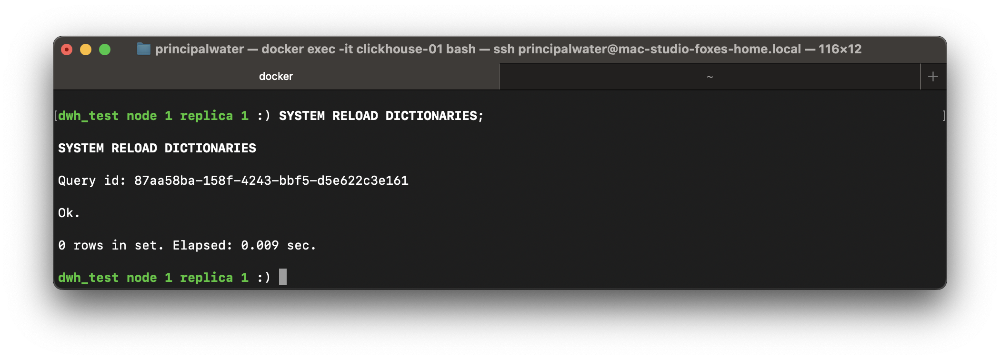
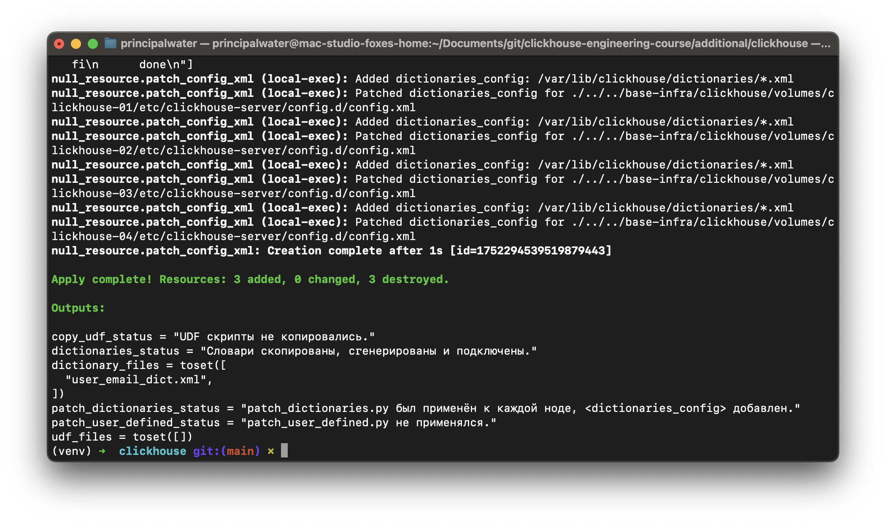
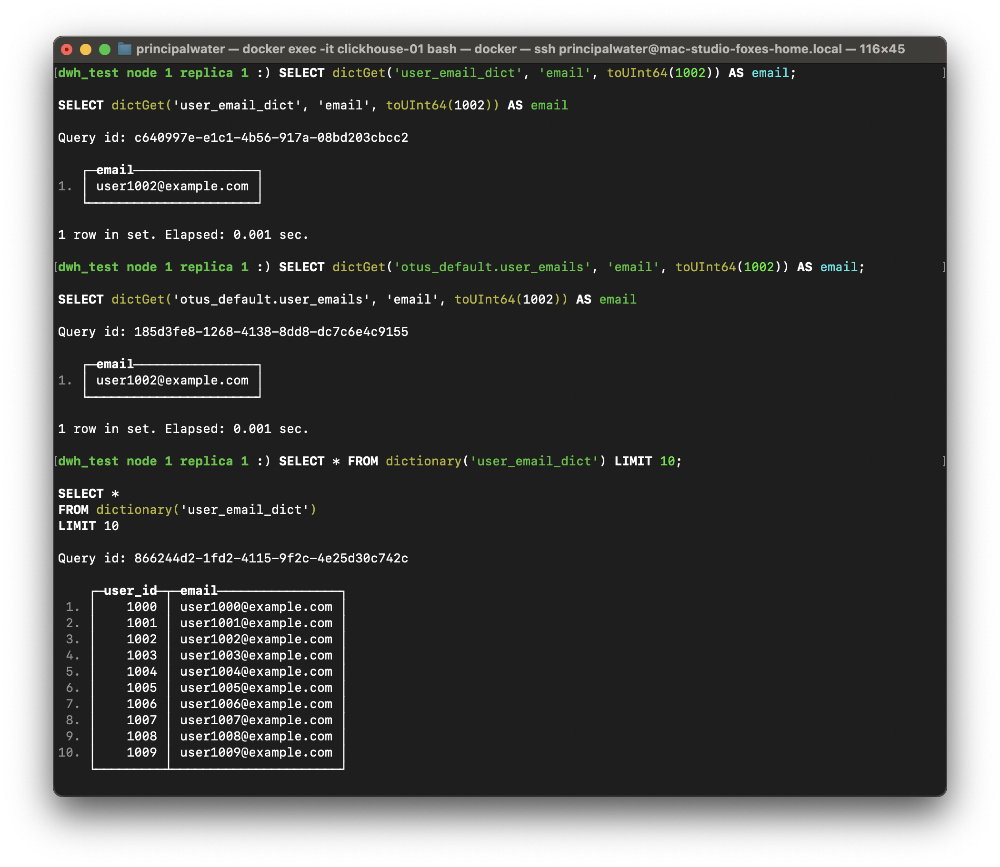
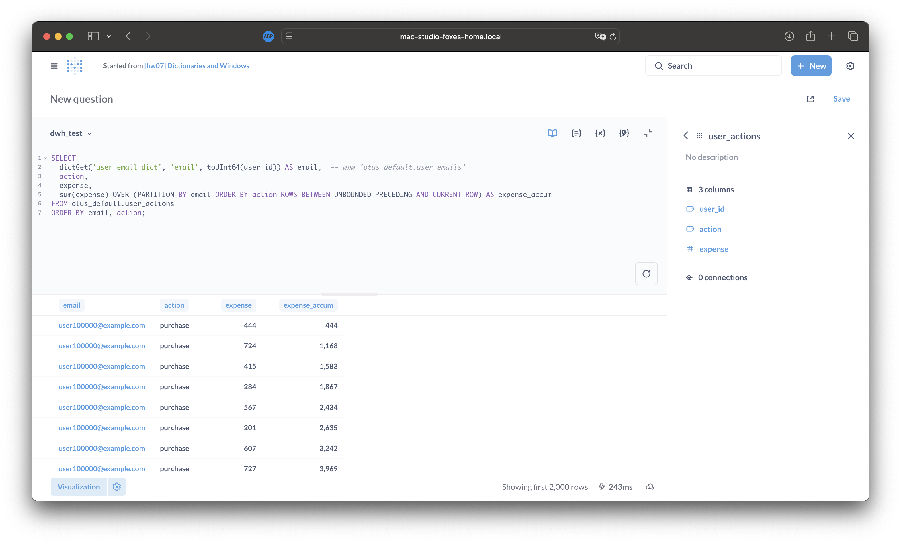

# Домашнее задание №7: Работа со словарями и оконными функциями в ClickHouse

## Общее описание задания

В этом домашнем задании необходимо закрепить навыки работы со словарями (dictionaries) и оконными функциями (window functions) в ClickHouse. Вы создадите таблицу пользовательских действий, загрузите тестовые данные, создадите словарь для сопоставления user_id с email, и реализуете оконную функцию для расчёта аккумулятивной суммы расходов по каждому пользователю. Задание предполагает практику как с SQL-операторами ClickHouse, так и с инфраструктурными аспектами (работа с файлами, кластерами, BI-интерфейсом).

_Примечание: Все SELECT-запросы (не DDL) выполнялись из интерфейса Metabase, развернутого через Terraform-пайплайн из каталога [../additional/bi-infra](../additional/bi-infra). Metabase подключён к кластеру ClickHouse (dwh_test) по протоколу HTTP (порт 8123) через виртуальный хост (host.docker.internal). ClickHouse Keeper обеспечивает внутреннюю репликацию, а клиентские SQL-запросы отправляются напрямую на кластер через порт 8123._

_Такой подход позволяет выполнять запросы из удобного UI, оперативно видеть результаты и получать скриншоты непосредственно из интерфейса бизнес-аналитики._

## Предварительная подготовка

### Создание базы данных `otus_default`

_SQL:_  
```sql
CREATE DATABASE IF NOT EXISTS otus_default ON CLUSTER dwh_test;
```

_Комментарий:_ Создание базы данных с использованием кластера `dwh_test`.

## Оглавление

1. [Цель и задачи](#цель-и-задачи)  
2. [Создание таблицы и загрузка данных](#создание-таблицы-и-загрузка-данных)  
3. [Варианты создания словаря](#варианты-создания-словаря)  
   - [Преимущества и недостатки CREATE DICTIONARY](#преимущества-и-недостатки-create-dictionary)  
   - [Преимущества и недостатки XML-конфига](#преимущества-и-недостатки-xml-конфига)  
   - [Рекомендации: в каких случаях использовать тот или иной подход](#рекомендации-в-каких-случаях-использовать-тот-или-иной-подход)  
4. [Создание словаря на основе файла](#создание-словаря-на-основе-файла)  
   - [Вариант 1: Создание через CREATE DICTIONARY (DDL)](#вариант-1-create-dictionary-ddl)
   - [Вариант 2: Создание через XML-конфиг](#вариант-2-xml-конфиг)
5. [Проверка работы словаря](#4-проверка-словаря)  
6. [Итоговый SELECT с использованием словаря и оконной функции](#5-итоговый-select-с-использованием-словаря-и-оконной-функции)  
7. [Инструкция по удалению временного файла из контейнера](#6-удаление-временного-файла)  
8. [Общие выводы по заданию](#выводы)   
9. [Список источников](#список-источников)  

---

## Цель и задачи

**Цель:** закрепить навыки работы со словарями и оконными функциями для выборки данных и вычисления аккумулятивной суммы.

**Задачи:**

- Создать таблицу с полями: `user_id UInt64, action LowCardinality(String), expense UInt64`.
- Создать словарь с атрибутом `email`, источник — файл.
- Заполнить тестовыми данными, чтобы `action` был низкокардинальным.
- Написать `SELECT`, возвращающий `email` (через `dictGet`), аккумулятивную сумму (оконная функция), сортировку по email.

---

## Создание таблицы и загрузка данных

В ClickHouse оптимально использовать типы данных с учетом характера данных. Для `user_id` выбран `UInt64` для уникальной идентификации, `action` — `LowCardinality(String)` для эффективного хранения низкокардинальных значений, а `expense` — `UInt64` для хранения расходов.

```sql
CREATE TABLE IF NOT EXISTS otus_default.user_actions ON CLUSTER dwh_test
(
    user_id UInt64,
    action LowCardinality(String),
    expense UInt64
)
ENGINE = MergeTree()
ORDER BY (user_id, action);
```


---

### Загрузка тестовых данных

Для генерации большого объёма реалистичных тестовых данных в ClickHouse рекомендуется использовать встроенные генераторы данных и функции. Это позволяет быстро наполнить таблицу миллионами событий без ручного перечисления значений, а также создать нагрузку, близкую к реальным сценариям.

**Преимущества такого подхода:**
- **Автоматизация:** Нет необходимости вручную готовить большие csv-файлы или перечислять значения.
- **Нагруженность:** Можно смоделировать миллионы событий, чтобы проверить производительность и поведение оконных функций.
- **Реалистичность:** Использование функций `sequence`, `rand`, `arrayJoin` позволяет создавать разнообразные действия и расходы для разных пользователей.

**Пример генерации 5 млн событий с помощью генератора ClickHouse:**

```sql
INSERT INTO otus_default.user_actions
SELECT
    (number % 100000) + 1000 AS user_id,
    ['purchase', 'view', 'refund'][rand() % 3 + 1] AS action,
    abs(rand() % 1000) AS expense
FROM numbers(5000000)
SETTINGS max_threads = 8
-- SETTINGS указывается только один раз, в самом конце запроса, чтобы избежать ошибки синтаксиса.
-- В ClickHouse директива SETTINGS применяется к запросу целиком и не должна дублироваться внутри подзапросов или после каждого SELECT/INSERT.
```

- Здесь:
    - `number % 100000 + 1000` создаёт 100 000 уникальных пользователей (user_id от 1000 до 100999).
    - `['purchase', 'view', 'refund'][rand() % 3 + 1]` случайным образом выбирает одно из действий (доступ по индексу массива, arrayJoin не используется).
    - `abs(rand() % 1000)` — случайный расход от 0 до 999.
    - `numbers(5000000)` — создаёт 5 млн строк.
    - `SETTINGS max_threads = 8` — ускоряет вставку параллелизмом.



---

## Варианты создания словаря

В ClickHouse словарь можно создать двумя основными способами:

### Преимущества и недостатки CREATE DICTIONARY

**Преимущества:**

- Быстрая и удобная декларация словаря через SQL.
- Легко управлять словарём с помощью SQL-запросов и кластерных команд (`ON CLUSTER`).
- Позволяет быстро изменять и обновлять словарь без перезапуска сервера.

**Недостатки:**

- Меньше гибкости в настройках по сравнению с XML-конфигом.
- Некоторые сложные параметры словаря могут быть недоступны.

### Преимущества и недостатки XML-конфига

**Преимущества:**

- Максимальная гибкость и полный контроль над параметрами словаря.
- Поддержка всех типов источников и сложных настроек.
- Подходит для production-сред, где конфигурация централизована.

**Недостатки:**

- Требуется перезапуск сервера или выполнение команды `SYSTEM RELOAD DICTIONARIES;` для применения изменений.
- Меньше удобства для быстрого прототипирования.

### Рекомендации: в каких случаях использовать тот или иной подход

- Используйте **CREATE DICTIONARY** для быстрого создания и тестирования словарей, а также в случаях, когда необходима интеграция с кластером через SQL.
- Используйте **XML-конфиг** для production-сред с централизованным управлением конфигурацией и необходимостью более тонкой настройки словарей.

---

## Создание словаря на основе файла

Чтобы использовать словарь для сопоставления user_id с email на основе файла, выполните последовательные шаги, охватывающие весь жизненный цикл словаря — от генерации файла до проверки работы.

### 1. Генерация и подготовка файла user_emails.csv
- Сгенерируйте файл `user_emails.csv` с нужным диапазоном user_id (1000–100999), например скриптом [`../../additional/clickhouse/samples/gen_user_emails_csv.py`](../../additional/clickhouse/samples/gen_user_emails_csv.py):
  ```bash
  python3 ../../additional/clickhouse/samples/gen_user_emails_csv.py
  ```
  Файл должен содержать только user_id из диапазона 1000–100999 — иначе dictGet не вернёт значения.

- Скопируйте файл в директорию ClickHouse:
  ```bash
  docker cp ./user_emails.csv clickhouse-01:/var/lib/clickhouse/user_files/user_emails.csv
  ```
  > В некоторых версиях ClickHouse путь к файлу для файлового словаря должен находиться в user_files (например, `/var/lib/clickhouse/user_files/user_emails.csv`). Если возникает ошибка PATH_ACCESS_DENIED — используйте user_files или symlink, и скорректируйте путь в конфиге словаря.

### 2. Создание словаря: два варианта

Выберите один из способов:

#### Вариант 1: CREATE DICTIONARY (DDL)
```sql
CREATE DICTIONARY IF NOT EXISTS otus_default.user_emails ON CLUSTER dwh_test
(
    user_id UInt64,
    email String
)
PRIMARY KEY user_id
SOURCE(FILE(PATH '/var/lib/clickhouse/user_files/dictionaries/user_emails.csv' FORMAT CSV))
LIFETIME(MIN 300 MAX 600)
LAYOUT(FLAT());
```
> Для изменений: используйте DROP DICTIONARY ... ON CLUSTER, затем CREATE DICTIONARY.



#### Вариант 2: XML-конфиг
Создайте XML-файл (например, `user_email_dict.xml`) в каталоге `/var/lib/clickhouse/dictionaries/` (или соответствующем для словарей):
```xml
<yandex>
  <dictionary>
    <name>user_email_dict</name>
    <source>
      <file>
        <path>/var/lib/clickhouse/user_files/user_emails.csv</path>
        <format>CSVWithNames</format>
      </file>
    </source>
    <layout>
      <flat/>
    </layout>
    <structure>
      <id>
        <name>user_id</name>
      </id>
      <attribute>
        <name>email</name>
        <type>String</type>
        <null_value></null_value>
      </attribute>
    </structure>
    <lifetime>300</lifetime>
  </dictionary>
</yandex>
```

Чтобы словари из этой директории автоматически подхватывались, пропишите в конфиге ClickHouse (например, `config.xml` или в одном из файлов в `config.d/`) строку:
```xml
<dictionaries_config>/var/lib/clickhouse/dictionaries/*.xml</dictionaries_config>
```
внутри блока `<yandex>...</yandex>`.

После добавления или изменения XML-конфига выполните:
```sql
SYSTEM RELOAD DICTIONARIES;
```



### 3. Автоматизация через Terraform
Для автоматизации используйте пайплайн, который:
- генерирует и копирует свежий `user_emails.csv` в `/var/lib/clickhouse/user_files/` и xml-конфиги словарей в директорию `/var/lib/clickhouse/dictionaries/` внутри контейнера;
- автоматически патчит основной конфиг ClickHouse (`config.xml`), добавляя строку `<dictionaries_config>/var/lib/clickhouse/dictionaries/*.xml</dictionaries_config>` в `<yandex>`;
- выполняет команду `SYSTEM RELOAD DICTIONARIES;` для активации изменений.

Перед запуском автоматизации необходимо перейти в каталог с main.tf (обычно это clickhouse-engineering-course/additional/clickhouse):
```sh
cd ../../additional/clickhouse
# или так, если находились в корне репозитория
cd additional/clickhouse
```
Только после этого запускайте terraform apply.

Запуск автоматизации выполняется в этом каталоге командой:
```sh
terraform apply -auto-approve -var="enable_copy_udf=false" -var="enable_dictionaries=true"
```



Пошагово при выполнении автоматизации через Terraform происходит следующее:

1. Переход в каталог с main.tf (см. выше).

2. Генерация свежего user_emails.csv скриптом Python.

3. Копирование user_emails.csv в `/var/lib/clickhouse/user_files/` и XML-конфигов словарей в `/var/lib/clickhouse/dictionaries/` во все volume-директории ClickHouse-контейнеров.

4. Автоматический патчинг конфига ClickHouse на каждой ноде: в config.xml добавляется строка `<dictionaries_config>/var/lib/clickhouse/dictionaries/*.xml</dictionaries_config>`.

5. После применения словари сразу доступны для работы, никаких дополнительных команд не требуется.

6. Далее можно проверять работу словаря через dictGet или dictionary.

> Подробнее о шагах и тонкостях автоматизации см. [/additional/clickhouse/README.md](../additional/clickhouse/README.md).

### 4. Проверка словаря
- Для проверки используйте имя словаря:
  - `user_email_dict` — если XML-конфиг
  - `otus_default.user_emails` — если DDL

Примеры:
```sql
SELECT dictGet('user_email_dict', 'email', toUInt64(1002)) AS email;
SELECT dictGet('otus_default.user_emails', 'email', toUInt64(1002)) AS email;
SELECT * FROM dictionary('user_email_dict') LIMIT 10;
```


> Если dictGet возвращает ошибку PATH_ACCESS_DENIED — проверьте, что путь к файлу действительно в user_files.

### 5. Итоговый SELECT с использованием словаря и оконной функции
Используйте следующий запрос, чтобы получить email пользователя через словарь, действие, расход и аккумулятивную сумму расхода по каждому пользователю и действию:
```sql
SELECT
  dictGet('user_email_dict', 'email', toUInt64(user_id)) AS email,  -- или 'otus_default.user_emails'
  action,
  expense,
  sum(expense) OVER (PARTITION BY user_id, action ORDER BY expense ASC ROWS BETWEEN UNBOUNDED PRECEDING AND CURRENT ROW) AS expense_accum
FROM otus_default.user_actions
ORDER BY email, action, expense;
```


- Аккумулятивная сумма считается по окну PARTITION BY user_id, action, что обеспечивает детерминированность результата для каждого пользователя и действия.
- Сортировка по email и action, а также expense (для стабильности порядка).
- Если требуется сортировать только по email (без action/expense) в результате, можно убрать их из ORDER BY, но оставить в SELECT, т.к. они требуются по условию задания.

### 6. Удаление временного файла
Удаляйте файл `user_emails.csv` из контейнера только после создания и проверки работоспособности словаря:
```bash
for c in $(docker ps --format '{{.Names}}' | grep -E '^clickhouse-[0-9]+$'); do
  echo "Удаляю user_emails.csv в $c"
  docker exec -i "$c" rm -f /var/lib/clickhouse/user_files/user_emails.csv
done
```
> Удаление файла до создания словаря приведёт к его неработоспособности.

---

## Выводы
- Оба способа создания словаря (DDL и XML) дают одинаковый функционал, но отличаются гибкостью и способом управления:
  - DDL (CREATE DICTIONARY) — быстрее для прототипирования, проще управлять через SQL.
  - XML — максимальная гибкость, централизованное конфигурирование, подходит для production и автоматизации.
- Автоматизация через Terraform и пайплайны позволяет полностью исключить ручные шаги, гарантировать согласованность конфигов и файлов, и ускоряет воспроизводимость среды.

## Список источников

- [ClickHouse Documentation: Dictionaries](https://clickhouse.com/docs/en/sql-reference/dictionaries/)  
- [ClickHouse Documentation: Window Functions](https://clickhouse.com/docs/en/sql-reference/window-functions/)  
- [ClickHouse Blog: Optimizing Low Cardinality Data](https://clickhouse.com/blog/low-cardinality-data)  

---