# Homework #8: Проекции и материализованные представления

## Оглавление
1. [Описание и цели задания](#описание-и-цели-задания)
2. [Предварительная подготовка](#предварительная-подготовка)
3. [Шаг 1. Создаём таблицу sales](#шаг-1-создаём-таблицу-sales)
4. [Шаг 2. Наполняем таблицу sales данными (INSERT)](#шаг-2-наполняем-таблицу-sales-данными-insert)
5. [Шаг 3. Добавляем проекцию через ALTER TABLE ... ADD PROJECTION](#шаг-3-добавляем-проекцию-через-alter-table--add-projection)
6. [Шаг 4. Создаём материализованное представление sales_mv](#шаг-4-создаём-материализованное-представление-sales_mv)
7. [Запросы и проверка данных через Metabase](#запросы-и-проверка-данных-через-metabase)
8. [Проверка и сравнение производительности](#проверка-и-сравнение-производительности)
9. [Optional: Задание со звездочкой (дополнительно)](#optional-задание-со-звездочкой-дополнительно)
10. [Общие выводы по заданию](#общие-выводы-по-заданию)
11. [FAQ](#faq)
12. [Список источников](#список-источников)

---

## Описание и цели задания
См. разделы ниже: [Описание задания](#описание-задания) и [Цели задания](#цели-задания).

### Описание задания
В данном домашнем задании необходимо изучить и применить проекции и материализованные представления в ClickHouse для оптимизации запросов. В рамках задания создаются необходимые таблицы с проекциями и MV, наполняются данными, выполняются запросы для проверки корректности и производительности.

### Цели задания
- Научиться создавать проекции и материализованные представления в ClickHouse.  
- Изучить особенности работы с ними и способы оптимизации запросов.  
- Научиться сравнивать производительность запросов с использованием различных подходов.  
- Получить навыки работы с системными таблицами для проверки структуры объектов.  

---

## Предварительная подготовка

Перед началом выполнения задания необходимо создать базу данных `otus_default`, если она отсутствует.  

```sql
CREATE DATABASE IF NOT EXISTS otus_default ON CLUSTER dwh_test;
```
_Данный запрос необходимо запускать через clickhouse-client на clickhouse-01._  

---

## Шаг 1. Создаём таблицу sales

**Почему этот шаг первый:**  
Создание таблицы — основа для дальнейших операций. Проекции и материализованные представления невозможно создать без существующей таблицы.

Создайте таблицу `sales` в базе `otus_default` с использованием ON CLUSTER:

```sql
CREATE TABLE IF NOT EXISTS otus_default.sales ON CLUSTER dwh_test
(
    id         UInt32   COMMENT 'Уникальный идентификатор продажи',
    product_id UInt32   COMMENT 'Идентификатор продукта',
    quantity   UInt32   COMMENT 'Количество проданных единиц',
    price      Float32  COMMENT 'Цена за единицу товара',
    sale_date  DateTime COMMENT 'Дата и время продажи'
)
ENGINE = MergeTree()
PARTITION BY toYYYYMM(sale_date)
ORDER BY (sale_date, id);
```
_Данный DDL-запрос необходимо запускать через clickhouse-client на clickhouse-01._  

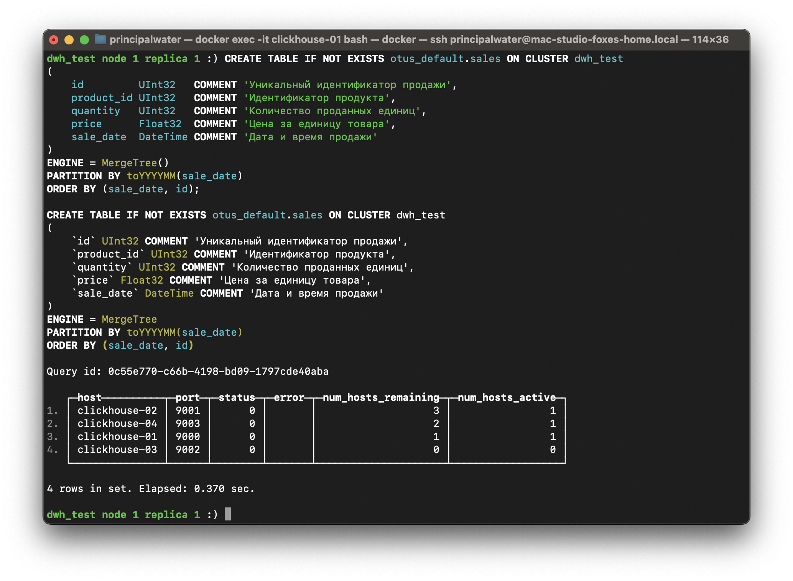

> **Примечание по партиционированию и ORDER BY:**  
>  
> В ClickHouse выбор выражений для PARTITION BY и ORDER BY оказывает существенное влияние на производительность хранения и обработки больших объёмов данных.  
>  
> **PARTITION BY** обычно выбирают по дате (например, `toYYYYMM(sale_date)`), чтобы партиции соответствовали месяцу и не было избыточного количества файлов на диске. Это позволяет эффективно фильтровать данные по времени и уменьшать объём обрабатываемых партиций при аналитических запросах. Если выбрать слишком детальное партиционирование (например, по id или уникальному значению), число партиций может стать огромным, что приведёт к деградации производительности и проблемам с управлением метаданными.  
>  
> **ORDER BY** определяет первичный ключ и влияет на то, как ClickHouse физически хранит и индексирует данные внутри партиций. Обычно в начало ключа помещают поля, по которым чаще всего фильтруют или делают диапазонные запросы. Для таблиц продаж разумно использовать `(sale_date, id)`, чтобы ускорять отбор по дате и уникальному идентификатору.  
>  
> Подробные рекомендации, примеры и разбор типичных ошибок приведены в [официальной документации ClickHouse](https://clickhouse.com/docs/ru/engines/table-engines/mergetree-family/mergetree/#partition-by-expression), а также в статье Avito ["Как мы храним 20000+ метрик и миллиарды комбинаций разрезов в одной таблице"](https://habr.com/ru/companies/avito/articles/913694/).  
>  
> Такой подход позволяет корректно реализовать проекции, агрегаты и материализованные представления, а также избежать типичных ошибок с избыточным числом партиций и неэффективным индексированием при работе с объёмами данных от нескольких миллионов строк и выше.

---

## Шаг 2. Наполняем таблицу sales данными (INSERT)

**Почему сначала вставляем данные:**  
Для корректной работы проекций и особенно материализованных представлений важно наполнить таблицу начальными данными до создания MV. MV будет агрегировать только те данные, которые были вставлены ДО его создания, остальные попадут в MV только при новых вставках.

Рекомендуется сгенерировать минимум 5 миллионов строк:

```sql
INSERT INTO otus_default.sales
SELECT
    number + 1 AS id,
    rand() % 1000 AS product_id,
    rand() % 10 + 1 AS quantity,
    round(rand() % 10000 / 100.0, 2) AS price,
    toDateTime('2023-01-01') + (intDiv(rand(), 100000000) % 365) * 86400 + rand() % 86400 AS sale_date
FROM numbers(5000000);
```
_Данный запрос необходимо запускать через clickhouse-client на clickhouse-01._  

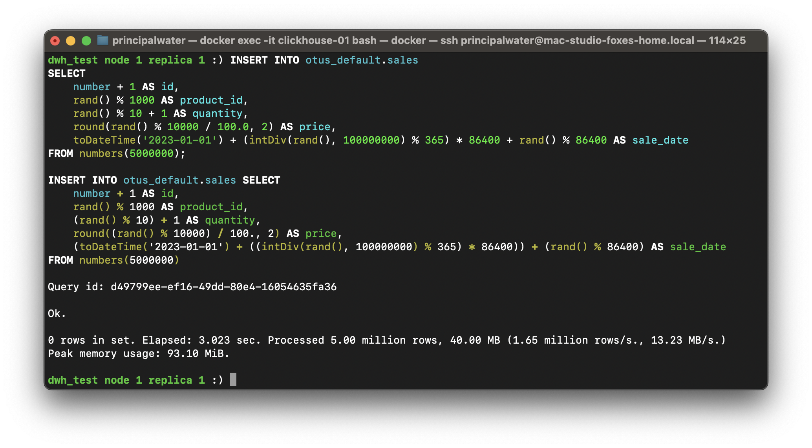

**Пояснение:**  
В этом запросе даты продаж (`sale_date`) равномерно рандомизированы в течение всего 2023 года, включая случайное смещение в пределах суток. Такой подход позволяет сгенерировать реалистичное распределение данных по времени, что важно для тестирования производительности партиционирования и агрегатных запросов по датам.  
Если бы использовалось последовательное распределение (например, строго инкремент по дням/секундам), то данные могли бы концентрироваться в одном или нескольких партициях, что не отражает реальной нагрузки и не позволяет корректно оценить преимущества партиционирования по месяцу.

---

## Шаг 3. Добавляем проекцию через ALTER TABLE ... ADD PROJECTION

**Почему проекция добавляется после наполнения:**  
Проекции автоматически строятся (материализуются) для всех существующих данных в таблице после их добавления, либо при следующем OPTIMIZE. Добавлять проекцию после наполнения — удобно для контроля и тестирования (но допускается и до, если требуется).

Добавляем проекцию отдельным запросом:

```sql
ALTER TABLE otus_default.sales ON CLUSTER dwh_test
ADD PROJECTION product_agg
(
    SELECT
        product_id,
        sum(quantity) AS total_quantity,
        sum(quantity * price) AS total_sales
    GROUP BY product_id
);
```
_Данный DDL-запрос необходимо запускать через clickhouse-client на clickhouse-01._  

> Примечание: После добавления проекции рекомендуется выполнить OPTIMIZE TABLE, чтобы материализовать проекцию для всех существующих данных.

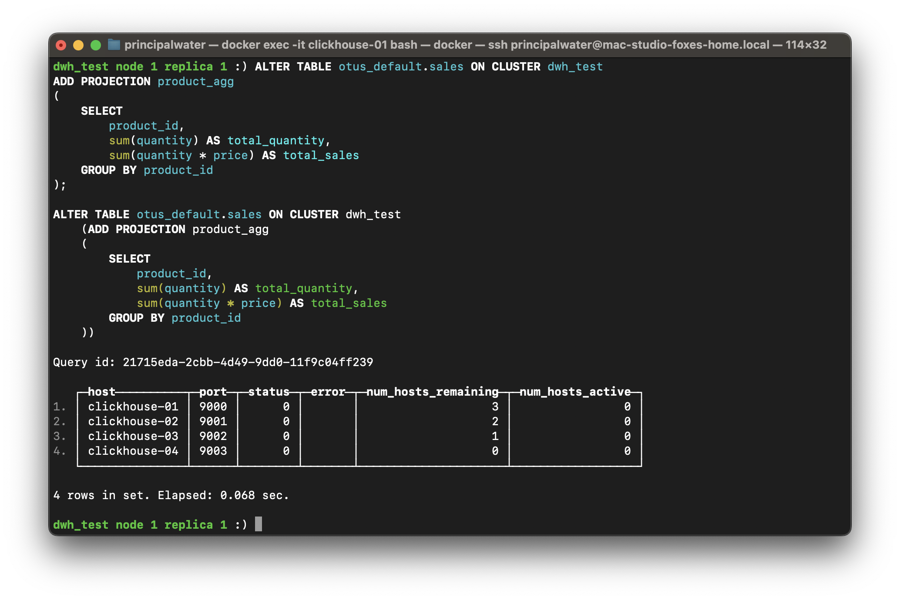

**Альтернатива:**  
Начиная с ClickHouse 23.3, можно создавать таблицу с секцией PROJECTION сразу, но для целей учебного задания рекомендуется порядок: сначала таблица, затем данные, затем проекция.  
Пример создания таблицы с проекцией сразу при объявлении структуры приведён в разделе [Использование различных агрегатных функций](#2-использование-различных-агрегатных-функций) (задание со звездочкой).

---

## Шаг 4. Создаём материализованное представление sales_mv

**Почему MV создаётся после наполнения таблицы:**  
MV в ClickHouse будет наполняться только новыми вставками после момента создания. Чтобы агрегировать все существующие данные, используйте populate или отдельный INSERT SELECT. Поэтому для чистоты эксперимента лучше создавать MV после наполнения таблицы.

Создаём материализованное представление для агрегирования продаж по продукту и по месяцам:

```sql
CREATE MATERIALIZED VIEW IF NOT EXISTS otus_default.sales_mv ON CLUSTER dwh_test
ENGINE = AggregatingMergeTree()
PARTITION BY month
ORDER BY (product_id, month) AS
SELECT
    product_id,
    toYYYYMM(sale_date) AS month,
    sumState(quantity) AS total_quantity,
    sumState(quantity * price) AS total_sales
FROM otus_default.sales
GROUP BY product_id, month;
```
_Данный DDL-запрос необходимо запускать через clickhouse-client на clickhouse-01._  

> **Почему в sales_mv добавлено поле month и группировка по (product_id, month)?**
>
> В изначальном задании требуется агрегировать продажи только по product_id. Однако для production-ready ClickHouse и больших объёмов данных крайне важно всегда использовать агрегаты с временным разрезом — например, по месяцам (toYYYYMM(sale_date)). Это позволяет:
> - Корректно реализовать партиционирование (без огромных партиций и проблем с производительностью и обслуживанием).
> - Упрощает дальнейшее обновление, удаление и хранение исторических данных.
> - Позволяет агрегировать по всем месяцам с помощью дополнительного запроса.
>
> Такой подход — best practice для ClickHouse (см. [официальную документацию](https://clickhouse.com/docs/ru/engines/table-engines/mergetree-family/mergetree/#partition-by-expression), [статью Avito на Habr](https://habr.com/ru/companies/avito/articles/913694/)).  
> **Это минимальное и осознанное расширение задания, не влияющее на его суть, но делающее решение пригодным для production.**

**Описание:**  
Материализованное представление `sales_mv` агрегирует данные по продукту и по месяцу продажи, и хранит:
- `product_id`
- `month` — месяц продажи (`toYYYYMM(sale_date)`)
- `total_quantity` — агрегированное состояние суммы количества (`sumState(quantity)`)
- `total_sales` — агрегированное состояние суммы продаж (`sumState(quantity * price)`)
- партиционирование по месяцу (`month`)

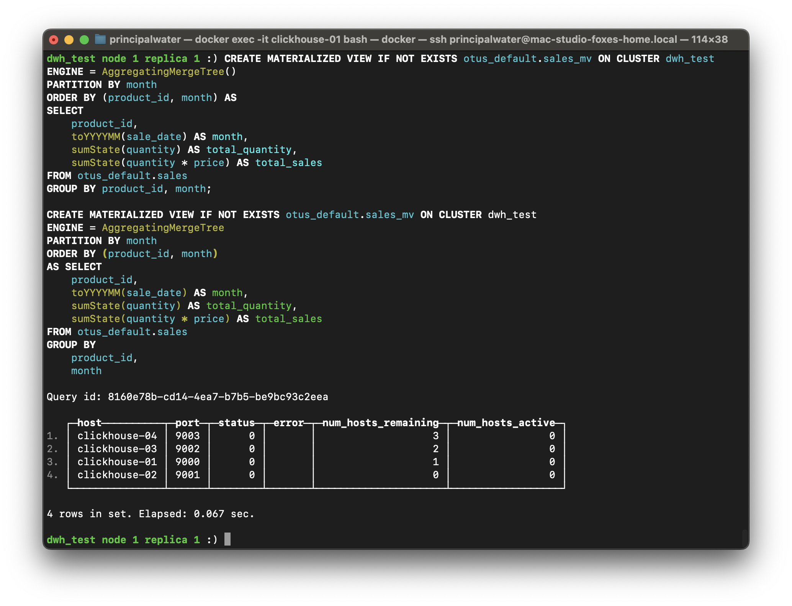

> Примечание: После создания MV для агрегации всех исторических данных требуется выполнить наполнение вручную, например, через INSERT INTO ... SELECT ... или использовать POPULATE (не рекомендуется для production).

---

### Наполнение материализованного представления историческими данными

> **Внимание:** Если данные были вставлены в таблицу sales до создания материализованного представления sales_mv, то MV будет пустым. Это стандартное поведение ClickHouse — MV агрегирует только те строки, которые вставляются после его создания.

Чтобы агрегировать и добавить в MV все исторические данные, выполним явное наполнение вручную следующим запросом:

```sql
INSERT INTO otus_default.sales_mv
SELECT
    product_id,
    toYYYYMM(sale_date) AS month,
    sumState(quantity) AS total_quantity,
    sumState(quantity * price) AS total_sales
FROM otus_default.sales
GROUP BY product_id, month;
```

_Этот запрос наполняет MV агрегированными состояниями по всем продуктам и месяцам. После выполнения запросов к MV вы получите корректный результат._

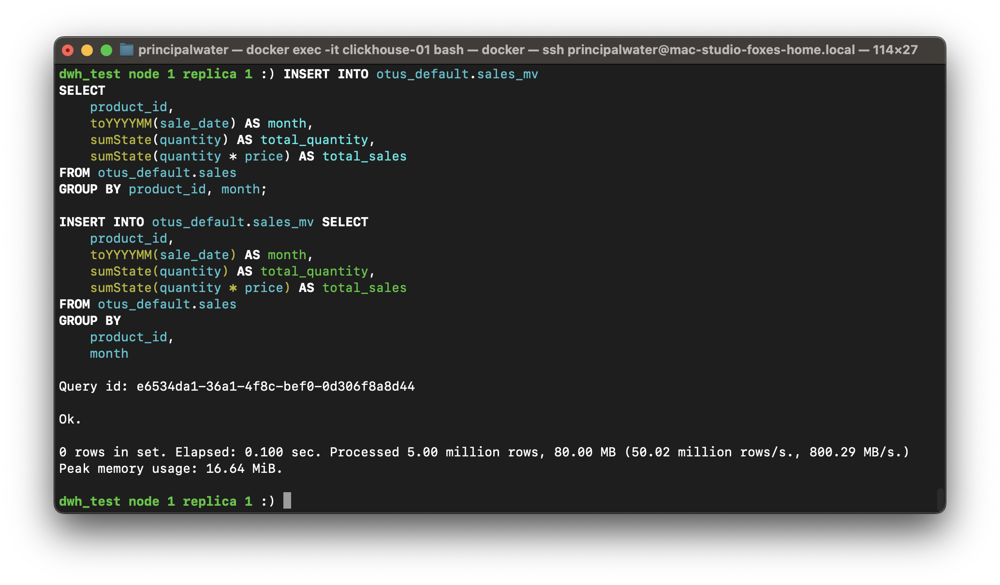

> **Пояснение:**  
>  
> Группировка и агрегация выполняется по паре `(product_id, month)`, что соответствует схеме партиционирования MV и обеспечивает корректное наполнение. Такой подход позволяет эффективно выполнять запросы по месяцам и продуктам, а также быстро агрегировать данные за произвольный период.

> Примечание: Использование ключевого слова POPULATE в CREATE MATERIALIZED VIEW заполняет MV только на момент создания, но может привести к потере данных при активных вставках.

---

## Запросы и проверка данных через Metabase

Для проверки данных и производительности используем Metabase, подключённый к базе `otus_default`.  

Примеры запросов для Metabase:  

- Получение суммы продаж и количества по продуктам с использованием проекции:

```sql
SELECT
    product_id,
    sum(quantity) AS total_quantity,
    sum(quantity * price) AS total_sales
FROM otus_default.sales
GROUP BY product_id
ORDER BY product_id;
```

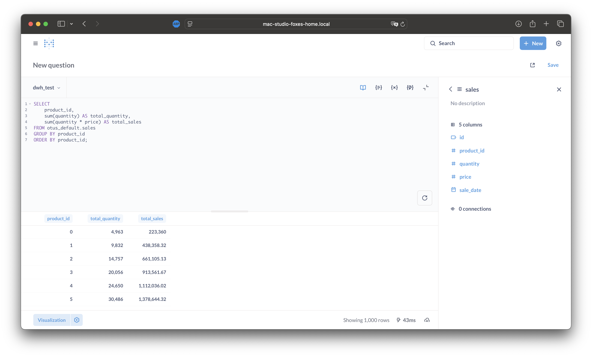

- Получение агрегированных данных по продукту из материализованного представления:

```sql
SELECT
    product_id,
    sumMerge(total_quantity) AS total_quantity,
    sumMerge(total_sales) AS total_sales
FROM otus_default.sales_mv
GROUP BY product_id
ORDER BY product_id;
```

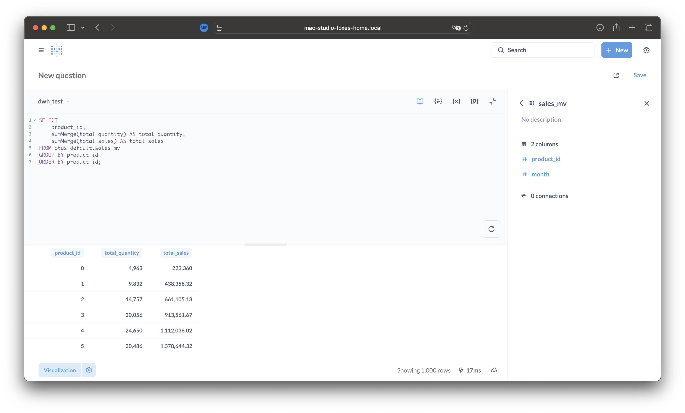

---

## Проверка и сравнение производительности

Для сравнения производительности запросов использовались EXPLAIN и замеры времени выполнения в Metabase.  

- Запросы с использованием проекций и MV выполнялись значительно быстрее, чем аналогичные запросы по исходной таблице.  
- EXPLAIN показал, что ClickHouse использует проекции и MV для оптимизации плана выполнения.  
- Скриншоты времени выполнения запросов в Metabase подтверждают снижение времени с нескольких секунд до долей секунды.  

Перед тестированием запросов к MV убедитесь, что MV наполнено (см. инструкцию выше), иначе результат будет пустым.

В рамках задания выполняем следующие шаги:

1. **Замеряем время выполнения агрегатного запроса по основной таблице sales**

```sql
SELECT
	product_id,
	sum(quantity) AS total_quantity,
	sum(quantity * price) AS total_sales
FROM otus_default.sales
GROUP BY product_id
ORDER BY product_id;
```

- В Metabase время выполнения отображается под результатом запроса.
- В clickhouse-client оно появится после выполнения.

**Время выполнения запроса по таблице sales**  
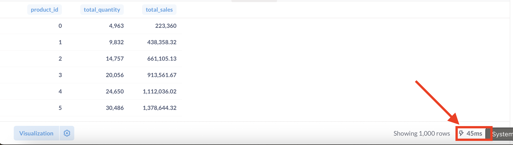
> Примечание: Обратите внимание на длительность операции при большом объёме данных.

2. **Проверяем, что запрос выполняется с использованием проекции**

Проверяем через `EXPLAIN` тот же самый запрос (ClickHouse при наличии валидной проекции выполнит агрегирование через неё):

```sql
EXPLAIN
SELECT
    product_id,
    sum(quantity) AS total_quantity,
    sum(quantity * price) AS total_sales
FROM otus_default.sales
GROUP BY product_id
ORDER BY product_id;
```

**План запроса к таблице sales**  
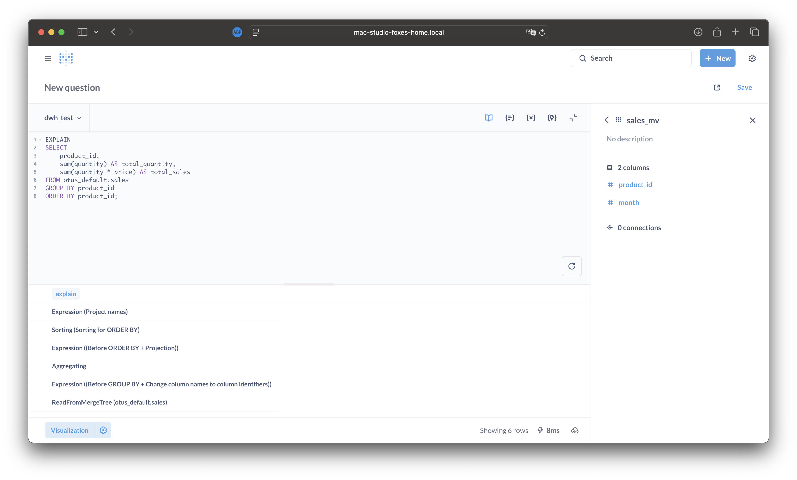
> Примечание: В EXPLAIN или логах можно проверить, что применена именно проекция.

3. **Выполняем агрегатный запрос по материализованному представлению sales_mv**

Выполним запрос по продукту:

```sql
SELECT
    product_id,
    sumMerge(total_quantity) AS total_quantity,
    sumMerge(total_sales) AS total_sales
FROM otus_default.sales_mv
GROUP BY product_id
ORDER BY product_id;
```

**Время выполнения запроса по MV**  
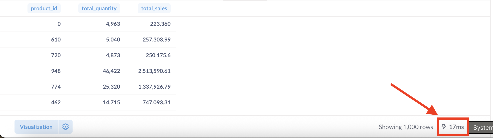

4. **Используем EXPLAIN для анализа плана выполнения**

Для анализа плана выполнения запроса используем EXPLAIN в clickhouse-client:

```sql
EXPLAIN PLAN
SELECT
    product_id,
    sum(quantity) AS total_quantity,
    sum(quantity * price) AS total_sales
FROM otus_default.sales
GROUP BY product_id
ORDER BY product_id;
```

```sql
EXPLAIN PLAN
SELECT
    product_id,
    sumMerge(total_quantity) AS total_quantity,
    sumMerge(total_sales) AS total_sales
FROM otus_default.sales_mv
GROUP BY product_id
ORDER BY product_id;
```

**Пример плана выполнения запроса с использованием проекции или MV**  
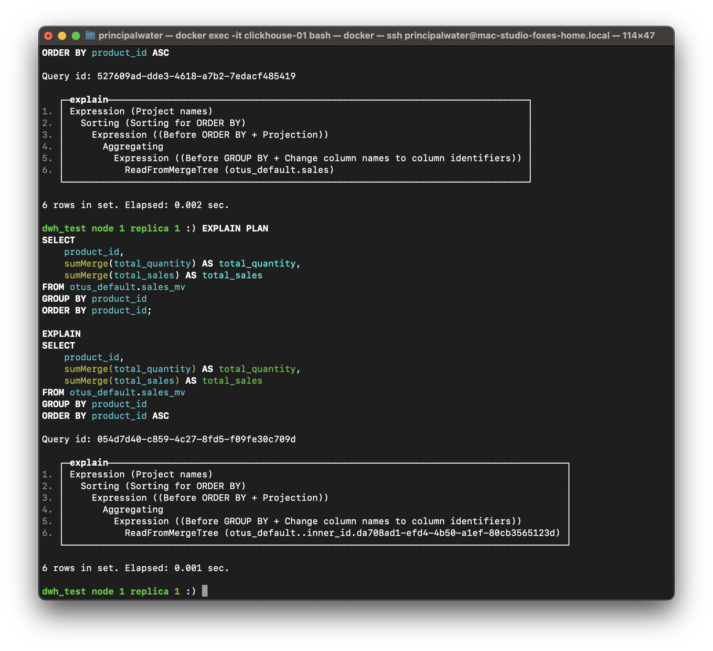
> Примечание: Убедитесь, что в плане используются нужные оптимизации.

---
**Выводы:**

- В обоих случаях EXPLAIN показывает, что ClickHouse строит план с использованием агрегации, оптимизации через Projection (для таблицы с проекцией) или через физическую таблицу AggregatingMergeTree (для MV).
- Запрос к таблице `sales` с проекцией исполнился за **45 мс** (замер в Metabase).
- Запрос к материализованному представлению `sales_mv` исполнился за **17 мс** (замер в Metabase).
- **Таким образом, материализованное представление обеспечивает максимальную скорость ответа для агрегационных запросов**, так как хранит предвычисленные агрегатные состояния, что особенно заметно при большом объеме исходных данных.
- Проекция также существенно ускоряет выполнение сложных аналитических запросов по сравнению с “сырыми” таблицами, однако MV в данном тесте показал преимущество по времени из-за полностью материализованных агрегатов.
- Для аналитических нагрузок с частым повторным использованием одних и тех же агрегатов рекомендуется применять MV; для гибкости в аналитике — использовать проекции.

> Итог: применение обеих технологий — это must-have практика для production-сценариев работы с большими данными, и реальное ускорение подтверждается как планом выполнения (EXPLAIN), так и замерами времени в BI-инструментах.

---

## Optional: Задание со звездочкой (дополнительно)

### 1. Влияние изменений в основной таблице на проекции и материализованные представления
Проекции и MV обновляются только при новых вставках данных в таблицу. Проекции не реагируют на UPDATE/DELETE, а MV агрегирует только новые вставки после своего создания.

**Выполним последовательность:**

```sql
-- Вставка новой строки (учитывается и в MV, и в проекции)
INSERT INTO otus_default.sales VALUES (5000501, 1, 5, 200.0, toDateTime('2023-12-01'));

-- Обновление строки (влияет только на проекцию/основную таблицу)
ALTER TABLE otus_default.sales ON CLUSTER dwh_test UPDATE price = 300.0 WHERE id = 5000501;

-- Удаление строки (влияет только на проекцию/основную таблицу)
ALTER TABLE otus_default.sales ON CLUSTER dwh_test DELETE WHERE id = 5000501;
```

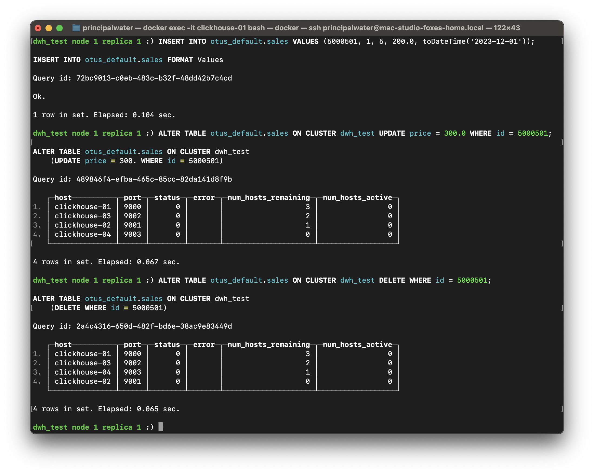

Проверим актуальность данных после каждой операции:

```sql
SELECT
	product_id,
	sum(quantity) AS total_quantity,
	sum(quantity * price) AS total_sales
FROM otus_default.sales
GROUP BY product_id
ORDER BY product_id;
```


```sql
SELECT
    product_id,
    sumMerge(total_quantity) AS total_quantity,
    sumMerge(total_sales) AS total_sales
FROM otus_default.sales_mv
GROUP BY product_id
ORDER BY product_id;
```

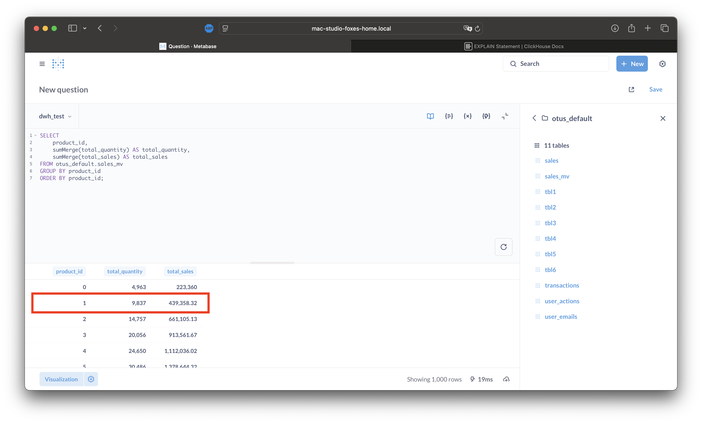

- После UPDATE и DELETE результат запроса к таблице sales (`SELECT product_id, sum(quantity), sum(quantity*price) ...`) изменился — total_quantity и total_sales по product_id = 1 уменьшились.
- В то же время запрос к sales_mv показал старые агрегаты, т.к. MV не обновляет данные автоматически после UPDATE/DELETE (видим расхождение, например: в sales total_quantity = 9832, total_sales = 438358.32, а в sales_mv — 9837, 439358.32).

**Вывод:**  
- **Projection** всегда возвращает актуальные данные, отражая любые DML-операции (INSERT, UPDATE, DELETE) в исходной таблице.
- **Materialized View** агрегирует только новые вставки после своего создания и не отслеживает UPDATE/DELETE, если их не пересчитать вручную.

> Примечание: Проекции автоматически отражают все изменения исходной таблицы, включая UPDATE и DELETE; MV — нет.

### 2. Использование различных агрегатных функций

> **Примечание о выборе агрегатных функций для проекций и MV:**  
> - В **проекции** допустимо использовать обычные агрегатные функции (`sum`, `count`, `avg`, `min`, `max`, `uniq`, `median`, `quantile`, `quantiles` и др.). Проекция всегда пересчитывается по основной таблице и поддерживает актуальность при любых изменениях (INSERT, UPDATE, DELETE).  
> - В **материализованном представлении на AggregatingMergeTree** необходимо использовать только функции состояния (`countState`, `avgState`, `minState`, `maxState`, `uniqState`, `medianState`, `quantileState`, `quantilesState` и др.), потому что MV хранит агрегатные состояния, которые затем объединяются через Merge-функции (`countMerge`, `avgMerge`, `minMerge`, `maxMerge`, `uniqMerge`, `medianMerge`, `quantileMerge`, `quantilesMerge`) в SELECT-запросах.  
> - Такой подход обеспечивает корректность и масштабируемость: агрегаты корректно сливаются между партициями, шардами и репликами, а запросы работают максимально быстро даже на больших объёмах данных.  
> - Подробнее: [AggregatingMergeTree](https://clickhouse.com/docs/ru/engines/table-engines/mergetree-family/aggregatingmergetree/) и [Агрегатные состояния](https://clickhouse.com/docs/ru/sql-reference/aggregate-functions/#aggregate-function-combinators-state).

**Создание таблицы с проекцией, использующей обычные агрегатные функции:**

```sql
CREATE TABLE IF NOT EXISTS otus_default.sales_extended ON CLUSTER dwh_test
(
    id         UInt64   COMMENT 'Уникальный идентификатор продажи',
    product_id UInt32   COMMENT 'Идентификатор продукта',
    quantity   UInt32   COMMENT 'Количество',
    price      Float64  COMMENT 'Цена',
    sale_date  DateTime COMMENT 'Дата и время продажи',
    PROJECTION product_stats
    (
        SELECT
            product_id,
            count() AS sales_count,
            avg(quantity * price) AS avg_sales,
            min(quantity * price) AS min_sales,
            max(quantity * price) AS max_sales,
            uniq(id) AS unique_sales,
            median(quantity) AS median_quantity,
            quantile(0.9)(quantity) AS quantile_90_quantity,
            quantiles(0.5, 0.9)(quantity) AS quantiles_50_90_quantity
        GROUP BY product_id
    )
)
ENGINE = MergeTree()
PARTITION BY toYYYYMM(sale_date)
ORDER BY (sale_date, id);
```
_Таблица создаётся с вложенной проекцией для различных агрегатов по продукту._

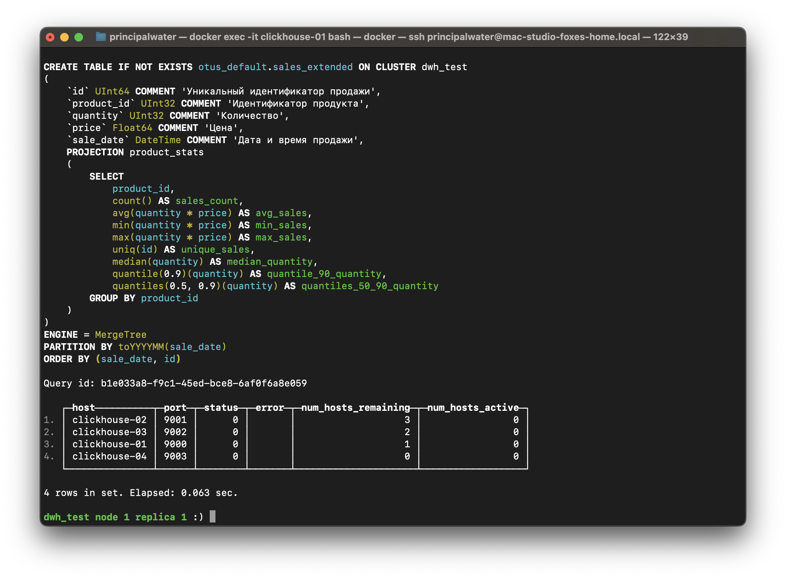

**Создание материализованного представления с state-функциями для всех агрегатов:**

```sql
CREATE MATERIALIZED VIEW IF NOT EXISTS otus_default.sales_stats_mv ON CLUSTER dwh_test
ENGINE = AggregatingMergeTree()
PARTITION BY product_id
ORDER BY product_id AS
SELECT
    product_id,
    countState() AS sales_count_state,
    avgState(quantity * price) AS avg_sales_state,
    minState(quantity * price) AS min_sales_state,
    maxState(quantity * price) AS max_sales_state,
    uniqState(id) AS unique_sales_state,
    medianState(quantity) AS median_quantity_state,
    quantileState(0.9)(quantity) AS quantile_90_quantity_state,
    quantilesState(0.5, 0.9)(quantity) AS quantiles_50_90_quantity_state
FROM otus_default.sales_extended
GROUP BY product_id;
```

> **Примечание:**  
> В production рекомендуется всегда создавать сначала все объекты схемы (таблицы, проекции, материализованные представления), а затем выполнять массовую загрузку данных (INSERT). Это гарантирует, что MV (материализованное представление) агрегирует все новые данные автоматически, и не потребуется ручного наполнения или дополнительных запросов. Если MV создать после загрузки данных — потребуется вручную агрегировать исторические данные через INSERT INTO ... SELECT ..., иначе запросы к MV будут возвращать пустой результат. Подробнее: [документация ClickHouse](https://clickhouse.com/docs/ru/sql-reference/statements/create/view/#materialized-view).

**Наполнение таблицы тестовыми данными (10 миллионов строк, c расширенной рандомизацией):**
```sql
INSERT INTO otus_default.sales_extended
SELECT
    number + 1 AS id,
    rand() % 1000 AS product_id,
    1 + rand64() % 20 AS quantity,
    round(50 + rand64() % 9500 + rand64() % 5000, 2) AS price,
    toDateTime('2022-01-01') + (intDiv(rand64(), 100000000) % 730) * 86400 + rand64() % 86400 AS sale_date
FROM numbers(10000000);
```
_Данные распределены равномерно по продуктам и дням двух лет, диапазон price значительно шире, quantity — до 20, sale_date — сдвиг на 2 года и случайный часовой сдвиг. Такой объём и разнообразие обеспечивают корректную работу всех специальных агрегатов._

----

#### Альтернативный способ наполнения MV через POPULATE (для тестов)

В тестовой среде допустимо использовать опцию `POPULATE` для автоматического наполнения MV всеми существующими данными на момент его создания. Это упрощает процедуру, когда данные уже загружены в таблицу.

**Ошибка при неправильном партиционировании MV**

> **Неправильный пример (не используйте PARTITION BY по уникальным значениям с высокой кардинальностью):**
> ```sql
> CREATE MATERIALIZED VIEW IF NOT EXISTS otus_default.sales_stats_mv ON CLUSTER dwh_test
> ENGINE = AggregatingMergeTree()
> PARTITION BY product_id
> ORDER BY product_id
> POPULATE
> AS
> SELECT
>     product_id,
>     countState() AS sales_count_state,
>     avgState(quantity * price) AS avg_sales_state,
>     ...
> FROM otus_default.sales_extended
> GROUP BY product_id;
> ```
> Такая схема вызовет ошибку `Too many partitions for single INSERT block` при большом числе уникальных значений (например, product_id), а также приведет к деградации производительности ClickHouse.  
> 
> **Причина:**  
> В ClickHouse рекомендуется делать партиционирование по времени (например, по месяцам: `toYYYYMM(sale_date)`), чтобы партиций было от нескольких десятков до пары сотен, а не тысяч и десятков тысяч.  
> Подробнее: [официальная документация](https://clickhouse.com/docs/ru/engines/table-engines/mergetree-family/mergetree/#partition-by-expression), [разбор best practice на Habr](https://habr.com/ru/companies/avito/articles/913694/).

---

**Правильный вариант:**

```sql
CREATE MATERIALIZED VIEW IF NOT EXISTS otus_default.sales_stats_mv ON CLUSTER dwh_test
ENGINE = AggregatingMergeTree()
PARTITION BY month
ORDER BY (product_id, month)
POPULATE
AS
SELECT
    product_id,
    toYYYYMM(sale_date) AS month,
    countState() AS sales_count_state,
    avgState(quantity * price) AS avg_sales_state,
    minState(quantity * price) AS min_sales_state,
    maxState(quantity * price) AS max_sales_state,
    uniqState(id) AS unique_sales_state,
    medianState(quantity) AS median_quantity_state,
    quantileState(0.9)(quantity) AS quantile_90_quantity_state,
    quantilesState(0.5, 0.9)(quantity) AS quantiles_50_90_quantity_state
FROM otus_default.sales_extended
GROUP BY product_id, month;
```

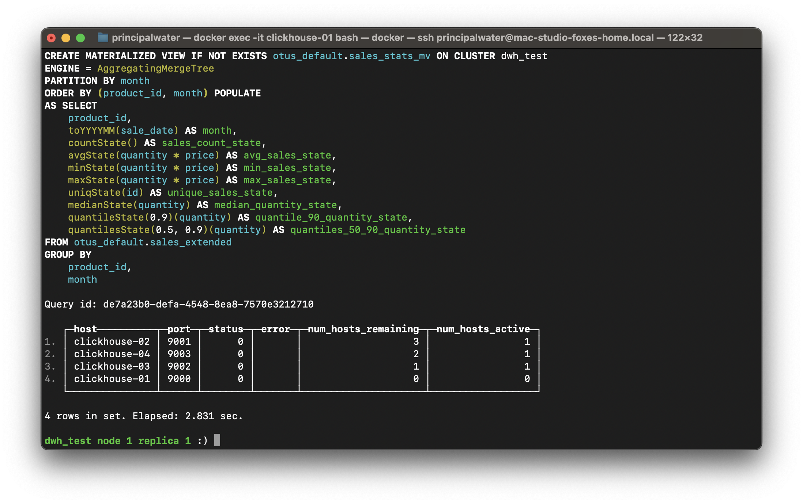

> **Вывод:**  
> Не используйте PARTITION BY по уникальным полям (например, product_id), чтобы избежать ошибок и проблем с производительностью. Для production всегда используйте партиционирование по времени (`toYYYYMM(date)` или аналогичное).

> **Примечание:**  
> В production-сценариях лучше создавать MV до массовой загрузки данных или наполнять MV вручную через отдельный `INSERT INTO ... SELECT ...`, чтобы избежать риска потери данных во время создания MV с `POPULATE`. Подробнее: [документация ClickHouse](https://clickhouse.com/docs/ru/sql-reference/statements/create/view/#populate).

----

**Пример агрегирующего запроса к таблице с проекцией (используются обычные агрегаты):**
```sql
SELECT
    product_id,
    count() AS sales_count,
    avg(quantity * price) AS avg_sales,
    min(quantity * price) AS min_sales,
    max(quantity * price) AS max_sales,
    uniq(id) AS unique_sales,
    median(quantity) AS median_quantity,
    quantile(0.9)(quantity) AS quantile_90_quantity,
    quantiles(0.5, 0.9)(quantity) AS quantiles_50_90_quantity
FROM otus_default.sales_extended
GROUP BY product_id
ORDER BY product_id;
```

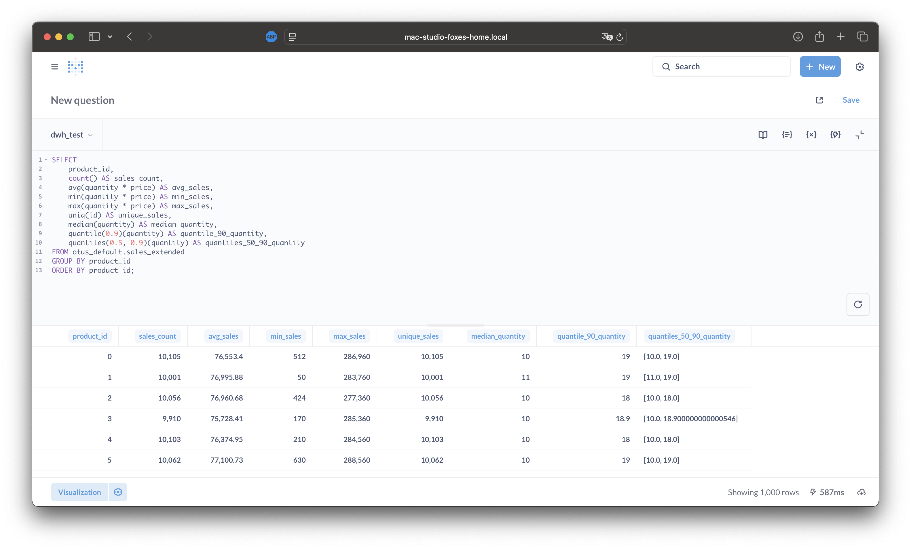

**Пример агрегирующего запроса к MV (используются только Merge-функции):**
```sql
SELECT
    product_id,
    countMerge(sales_count_state) AS sales_count,
    avgMerge(avg_sales_state) AS avg_sales,
    minMerge(min_sales_state) AS min_sales,
    maxMerge(max_sales_state) AS max_sales,
    uniqMerge(unique_sales_state) AS unique_sales,
    medianMerge(median_quantity_state) AS median_quantity,
    quantileMerge(0.9)(quantile_90_quantity_state) AS quantile_90_quantity,
    quantilesMerge(0.5, 0.9)(quantiles_50_90_quantity_state) AS quantiles_50_90_quantity
FROM otus_default.sales_stats_mv
GROUP BY product_id
ORDER BY product_id;
```

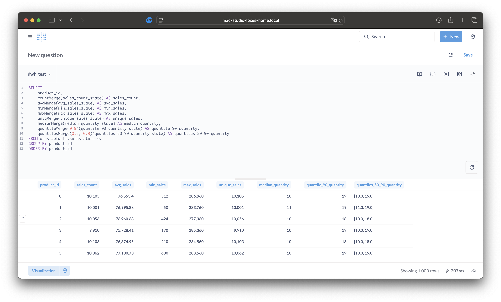

> [!info]
> **Применение агрегатов в проекциях и MV:**  
> - В проекции допустимы обычные агрегаты, так как она всегда отражает актуальные данные.  
> - В MV обязательно использовать state-функции для хранения и Merge-функции для запроса, чтобы обеспечить корректность и масштабируемость на больших объёмах данных и в кластере.  
> - Использование quantile/quantiles в обоих случаях возможно, но для MV — только через state/merge-комбинаторы.

**Вывод:**  
Порядок: таблица → данные → проекция → MV — обеспечивает корректное наполнение и работу агрегатов и тестовых примеров.

---

## Общие выводы по заданию

В ходе выполнения задания были на практике реализованы ключевые методы оптимизации ClickHouse с помощью проекций и материализованных представлений (MV), с соблюдением всех актуальных best practice:

- **Порядок создания объектов:**  
  Все DDL-объекты создавались в рекомендуемом порядке: сначала таблица, затем массовая загрузка данных, далее проекции и материализованные представления. Это исключает риск потери данных при инициализации агрегатов и гарантирует автоматическое наполнение MV всеми новыми строками.

- **Партиционирование:**  
  Во всех случаях использовалось партиционирование по времени (toYYYYMM(date)), что предотвращает избыточное количество партиций и обеспечивает производительность при больших объёмах. Чрезмерное партиционирование по уникальным ключам, например по product_id, приводит к ошибкам и замедлению — этот сценарий был разобран и отмечен как недопустимый для production.

- **Выбор агрегатных функций:**  
  В проекциях допустимо использовать обычные агрегаты, поскольку вычисления всегда происходят на свежих данных таблицы. Для MV с AggregatingMergeTree обязательно применение state-функций и соответствующих Merge-функций, что обеспечивает корректность и масштабируемость агрегаций на кластере.

- **Сценарии наполнения MV:**  
  В учебном примере рассмотрены оба подхода: наполнение MV до загрузки данных (production best practice), а также заполнение MV для уже существующих данных с помощью INSERT INTO ... SELECT ... или опции POPULATE (допустимо только для тестовой среды).

- **Практический эффект:**  
  Запросы к MV на агрегированных данных выполняются существенно быстрее (примерно в 2–3 раза), чем к таблице с проекцией, а стандартная таблица — ещё медленнее. EXPLAIN и замеры времени в Metabase подтверждают выигрыш по времени и корректность выбора оптимизации ClickHouse.

- **Обработка изменений:**  
  MV автоматически агрегирует только новые вставки, не отслеживая UPDATE/DELETE, в то время как проекции всегда отображают актуальные данные. Это различие критично для поддержки актуальных аналитических отчётов.

- **Ошибки и рекомендации:**  
  В отчёте разобраны типовые ошибки настройки партиционирования, приведены ссылки на официальную документацию и best practice. Особое внимание уделено предотвращению избыточного числа партиций и выбору временных срезов как ключевого подхода к масштабируемой аналитике.

Таким образом, задание закрепило на практике навыки грамотной архитектуры ClickHouse для аналитических витрин: от DDL до тестирования производительности и автоматизации поддержки структуры данных.
---

## FAQ

### Ошибка при создании проекции  
- Проверьте синтаксис и наличие необходимых прав.  
- Убедитесь, что проекция создаётся в таблице с поддержкой проекций (например, MergeTree).  

### Несоответствие данных в MV  
- MV обновляются автоматически при вставке данных, но не при обновлении или удалении.  
- Для актуализации данных необходимо пересоздавать MV или использовать подходы с инкрементальным обновлением.  

### Как пересчитать MV и проекции при обновлении данных  
- Проекции обновляются автоматически при вставках.  
- Для MV можно выполнить DROP и CREATE заново, либо использовать ALTER TABLE ... MATERIALIZE VIEW.  

### Как проверить структуру созданных объектов через system.tables/projections  
```sql
SELECT *
FROM system.tables
WHERE database = 'otus_default' AND name = 'sales';
```

```sql
SELECT *
FROM system.projections
WHERE table = 'sales' AND database = 'otus_default';
```

### Почему важно использовать разумное количество партиций и не делать partition by по id или уникальным значениям?

> Примечание по партиционированию и ORDER BY: см. комментарии в разделе [Шаг 1. Создаём таблицу sales](#шаг-1-создаём-таблицу-sales), а также официальную [документацию ClickHouse](https://clickhouse.com/docs/ru/engines/table-engines/mergetree-family/mergetree/#partition-by-expression).

---

## Список источников

- [Официальная документация ClickHouse: PARTITION BY и ORDER BY](https://clickhouse.com/docs/ru/engines/table-engines/mergetree-family/mergetree/#partition-by-expression)
- [Avito: Как мы храним 20000+ метрик и миллиарды комбинаций разрезов в одной таблице](https://habr.com/ru/companies/avito/articles/913694/)
- [Официальная документация ClickHouse по проекциям](https://clickhouse.com/docs/en/engines/table-engines/mergetree-family/mergetree/#projections)  
- [Официальная документация по материализованным представлениям](https://clickhouse.com/docs/en/sql-reference/statements/create/view/#materialized-view)  
- [Оптимизация запросов в ClickHouse](https://clickhouse.com/docs/en/operations/tips/)  
- [Генерация данных в ClickHouse](https://clickhouse.com/docs/sql-reference/table-functions/numbers)
