# Домашнее задание №9: Репликация и фоновые процессы в ClickHouse

---

## Оглавление

- [Описание задания и цели](#описание-задания-и-цели)
- [Архитектура кластера и внесённые изменения](#архитектура-кластера-и-внесённые-изменения)
- [Шаг 1. Подготовка и импорт демо-датасета](#шаг-1-подготовка-и-импорт-демо-датасета)
- [Шаг 2. Денормализация данных](#шаг-2-денормализация-данных)
- [Шаг 3. Конвертация таблицы в реплицируемую](#шаг-3-конвертация-таблицы-в-реплицируемую)
- [Шаг 4. Создание Distributed-таблицы](#шаг-4-создание-distributed-таблицы)
- [Шаг 5. Масштабирование кластера: добавление новых реплик](#шаг-5-масштабирование-кластера-добавление-новых-реплик)
- [Шаг 6. Проверка состояния кластера](#шаг-6-проверка-состояния-кластера)
- [Шаг 7. Управление жизненным циклом данных (TTL)](#шаг-7-управление-жизненным-циклом-данных-ttl)
- [Шаг 8. Проверка отказоустойчивости (стресс-тест)](#шаг-8-проверка-отказоустойчивости-стресс-тест)
- [Общие выводы по заданию](#общие-выводы-по-заданию)
- [Список источников](#список-источников)

---

## Описание задания и цели

В данном домашнем задании изучается настройка репликации и фоновых процессов в ClickHouse на примере реального демонстрационного датасета. Репликация обеспечивает высокую доступность и отказоустойчивость данных, а TTL позволяет автоматически удалять устаревшие данные, что важно для масштабируемых аналитических систем с большими объёмами информации.

Цели задания:
- Создать отказоустойчивую реплицируемую таблицу с использованием движка `ReplicatedMergeTree`.
- Настроить кластер с несколькими шардами и репликами через инфраструктурный код (Terraform).
- Импортировать и обработать реальные данные.
- Настроить TTL для автоматического удаления старых данных.
- Выполнить кластерные запросы для проверки состояния репликации и синхронизации.
- Проверить отказоустойчивость кластера путем имитации сбоя ноды.

Компетенции, которые будут отработаны:
- Работа с кластерами ClickHouse и движком `ReplicatedMergeTree`.
- Управление инфраструктурой через Terraform.
- Настройка и мониторинг репликации.
- Использование TTL для управления жизненным циклом данных.
- Анализ поведения кластера при сбоях.

---

## Архитектура кластера и внесённые изменения

Базовый кластер развёрнут и управляется через Terraform из каталога [`hw09_replication-lab/terraform`](./terraform/).

**Схема кластера:**
- **2 шарда × 2 или 3 реплики** (4 или 6 нод ClickHouse)
- **3 Keeper-ноды** (для метаданных и координации репликации)
- Изолированная сетевая среда, централизованный volume

**Динамическое масштабирование кластера**

Terraform-пайплайн настроен для поэтапного развертывания и масштабирования кластера. Управление составом кластера осуществляется через переменную `deploy_new_replicas` в файле `variables.tf`.

- **Базовая конфигурация (`deploy_new_replicas = false`):** Разворачиваются 4 ноды (2 шарда × 2 реплики).
- **Расширенная конфигурация (`deploy_new_replicas = true`):** Добавляются еще 2 ноды, доводя общее число до 6 (2 шарда × 3 реплики).

Такой подход позволяет гибко управлять инфраструктурой, добавляя или удаляя реплики одной командой без необходимости редактировать основной код. Terraform автоматически перегенерирует конфигурации для всех нод, включая секцию `<remote_servers>`, и безопасно перезапустит существующие контейнеры для применения изменений.

**Управление портами**

В конфигурации Terraform предусмотрена возможность гибкого управления портами ClickHouse через переменные в `variables.tf`:
- `use_standard_ports` (boolean, default: `true`): Если `true`, все ноды ClickHouse будут использовать стандартные порты (`ch_http_port`, `ch_tcp_port`, `ch_replication_port`). Если `false`, порты будут назначаться динамически, как в исходной конфигурации.
- `ch_http_port` (number, default: `8123`): Стандартный HTTP порт.
- `ch_tcp_port` (number, default: `9000`): Стандартный TCP порт.
- `ch_replication_port` (number, default: `9001`): Стандартный порт для репликации.

Эта функциональность позволяет легко переключаться между стандартной и пользовательской конфигурациями портов, что полезно для тестирования и развертывания в различных средах.

---

### Ключевые параметры конфигурации (`config.xml.tpl`)

В дополнение к базовой конфигурации были добавлены и оптимизированы параметры, выбранные на основании best-practice ClickHouse для масштабируемых кластеров.

- **Ограничения сетевого трафика для репликации:**
  - `<max_replicated_fetches_network_bandwidth_for_server>` и `<max_replicated_sends_network_bandwidth_for_server>` ограничивают входящий и исходящий трафик репликации, чтобы контролировать нагрузку на сеть при восстановлении или балансировке.
- **Параметры MergeTree для больших объёмов:**
  - `<parts_to_throw_insert>`: Жёсткий лимит на количество активных частей в таблице для предотвращения деградации производительности (`Too many parts`).
  - `<replication_alter_partitions_sync>`: Обеспечивает синхронное выполнение операций `ALTER` на всех репликах, гарантируя согласованность схемы.
  - `<replicated_can_become_leader>`: Позволяет назначать только определённым репликам становиться лидерами, что повышает стабильность.
- **Секция `<compression>`**: Используется гибридный подход (ZSTD для больших партиций, LZ4 для остальных) для баланса скорости и степени сжатия.

> Все параметры подбирались с учётом тестирования, опыта эксплуатации и рекомендаций из [официальной документации ClickHouse](https://clickhouse.com/docs/en/).

---

## Шаг 1. Подготовка и импорт демо-датасета

### 1.1. Развёртывание инфраструктуры
Перед началом работы необходимо развернуть базовую инфраструктуру (4 ноды) с помощью Terraform.
```sh
cd hw09_replication-lab/terraform
terraform init
terraform apply -auto-approve
```
> Все последующие `apply`/расширения кластера необходимо делать уже только из этой директории.

### 1.2. Создание базы данных и базовых таблиц
Для всех таблиц используется база данных `otus_default`. Она создаётся на всех нодах кластера с помощью следующей команды, выполненной из `clickhouse-client` на узле `clickhouse-01`:
```sql
CREATE DATABASE IF NOT EXISTS otus_default ON CLUSTER dwh_test;
```
В качестве демонстрационного датасета используется открытый набор данных [NYPL "What's on the menu?"](https://clickhouse.com/docs/en/getting-started/example-datasets/menus) — исторические меню Нью-Йоркской публичной библиотеки.

> **Важное примечание по датасету:**  
> По состоянию на Июль 2025, официальный сайт проекта ["What's on the Menu?"](https://www.nypl.org/research/support/whats-on-the-menu) был выведен из эксплуатации из-за устаревшего программного и аппаратного обеспечения, представлявшего риски кибербезопасности.
>
> Однако сами данные по-прежнему доступны для загрузки по прямым ссылкам, указанным в [документации ClickHouse](https://clickhouse.com/docs/getting-started/example-datasets/menus), откуда они и берутся в рамках данной работы.

Создаём четыре основные таблицы на кластере `dwh_test` в базе `otus_default`:
```sql
CREATE TABLE IF NOT EXISTS otus_default.dish ON CLUSTER dwh_test
(
    id                   UInt32 COMMENT 'Уникальный идентификатор блюда',
    name                 String COMMENT 'Название блюда'
)
ENGINE = MergeTree
ORDER BY id;

CREATE TABLE IF NOT EXISTS otus_default.menu ON CLUSTER dwh_test
(
    id                   UInt32 COMMENT 'Уникальный идентификатор меню',
    name                 String COMMENT 'Название меню или заведения',
    sponsor              String COMMENT 'Спонсор или заказчик меню',
    event                String COMMENT 'Событие, к которому относится меню',
    venue                String COMMENT 'Место проведения события/заведение',
    place                String COMMENT 'Описание локации (зал, стол и т.п.)',
    physical_description String COMMENT 'Физическое описание меню (тип, особенности оформления)',
    occasion             String COMMENT 'Повод или причина создания меню',
    notes                String COMMENT 'Дополнительные заметки',
    call_number          String COMMENT 'Инвентарный или архивный номер',
    keywords             String COMMENT 'Ключевые слова для поиска',
    language             String COMMENT 'Язык меню',
    date                 String COMMENT 'Дата меню (строкой из источника)',
    location             String COMMENT 'Город или адрес',
    location_type        String COMMENT 'Тип локации (город, регион и т.д.)',
    currency             String COMMENT 'Валюта цен',
    currency_symbol      String COMMENT 'Символ валюты',
    status               String COMMENT 'Статус или примечание по состоянию меню',
    page_count           UInt16 COMMENT 'Количество страниц меню',
    dish_count           UInt16 COMMENT 'Количество блюд в меню'
)
ENGINE = MergeTree
ORDER BY id;

CREATE TABLE IF NOT EXISTS otus_default.menu_page ON CLUSTER dwh_test
(
    id                   UInt32 COMMENT 'Уникальный идентификатор страницы меню',
    menu_id              UInt32 COMMENT 'Идентификатор меню',
    page_number          UInt16 COMMENT 'Номер страницы',
    image_id             String COMMENT 'Идентификатор изображения страницы',
    full_height          UInt32 COMMENT 'Высота изображения',
    full_width           UInt32 COMMENT 'Ширина изображения'
)
ENGINE = MergeTree
ORDER BY id;

CREATE TABLE IF NOT EXISTS otus_default.menu_item ON CLUSTER dwh_test
(
    id                   UInt32 COMMENT 'Уникальный идентификатор блюда в меню',
    menu_page_id         UInt32 COMMENT 'Идентификатор страницы меню',
    dish_id              UInt32 COMMENT 'Идентификатор блюда (dish.id)',
    price                String COMMENT 'Цена блюда (строкой)',
    high_price           String COMMENT 'Верхняя граница цены (если указана)',
    low_price            String COMMENT 'Нижняя граница цены (если указана)',
    section              String COMMENT 'Раздел меню',
    subsection           String COMMENT 'Подраздел меню',
    position             String COMMENT 'Позиция на странице',
    description          String COMMENT 'Описание блюда'
)
ENGINE = MergeTree
ORDER BY id;
```

### 1.3. Импорт данных
Импортируем CSV-файлы с помощью скрипта:
```bash
../scripts/import_menu_dataset.sh
```
Скрипт скачивает и распаковывает архив NYPL, копирует файлы `Menu.csv`, `MenuItem.csv`, `MenuPage.csv`, `Dish.csv` в директорию `/var/lib/clickhouse/user_files/` и выполняет вставку данных в соответствующие таблицы. По умолчанию скрипт использует стандартный порт `9000`.

> ⚠️ Перед запуском задайте переменные окружения `TF_VAR_super_user_name` и `TF_VAR_super_user_password` для аутентификации. Для использования нестандартных портов, установите переменную окружения `USE_STANDARD_PORTS` в `false`:
> ```bash
> USE_STANDARD_PORTS=false ../scripts/import_menu_dataset.sh
> ```
> 
> Это необходимо в случае, если были заданы нестандартные порты в terraform пайплайне и переменная `use_standard_ports` заменена на `false` в `terraform.tfvars` или при деплое terraform инфраструктуры с `-var="use_standard_ports=false"`.

> Документация по импорту CSV:  
> - https://clickhouse.com/docs/en/interfaces/formats#csvwithnames  
> - https://clickhouse.com/docs/en/sql-reference/statements/copy/

> Альтернативно можно залить данные вручную для каждого файла:
> ```bash
> clickhouse-client --host <host> --query "INSERT INTO otus_default.menu_item FORMAT CSV" < MenuItem.csv
> ```
> Или циклом:
> ```bash
> for tbl in menu menu_item menu_page dish; do
>   clickhouse-client --host <host> --query "INSERT INTO otus_default.$tbl FORMAT CSV" < ${tbl^}.csv
> done
> ```
> где `${tbl^}` — Bash 4+, первая буква в верхний регистр.

*Результат исполнения скрипта и импорта данных:*

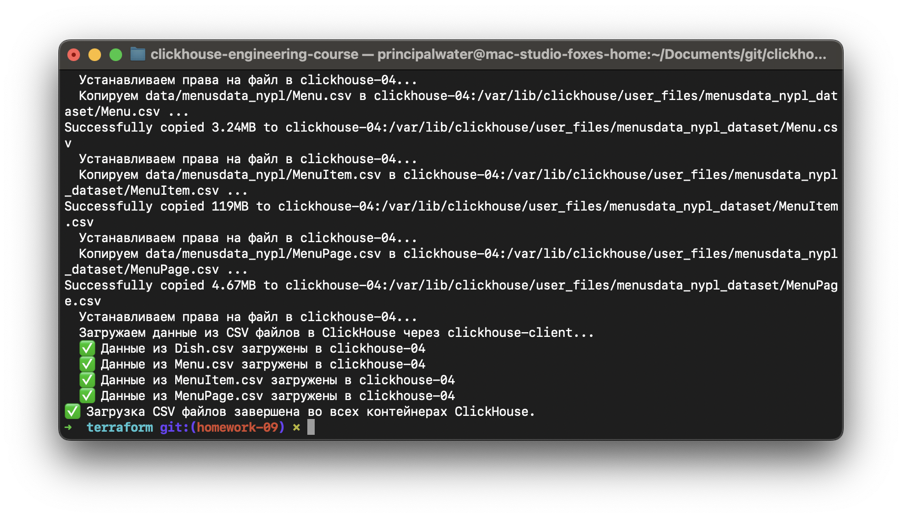

---

## Шаг 2. Денормализация и оптимизация таблицы
Для аналитических задач нормализованная схема не всегда является самой эффективной. Используем подход `CREATE TABLE ... AS SELECT ...`, чтобы атомарно создать и заполнить денормализованную таблицу на всех узлах кластера. Этот метод, описанный в [документации ClickHouse](https://clickhouse.com/docs/ru/sql-reference/statements/create/table#create-table-as-select), является наиболее производительным и идемпотентным для инициализации таблиц в кластерном режиме и заменяет необходимость в двухшаговом создании таблицы с последующим переносом партиций.

### Создание и заполнение таблицы
Выполним единый запрос, который объединяет данные из исходных таблиц и сразу же генерирует служебные поля `date` и `partition_state`.
```sql
CREATE TABLE IF NOT EXISTS otus_default.menu_item_denorm ON CLUSTER dwh_test
ENGINE = MergeTree
PARTITION BY toYYYYMM(date)
ORDER BY (date, menu_item_id, dish_id)
SETTINGS index_granularity = 8192
AS
WITH
    -- Используем WITH для генерации псевдо-случайной даты для каждой строки. 564 — это количество дней между '2024-01-01' и '2025-07-18'
    toDate('2024-01-01') + INTERVAL rowNumberInAllBlocks() % 564 DAY AS generated_date
SELECT
    generated_date AS date,
    toInt64(toStartOfDay(generated_date)) + cityHash64(menu_item.id, dish.id) % 86400 AS partition_state,
    menu_item.price,
    menu_item.high_price,
    menu_item.section,
    menu_item.subsection,
    menu_item.position,
    menu_item.description,
    menu_item.id                   AS menu_item_id,
    menu_item.menu_page_id         AS menu_item_menu_page_id,
    menu_item.dish_id              AS menu_item_dish_id,
    dish.id                        AS dish_id,
    dish.name                      AS dish_name,
    menu_page.id                   AS menu_page_id,
    menu_page.menu_id              AS menu_page_menu_id,
    menu_page.page_number          AS menu_page_number,
    menu_page.image_id             AS menu_page_image_id,
    menu_page.full_height          AS menu_page_full_height,
    menu_page.full_width           AS menu_page_full_width,
    menu.id                        AS menu_id,
    menu.name                      AS menu_name,
    menu.sponsor                   AS menu_sponsor,
    menu.event                     AS menu_event,
    menu.venue                     AS menu_venue,
    menu.place                     AS menu_place,
    menu.physical_description      AS menu_physical_description,
    menu.occasion                  AS menu_occasion,
    menu.notes                     AS menu_notes,
    menu.call_number               AS menu_call_number,
    menu.keywords                  AS menu_keywords,
    menu.language                  AS menu_language,
    menu.date                      AS menu_date,
    menu.location                  AS menu_location,
    menu.location_type             AS menu_location_type,
    menu.currency                  AS menu_currency,
    menu.currency_symbol           AS menu_currency_symbol,
    menu.status                    AS menu_status,
    menu.page_count                AS menu_page_count,
    menu.dish_count                AS menu_dish_count
FROM otus_default.menu_item
    JOIN otus_default.dish       ON menu_item.dish_id = dish.id
    JOIN otus_default.menu_page  ON menu_item.menu_page_id = menu_page.id
    JOIN otus_default.menu       ON menu_page.menu_id = menu.id
COMMENT 'Денормализованная и оптимизированная таблица, объединяющая меню, блюда и их атрибуты.';
```

> **💡 Примечание по генерации данных:**  
> Для имитации реальных данных мы генерируем `date` и `partition_state` "на лету". Чтобы значения были разными для каждой строки, а не одинаковыми для всего запроса, мы используем `rowNumberInAllBlocks()`. Эта функция возвращает порядковый номер строки в пределах всех обработанных блоков, что обеспечивает более равномерное распределение дат, к примеру, по сравнению с `cityHash64(menu_item.id)`, которое может приводить к перекосам в распределении и, как следствие, к разному количеству партиций на репликах.

*Результат создания и заполнения денормализованной таблицы:*

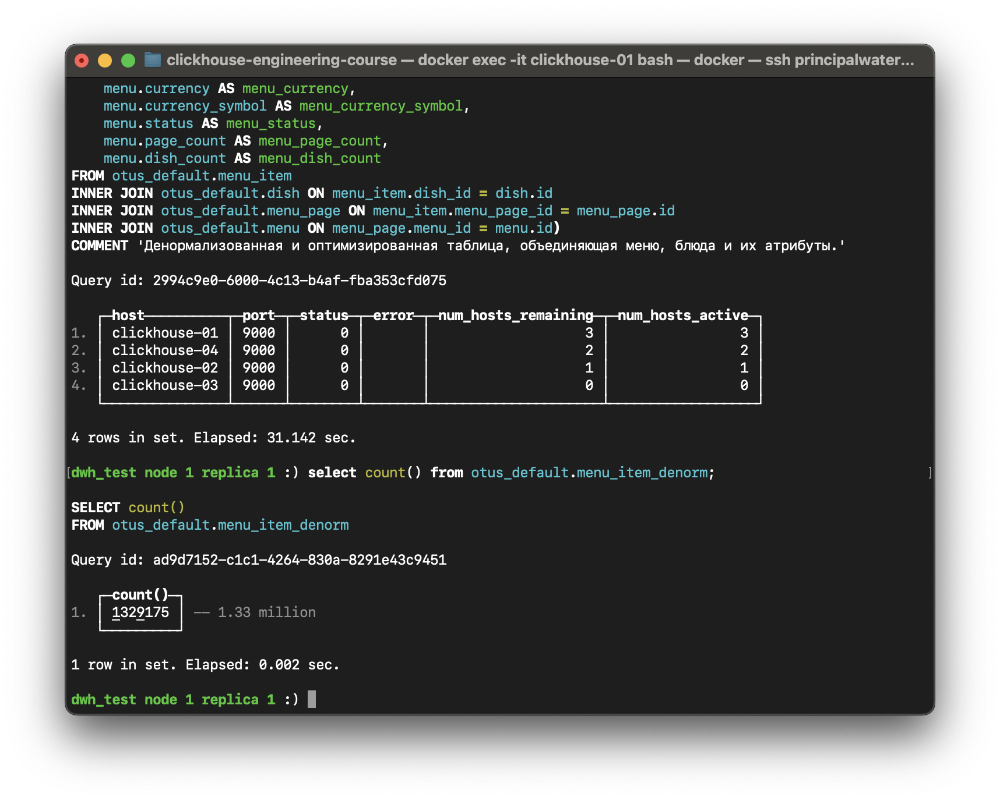

После создания таблицы применим кодеки сжатия для оптимизации хранения данных.
```sql
ALTER TABLE otus_default.menu_item_denorm ON CLUSTER dwh_test 
    MODIFY COLUMN date CODEC(Delta(2), ZSTD(1)),
    MODIFY COLUMN partition_state CODEC(Delta(8), ZSTD(1));
```

> **💡 Примечания по оптимизации таблицы:**  
> - **`PARTITION BY toYYYYMM(date)`**: Мы партиционируем данные по месяцам. Это ключевая оптимизация для time-series данных. ClickHouse будет хранить данные за каждый месяц в отдельных каталогах (партициях), что позволяет ему при запросах с фильтром по `date` (например, `WHERE date >= '2025-01-01'`) сканировать не всю таблицу, а только нужные партиции.
> - **`ORDER BY (date, ...)`**: Ключ сортировки начинается с `date`, что совпадает с ключом партиционирования. Это позволяет ClickHouse очень эффективно считывать данные, так как они уже отсортированы на диске в нужном порядке.
> - **`SETTINGS index_granularity = 8192`**: Это стандартное значение, определяющее, сколько строк попадает в одну "гранулу" индекса. Каждые 8192 строки ClickHouse сохраняет "засечку" со значением первичного ключа. При поиске данных он сначала смотрит на эти засечки, чтобы быстро найти нужный диапазон гранул, а не сканировать все данные подряд.
> - **`CODEC(Delta, ZSTD)`**: Мы применяем каскадные кодеки. `Delta` вычисляет разницу между соседними значениями (что очень эффективно для отсортированных дат и timestamp'ов), а затем `ZSTD` сжимает эти дельты. Это даёт значительно лучшее сжатие для числовых и временных рядов по сравнению со стандартным `LZ4`.
>
> Подробнее об этих техниках:
> - [Официальная документация по CREATE TABLE](https://clickhouse.com/docs/ru/sql-reference/statements/create/table)
> - [Habr - Clickhouse: сжимаем данные эффективно](https://habr.com/ru/articles/718618/)
> - [Optimizing ClickHouse Compression for Fun and Profit](https://clickhouse.com/blog/optimize-clickhouse-codecs-compression-schema)

---

## Шаг 3. Конвертация таблицы в реплицируемую
Теперь конвертируем денормализованную таблицу в реплицируемую — основу отказоустойчивости. Процесс состоит из двух DDL-запросов, которые обеспечивают атомарное создание реплицируемой таблицы с наследованием схемы и данных.

1.  **Создание реплицируемой таблицы и перенос данных**
    Выполняем два запроса. Первый создаёт новую таблицу, второй — атомарно переносит в неё данные с локальной ноды.

    ```sql
    -- Шаг 3.1: Создаём пустую реплицируемую таблицу, клонируя структуру существующей.
    -- ORDER BY и PARTITION BY наследуются автоматически из menu_item_denorm.
    CREATE TABLE IF NOT EXISTS otus_default.menu_item_denorm_replicated ON CLUSTER dwh_test
        CLONE AS otus_default.menu_item_denorm
        ENGINE = ReplicatedMergeTree('/clickhouse/tables/{shard}/otus_default/menu_item_denorm_local/{uuid}', '{replica}');

    -- Шаг 3.2: Принудительно и атомарно подключаем все партиции из локальной таблицы.
    -- Это необходимо для инициализации реплики её собственными локальными данными.
    ALTER TABLE otus_default.menu_item_denorm_replicated ON CLUSTER dwh_test
        ATTACH PARTITION ALL FROM otus_default.menu_item_denorm;
    ```

    > **💡 Почему именно такая последовательность?**
    > - **`CREATE ... CLONE ...`**: Эта команда — production best-practice для миграции. Она создаёт новую таблицу, полностью копируя структуру исходной (`ORDER BY`, `PARTITION BY`, `SETTINGS` и т.д.), поэтому их не нужно указывать повторно.
    > - **`ALTER ... ATTACH ...`**: Хотя `CLONE` предназначен для копирования и данных, в кластерном режиме при конвертации `MergeTree` в `ReplicatedMergeTree` может возникнуть ситуация, когда реплика остаётся пустой, ожидая данных от "соседей". Команда `ATTACH` явно указывает реплике использовать уже имеющиеся на её диске партиции от `menu_item_denorm`, что является надёжным способом инициализации. Реплики могут ожидать `fetch` с других нод, но не получать его, если партиции не "закреплены" через `ATTACH`. Подробнее в issue [#53180](https://github.com/ClickHouse/ClickHouse/issues/53180).
    > - **Путь в Keeper**: Путь `/clickhouse/tables/{shard}/otus_default/menu_item_denorm_local/{uuid}` содержит макросы `{shard}` и `{uuid}`, которые ClickHouse автоматически заменяет на ID шарда и уникальный ID реплики. Это гарантирует, что у каждой реплики в Keeper будет свой уникальный путь для хранения метаданных.

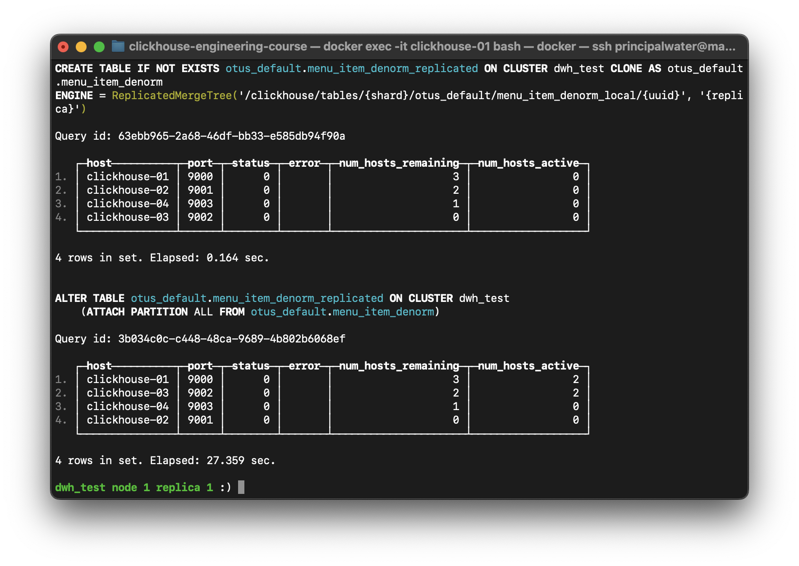

2.  **Переименовываем таблицы**:
    ```sql
    RENAME TABLE otus_default.menu_item_denorm TO otus_default.menu_item_denorm_base,
                 otus_default.menu_item_denorm_replicated TO otus_default.menu_item_denorm_local
    ON CLUSTER dwh_test;
    ```
    > **Примечание:** Мы не удаляем исходную таблицу, а переименовываем её в `_base`. Она понадобится нам в **Шаге 5** в качестве "шаблона" для создания реплицируемой таблицы на новых нодах после масштабирования кластера.

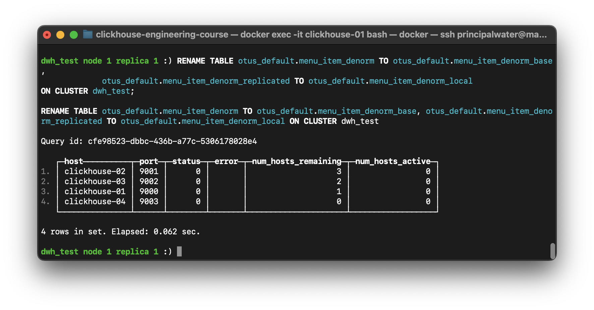

3. **Проверяем репликацию**:
    Для проверки, что каждая реплика таблицы `menu_item_denorm_local` содержит данные, используем следующий запрос.
   ```sql
    SELECT
        getMacro('replica') AS replica,
        hostName() AS host,
        count() AS part_count
    FROM clusterAllReplicas('dwh_test', system.parts)
    WHERE table = 'menu_item_denorm_local'
      AND database = 'otus_default'
      AND active
    GROUP BY replica, host
    ORDER BY replica, part_count;
    ```
*Результат создания и проверки реплицируемой таблицы:*

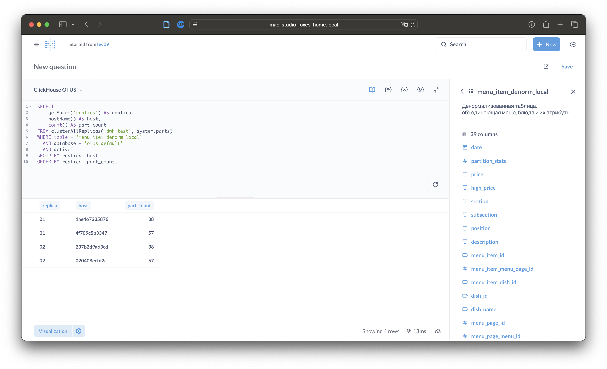

> **⚠️ Примечание о разном количестве партиций (кусков)**
> Стоит обратить внимание на то, что количество кусков (`part_count`) на репликах одного шарда может отличаться. Это **ожидаемое поведение** при данном способе инициализации и **не является критической ошибкой** для настоящего задания.
>
> - **Причина:** Запрос `CREATE TABLE ... AS SELECT` выполняется независимо на каждой ноде кластера. Несмотря на использование детерминированной функции `rowNumberInAllBlocks()`, небольшие различия в таймингах выполнения `JOIN` или фоновых `MERGE`-процессов на каждой ноде приводят к формированию разного набора и количества кусков (parts) для одних и тех же логических данных. Когда мы инициализируем реплики через `ATTACH PARTITION`, они просто "подхватывают" эти уже существующие локальные куски.
> - **Production best practice:** В продуктивных средах для обеспечения полной идентичности реплик (включая физическую структуру) используется другой подход: данные вставляются (`INSERT`) только в одну реплику каждого шарда. ClickHouse затем сам тиражирует эти вставки на остальные реплики, гарантируя, что они будут байт-в-байт идентичны.
>
> В нашем случае логические данные на всех репликах полностью согласованы, и кластер работает корректно.

---

## Шаг 4. Создание Distributed-таблицы
Для обеспечения корректного распределения данных по всем репликам и шардам при дальнейшей работе с таблицей, а также для обеспечения удобной работы с кластером как с единым целым создадим `Distributed`-таблицу. Такая таблица будет автоматически распределять запросы по всем шардам кластера.
```sql
CREATE TABLE IF NOT EXISTS otus_default.menu_item_denorm ON CLUSTER dwh_test
AS otus_default.menu_item_denorm_local
ENGINE = Distributed(
    'dwh_test',                         -- Имя кластера
    'otus_default',                     -- БД для локальных таблиц
    'menu_item_denorm_local',           -- Имя локальной таблицы
    toYYYYMM(date)                      -- Ключ шардирования
);
```
*Результат создания распределенной таблицы:*


> **💡 Примечание по шардированию:**  
> - **Движок `Distributed` не хранит данные**, а лишь является "прокси" для запросов к локальным таблицам на шардах. Поэтому он не имеет собственных ключей `ORDER BY` или `PARTITION BY` — эти свойства определяются на уровне локальных таблиц (`menu_item_denorm_local`).
> - В качестве ключа шардирования используется `toYYYYMM(date)`. В отличие от `cityHash64` от идентификатора, такой подход обеспечивает шардирование по месяцам. Это стандартная практика для time-series данных, которая даёт следующие преимущества:
> - **Локальность данных:** Запросы, фильтрующие по диапазону дат (например, за последний месяц), будут обращаться только к одному шарду, что значительно ускоряет их выполнение.
> - **Управляемость:** Упрощается управление данными, например, удаление или архивация старых партиций пошардово.
> - **Предсказуемое распределение:** Данные распределяются по шардам предсказуемо, что помогает избежать проблемы "раздувания" данных при `INSERT ... SELECT`, когда один и тот же набор данных может дублироваться на разных шардах.
>
> Подробнее о выборе ключа шардирования можно почитать в статьях:
> - [Habr - Шардированный кластер ClickHouse](https://habr.com/ru/companies/wildberries/articles/896060/)
> - [Habr - Oracle/ClickHouse. DWH. Партицирование как средство быстрого обновления данных](https://habr.com/ru/articles/762960/)

---

## Шаг 5. Масштабирование кластера: добавление новых реплик
Terraform-пайплайн полностью автоматизирует процесс масштабирования. Для добавления двух новых реплик (`clickhouse-05` и `clickhouse-06`) необходимо выполнить следующие шаги.

1.  **Применение новой конфигурации Terraform**:
    Перейдите в каталог `hw09_replication-lab/terraform` и выполните команду:
    ```sh
    terraform apply -var="deploy_new_replicas=true" -auto-approve
    ```
    Эта команда инструктирует Terraform:
    - **Создать ресурсы** для двух новых нод: `clickhouse-05` (шард 1, реплика 3) и `clickhouse-06` (шард 2, реплика 3).
    - **Обновить конфигурации**: Перегенерировать `config.xml` для *всех* нод (старых и новых), добавив в секцию `remote_servers` новые хосты.
    - **Безопасно перезапустить контейнеры**: Terraform обнаружит изменение в хеше конфигурации (через `labels`) и пересоздаст существующие контейнеры, чтобы они подхватили новую топологию кластера.

*Результат выполнения команды и новые контейнеры в Docker:*

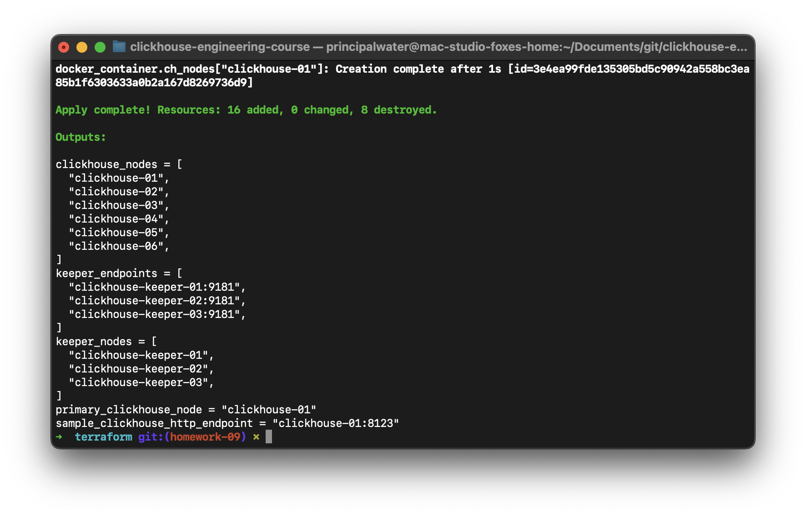

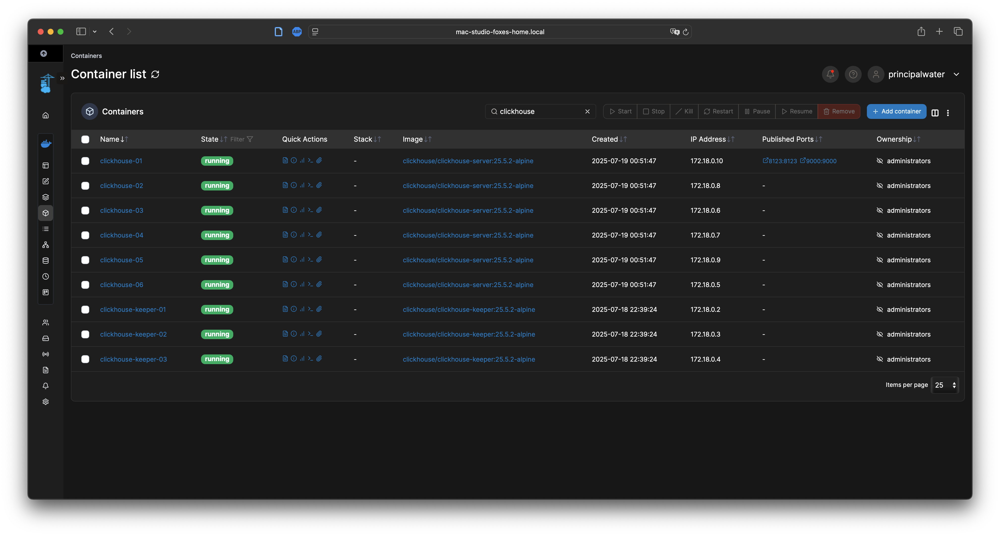

2.  **Инициализация таблицы на новых репликах**:
    После запуска новых нод на них необходимо создать `Replicated`-таблицу. Это делается явным DDL-запросом, который будет выполнен на всех узлах кластера, но сработает только на новых благодаря флагу `IF NOT EXISTS`.

    > **Важно:** При создании таблицы на новых нодах нужно обязательно указать тот же `uuid`, что зафиксировался на первых 4-х нодах. Это обеспечит консистентность реплик и позволит им правильно синхронизироваться.
    > 
    > Чтобы найти этот `uuid`, нужно выполнить запрос на любой из "старых" нод:
    > ```sql
    > SELECT 
    >     database, 
    >     name, 
    >     uuid 
    > FROM system.tables
    > WHERE database = 'otus_default'
    >   AND name = 'menu_item_denorm_local';
    > ```
    >
    > Полученное значение `uuid` необходимо подставить вместо плейсхолдера `{uuid}` в `ENGINE`-определении ниже.


```sql
CREATE TABLE IF NOT EXISTS otus_default.menu_item_denorm_local ON CLUSTER dwh_test
(
    -- Структура полностью повторяет таблицу, созданную в Шаге 2
    `date` Date COMMENT 'Служебная дата события для партиционирования' CODEC(Delta(2), ZSTD(1)),
    `partition_state` Int64 COMMENT 'Служебный timestamp для версионирования загрузки данных' CODEC(Delta(8), ZSTD(1)),
    `price` String COMMENT 'Цена блюда (строкой)',
    `high_price` String COMMENT 'Верхняя граница цены (если указана)',
    `section` String COMMENT 'Раздел меню',
    `subsection` String COMMENT 'Подраздел меню',
    `position` String COMMENT 'Позиция на странице',
    `description` String COMMENT 'Описание блюда',
    `menu_item_id` UInt32 COMMENT 'Уникальный идентификатор блюда в меню (menu_item.id)',
    `menu_item_menu_page_id` UInt32 COMMENT 'Идентификатор страницы меню (menu_item.menu_page_id)',
    `menu_item_dish_id` UInt32 COMMENT 'Идентификатор блюда (menu_item.dish_id)',
    `dish_id` UInt32 COMMENT 'Уникальный идентификатор блюда (dish.id)',
    `dish_name` String COMMENT 'Название блюда',
    `menu_page_id` UInt32 COMMENT 'Уникальный идентификатор страницы меню (menu_page.id)',
    `menu_page_menu_id` UInt32 COMMENT 'Идентификатор меню (menu_page.menu_id)',
    `menu_page_number` UInt16 COMMENT 'Номер страницы',
    `menu_page_image_id` String COMMENT 'Идентификатор изображения страницы',
    `menu_page_full_height` UInt32 COMMENT 'Высота изображения',
    `menu_page_full_width` UInt32 COMMENT 'Ширина изображения',
    `menu_id` UInt32 COMMENT 'Уникальный идентификатор меню (menu.id)',
    `menu_name` String COMMENT 'Название меню или заведения',
    `menu_sponsor` String COMMENT 'Спонсор или заказчик меню',
    `menu_event` String COMMENT 'Событие, к которому относится меню',
    `menu_venue` String COMMENT 'Место проведения события/заведение',
    `menu_place` String COMMENT 'Описание локации (зал, стол и т.п.)',
    `menu_physical_description` String COMMENT 'Физическое описание меню (тип, особенности оформления)',
    `menu_occasion` String COMMENT 'Повод или причина создания меню',
    `menu_notes` String COMMENT 'Дополнительные заметки',
    `menu_call_number` String COMMENT 'Инвентарный или архивный номер',
    `menu_keywords` String COMMENT 'Ключевые слова для поиска',
    `menu_language` String COMMENT 'Язык меню',
    `menu_date` String COMMENT 'Дата меню (строкой из источника)',
    `menu_location` String COMMENT 'Город или адрес',
    `menu_location_type` String COMMENT 'Тип локации (город, регион и т.д.)',
    `menu_currency` String COMMENT 'Валюта цен',
    `menu_currency_symbol` String COMMENT 'Символ валюты',
    `menu_status` String COMMENT 'Статус или примечание по состоянию меню',
    `menu_page_count` UInt16 COMMENT 'Количество страниц меню',
    `menu_dish_count` UInt16 COMMENT 'Количество блюд в меню'
)
ENGINE = ReplicatedMergeTree(
    '/clickhouse/tables/{shard}/otus_default/menu_item_denorm_local/ae08bca2-291a-4b49-86b9-b4b814fc18ed',
    '{replica}'
)
PARTITION BY toYYYYMM(date)
ORDER BY (date, menu_item_id, dish_id)
SETTINGS index_granularity = 8192;
```
> **Как это работает:** Этот DDL-запрос полностью описывает структуру реплицируемой таблицы, включая `ORDER BY`, `PARTITION BY`, кодеки и комментарии. Он не зависит от наличия таблицы-шаблона.
> - На старых нодах (`01`-`04`) команда не выполнится, так как таблица `menu_item_denorm_local` уже существует.
> - На новых нодах (`05`, `06`) будет создана пустая таблица с верной схемой.
> - Сразу после создания таблица зарегистрируется в Keeper, обнаружит "соседей" по шарду и автоматически начнёт скачивать у них недостающие данные для синхронизации.

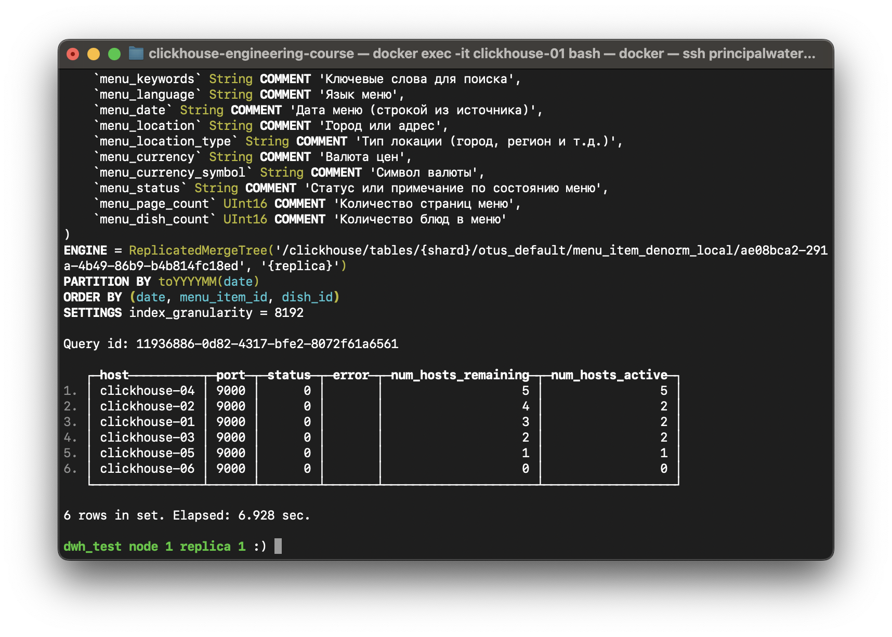

3.  **Проверка статуса репликации**:
    Через некоторое время убедимся, что данные успешно синхронизировались, проверив количество партиций на всех репликах:
    ```sql
    SELECT
        getMacro('replica') AS replica,
        hostName() AS host,
        count() AS part_count
    FROM clusterAllReplicas('dwh_test', system.parts)
    WHERE table = 'menu_item_denorm_local'
      AND database = 'otus_default'
      AND active
    GROUP BY replica, host
    ORDER BY replica, part_count;
    ```

Сразу после создания таблицы на новых нодах, можно увидеть, что данные постепенно проливаются:
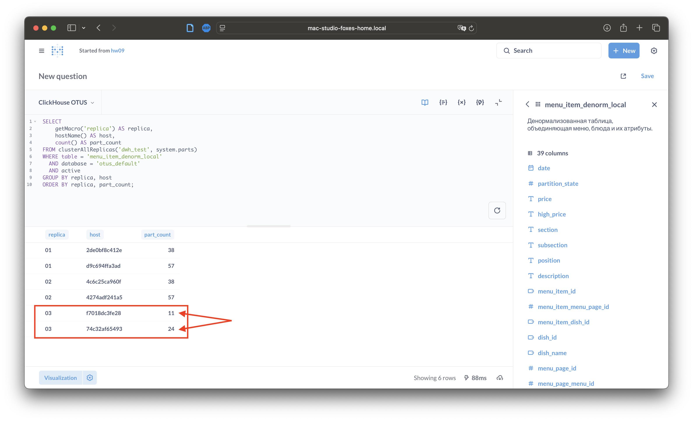

По завершении репликации, значения кусков будут идентичны другим нодам кластера:
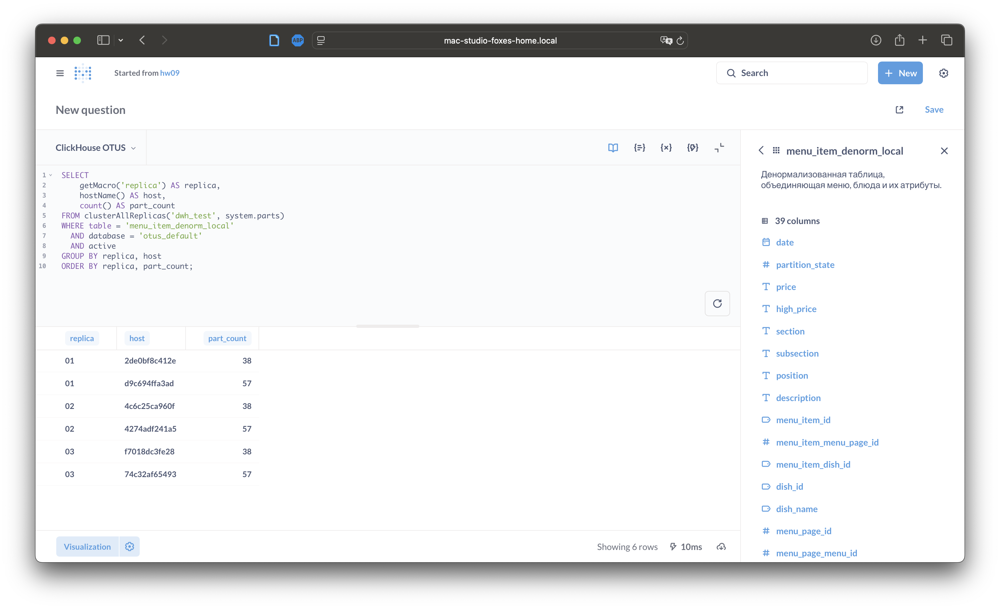

4.  **Очистка**:
    Теперь, когда все реплики созданы и синхронизированы, "базовая" таблица-шаблон больше не нужна.
    ```sql
    DROP TABLE IF EXISTS otus_default.menu_item_denorm_base ON CLUSTER dwh_test;
    ```

---

## Шаг 6. Проверка состояния кластера
Для анализа состояния кластера выполним запросы к системным таблицам и сохраним результаты в файлы.
1.  **Проверка частей таблицы на всех репликах:**

    Для выполнения этой проверки можно использовать два подхода.

    **Способ 1 (устаревший, с `remote()`) - изначально используемый в рамках задания:**
    Этот метод требует явной передачи учётных данных, так как из-за особенностей конфигурации (нетиповой путь к `users.xml`) ClickHouse не может автоматически определить пользователя сессии и по умолчанию пытается использовать `default`, что приводит к ошибке аутентификации.
    ```sql
    SELECT getMacro('replica') AS replica, *
    FROM remote(
        'clickhouse-01,clickhouse-02,clickhouse-03,clickhouse-04,clickhouse-05,clickhouse-06',
        'system',
        'parts',
        'your_user',      -- Замените на ваше имя суперпользователя
        'your_password'   -- Замените на ваш пароль
    )
    WHERE table = 'menu_item_denorm_local' AND database = 'otus_default'
    FORMAT JSONEachRow;
    ```

    **Способ 2 (рекомендуемый, с `clusterAllReplicas()`):**
    Этот подход является более современным и надёжным, так как использует конфигурацию кластера из `config.xml`, не требует ручного перечисления хостов и явной передачи пароля в запросе.
    ```sql
    SELECT getMacro('replica') AS replica, *
    FROM clusterAllReplicas('dwh_test', system.parts)
    WHERE table = 'menu_item_denorm_local' AND database = 'otus_default'
    FORMAT JSONEachRow;
    ```

    **Выполнение и сохранение результата в файл:**
    Для исполнения запроса и сохранения его вывода в формате `JSONEachRow` в нужный файл, необходимо выполнить из каталога `hw09_replication-lab/terraform` следующую команду:
    ```bash
    docker exec -i clickhouse-01 clickhouse-client \
      --user "${TF_VAR_super_user_name}" \
      --password "${TF_VAR_super_user_password}" \
      --query "SELECT getMacro('replica') AS replica, * FROM clusterAllReplicas('dwh_test', system.parts) WHERE table = 'menu_item_denorm_local' AND database = 'otus_default' FORMAT JSONEachRow" > ../../materials/hw09_replication-lab/parts.jsonl
    ```
    > **💡 Примечание:** Команда использует переменные окружения `TF_VAR_super_user_name` и `TF_VAR_super_user_password`, которые необходимо было задать для работы с Terraform.
    >
    > Результат будет сохранен в файле: [`parts.jsonl`](../materials/hw09_replication-lab/parts.jsonl).

2.  **Проверка статуса реплик:**
    ```sql
    SELECT * FROM system.replicas
    WHERE table = 'menu_item_denorm_local' AND database = 'otus_default'
    FORMAT JSONEachRow;
    ```
    Аналогично, для сохранения результата в файл, необходимо выполнить команду:
    ```bash
    docker exec -i clickhouse-01 clickhouse-client \
      --user "${TF_VAR_super_user_name}" \
      --password "${TF_VAR_super_user_password}" \
      --query "SELECT * FROM system.replicas WHERE table = 'menu_item_denorm_local' AND database = 'otus_default' FORMAT JSONEachRow" > ../../materials/hw09_replication-lab/replicas.jsonl
    ```
    > Результат будет сохранен в файле: [`replicas.jsonl`](../materials/hw09_replication-lab/replicas.jsonl).

*Скриншоты с примерами вывода:*

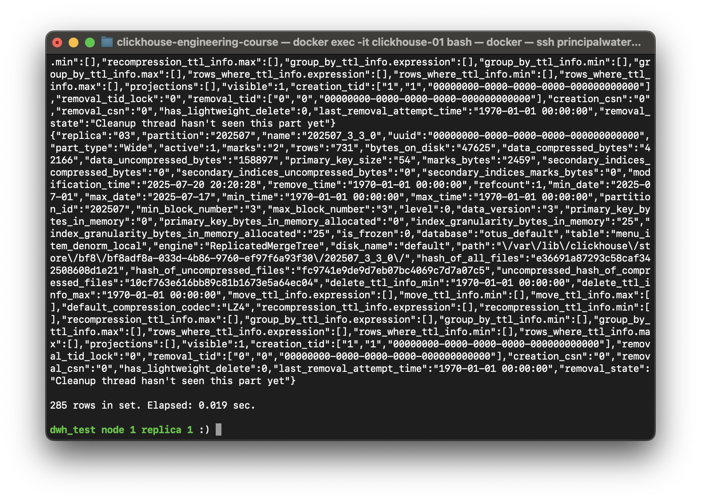
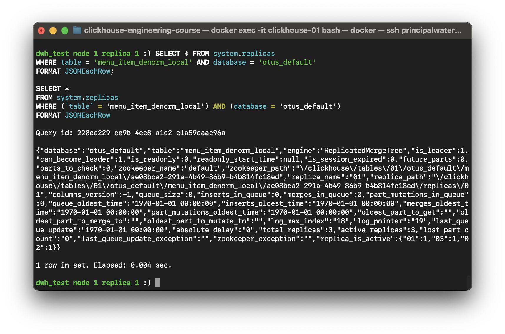

---

## Шаг 7. Управление жизненным циклом данных (TTL)
Добавим в таблицу политику TTL для автоматического удаления данных старше 7 дней, используя сгенерированную нами колонку `date`.

1.  **Устанавливаем TTL** на локальную таблицу:
    ```sql
    ALTER TABLE otus_default.menu_item_denorm_local ON CLUSTER dwh_test
    MODIFY TTL date + INTERVAL 7 DAY;
    ```
    > **Примечание:** TTL применяется только к `ReplicatedMergeTree` таблице. `Distributed` таблица не хранит данные и лишь проксирует запросы.

2.  **Проверяем результат** запросом `SHOW CREATE TABLE`:
    ```sql
    SHOW CREATE TABLE otus_default.menu_item_denorm_local;
    ```
*Результат выполнения `SHOW CREATE TABLE` с TTL:*

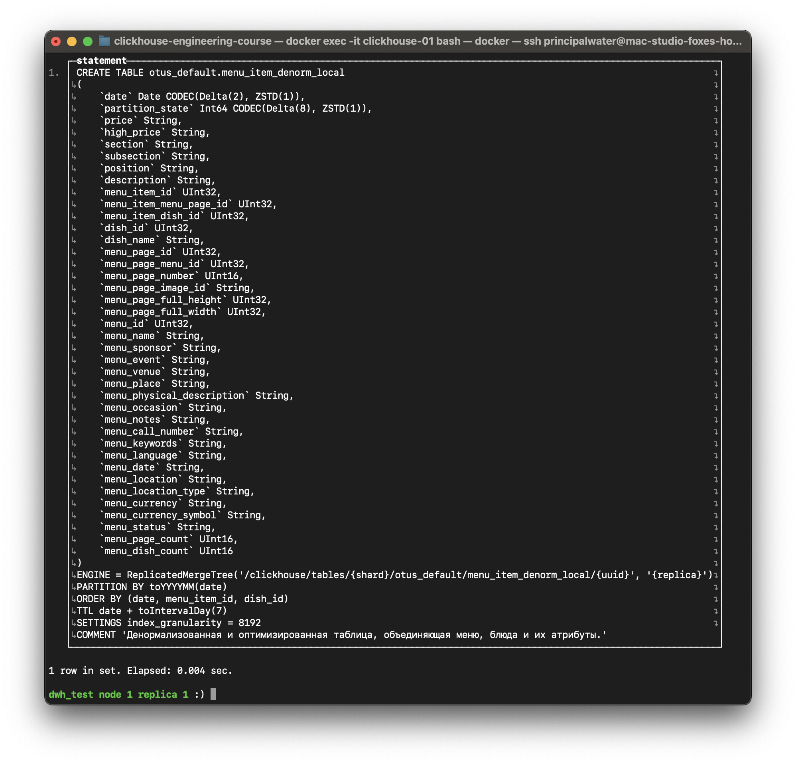

---

## Шаг 8. Проверка отказоустойчивости (стресс-тест)
Имитируем сбои, чтобы проверить, как кластер справляется с нагрузкой и обеспечивает высокую доступность.

### Кейс 1: Отказ одной реплики
Этот тест демонстрирует, что кластер продолжает обслуживать запросы на чтение и запись, если в одном из шардов выходит из строя одна из реплик.

1.  **Останавливаем одну из нод**, например, `clickhouse-04` (реплика 2 шарда 2):
    ```sh
    docker stop clickhouse-04
    ```

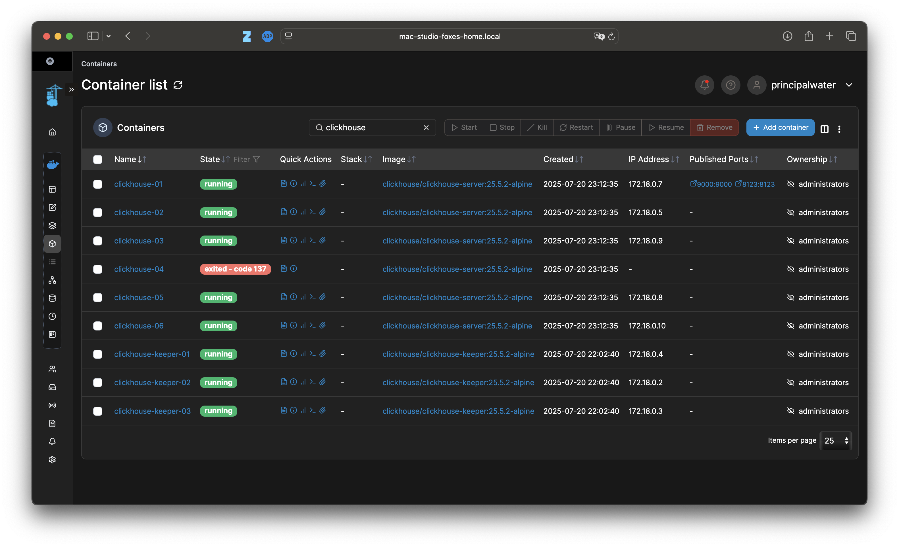

2.  **Проверяем чтение данных:**  
    Выполним запрос на подсчёт строк к `Distributed`-таблице. ClickHouse должен автоматически перенаправить запрос на живые реплики (`clickhouse-02` или `clickhouse-06`) того же шарда, и запрос выполнится успешно.
    ```sql
    SELECT count() FROM otus_default.menu_item_denorm;
    ```

    *Результат выполнения запроса на чтение при одной отключенной реплике:*
    
    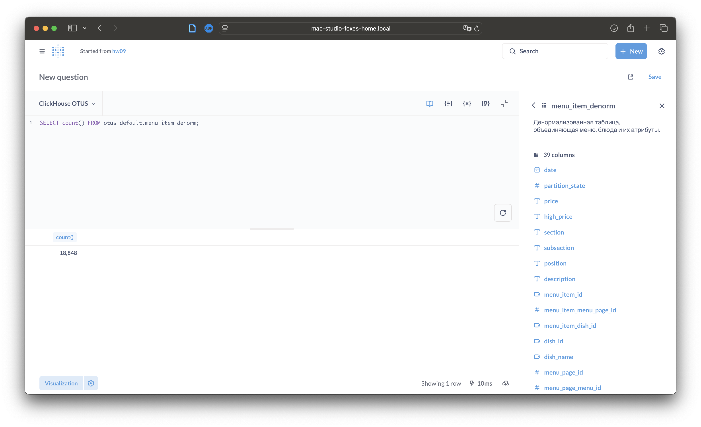

3.  **Проверяем запись данных:**  
    Выполним вставку данных. Движок `Distributed` сам определит, на какой шард отправить данные, а внутри шарда выберет живую реплику для записи. Эта запись попадёт в очередь репликации для `clickhouse-04`.
    ```sql
    INSERT INTO otus_default.menu_item_denorm (date, menu_item_id, dish_id) VALUES (today(), 9999999, 9999999);
    ```

    *Результат выполнения запроса на запись при одной отключенной реплике:*

    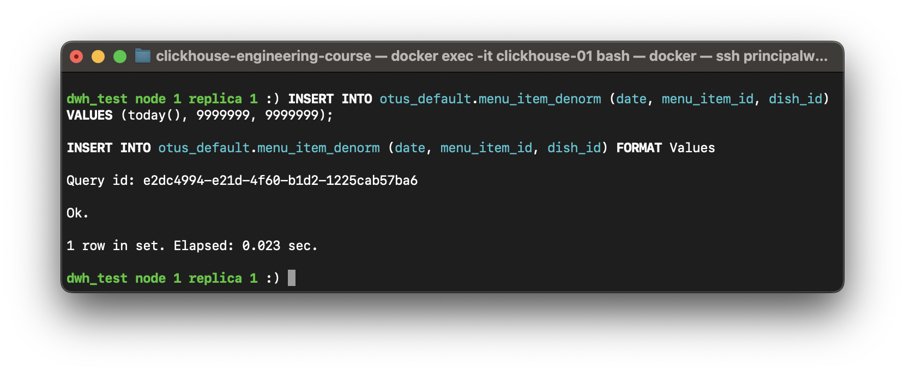

4.  **Анализируем состояние репликации:**  
    Поскольку `clusterAllReplicas` не работает при недоступности хотя бы одной ноды, а запрос к `system.replicas` на одном узле показывает информацию только о нём самом, мы не можем единым запросом увидеть статус "упавшей" реплики. Однако, мы можем убедиться, что **остальные реплики работают нормально**. Для этого можно подключиться к живой реплике из другого шарда, например `clickhouse-01`, и проверить её статус.
    ```sql
    -- Выполняем из clickhouse-client, подключенного к clickhouse-01
    SELECT
        replica_name,
        is_readonly,
        is_session_expired,
        replica_is_active
    FROM system.replicas
    WHERE table = 'menu_item_denorm_local' AND database = 'otus_default';
    ```
    Тот факт, что `SELECT` и `INSERT` (шаги 2 и 3) продолжают работать, а живые реплики показывают нормальный статус, доказывает отказоустойчивость кластера.

    *Скриншот с состоянием `system.replicas` на живой ноде `clickhouse-01`:*

    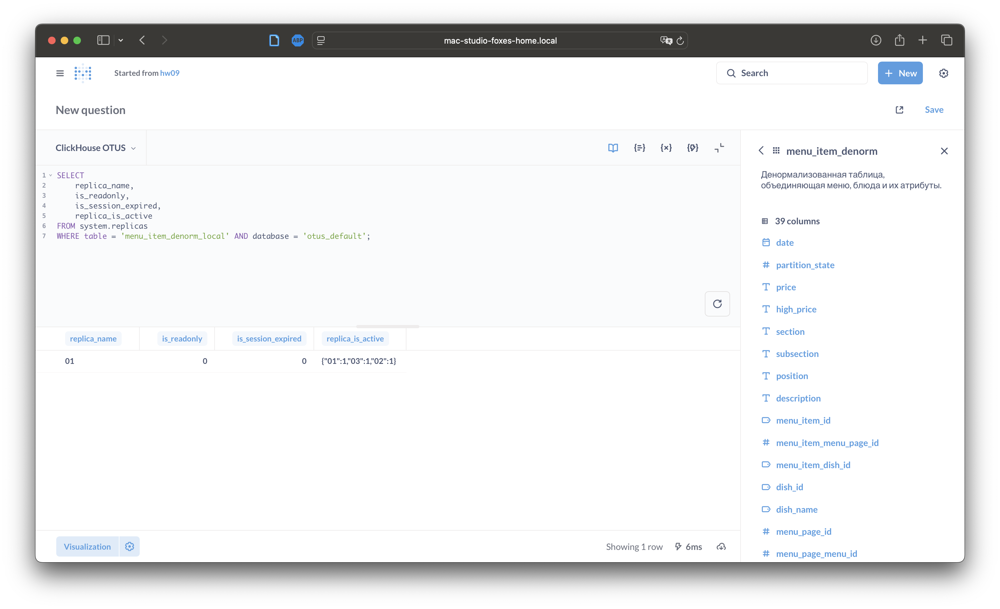

5.  **Восстанавливаем ноду:**
    ```sh
    docker start clickhouse-04
    ```
    После запуска нода автоматически подключится к Keeper, обнаружит, что отстала от других реплик, и начнёт скачивать у них недостающие куски данных.

6.  **Проверяем синхронизацию данных:**
    Теперь убедимся, что запись, сделанная в шаге 3, успешно реплицировалась на восстановленную ноду `clickhouse-04`. Для этого подключимся напрямую к ней и выполним запрос к **локальной** таблице.
    ```bash
    docker exec -i clickhouse-04 clickhouse-client \
      --user "${TF_VAR_super_user_name}" \
      --password "${TF_VAR_super_user_password}" \
      --query "SELECT * FROM otus_default.menu_item_denorm_local WHERE menu_item_id = 9999999"
    ```
    Запрос должен вернуть одну строку, подтверждая, что нода получила данные, вставленные во время её простоя.
    
    *Скриншот с результатом проверки синхронизации на `clickhouse-04`:*

    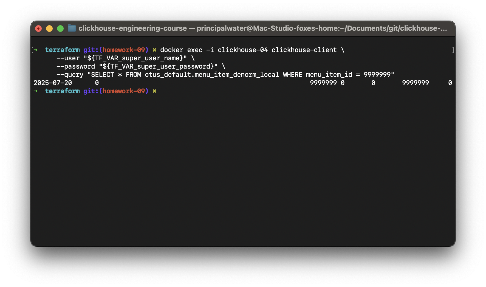

### Кейс 2: Отказ целого шарда и асинхронная вставка
Этот тест демонстрирует важное асинхронное поведение `Distributed` таблиц при сбое целого шарда.

1.  **Останавливаем все ноды одного шарда**, например, шарда 2 (`clickhouse-02`, `clickhouse-04`, `clickhouse-06`):
    ```sh
    docker stop clickhouse-02 clickhouse-04 clickhouse-06
    ```
    *Результат остановки контейнеров шарда 2:*

    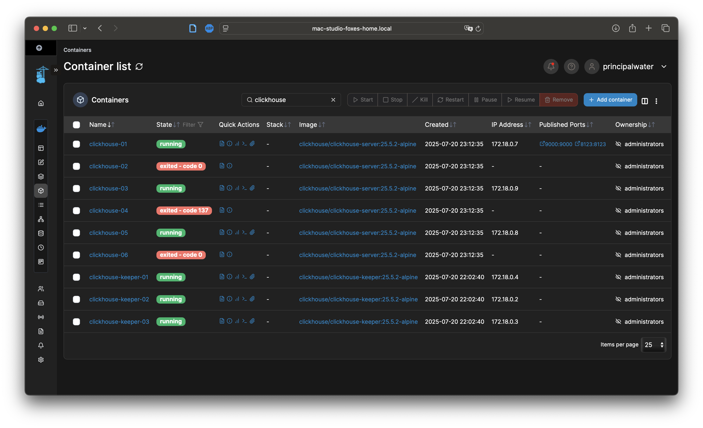

2.  **Проверяем чтение данных:**  
    Попытка выполнить любой `SELECT` запрос к `Distributed`-таблице, который требует обращения ко всем шардам, предсказуемо завершится ошибкой.
    ```sql
    SELECT count() FROM otus_default.menu_item_denorm;
    ```
    *Результат выполнения запроса на чтение при отключенном шарде:*

    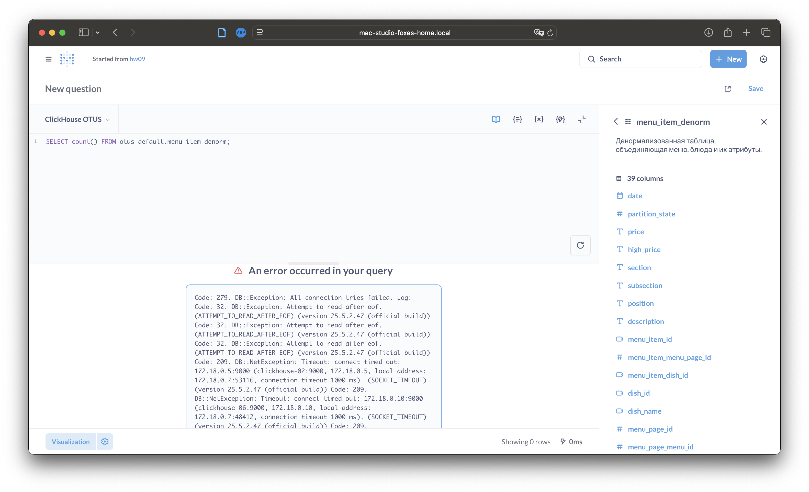

3.  **Проверяем асинхронную запись данных:**  
    Теперь выполним `INSERT`. Вопреки ожиданиям, этот запрос выполнится **успешно** и без ошибок. Это ключевая особенность асинхронной работы `Distributed` таблиц (настройка `insert_distributed_sync=0`). Узел `clickhouse-01`, принявший запрос, видит, что целевой шард недоступен, и временно сохраняет данные для него у себя локально. Он будет периодически пытаться отправить их, пока шард не поднимется.
    ```sql
    INSERT INTO otus_default.menu_item_denorm (date, menu_item_id, dish_id) VALUES (today(), 8888888, 8888888);
    ```

    *Результат выполнения успешного запроса на запись при отключенном шарде:*

    

    Важно! Если мы сразу после успешной вставки попробуем прочитать данные, запрос `SELECT` всё равно упадёт с ошибкой, так как шард по-прежнему недоступен для чтения, а данные для него ещё не доставлены.

4.  **Восстанавливаем шард:**
    ```sh
    docker start clickhouse-02 clickhouse-04 clickhouse-06
    ```

5.  **Проверяем доставку данных:**
    После восстановления шарда узел-координатор (`clickhouse-01`) должен обнаружить это и доставить "застрявшую" запись. Подождав некоторое время, проверим это для каждой поднятой ноды (заменяя N на номер ноды в формате 02 / 04 / 06):
    ```bash
    docker exec -i clickhouse-N clickhouse-client \
      --user "${TF_VAR_super_user_name}" \
      --password "${TF_VAR_super_user_password}" \
      --query "SELECT * FROM otus_default.menu_item_denorm_local WHERE menu_item_id = 8888888"
    ```

    *Результат выполнения запроса на чтение после восстановления шарда:*
    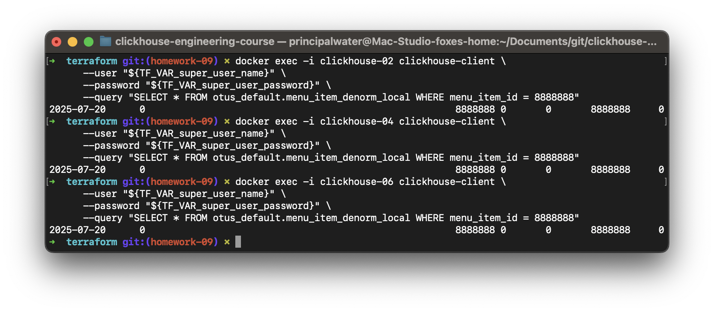

---

## Общие выводы по заданию
В ходе выполнения задания была создана отказоустойчивая реплицируемая таблица с автоматическим удалением устаревших данных по TTL. Использование макросов `{shard}` и `{replica}` и автоматизация через Terraform позволяют централизованно управлять кластером и легко его масштабировать. Репликация через `ReplicatedMergeTree` и ClickHouse Keeper гарантирует высокую доступность и согласованность данных, что было подтверждено в ходе стресс-теста.

---

## Список источников
- [Официальная документация ClickHouse: Репликация](https://clickhouse.com/docs/en/engines/table-engines/mergetree-family/replication/)
- [Официальная документация ClickHouse: TTL](https://clickhouse.com/docs/en/sql-reference/statements/create/table/#ttl)
- [Документация по мониторингу репликации](https://clickhouse.com/docs/en/operations/system-tables/replicas/)
- [ClickHouse Keeper — отказоустойчивый сервис хранения метаданных](https://clickhouse.com/docs/en/operations/server-configuration-keeper/)
- [Вставка данных с ON CLUSTER (ClickHouse docs)](https://clickhouse.com/docs/en/sql-reference/statements/insert-into#insert-into-on-cluster)
