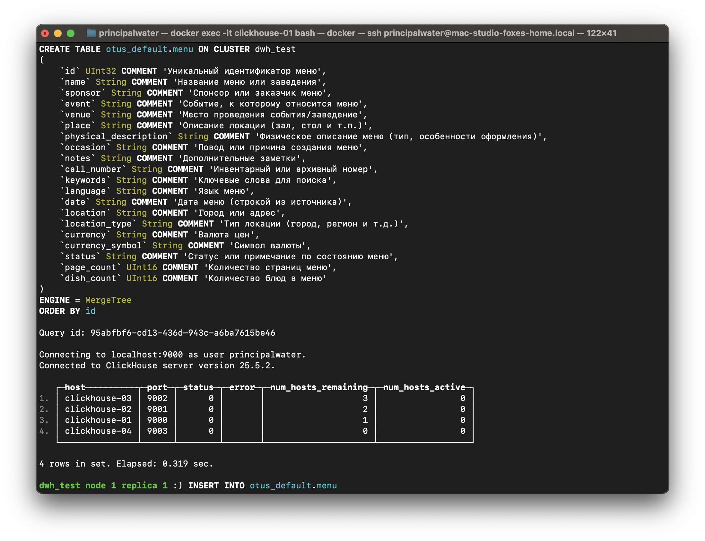
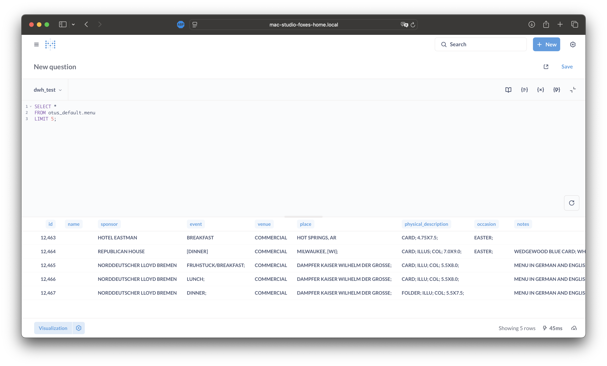
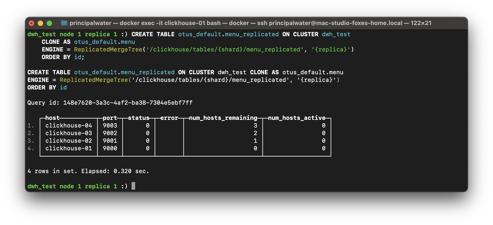
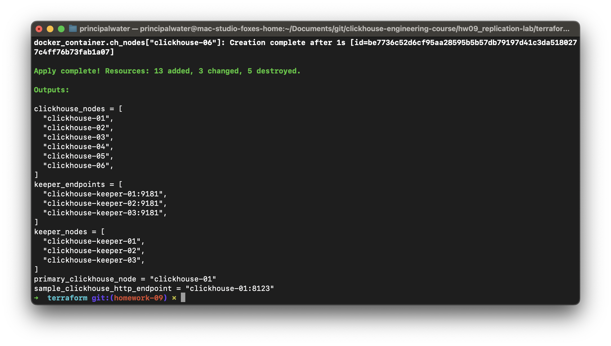
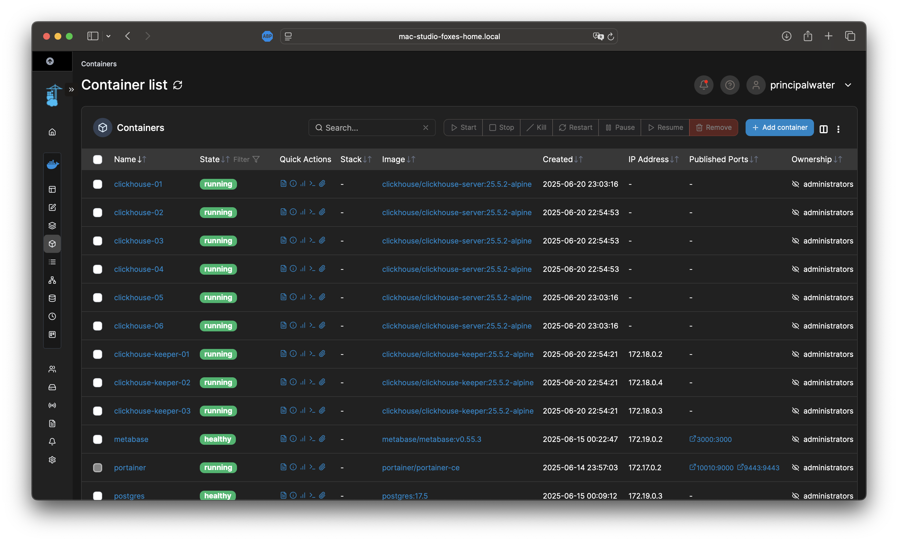

# Домашнее задание №9: Репликация и фоновые процессы в ClickHouse

---

## Оглавление

- [Описание задания и цели](#описание-задания-и-цели)  
- [Архитектура кластера и внесённые изменения](#архитектура-кластера-и-внесённые-изменения)  
- [Подготовка: создание базы данных и подготовка датасета](#подготовка-создание-базы-данных-и-подготовка-датасета)  
- [Шаг 1. Создание таблицы menu](#шаг-1-создание-таблицы-menu)  
- [Шаг 2. Импорт данных в таблицу menu](#шаг-2-импорт-данных-в-таблицу-menu)  
- [Шаг 3. Конвертация таблицы в реплицируемую и добавление реплик](#шаг-3-конвертация-таблицы-в-реплицируемую-и-добавление-реплик)  
- [Шаг 4. Кластерные запросы и проверка репликации](#шаг-4-кластерные-запросы-и-проверка-репликации)  
- [Шаг 5. Добавление колонки date и настройка TTL](#шаг-5-добавление-колонки-date-и-настройка-ttl)  
- [Проверка отказоустойчивости и анализ репликации](#проверка-отказоустойчивости-и-анализ-репликации)  
- [Общие выводы по заданию](#общие-выводы-по-заданию)  
- [Список источников](#список-источников)  

---

## Описание задания и цели

В данном домашнем задании изучается настройка репликации и фоновых процессов в ClickHouse на примере реального демонстрационного датасета. Репликация обеспечивает высокую доступность и отказоустойчивость данных, а TTL позволяет автоматически удалять устаревшие данные, что важно для масштабируемых аналитических систем с большими объёмами информации.

Цели задания:  
- Создать отказоустойчивую реплицируемую таблицу с использованием движка `ReplicatedMergeTree`.  
- Настроить кластер с несколькими шардами и репликами через инфраструктурный код (Terraform).  
- Импортировать и обработать реальные данные.  
- Настроить TTL для автоматического удаления старых данных.  
- Выполнить кластерные запросы для проверки состояния репликации и синхронизации.  

Компетенции, которые будут отработаны:  
- Работа с кластерами ClickHouse и движком `ReplicatedMergeTree`.  
- Управление инфраструктурой через Terraform.  
- Настройка и мониторинг репликации.  
- Использование TTL для управления жизненным циклом данных.  

---

## Архитектура кластера и внесённые изменения

Базовый кластер развёрнут и управляется через Terraform из каталога [`base-infra/`](../base-infra/).  
Вся инфраструктурная автоматизация — в каталоге [`base-infra/clickhouse`](../base-infra/clickhouse), где находится шаблон базовой конфигурации и volume для ClickHouse.  
Подробнее о структуре инфраструктуры см. в [base-infra/README.md](../base-infra/README.md).

**Схема кластера:**
- **2 шарда × 2 реплики** (4 ноды ClickHouse)  
- **3 Keeper-ноды** (для метаданных и координации репликации)
- Изолированная сетевая среда, централизованный volume

---

**Детализация создания новых нод и изменение схемы кластера через main.tf**

Для увеличения количества реплик и масштабирования кластера (например, с 2 до 3 реплик на каждый из 2 шардов, всего 6 ClickHouse-нод) в Terraform-конфиге была расширена секция `clickhouse_nodes`:

```hcl
# ClickHouse-ноды (ручная карта для схемы 2S_3R, с кастомными портами и шардами/репликами)
clickhouse_nodes = [
    { name = "clickhouse-01", shard = 1, replica = 1, host = "clickhouse-01", http_port = 8123, tcp_port = 9000 },
    { name = "clickhouse-02", shard = 2, replica = 1, host = "clickhouse-02", http_port = 8124, tcp_port = 9001 },
    { name = "clickhouse-03", shard = 1, replica = 2, host = "clickhouse-03", http_port = 8125, tcp_port = 9002 },
    { name = "clickhouse-04", shard = 2, replica = 2, host = "clickhouse-04", http_port = 8126, tcp_port = 9003 },
    # Новые реплики:
    { name = "clickhouse-05", shard = 1, replica = 3, host = "clickhouse-05", http_port = 8127, tcp_port = 9004 },
    { name = "clickhouse-06", shard = 2, replica = 3, host = "clickhouse-06", http_port = 8128, tcp_port = 9005 },
]
```
Задание массива нод позволяет декларативно и централизованно масштабировать кластер: добавление или удаление реплик/шардов осуществляется простым редактированием этого блока.

Кроме того, для автоматической генерации секции `<remote_servers>` в `config.xml.tpl` формируется структура:

```hcl
remote_servers = [
    {
      shard = 1
      replicas = [
        { host = "clickhouse-01", port = 9000 },
        { host = "clickhouse-03", port = 9002 },
        { host = "clickhouse-05", port = 9004 },
      ]
    },
    {
      shard = 2
      replicas = [
        { host = "clickhouse-02", port = 9001 },
        { host = "clickhouse-04", port = 9003 },
        { host = "clickhouse-06", port = 9005 },
      ]
    },
]
```
Эти изменения отражаются во всех автогенерируемых конфигах через Terraform-шаблоны, обеспечивая актуальность конфигурации кластера на каждом этапе.

**Пример полного блока из `main.tf`:**
```hcl
clickhouse_nodes = [
    { name = "clickhouse-01", shard = 1, replica = 1, host = "clickhouse-01", http_port = 8123, tcp_port = 9000 },
    ...
    { name = "clickhouse-06", shard = 2, replica = 3, host = "clickhouse-06", http_port = 8128, tcp_port = 9005 },
]
```

**Результат:**  
- Изменения применяются одной командой `terraform apply`.
- Новые ноды сразу получают валидный конфиг и автоматически интегрируются в кластер без ручных операций.

> Такой подход облегчает расширение и обслуживание инфраструктуры, позволяет быстро добавлять/удалять реплики и шарды без риска ошибиться в ручных настройках.  
> Подробнее см. комментарии к секциям `main.tf` в каталоге [`hw09_replication-lab/terraform/main.tf`](./terraform/main.tf).

---

**Важные моменты организации кластера:**
- Кластер поддерживает горизонтальное масштабирование (новые шарды и реплики добавляются через изменение массива в `main.tf`).
- Сетевые и volume-ресурсы централизованы для удобства сопровождения.
- Все изменения в конфигурации (шаблон `config.xml.tpl`) распространяются через Terraform на все ноды автоматически.

### Основные изменения и параметры в конфиге (`config.xml.tpl`)

В дополнение к базовой конфигурации были добавлены и оптимизированы параметры (см. `hw09_replication-lab/terraform/samples/config.xml.tpl`). Эти параметры выбраны на основании best-practice ClickHouse для масштабируемых кластеров с высокой нагрузкой и требованиями к отказоустойчивости:

- **Ограничения сетевого трафика для репликации:**
  - `<max_replicated_fetches_network_bandwidth_for_server>1073741824</max_replicated_fetches_network_bandwidth_for_server>`  
    Ограничивает *входящую* полосу пропускания для fetch-запросов репликации на уровне сервера (1 GB/s). Позволяет контролировать нагрузку на сеть при восстановлении или балансировке больших таблиц, особенно на стендах и в стресс-тестах.  
    [Документация: network bandwidth settings](https://clickhouse.com/docs/en/operations/server-configuration-parameters/settings/#max_replicated_fetches_network_bandwidth_for_server)
  - `<max_replicated_sends_network_bandwidth_for_server>536870912</max_replicated_sends_network_bandwidth_for_server>`  
    Ограничивает *исходящий* трафик для передачи данных репликации (512 MB/s). Важно для предотвращения перегрузки узлов и сбалансированной работы в кластере с несколькими репликами.  
    [Документация: network bandwidth settings](https://clickhouse.com/docs/en/operations/server-configuration-parameters/settings/#max_replicated_sends_network_bandwidth_for_server)

- **Параметры MergeTree для больших объёмов:**
  - `<parts_to_throw_insert>300</parts_to_throw_insert>`  
    Жёсткий лимит на количество активных частей в таблице — предотвращает деградацию при массовых вставках и партиционировании. При превышении лимита новые вставки будут выброшены с ошибкой, что позволяет выявить проблемы с потоком данных на ранних этапах.  
    [Документация: Resolving "Too Many Parts" Error in ClickHouse](https://clickhouse.com/docs/ru/knowledgebase/exception-too-many-parts)
  - `<write_ahead_log_max_bytes>1073741824</write_ahead_log_max_bytes>`  
    Максимальный размер журнала WAL (Write Ahead Log) — критично для стабильности на больших потоках вставок и восстановления после сбоев.
  - `<enable_mixed_granularity_parts>1</enable_mixed_granularity_parts>`  
    Включает поддержку смешанной детализации гранул — рекомендуется для современных версий ClickHouse, ускоряет чтение, оптимизирует хранение.
  - `<replication_alter_partitions_sync>2</replication_alter_partitions_sync>`  
    Обеспечивает синхронное выполнение операций ALTER на всех репликах, гарантируя согласованность состояния и предотвращая рассогласование метаданных при schema changes (особенно важно на мульти-шардовых кластерах).
  - `<replicated_can_become_leader>${node.replica == 1 ? 1 : 0}</replicated_can_become_leader>`  
    Только первая реплика в каждом шарде может стать лидером — оптимизация для стабильности, предотвращает коллизии в распределении лидерства (и экономит ресурсы при failover).

---

После удаления невалидного параметра и корректной настройки лидера репликации контейнеры ClickHouse успешно стартуют, и кластер работает штатно.

- **Секция `<compression>`**  
  - Использование ZSTD для больших партиций (>1 GB), LZ4 — для всех остальных. Такой паттерн — стандарт для balanc'а скорости и компрессии (см. [документацию ClickHouse по сжатию](https://clickhouse.com/docs/en/operations/server-configuration-compression/)).

- **Query Log**  
  - Логирование в таблицу system.query_log, с flush-интервалом 7.5 сек — удобно для аналитики и отладки.

- **Настройки пользователей, DDL и макросы**  
  - Макросы shard/replica автоматизированы, используются в пути к таблицам и при создании реплицируемых таблиц.

> Все параметры подбирались с учётом тестирования, опыта эксплуатации продакшн-кластеров и рекомендаций из [официальной документации ClickHouse](https://clickhouse.com/docs/en/), а также комьюнити (Habr, конференции ClickHouse).

---

## Подготовка: создание базы данных и подготовка датасета

### Предварительная подготовка: развёртывание и корректная инициализация пайплайна

Если ранее инфраструктура была развернута через [`base-infra/clickhouse`](../base-infra/clickhouse), перед запуском пайплайна из hw09_replication-lab/terraform необходимо:

1. Перейти в директорию base-infra/clickhouse:
   ```sh
   # учитывая, что пользователь уже находится в каталоге hw09_replication-lab
   cd ../base-infra/clickhouse
   terraform destroy -auto-approve
   ```
   > **Примечание:** При этом директории и данные ClickHouse не удаляются, а удаляется только инфраструктура Docker (контейнеры, сеть и пр.).

2. Затем перейти в директорию с финальным пайплайном:
   ```sh
   cd ../../hw09_replication-lab/terraform
   terraform apply -auto-approve
   ```
   > Все последующие apply/расширения кластера необходимо делать уже только из hw09_replication-lab/terraform — это обеспечит корректную работу пайплайна и возможность добавления реплик без конфликтов.

В противном случае возможны конфликты с сетью и именами контейнеров, либо некорректное состояние кластера.

### Создание базы данных otus_default на кластере dwh_test

Для всех таблиц используется база данных `otus_default`. Она создаётся на всех нодах кластера с помощью следующей команды, выполненной из `clickhouse-client` на узле `clickhouse-01`:

```sql
CREATE DATABASE IF NOT EXISTS otus_default ON CLUSTER dwh_test;
```

---

### Подготовка демонстрационного датасета

В качестве демонстрационного датасета используется открытый набор данных [NYPL "What's on the menu?"](https://clickhouse.com/docs/en/getting-started/example-datasets/menus) — исторические меню Нью-Йоркской публичной библиотеки. Датасет содержит около 1.3 млн строк с 20 атрибутами в формате CSV.

Для автоматизации загрузки подготовлен скрипт:

```bash
./scripts/import_menu_dataset.sh
```

Скрипт выполняет:  
- Скачивание и распаковку архива в каталог `data/menusdata_nypl/`.  
- Копирование файла `Menu.csv` в директорию внутри контейнера ClickHouse `/var/lib/clickhouse/user_files/menusdata_nypl_dataset/`.  
- Установку необходимых прав доступа на файл.  

> Важно: для загрузки через SQL-команду `INSERT ... INFILE` файл должен находиться в каталоге `/var/lib/clickhouse/user_files/`. Подробнее: [документация ClickHouse](https://clickhouse.com/docs/ru/operations/settings/settings#user_files_path)

---

## Шаг 1. Создание таблицы menu

Таблица создаётся в базе `otus_default` на кластере `dwh_test`. Запрос выполняется из `clickhouse-client` на `clickhouse-01`:

```sql
CREATE TABLE IF NOT EXISTS otus_default.menu ON CLUSTER dwh_test
(
    id                   UInt32  COMMENT 'Уникальный идентификатор меню',
    name                 String  COMMENT 'Название меню или заведения',
    sponsor              String  COMMENT 'Спонсор или заказчик меню',
    event                String  COMMENT 'Событие, к которому относится меню',
    venue                String  COMMENT 'Место проведения события/заведение',
    place                String  COMMENT 'Описание локации (зал, стол и т.п.)',
    physical_description String  COMMENT 'Физическое описание меню (тип, особенности оформления)',
    occasion             String  COMMENT 'Повод или причина создания меню',
    notes                String  COMMENT 'Дополнительные заметки',
    call_number          String  COMMENT 'Инвентарный или архивный номер',
    keywords             String  COMMENT 'Ключевые слова для поиска',
    language             String  COMMENT 'Язык меню',
    date                 String  COMMENT 'Дата меню (строкой из источника)',
    location             String  COMMENT 'Город или адрес',
    location_type        String  COMMENT 'Тип локации (город, регион и т.д.)',
    currency             String  COMMENT 'Валюта цен',
    currency_symbol      String  COMMENT 'Символ валюты',
    status               String  COMMENT 'Статус или примечание по состоянию меню',
    page_count           UInt16  COMMENT 'Количество страниц меню',
    dish_count           UInt16  COMMENT 'Количество блюд в меню'
)
ENGINE = MergeTree
ORDER BY id;
```

> **Примечание:** каждый столбец снабжён описанием через `COMMENT`, что облегчает понимание структуры таблицы - например, такие описания автоматически пробрасываются в описания в Metabase.



---

## Шаг 2. Импорт данных в таблицу menu

> ⚠️ **Важно:** В новых версиях ClickHouse параметры формата CSV (`format_csv_*`) применяются только на уровне клиента или конфигурационного файла, а не через `SET` или `SETTINGS` в SQL-запросах. Поэтому загрузка больших локальных файлов CSV с настройками формата производится только через `clickhouse-client` (CLI).

Для загрузки данных используйте следующую команду в `clickhouse-client` на `clickhouse-01`:

```bash
clickhouse-client --user <user> --password <password> --format_csv_allow_single_quotes 0 --input_format_null_as_default 0 --query "INSERT INTO otus_default.menu FORMAT CSVWithNames" < /var/lib/clickhouse/user_files/menusdata_nypl_dataset/Menu.csv
```

Параметры формата CSV (`--format_csv_allow_single_quotes`, `--input_format_null_as_default` и др.) должны передаваться только через опции CLI или через конфиг клиента.  
Использование SQL-вариантов с `FROM INFILE` и `SETTINGS` для этих параметров **невозможно** — такие параметры игнорируются или приводят к ошибкам, см. [официальную документацию](https://clickhouse.com/docs/integrations/data-ingestion/insert-local-files).

**Документация:**
- [Загрузка локальных файлов через clickhouse-client](https://clickhouse.com/docs/integrations/data-ingestion/insert-local-files)
- [Параметры формата CSV/TSV](https://clickhouse.com/docs/integrations/data-formats/csv-tsv)

**Результат:** таблица `menu` наполнена историческими данными NYPL.



---

## Шаг 3. Конвертация таблицы в реплицируемую и добавление реплик

Для конвертации обычной таблицы в реплицируемую без простоя и с сохранением всех партиций используем оптимальный подход с новым синтаксисом ClickHouse (v24.4+):

```sql
CREATE TABLE otus_default.menu_replicated ON CLUSTER dwh_test
    CLONE AS otus_default.menu
    ENGINE = ReplicatedMergeTree('/clickhouse/tables/{shard}/menu_replicated', '{replica}')
    ORDER BY id;
```

**Результат:** таблица `menu_replicated` создана и наполнена историческими данными NYPL из таблицы `menu`.



> **Примечание:**  
> Данная команда объединяет два действия в один DDL-запрос:
> - создание таблицы с той же структурой, что и у исходной (AS ...)
> - автоматическое клонирование всех партиций из оригинала (ATTACH PARTITION ALL FROM ...)
>
> Это эквивалентно выполнению двух отдельных запросов:
> ```
> CREATE TABLE ... AS ... ENGINE=...;
> ALTER TABLE ... ATTACH PARTITION ALL FROM ...;
> ```
> Используем CLONE, потому что нам важно максимально быстро и надёжно перенести *все* партиции и структуру, без ручного перебора partition_id — это production best practice для миграции таблиц в больших кластерах. Подробнее: [ClickHouse docs: CREATE TABLE ... CLONE](https://clickhouse.com/docs/en/sql-reference/statements/create/table#with-a-schema-and-data-cloned-from-another-table).

Варианты обмена или переименования таблиц (если имя должно остаться прежним) остаются такими же:

- Если требуется оставить старое имя:
  ```sql
  EXCHANGE TABLES otus_default.menu_replicated AND otus_default.menu;
  DROP TABLE otus_default.menu_replicated;
  ```
  или
  ```sql
  DROP TABLE otus_default.menu;
  RENAME TABLE otus_default.menu_replicated TO otus_default.menu;
  ```
- Если новое имя подходит — просто используем новую таблицу и удаляем старую:
  ```sql
  DROP TABLE otus_default.menu;
  ```

---

### Замечание: миграция данных через CLONE AS ... ON CLUSTER — подводные камни

Хотя команда
```sql
CREATE TABLE ... CLONE AS ... ON CLUSTER ...
```
согласно [официальной документации ClickHouse](https://clickhouse.com/docs/en/sql-reference/statements/create/table#with-a-schema-and-data-cloned-from-another-table)
должна быть эквивалентна последовательному выполнению
```sql
CREATE TABLE ... AS ... ENGINE=...;
ALTER TABLE ... ATTACH PARTITION ALL FROM ...;
```
на практике перенос данных в ReplicatedMergeTree не всегда гарантируется, если исходная таблица на MergeTree была заполнена **отдельно на каждой ноде** (например, скриптом или ручным импортом не через ON CLUSTER).

**Частые проблемы:**
* Данные могут не появиться в новой таблице вовсе (особенно если исходные партиции были только на одной ноде).
* Репликация между новыми репликами ReplicatedMergeTree может не инициироваться автоматически — физические партиции не подключаются на всех нодах, и синхронизация не стартует.

**Надёжный способ миграции:**  
Рекомендуется ЯВНО выполнить команду ATTACH PARTITION ALL FROM ... ON CLUSTER после создания таблицы ReplicatedMergeTree.  
Пример:
```sql
ALTER TABLE otus_default.menu_replicated ON CLUSTER dwh_test ATTACH PARTITION ALL FROM otus_default.menu;
```
Это гарантирует физическое подключение всех партиций на всех нодах кластера и корректный запуск механизма репликации между репликами.

Такой подход позволяет:
- Контролировать процесс миграции — видно, если на какой-то ноде возникла ошибка или отсутствуют данные;
- Добиться совместимости с разными версиями ClickHouse и разными сценариями наполнения исходной таблицы;
- Быстро выявить и устранить рассинхронизацию или отсутствие партиций на отдельных репликах.

**Best practice:**  
При миграции реальных данных с MergeTree → ReplicatedMergeTree на кластере всегда используйте отдельную команду:
```sql
ALTER TABLE ... ON CLUSTER ... ATTACH PARTITION ALL FROM ...;
```
Это обеспечивает надёжную передачу всех данных и корректную работу ReplicatedMergeTree вне зависимости от истории наполнения исходной таблицы.

---

### Добавление реплик через Terraform

#### Важные переменные окружения

Перед запуском Terraform-пайплайна необходимо задать переменные для учётных данных ClickHouse:

```sh
export TF_VAR_super_user_name="<SUPERUSER_LOGIN>"
export TF_VAR_super_user_password="<SUPERUSER_PASSWORD>"
# Для BI-пользователя:
export TF_VAR_bi_user_password="<BI_USER_PASSWORD>"
# (TF_VAR_bi_user_name — опционально, по умолчанию 'bi_user')
```

> ⚠️ Без этих переменных развертывание не будет выполнено корректно.

После завершения работы обязательно очистите чувствительные переменные:

```sh
unset TF_VAR_super_user_password TF_VAR_bi_user_password
```

Для добавления реплик необходимо:  
1. Расширить массив `clickhouse_nodes` в `main.tf`, добавив ноды с параметрами `shard` и `replica`.  
2. Применить изменения:

```bash
terraform apply -auto-approve
```

После применения на всех нодах автоматически создадутся таблицы с правильными макросами.




---

## Шаг 4. Кластерные запросы и проверка репликации

Для проверки распределения частей таблицы и состояния реплик используется Metabase, подключённый к кластеру `dwh_test`. Это позволяет выполнять запросы к распределённому кластеру и видеть актуальное состояние на всех нодах.

---

### Проверка частей таблицы на всех репликах

Запрос в Metabase:

```sql
SELECT getMacro('replica') AS replica, *
FROM remote('clickhouse-{01|02|03|04|05|06}', system.parts)
WHERE table = 'menu_replicated' AND database = 'otus_default'
FORMAT JSONEachRow;
```

---

### Проверка статуса реплик

Запрос в Metabase:

```sql
SELECT *
FROM system.replicas
WHERE table = 'menu_replicated' AND database = 'otus_default'
FORMAT JSONEachRow;
```


---

## Шаг 5. Добавление колонки date и настройка TTL

Для управления временем жизни данных создаём новую таблицу с колонкой `date` типа `Date` и настройкой TTL. Запрос выполняется из `clickhouse-client` на `clickhouse-01`:

```sql
CREATE TABLE otus_default.menu_replicated_ttl ON CLUSTER dwh_test
(
    id UInt32,
    name String,
    sponsor String,
    event String,
    venue String,
    place String,
    physical_description String,
    occasion String,
    notes String,
    call_number String,
    keywords String,
    language String,
    date Date,
    location String,
    location_type String,
    currency String,
    currency_symbol String,
    status String,
    page_count UInt16,
    dish_count UInt16
)
ENGINE = ReplicatedMergeTree('/clickhouse/tables/{shard}/menu_replicated_ttl', '{replica}')
ORDER BY id
TTL date + INTERVAL 7 DAY;
```

Миграция данных с преобразованием строки в дату:

```sql
INSERT INTO otus_default.menu_replicated_ttl ON CLUSTER dwh_test
SELECT
    id,
    name,
    sponsor,
    event,
    venue,
    place,
    physical_description,
    occasion,
    notes,
    call_number,
    keywords,
    language,
    parseDateTimeBestEffortOrNull(date) AS date,
    location,
    location_type,
    currency,
    currency_symbol,
    status,
    page_count,
    dish_count
FROM otus_default.menu_replicated;
```

---

### Проверка структуры таблицы с TTL

Выполнено из Metabase для просмотра результата на всех нодах:

```sql
SHOW CREATE TABLE otus_default.menu_replicated_ttl ON CLUSTER dwh_test;
```


---

## Проверка отказоустойчивости и анализ репликации

Для проверки отказоустойчивости последовательно отключаются ноды кластера. Состояние реплик отслеживается запросом, выполненным из Metabase:

```sql
SELECT *
FROM system.replicas
WHERE table = 'menu_replicated' AND database = 'otus_default'
ON CLUSTER dwh_test;
```

---

### Анализ наблюдений

- При отключении отдельных реплик остальные продолжают обслуживать запросы, обеспечивая доступность данных.  
- Для каждого шарда существует лидер, который координирует операции записи. При отказе лидера происходит автоматический выбор нового лидера.  
- Статус реплик отображает их состояние, включая задержки и возможные ошибки.  

---

## Общие выводы по заданию

В ходе выполнения задания была создана отказоустойчивая реплицируемая таблица с автоматическим удалением устаревших данных по TTL. Использование макросов `{shard}` и `{replica}` в настройках таблиц и конфигурации позволяет централизованно управлять кластером. Масштабирование и добавление реплик осуществляется декларативно через Terraform, что упрощает сопровождение и развитие инфраструктуры.

Настройка TTL обеспечивает автоматическую очистку данных без ручного вмешательства, что важно для аналитических систем с большими объёмами данных и требованиями к актуальности. Репликация через `ReplicatedMergeTree` и ClickHouse Keeper гарантирует высокую доступность и согласованность данных даже при отказах отдельных нод.

Дальнейшие шаги могут включать улучшение мониторинга, настройку алертов и автоматизацию процессов восстановления.

---

## Список источников

- [Официальная документация ClickHouse: Репликация](https://clickhouse.com/docs/en/engines/table-engines/mergetree-family/replication/)  
- [Официальная документация ClickHouse: TTL](https://clickhouse.com/docs/en/sql-reference/statements/create/table/#ttl)  
- [Документация по мониторингу репликации](https://clickhouse.com/docs/en/operations/system-tables/replicas/)  
- [ClickHouse Keeper — отказоустойчивый сервис хранения метаданных](https://clickhouse.com/docs/en/operations/server-configuration-keeper/)  
- [Вставка данных с ON CLUSTER (ClickHouse docs)](https://clickhouse.com/docs/en/sql-reference/statements/insert-into#insert-into-on-cluster)