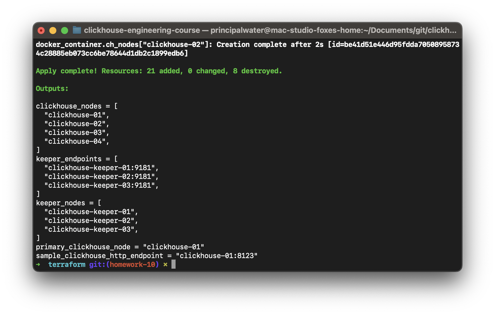
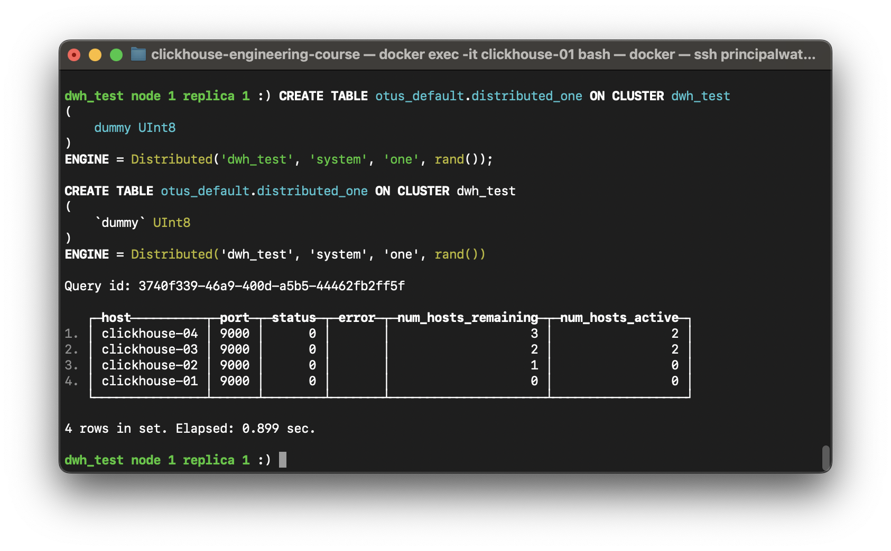
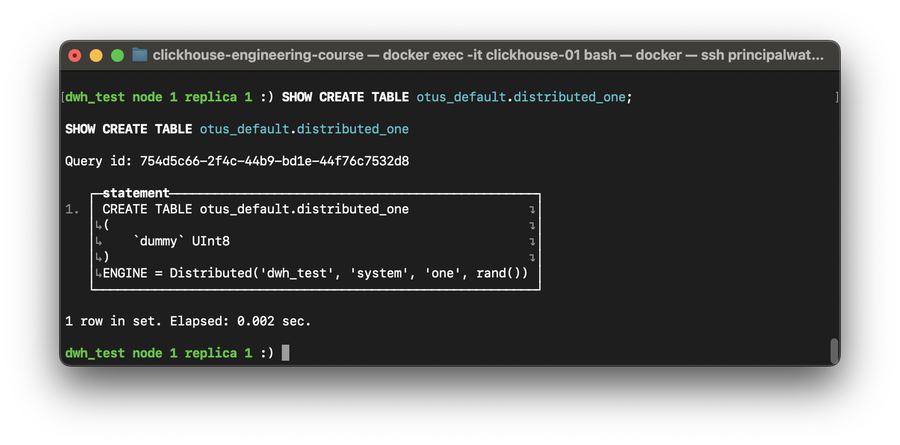
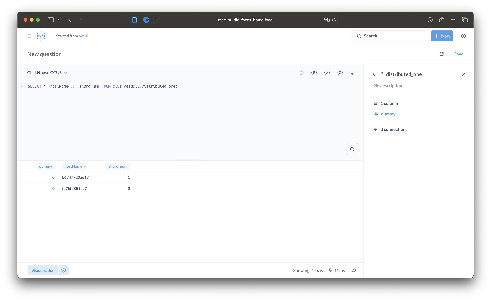
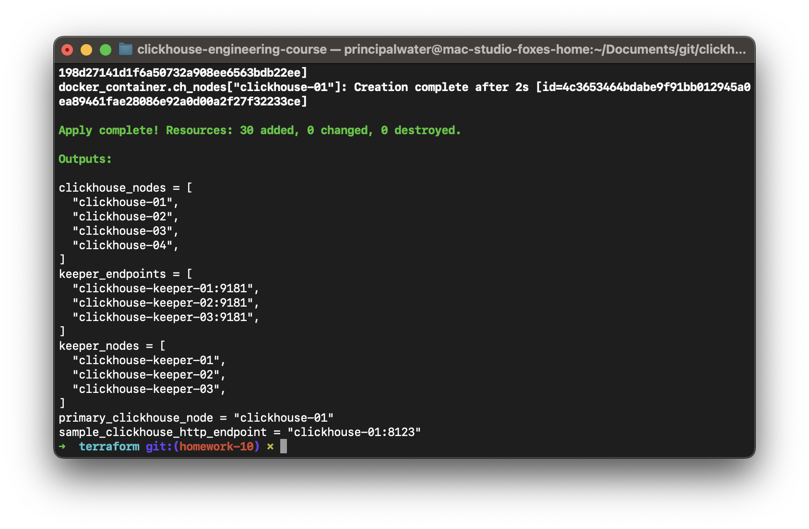
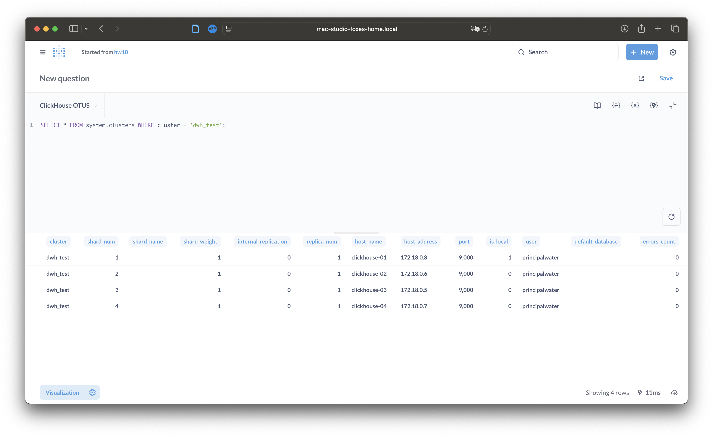
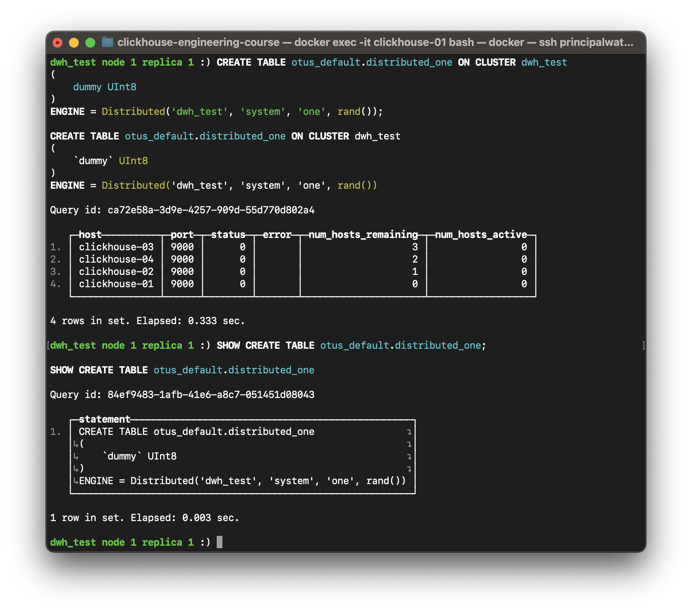
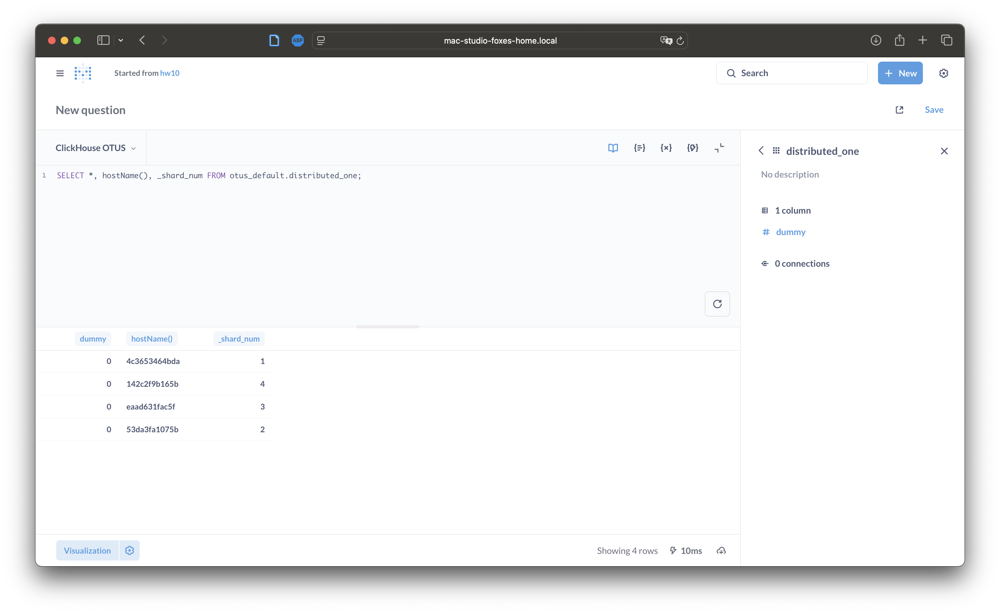
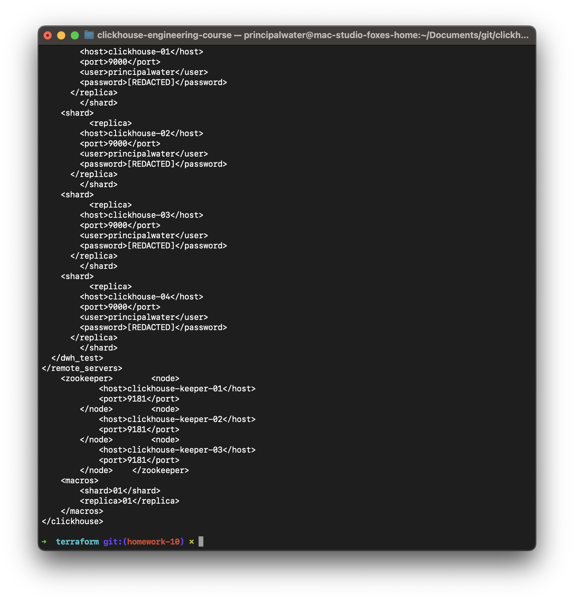

# Домашнее задание №10: Шардирование и распределенные запросы

---

## Оглавление
- [Описание задания и цели](#описание-задания-и-цели)
- [Архитектура и описание топологий](#архитектура-и-описание-топологий)
- [Часть 1. Работа с топологией "2 шарда × 2 реплики"](#часть-1-работа-с-топологией-2-шарда--2-реплики)
  - [Шаг 1.1. Развертывание кластера](#шаг-11-развертывание-кластера)
  - [Шаг 1.2. Создание Distributed-таблицы](#шаг-12-создание-distributed-таблицы)
  - [Шаг 1.3. Проверка конфигурации и запросов](#шаг-13-проверка-конфигурации-и-запросов)
  - [Шаг 1.4. Очистка перед сменой топологии](#шаг-14-очистка-перед-сменой-топологии)
- [Часть 2. Переключение на топологию "4 шарда × 1 реплика"](#часть-2-переключение-на-топологию-4-шарда--1-реплика)
  - [Шаг 2.1. Уничтожение текущей инфраструктуры](#шаг-21-уничтожение-текущей-инфраструктуры)
  - [Шаг 2.2. Развертывание кластера с новой топологией](#шаг-22-развертывание-кластера-с-новой-топологией)
  - [Шаг 2.3. Создание и проверка Distributed-таблицы](#шаг-23-создание-и-проверка-distributed-таблицы)
- [Часть 3. Предоставление конфигурации кластера (xml-секция)](#часть-3-предоставление-конфигурации-кластера-xml-секция)
- [Общие выводы по заданию](#общие-выводы-по-заданию)
- [Список источников](#список-источников)

---

## Описание задания и цели

В данном домашнем задании мы углубимся в концепцию шардирования в ClickHouse. Шардирование — это ключевой механизм горизонтального масштабирования, позволяющий распределять данные и нагрузку по нескольким серверам (шардам), что значительно повышает производительность и емкость хранения.

**Цели задания:**
-   Создать кластер ClickHouse с несколькими нодами.
-   Настроить и описать в конфигурации несколько топологий шардирования.
-   Научиться гибко переключаться между топологиями с помощью Terraform.
-   Создать `Distributed` таблицу для выполнения распределенных запросов.
-   Проверить корректность распределения данных и запросов по шардам.

**Компетенции, которые будут отработаны:**
-   Понимание принципов шардирования и репликации.
-   Управление конфигурацией кластера ClickHouse через `remote_servers`.
-   Использование `Distributed` таблиц для выполнения запросов к шардированному кластеру.
-   Гибкое управление инфраструктурой с помощью Terraform.

---

## Архитектура и описание топологий
Инфраструктура управляется через Terraform и позволяет гибко переключаться между двумя конфигурациями:
1.  **Топология `2s_2r` (2 шарда × 2 реплики):**
    -   **Шард 1:** `clickhouse-01`, `clickhouse-03`
    -   **Шард 2:** `clickhouse-02`, `clickhouse-04`
    -   **Фактор репликации:** 2. **Количество шардов:** 2.
    -   Обеспечивает высокую доступность.
2.  **Топология `4s_1r` (4 шарда × 1 реплика):**
    -   **Шард 1:** `clickhouse-01`
    -   **Шард 2:** `clickhouse-02`
    -   **Шард 3:** `clickhouse-03`
    -   **Шард 4:** `clickhouse-04`
    -   **Фактор репликации:** 1. **Количество шардов:** 4.
    -   Обеспечивает максимальный параллелизм запросов.

### Динамическое управление топологией
Ключевым изменением в этом задании является возможность управлять топологией кластера без изменения кода `config.xml.tpl`. Это достигается с помощью переменной `cluster_topology` в файле `variables.tf`. Terraform автоматически генерирует секцию `<remote_servers>` в `config.xml` для всех нод на основе выбранной топологии, что позволяет гибко тестировать различные конфигурации шардирования.

---

## Часть 1. Работа с топологией "2 шарда × 2 реплики"

### Шаг 1.1. Развертывание кластера
Развернем кластер с топологией по умолчанию (`2s_2r`).

1.  Перейдите в каталог `terraform`:
    ```sh
    cd hw10_sharding-distributed-queries/terraform
    ```
2.  Инициализируйте и примените конфигурацию:
    ```sh
    terraform init
    terraform apply -auto-approve
    ```
> ⚠️ Перед запуском задайте переменные окружения `TF_VAR_super_user_name` и `TF_VAR_super_user_password` для аутентификации.

*Результат развертывания кластера:*



### Шаг 1.2. Создание Distributed-таблицы
`Distributed` таблица — это "виртуальная" таблица, которая не хранит данные, а служит прокси для запросов к локальным таблицам на шардах. Мы создадим одну `Distributed` таблицу, которая будет работать с активной топологией кластера (`dwh_test`). В качестве локальной таблицы мы будем использовать `system.one`, которая существует на каждой ноде и содержит одну строку.

1.  **Создайте базу данных `otus_default` на кластере**:
    Выполните этот запрос из `clickhouse-client` на любой ноде (например, `clickhouse-01`):
    ```sql
    CREATE DATABASE IF NOT EXISTS otus_default ON CLUSTER dwh_test;
    ```
2.  **Создайте `Distributed` таблицу**:
    Эта таблица будет ссылаться на кластер `dwh_test`, конфигурация которого определяется переменной `cluster_topology` в Terraform.
    ```sql
    CREATE TABLE otus_default.distributed_one ON CLUSTER dwh_test
    (
        dummy UInt8
    )
    ENGINE = Distributed('dwh_test', 'system', 'one', rand());
    ```
> **💡 Примечание по ключу шардирования `rand()`**:
> Мы используем `rand()` в качестве ключа шардирования для `INSERT` запросов. Это означает, что вставки будут распределяться по шардам случайным образом. Для `SELECT` запросов ключ шардирования не используется. В реальных задачах для `INSERT` обычно выбирают ключ, связанный с данными (например, `user_id` или `event_date`), чтобы обеспечить логическую группировку данных на шардах.

*Результат выполнения DDL-запросов:*



### Шаг 1.3. Проверка конфигурации и запросов
Выполним два набора проверочных запросов, как того требуют критерии задания.

1.  **Проверка конфигурации кластера (`system.clusters` и `SHOW CREATE TABLE`):**
    ```sql
    SELECT * FROM system.clusters WHERE cluster = 'dwh_test';
    SHOW CREATE TABLE otus_default.distributed_one;
    ```
*Результат `system.clusters` и `SHOW CREATE TABLE` для топологии `2s_2r`:*




> **💡 Вывод:** Запрос к `system.clusters` подтверждает, что кластер `dwh_test` состоит из двух шардов, в каждом из которых по две реплики. Это в точности соответствует нашей топологии `2s_2r`.

2.  **Проверка распределения запроса `SELECT`:**
    ```sql
    SELECT *, hostName(), _shard_num FROM otus_default.distributed_one;
    ```
    Ожидается 2 строки, по одной от каждого шарда.

*Результат `SELECT` для топологии `2s_2r`:*



> **💡 Вывод:** Запрос к `Distributed`-таблице вернул две строки. ClickHouse по умолчанию отправляет `SELECT` запрос на одну *случайную* работоспособную реплику каждого шарда. Так как у нас два шарда, мы получили результат от двух разных нод, что подтверждает корректную работу распределенных запросов.

### Шаг 1.4. Очистка перед сменой топологии
Поскольку мы используем постоянные `volumes` для данных (`base-infra`), перед уничтожением кластера рекомендуется удалить созданную `Distributed`-таблицу. Это позволит избежать конфликтов и ошибок при следующем развертывании кластера с другой топологией.
```sql
DROP TABLE IF EXISTS otus_default.distributed_one ON CLUSTER dwh_test;
```

---

## Часть 2. Переключение на топологию "4 шарда × 1 реплика"

### Шаг 2.1. Развертывание кластера с новой топологией
Чтобы применить новую топологию, необходимо полностью пересоздать кластер. Выполните последовательно команды `destroy` и `apply`, указав новую переменную.

1.  **Уничтожьте текущую инфраструктуру:**
    ```sh
    terraform destroy -auto-approve
    ```

2.  **Разверните кластер с новой топологией `4s_1r`:**
    ```sh
    terraform apply -var="cluster_topology=4s_1r" -auto-approve
    ```
    *Результат развертывания кластера `4s_1r`:*

    

### Шаг 2.2. Создание и проверка Distributed-таблицы
Повторим шаги по созданию и проверке таблицы на новом кластере.

1.  **Создайте БД и таблицу** (используйте те же DDL-запросы, что и в шаге 1.2).

2.  **Проверьте конфигурацию кластера (`system.clusters` и `SHOW CREATE TABLE`):**
    ```sql
    SELECT * FROM system.clusters WHERE cluster = 'dwh_test';
    SHOW CREATE TABLE otus_default.distributed_one;
    ```
*Результат `system.clusters` и `SHOW CREATE TABLE` для топологии `4s_1r`:*





> **💡 Вывод:** Запрос к `system.clusters` теперь показывает, что кластер `dwh_test` состоит из четырех шардов, в каждом из которых по одной реплике. Это подтверждает, что переключение топологии с помощью переменной `cluster_topology` прошло успешно.

3.  **Проверьте распределение запроса `SELECT`:**
    ```sql
    SELECT *, hostName(), _shard_num FROM otus_default.distributed_one;
    ```
    Ожидается 4 строки, по одной от каждого шарда.

*Результат `SELECT` для топологии `4s_1r`:*



> **💡 Вывод:** В этой топологии запрос к `Distributed`-таблице вернул четыре строки. Так как каждая нода теперь является отдельным шардом без реплик, ClickHouse отправил `SELECT` запрос на каждый шард. Результат наглядно демонстрирует, как увеличение количества шардов напрямую влияет на параллелизм выполнения распределенных запросов.

---

## Часть 3. Предоставление конфигурации кластера (xml-секция)
Конфигурация кластера динамически генерируется Terraform из шаблона [`terraform/samples/config.xml.tpl`](./terraform/samples/config.xml.tpl) и записывается в файл `/etc/clickhouse-server/config.d/config.xml` внутри каждого контейнера.

Чтобы получить реальную `xml`-секцию с `remote_servers` для проверки, можно выполнить следующую команду. Она извлечет конфигурацию с ноды `clickhouse-01` и заменит реальный пароль на плейсхолдер `[REDACTED]`:

```bash
docker exec clickhouse-01 cat /etc/clickhouse-server/config.d/config.xml | sed "s/<password>.*<\/password>/<password>[REDACTED]<\/password>/g"
```

*Результат выполнения команды для топологии `4s_1r`:*



**Пример вывода (секция `remote_servers` для топологии `4s_1r`):**
```xml
<remote_servers>
  <dwh_test>
    <shard>
          <replica>
        <host>clickhouse-01</host>
        <port>9000</port>
        <user>principalwater</user>
        <password>[REDACTED]</password>
      </replica>
        </shard>
    <shard>
          <replica>
        <host>clickhouse-02</host>
        <port>9000</port>
        <user>principalwater</user>
        <password>[REDACTED]</password>
      </replica>
        </shard>
    <shard>
          <replica>
        <host>clickhouse-03</host>
        <port>9000</port>
        <user>principalwater</user>
        <password>[REDACTED]</password>
      </replica>
        </shard>
    <shard>
          <replica>
        <host>clickhouse-04</host>
        <port>9000</port>
        <user>principalwater</user>
        <password>[REDACTED]</password>
      </replica>
        </shard>
  </dwh_test>
</remote_servers>
```
Эта команда покажет итоговый `config.xml`, который использует ClickHouse, с примененными макросами и переменными, что позволяет точно увидеть, как сконфигурирован кластер.

---

## Общие выводы по заданию
В ходе этого задания мы на практике настроили шардированный кластер ClickHouse, научились управлять его топологией с помощью Terraform и проверили, как `Distributed`-таблицы распределяют запросы в зависимости от конфигурации. Это ключевые навыки для построения масштабируемых аналитических систем.

## Список источников
- [Официальная документация ClickHouse: Distributed Engine](https://clickhouse.com/docs/en/engines/table-engines/special/distributed)
- [Официальная документация ClickHouse: system.clusters table](https://clickhouse.com/docs/en/operations/system-tables/clusters)
- [Статья на Habr: Шардированный кластер ClickHouse](https://habr.com/ru/companies/wildberries/articles/896060/)
- [Статья на Habr: Clickhouse. Расширение кластера](https://habr.com/ru/articles/582034/)
- [Статья на Habr: Репликация ClickHouse без костылей: ожидание и реальность](https://habr.com/ru/companies/tuturu/articles/576992/)
