# Домашнее задание №11: Мутация данных и манипуляции с партициями

---

## Оглавление
- [Описание задания и цели](#описание-задания-и-цели)
- [Теоретическая справка](#теоретическая-справка)
- [Часть 1. Основное задание](#часть-1-основное-задание)
  - [Шаг 1.1. Подготовка окружения](#шаг-11-подготовка-окружения)
  - [Шаг 1.2. Создание таблиц](#шаг-12-создание-таблиц)
  - [Шаг 1.3. Генерация и вставка данных](#шаг-13-генерация-и-вставка-данных)
  - [Шаг 1.4. Проверка распределения данных](#шаг-14-проверка-распределения-данных)
  - [Шаг 1.5. Выполнение мутации (UPDATE)](#шаг-15-выполнение-мутации-update)
  - [Шаг 1.6. Проверка результатов мутации](#шаг-16-проверка-результатов-мутации)
  - [Шаг 1.7. Манипуляции с партициями (DROP PARTITION)](#шаг-17-манипуляции-с-партициями-drop-partition)
  - [Шаг 1.8. Проверка состояния таблицы после удаления](#шаг-18-проверка-состояния-таблицы-после-удаления)
- [Часть 2. Дополнительные задания](#часть-2-дополнительные-задания)
  - [Шаг 2.1. Мутация DELETE](#шаг-21-мутация-delete)
  - [Шаг 2.2. Атомарная замена партиции (REPLACE PARTITION)](#шаг-22-атомарная-замена-партиции-replace-partition)
  - [Шаг 2.3. Управление жизненным циклом данных (TTL)](#шаг-23-управление-жизненным-циклом-данных-ttl)
  - [Шаг 2.4. Трансформация данных через Materialized View](#шаг-24-трансформация-данных-через-materialized-view)
- [Общие выводы по заданию](#общие-выводы-по-заданию)
- [Список источников](#список-источников)

---

## Описание задания и цели
В данном домашнем задании будет рассмотрена концепция мутаций данных и операций с партициями в ClickHouse. Эти механизмы являются мощными инструментами для управления жизненным циклом данных и их модификации в больших таблицах.

**Компетенции, которые будут отработаны:**
-   Знание методов управления данными (UPDATE/DELETE) в кластере.
-   Понимание механизма асинхронных мутаций и способов их мониторинга.
-   Навыки работы с партициями (`DROP`, `REPLACE`).
-   Использование `Replicated` и `Distributed` таблиц для построения отказоустойчивых систем.
-   Настройка `TTL` для автоматического управления данными.
-   Применение `Materialized View` для трансформации данных.

---

## Теоретическая справка
**Мутации** в ClickHouse (например, `ALTER TABLE ... UPDATE/DELETE`) — это тяжеловесные, асинхронные операции. Как отмечается в [технических статьях](https://ivan-shamaev.ru/clickhouse-101-course-on-learn-clickhouse-com/#__ClickHouse-2), они не изменяют существующие данные "на месте". Вместо этого ClickHouse для каждого куска данных (part) создает новый, измененный кусок, а после успешного выполнения в фоновом режиме заменяет им старый. Этот процесс ресурсоемок и может занимать продолжительное время. Статус мутаций отслеживается в системной таблице `system.mutations`.

**Манипуляции с партициями** (`DROP PARTITION`, `REPLACE PARTITION`) — это более легковесные операции, так как они работают на уровне метаданных, оперируя целыми каталогами данных на диске. Это делает их предпочтительным способом для удаления или атомарной замены больших объемов данных.

---

## Часть 1. Основное задание

### Шаг 1.1. Подготовка окружения
Для выполнения задания будет использоваться кластер ClickHouse, развернутый с помощью Terraform из каталога [base-infra](../base-infra/).
```sh
cd base-infra/clickhouse
terraform apply -auto-approve
```
> ⚠️ Перед запуском необходимо задать переменные окружения `TF_VAR_super_user_name`, `TF_VAR_super_user_password` и `TF_VAR_bi_user_password` для аутентификации.

> **Примечание:** все последующие DDL/DML запросы будут выполняться с первого узла (`clickhouse-01`).

### Шаг 1.2. Создание таблиц
Будут созданы две таблицы: `user_activity_local` для хранения данных и `user_activity` для распределения запросов в схеме `otus_default`.

1.  **Создание Replicated-таблицы:**
    ```sql
    CREATE TABLE IF NOT EXISTS otus_default.user_activity_local ON CLUSTER dwh_test
    (
        user_id UInt32,
        activity_type Enum8('login' = 1, 'logout' = 2, 'purchase' = 3, 'view_page' = 4),
        activity_date DateTime
    )
    ENGINE = ReplicatedMergeTree('/clickhouse/tables/{shard}/user_activity/{uuid}', '{replica}')
    PARTITION BY toYYYYMM(activity_date)
    ORDER BY (user_id, activity_date);
    ```
2.  **Создание Distributed-таблицы:**
    ```sql
    CREATE TABLE IF NOT EXISTS otus_default.user_activity ON CLUSTER dwh_test AS otus_default.user_activity_local
    ENGINE = Distributed('dwh_test', 'otus_default', 'user_activity_local', cityHash64(user_id));
    ```
*Результат создания таблиц:*

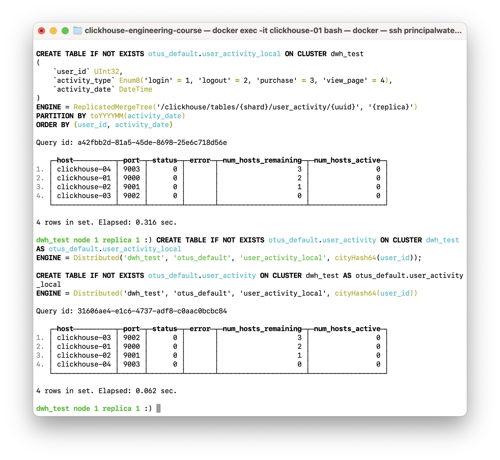

### Шаг 1.3. Генерация и вставка данных
Вставка данных осуществляется в `Distributed`-таблицу. Будет сгенерировано и вставлено 100 миллионов записей.
```sql
INSERT INTO otus_default.user_activity
SELECT
    rand() % 100000 + 1 AS user_id,
    CAST(rand() % 4 + 1, 'Enum8(\'login\' = 1, \'logout\' = 2, \'purchase\' = 3, \'view_page\' = 4)') AS activity_type,
    toDateTime('2025-01-01 00:00:00') + (rand() % 180 * 86400) AS activity_date
FROM numbers(100000000);
```
*Результат вставки данных:*

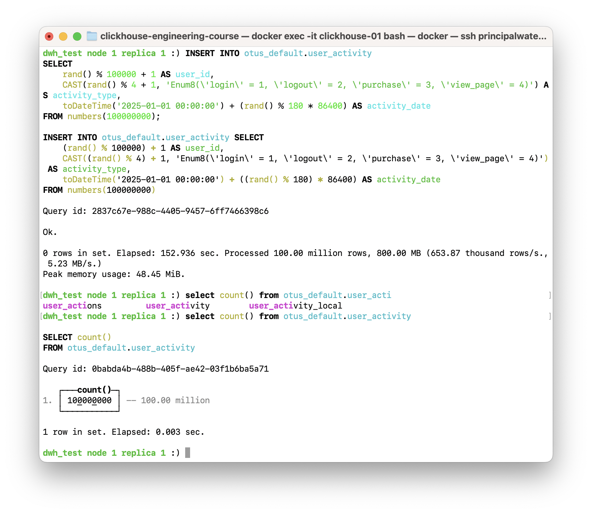

### Шаг 1.4. Проверка распределения данных
1.  **Проверка количества записей на локальной таблице одного узла:**
    ```sql
    SELECT count() FROM otus_default.user_activity_local;
    ```
2.  **Проверка общего количества записей через Distributed-таблицу:**
    ```sql
    SELECT count() FROM otus_default.user_activity;
    ```
> **💡 Почему количество строк отличается?**
> Это **ожидаемое и правильное** поведение. `user_activity_local` на каждом узле хранит данные только **своего** шарда. `user_activity` (Distributed) опрашивает все шарды и суммирует результат. Расхождение в цифрах примерно в два раза подтверждает, что данные корректно распределились по двум шардам.

*Результат проверки распределения данных:*

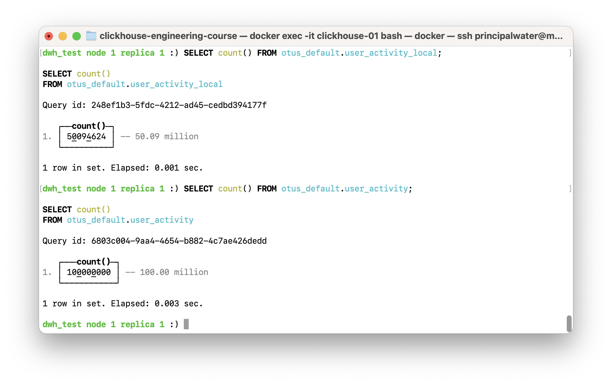

### Шаг 1.5. Выполнение мутации (UPDATE)
```sql
ALTER TABLE otus_default.user_activity_local ON CLUSTER dwh_test
    UPDATE activity_type = 'logout' WHERE toYYYYMM(activity_date) = 202501 AND activity_type = 'login';
```
*Результат выполнения запроса на мутацию:*

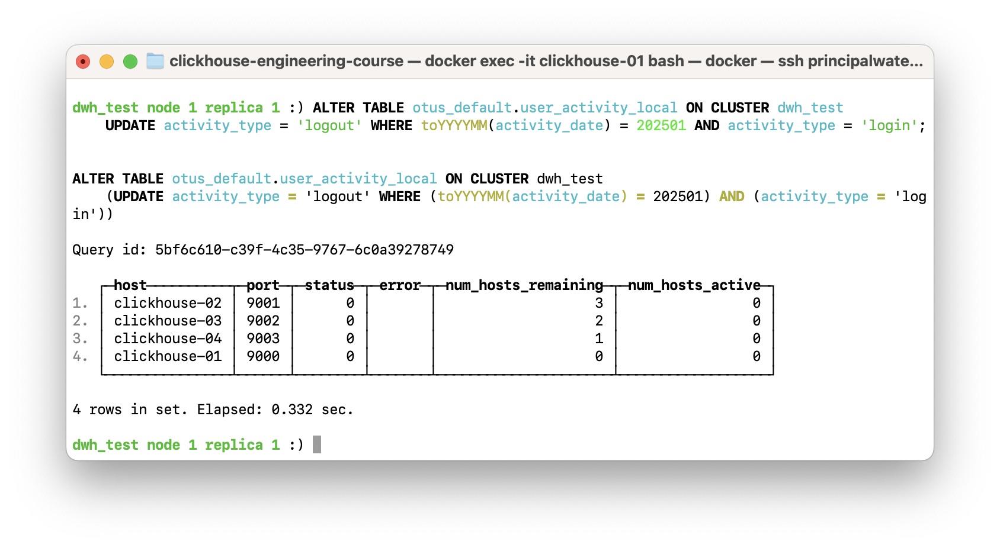

### Шаг 1.6. Проверка результатов мутации
1.  **Проверка статуса в `system.mutations`:**
    ```sql
    SELECT mutation_id, command, is_done
    FROM clusterAllReplicas('dwh_test', system.mutations)
    WHERE table = 'user_activity_local' AND database = 'otus_default'
    ORDER BY create_time DESC
    LIMIT 1;
    ```
2.  **Проверка данных:**
    ```sql
    SELECT activity_type, count()
    FROM otus_default.user_activity
    WHERE toYYYYMM(activity_date) = 202501
    GROUP BY activity_type;
    ```
*Результат проверки `system.mutations` и данных:*

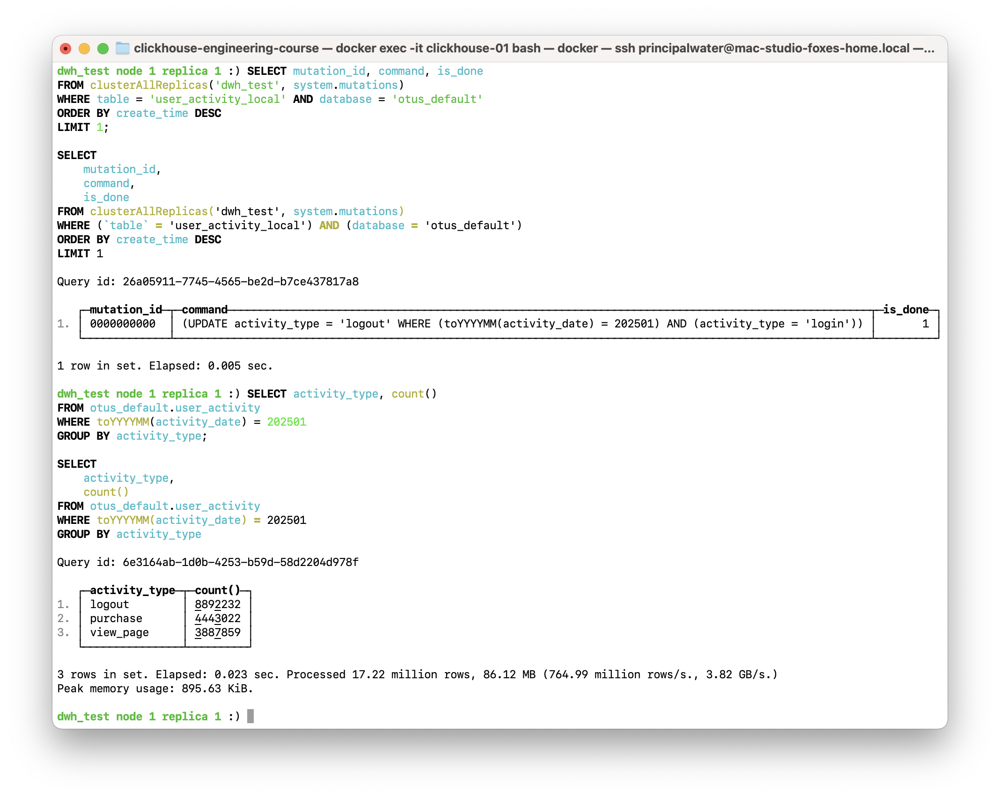

### Шаг 1.7. Манипуляции с партициями (DROP PARTITION)
```sql
ALTER TABLE otus_default.user_activity_local ON CLUSTER dwh_test DROP PARTITION '202502';
```

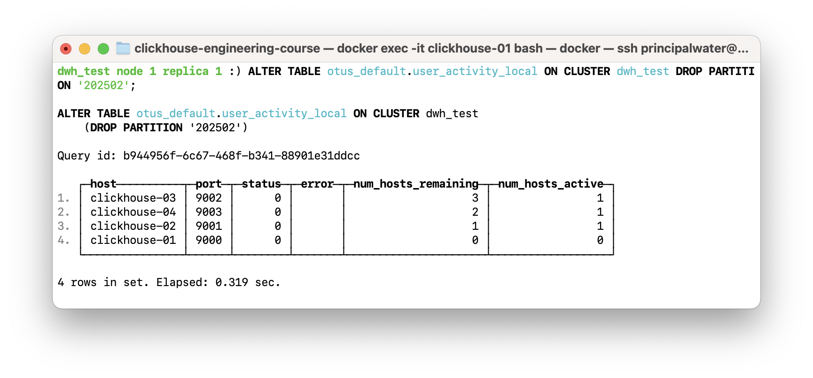


### Шаг 1.8. Проверка состояния таблицы после удаления
1.  **Промежуточная проверка (сразу после `DROP`):**
    ```sql
    SELECT partition, active, count()
    FROM clusterAllReplicas('dwh_test', system.parts)
    WHERE database = 'otus_default' AND table = 'user_activity_local' AND partition = '202502'
    GROUP BY partition, active;
    ```
    *Результат промежуточной проверки:*
    
    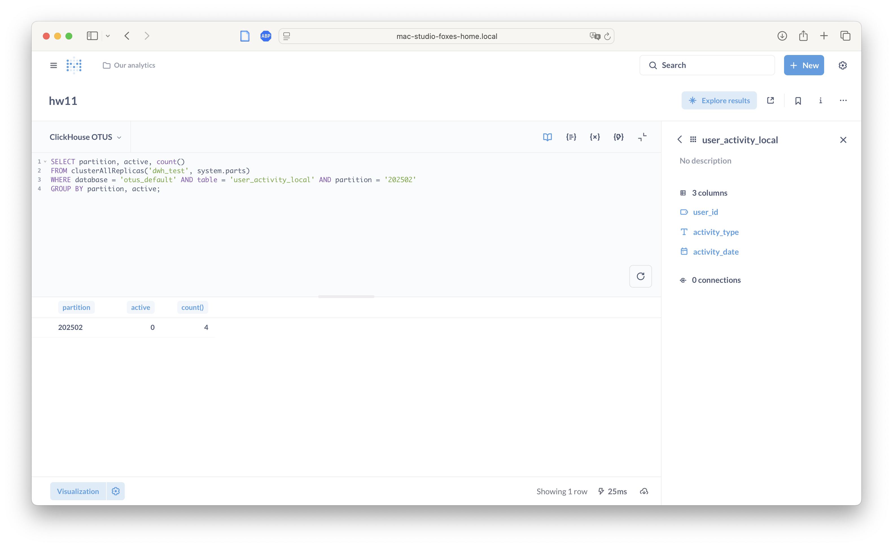

2.  **Финальная проверка (через некоторое время):**
    ```sql
    SELECT DISTINCT partition
    FROM clusterAllReplicas('dwh_test', system.parts)
    WHERE database = 'otus_default' AND table = 'user_activity_local' AND active = 1
    ORDER BY partition;
    ```
    *Результат финальной проверки партиций:*

    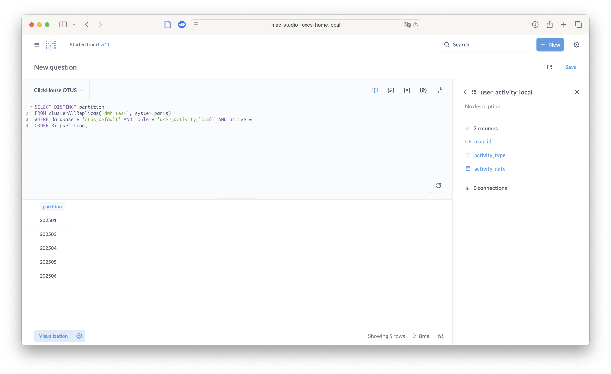

---

## Часть 2. Дополнительные задания

### Шаг 2.1. Мутация DELETE
```sql
ALTER TABLE otus_default.user_activity_local ON CLUSTER dwh_test
    DELETE WHERE toYYYYMM(activity_date) = 202503 AND activity_type = 'purchase';
```
Проверка:
```sql
SELECT count()
FROM otus_default.user_activity
WHERE toYYYYMM(activity_date) = 202503 AND activity_type = 'purchase';
```
*Результат проверки данных после `DELETE`:*


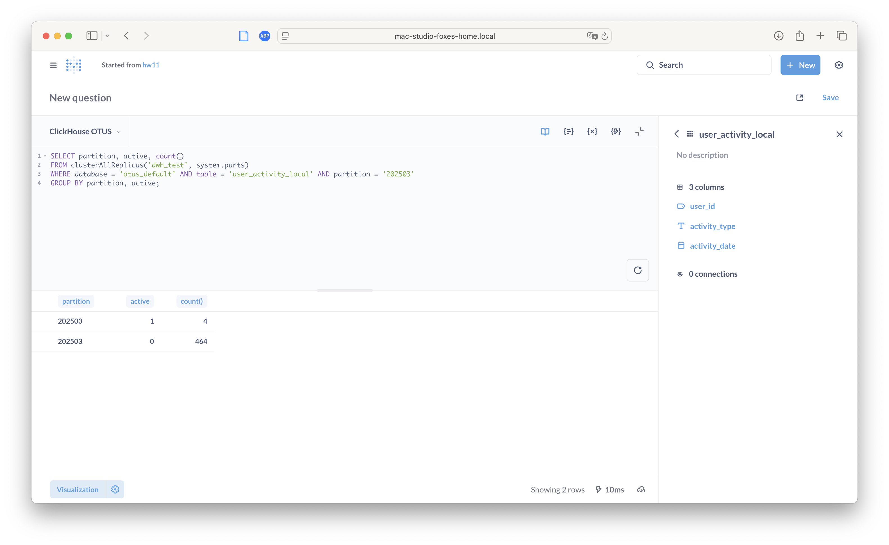

### Шаг 2.2. Атомарная замена партиции (REPLACE PARTITION)
1.  **Создание временной таблицы с измененными данными:**
    ```sql
    CREATE TABLE IF NOT EXISTS otus_default.user_activity_temp ON CLUSTER dwh_test
    AS otus_default.user_activity_local
    ENGINE = ReplicatedMergeTree('/clickhouse/tables/{shard}/user_activity_temp/{uuid}', '{replica}');

    INSERT INTO otus_default.user_activity_temp
    SELECT
        user_id,
        'login' AS activity_type,
        activity_date
    FROM otus_default.user_activity_local
    WHERE toYYYYMM(activity_date) = 202504;
    ```
2.  **Атомарная замена партиции:**
    ```sql
    ALTER TABLE otus_default.user_activity_local ON CLUSTER dwh_test
        REPLACE PARTITION '202504' FROM otus_default.user_activity_temp;
    ```
3.  **Проверка:**
    ```sql
    SELECT activity_type, count()
    FROM otus_default.user_activity
    WHERE toYYYYMM(activity_date) = 202504
    GROUP BY activity_type;
    ```
*Результат проверки после `REPLACE PARTITION`:*

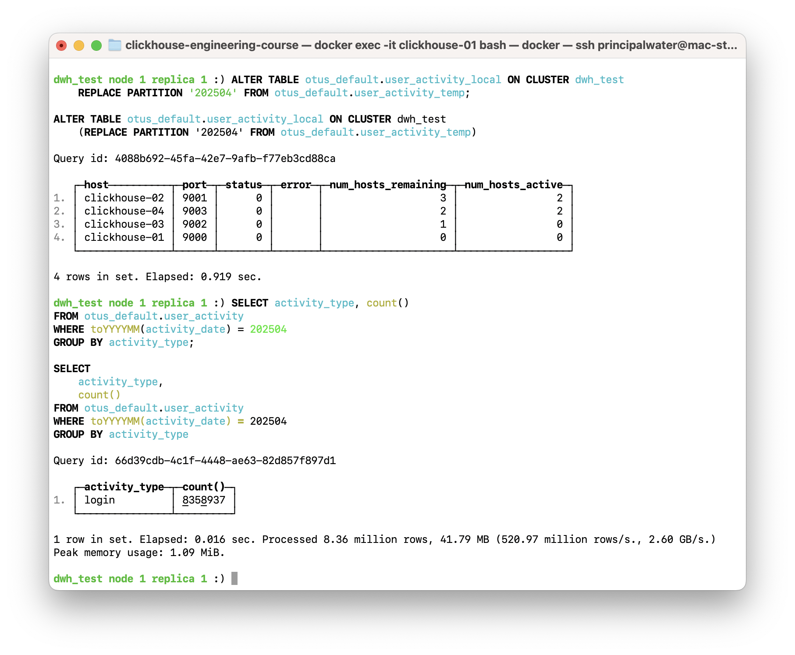

### Шаг 2.3. Управление жизненным циклом данных (TTL)
```sql
ALTER TABLE otus_default.user_activity_local ON CLUSTER dwh_test
    MODIFY TTL activity_date + INTERVAL 90 DAY;
```
Проверка:
```sql
SHOW CREATE TABLE otus_default.user_activity_local;
```
*Результат `SHOW CREATE TABLE` с TTL:*

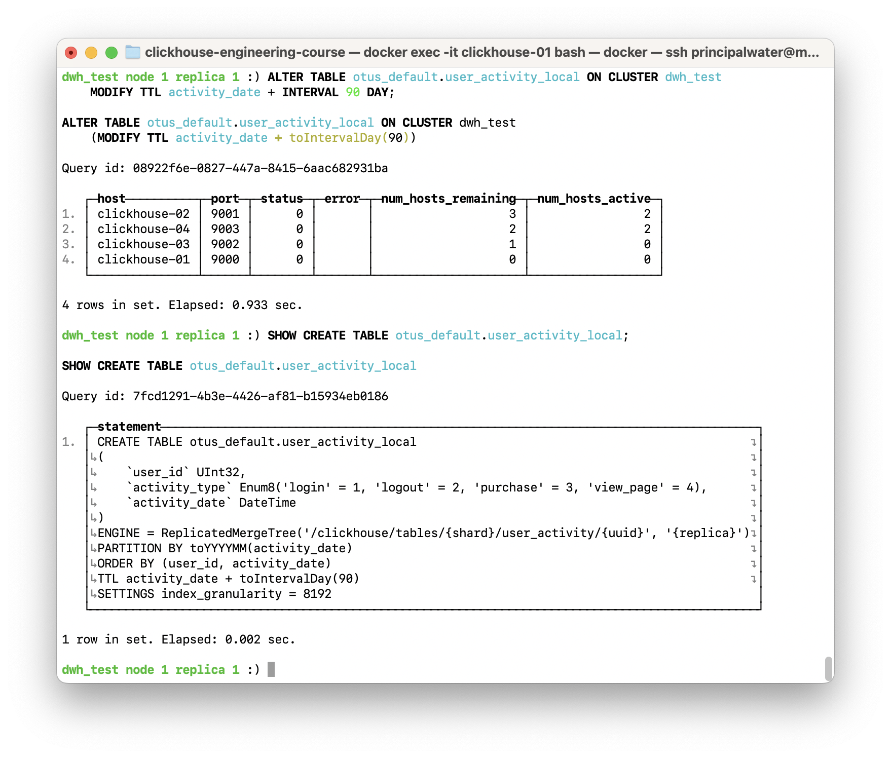

### Шаг 2.4. Трансформация данных через Materialized View
`Materialized View` (MV) можно использовать как триггер для трансформации данных "на лету". Однако в кластерной среде их настройка требует особого внимания, чтобы избежать дублирования данных.

> **💡 Причина дублей:** Если `Materialized View` слушает локальную `Replicated`-таблицу, он срабатывает на **каждой** реплике, куда приходят данные, что приводит к многократному выполнению одной и той же трансформации.

**Правильное решение:** `Materialized View` должен слушать `Distributed`-таблицу. В этом случае `INSERT` в `Distributed`-таблицу будет виден как единое событие, и MV сработает только один раз.

1. **Создание инфраструктуры для трансформации:**
   ```sql
   -- 1. Локальная таблица-приемник для трансформированных данных
   CREATE TABLE IF NOT EXISTS otus_default.user_activity_transformed_local ON CLUSTER dwh_test
   AS otus_default.user_activity_local
   ENGINE = ReplicatedMergeTree('/clickhouse/tables/{shard}/user_activity_transformed/{uuid}', '{replica}');

   -- 2. Materialized View: подписывается на распределенную таблицу-источник, пишет в локальную таблицу-приемник
   CREATE MATERIALIZED VIEW IF NOT EXISTS otus_default.mv_transform_activity ON CLUSTER dwh_test
   TO otus_default.user_activity_transformed_local
   AS SELECT
       user_id,
       if(activity_type = 'purchase', 'view_page', activity_type) AS activity_type,
       activity_date
   FROM otus_default.user_activity;
   ```

2. **Вставка данных для триггера:**
   ```sql
   INSERT INTO otus_default.user_activity (user_id, activity_type, activity_date)
   VALUES (999, 'purchase', '2025-06-01 12:00:00');
   ```

3. **Проверка результата:**
   Сначала проверим локальную таблицу на одном из узлов. Мы должны увидеть одну трансформированную запись.
   ```sql
   SELECT * FROM otus_default.user_activity_transformed_local WHERE user_id = 999;
   ```
   *Результат проверки `_local` таблицы:*

   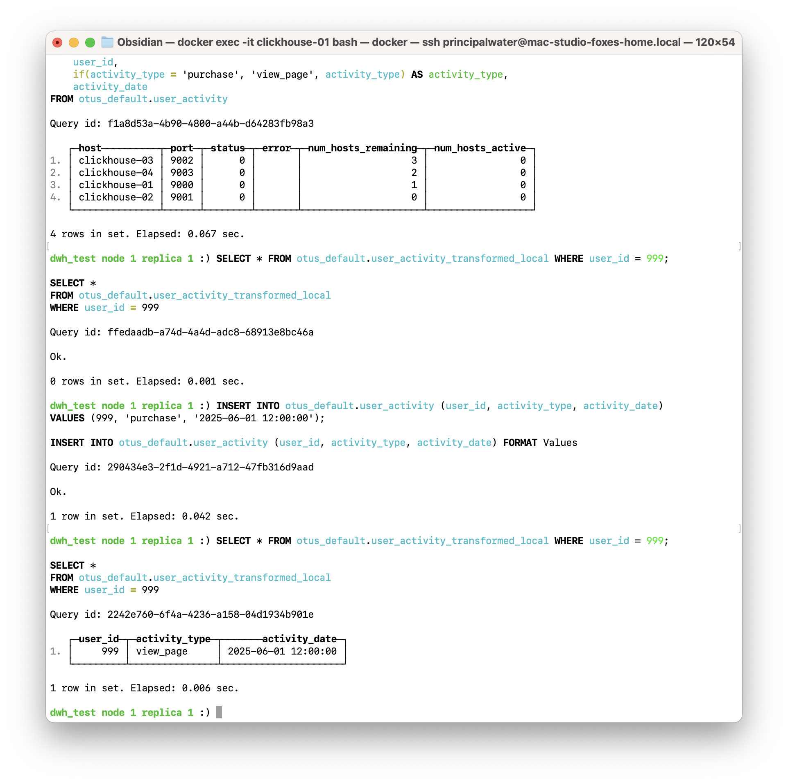

   > **💡 Примечание:** В продуктивной среде для запросов всегда следует использовать `Distributed`-таблицу. Создадим ее и убедимся, что и на уровне всего кластера мы видим одну запись.

4. **Создание `Distributed`-таблицы для проверки и очистка:**
   ```sql
   -- Создаем Distributed-таблицу поверх трансформированных данных
   CREATE TABLE IF NOT EXISTS otus_default.user_activity_transformed ON CLUSTER dwh_test
   AS otus_default.user_activity_transformed_local
   ENGINE = Distributed('dwh_test', 'otus_default', 'user_activity_transformed_local', cityHash64(user_id));

   -- Проверяем данные через нее
   SELECT * FROM otus_default.user_activity_transformed WHERE user_id = 999;
   ```
   *Результат проверки `Distributed`-таблицы:*

   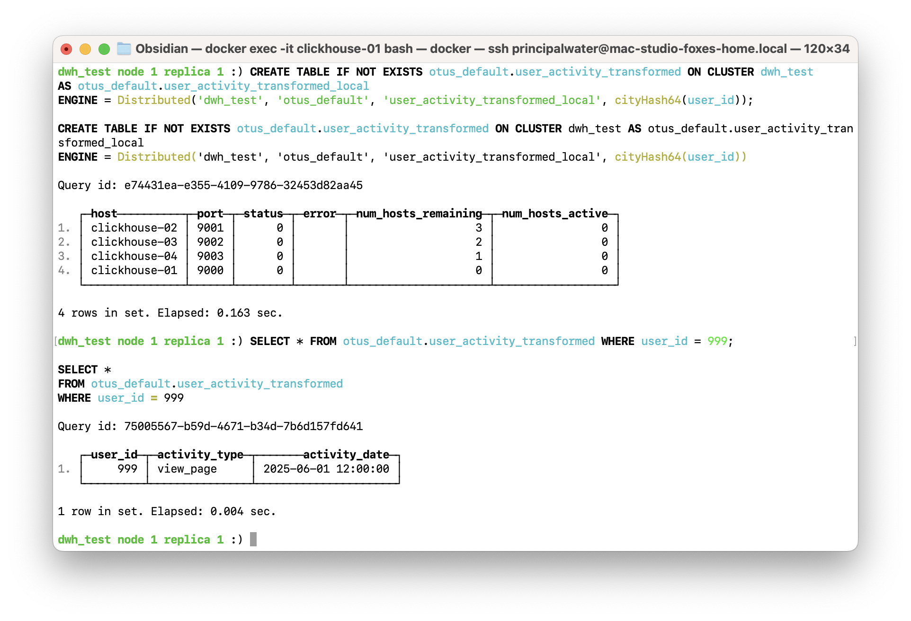

   ```sql
   -- Финальная очистка
   DROP VIEW IF EXISTS otus_default.mv_transform_activity ON CLUSTER dwh_test;
   DROP TABLE IF EXISTS otus_default.user_activity_transformed ON CLUSTER dwh_test;
   DROP TABLE IF EXISTS otus_default.user_activity_transformed_local ON CLUSTER dwh_test;
   ```

---

## Общие выводы по заданию
В ходе этого задания на практике были освоены механизмы мутации данных и манипуляции с партициями в кластерной среде ClickHouse. Было продемонстрировано, как строить отказоустойчивые решения с помощью `Replicated` и `Distributed` таблиц, выполнять `UPDATE`, `DELETE`, `REPLACE PARTITION` на кластере, а также настраивать `TTL` и использовать `Materialized View` для трансформации данных.

## Список источников
- [Официальная документация ClickHouse: ALTER TABLE](https://clickhouse.com/docs/ru/sql-reference/statements/alter)
- [Официальная документация ClickHouse: Materialized View](https://clickhouse.com/docs/ru/sql-reference/statements/create/view/#materialized-view)
- [Статья на Habr: Обновление данных в ClickHouse](https://habr.com/ru/companies/just_ai/articles/589621/)
- [Статья в блоге ivan-shamaev.ru: Что такое мутации в ClickHouse?](https://ivan-shamaev.ru/clickhouse-101-course-on-learn-clickhouse-com/#__ClickHouse-2)
