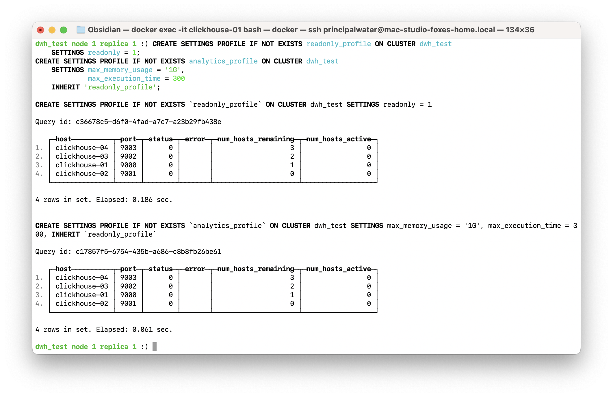
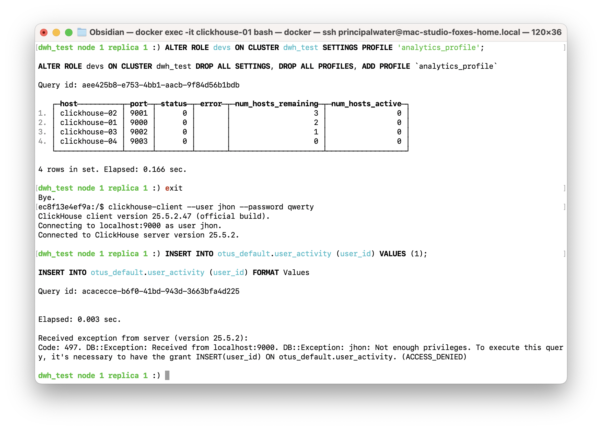
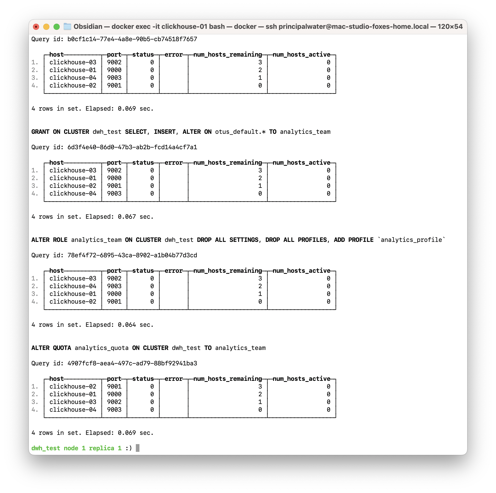
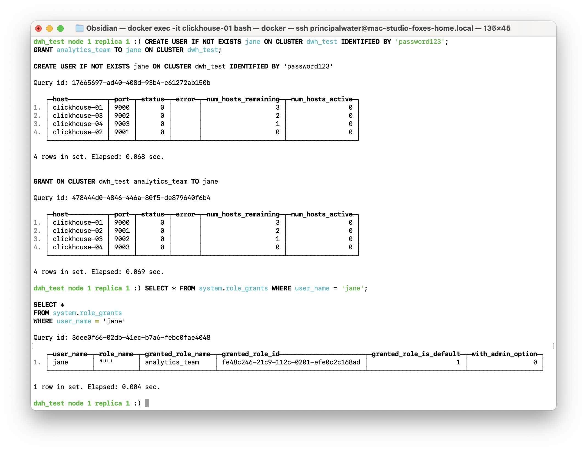
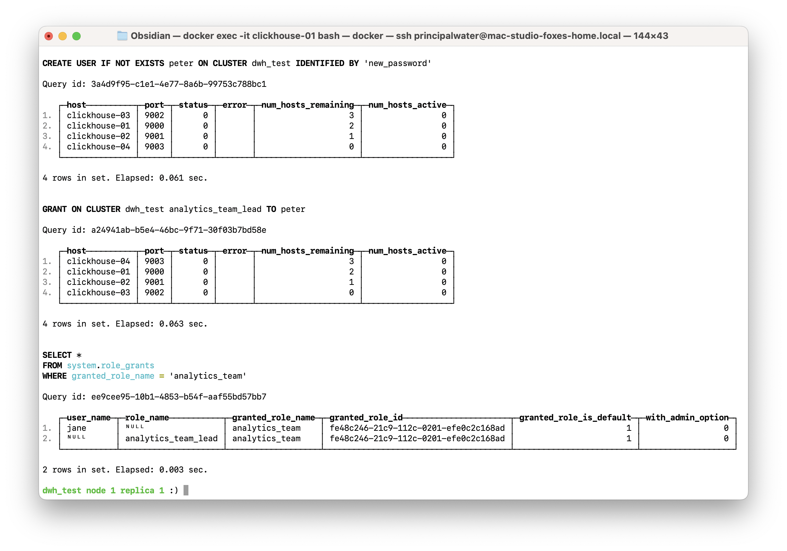

# Homework #12: RBAC контроль доступа, квоты и ограничения

---

## Оглавление
- [Описание задания и цели](#описание-задания-и-цели)
- [Теоретическая справка](#теоретическая-справка)
- [Часть 1. Реализация обязательного задания: RBAC](#часть-1-реализация-обязательного-задания-rbac)
  - [1.1. Подготовка окружения](#11-подготовка-окружения)
  - [1.2. Создание пользователя](#12-создание-пользователя)
  - [1.3. Создание роли и выдача привилегий](#13-создание-роли-и-выдача-привилегий)
  - [1.4. Назначение роли пользователю](#14-назначение-роли-пользователю)
  - [1.5. Проверка созданных сущностей](#15-проверка-созданных-сущностей)
  - [1.6. Формирование отчета](#16-формирование-отчета)
- [Часть 2. Дополнительные манипуляции: управление ресурсами и автоматизация](#часть-2-дополнительные-манипуляции-управление-ресурсами-и-автоматизация)
  - [2.1. Создание иерархии профилей настроек](#21-создание-иерархии-профилей-настроек)
  - [2.2. Создание и применение квоты](#22-создание-и-применение-квоты)
  - [2.3. Назначение профиля и тестирование ограничений](#23-назначение-профиля-и-тестирование-ограничений)
  - [2.4. Автоматизация и тиражирование настроек](#24-автоматизация-и-тиражирование-настроек)
- [Общие выводы по заданию](#общие-выводы-по-заданию)
- [Список источников](#список-источников)

---

## Описание задания и цели

В данном домашнем задании будет рассмотрена концепция Role-Based Access Control (RBAC), а также механизмы квот и ограничений в ClickHouse. Эти инструменты являются основой для построения безопасной и управляемой системы доступа к данным.

**Компетенции, которые будут отработаны:**
-   Создание и управление пользователями, ролями, профилями и квотами.
-   Назначение привилегий и ограничений.
-   Проверка конфигураций через системные таблицы.

---

## Теоретическая справка
**RBAC (Role-Based Access Control)** — это модель управления доступом, основанная на ролях. Вместо того чтобы выдавать права каждому пользователю индивидуально, администратор создает роли (например, `developer`, `analyst`), определяет для них набор привилегий, а затем назначает эти роли пользователям.

**Профили и квоты** в ClickHouse позволяют контролировать потребление ресурсов. Профили (`SETTINGS PROFILE`) задают ограничения на выполнение конкретного запроса (например, `max_memory_usage`), а квоты (`QUOTA`) — на совокупное потребление ресурсов за определенный интервал времени (например, количество запросов в час).

---

## Часть 1. Реализация обязательного задания: RBAC

### 1.1. Подготовка окружения
Для выполнения задания будет использоваться кластер ClickHouse, развернутый с помощью Terraform из каталога `base-infra`.
```sh
cd base-infra/clickhouse
terraform apply -auto-approve
```
> ⚠️ Перед запуском необходимо задать переменные окружения `TF_VAR_super_user_name`, `TF_VAR_super_user_password` и `TF_VAR_bi_user_password` для аутентификации.

> **Примечание:** все последующие DDL/DML запросы будут выполняться с первого узла (`clickhouse-01`).

### 1.2. Создание пользователя
Будет создан пользователь `jhon` с паролем `qwerty`. Команда `ON CLUSTER` обеспечивает создание пользователя на всех узлах кластера.
```sql
CREATE USER IF NOT EXISTS jhon ON CLUSTER dwh_test IDENTIFIED BY 'qwerty';
```
*Результат создания пользователя:*


### 1.3. Создание роли и выдача привилегий
Будет создана роль `devs` и ей будут выданы права на чтение (`SELECT`) из таблицы `system.parts`.
```sql
-- Создание роли на всех узлах кластера
CREATE ROLE IF NOT EXISTS devs ON CLUSTER dwh_test;

-- Выдача привилегий роли на всех узлах кластера
GRANT SELECT ON system.parts TO devs ON CLUSTER dwh_test;
```
*Результат создания роли и выдачи прав:*


### 1.4. Назначение роли пользователю
Пользователю `jhon` будет назначена роль `devs`.
```sql
GRANT devs TO jhon ON CLUSTER dwh_test;
```
*Результат назначения роли:*


### 1.5. Проверка созданных сущностей
Для проверки можно использовать системные таблицы `system.users`, `system.roles` и `system.grants`.

1.  **Проверка пользователя:**
    ```sql
    SELECT name FROM system.users WHERE name = 'jhon';
    ```
2.  **Проверка роли:**
    ```sql
    SELECT name FROM system.roles WHERE name = 'devs';
    ```
3.  **Проверка выданных ролей пользователю:**
    ```sql
    SELECT * FROM system.role_grants WHERE user_name = 'jhon';
    ```
4.  **Проверка привилегий, выданных роли:**
    ```sql
    SELECT * FROM system.grants WHERE role_name = 'devs';
    ```
*Результаты проверочных запросов:*


> **💡 Примечание по результатам:**
> Здесь стоит обратить внимание на значения `NULL` в системных таблицах:
> - В `system.role_grants` атрибут `role_name` имеет значение `NULL`, так как роль `devs` была выдана напрямую пользователю `jhon`, а не через другую роль.
> - В `system.grants` атрибут `user_name` имеет значение `NULL`, так как привилегия `SELECT` была выдана непосредственно роли `devs`, а не конкретному пользователю.
>
> Это стандартное поведение, которое показывает, как ClickHouse разделяет сущности прав.

### 1.6. Формирование отчета
Для сдачи домашнего задания необходимо предоставить текстовый документ, содержащий все выполненные DDL-запросы и результаты проверок из системных таблиц.

Следующая команда, выполненная из каталога `terraform`, сформирует отчет в удобном формате Markdown:
```bash
# Создаем директорию, если она не существует
mkdir -p ../../materials/hw12_rbac-quotas-limits

# Формируем отчет
(
    echo "## 1. Создание пользователя jhon"
    echo '```sql'
    echo "CREATE USER IF NOT EXISTS jhon ON CLUSTER dwh_test IDENTIFIED BY 'qwerty';"
    echo '```'
    echo -e "\n## 2. Создание роли devs и выдача прав"
    echo '```sql'
    echo "CREATE ROLE IF NOT EXISTS devs ON CLUSTER dwh_test;"
    echo "GRANT SELECT ON system.parts TO devs ON CLUSTER dwh_test;"
    echo '```'
    echo -e "\n## 3. Назначение роли пользователю"
    echo '```sql'
    echo "GRANT devs TO jhon ON CLUSTER dwh_test;"
    echo '```'
    echo -e "\n## 4. Результаты проверок"
    echo '### system.role_grants'
    echo '```'
    docker exec clickhouse-01 clickhouse-client --user ${TF_VAR_super_user_name} --password ${TF_VAR_super_user_password} --query "SELECT * FROM system.role_grants WHERE user_name = 'jhon';" --vertical
    echo '```'
    echo '### system.grants'
    echo '```'
    docker exec clickhouse-01 clickhouse-client --user ${TF_VAR_super_user_name} --password ${TF_VAR_super_user_password} --query "SELECT * FROM system.grants WHERE role_name = 'devs';" --vertical
    echo '```'
) > ../../materials/hw12_rbac-quotas-limits/result.md
```
> Результат сохранен в файле: [`result.md`](../materials/hw12_rbac-quotas-limits/result.md).

---

## Часть 2. Дополнительные манипуляции: управление ресурсами и автоматизация

В рамках дополнительной части задания будут рассмотрены более сложные сценарии управления ресурсами и автоматизации, которые являются неотъемлемой частью управления production-кластером.

### 2.1. Создание иерархии профилей настроек
Профили настроек позволяют централизованно управлять ограничениями. Использование наследования (`INHERIT`) позволяет строить гибкие иерархии.

1.  **Создание базового профиля `readonly_profile`:**
    Этот профиль запрещает любые операции, кроме чтения данных.
    ```sql
    CREATE SETTINGS PROFILE IF NOT EXISTS readonly_profile ON CLUSTER dwh_test
        SETTINGS readonly = 1;
    ```
2.  **Создание профиля `analytics_profile` с наследованием:**
    Этот профиль наследует все настройки от `readonly_profile` и добавляет собственные ограничения.
    ```sql
    CREATE SETTINGS PROFILE IF NOT EXISTS analytics_profile ON CLUSTER dwh_test
        SETTINGS max_memory_usage = '1G',
                 max_execution_time = 300
        INHERIT 'readonly_profile';
    ```
> **💡 Примечание:** Наследование профилей (`INHERIT`) позволяет строить гибкие иерархии ограничений, избегая дублирования настроек.
> Здесь устанавливается жесткий лимит на выполнение запроса (10 секунд) и максимальный объем ОЗУ (1 ГБ) для одного запроса.
> Подробнее о профилях можно прочитать в [официальной документации](https://clickhouse.com/docs/ru/sql-reference/statements/create/settings-profile).

*Результат создания профилей:*



### 2.2. Создание и применение квоты
Квоты отслеживают и ограничивают потребление ресурсов за определенный интервал времени. Это помогает предотвратить исчерпание ресурсов одним пользователем или ролью.
```sql
CREATE QUOTA IF NOT EXISTS analytics_quota ON CLUSTER dwh_test
    FOR INTERVAL 1 HOUR MAX queries = 100, read_bytes = '5G'
    TO devs;
```
> **💡 Примечание:** Эта квота ограничивает роль `devs` 100 запросами и 5 ГБ прочитанных данных в час.

*Результат создания и применения квоты:*


### 2.3. Назначение профиля и тестирование ограничений
1.  **Назначение профиля `analytics_profile` роли `devs`:**
    ```sql
    ALTER ROLE devs ON CLUSTER dwh_test SETTINGS PROFILE 'analytics_profile';
    ```
2.  **Проверка ограничений под пользователем `jhon`:**
    Попытка выполнить `INSERT` от имени `jhon` завершится ошибкой, так как его роль `devs` наследует `readonly=1`.
    ```sql
    -- Этот запрос должен вернуть ошибку
    INSERT INTO otus_default.user_activity (user_id) VALUES (1);
    ```
*Результат тестирования ограничений:*



### 2.4. Автоматизация и тиражирование настроек
Чтобы не выполнять все шаги вручную для каждого нового сотрудника, можно создать единую роль для команды, например, `analytics_team`.

1.  **Создание и настройка комплексной роли `analytics_team`:**
    ```sql
    CREATE ROLE IF NOT EXISTS analytics_team ON CLUSTER dwh_test;
    GRANT SELECT, INSERT, ALTER ON otus_default.* TO analytics_team ON CLUSTER dwh_test;
    
    -- Применение профиля и квоты к новой роли
    ALTER ROLE analytics_team ON CLUSTER dwh_test SETTINGS PROFILE 'analytics_profile';
    ALTER QUOTA analytics_quota ON CLUSTER dwh_test TO analytics_team;
    ```

*Результат создания роли и применения к ней профиля и квоты:*



2.  **Создание и добавление нового пользователя `jane`:**
    ```sql
    CREATE USER IF NOT EXISTS jane ON CLUSTER dwh_test IDENTIFIED BY 'password123';
    GRANT analytics_team TO jane ON CLUSTER dwh_test;
    ```

*Результат назначения комплексной роли новому пользователю:*



> **💡 Преимущество:** Теперь для любого нового аналитика достаточно выполнить всего две команды. Все права и ограничения применяются автоматически через роль.

3.  **Создание иерархии ролей:**
    Чтобы продемонстрировать, как `system.role_grants` отображает вложенность, создадим новую роль `analytics_team_lead` и назначим ей уже существующую роль `analytics_team`.
    ```sql
    CREATE ROLE IF NOT EXISTS analytics_team_lead ON CLUSTER dwh_test;
    GRANT analytics_team TO analytics_team_lead ON CLUSTER dwh_test;
    ```
    > **💡 Преимущество иерархии:** Такой подход позволяет создавать "роли-контейнеры". Например, `analytics_team_lead` может иметь все права `analytics_team` плюс дополнительные, эксклюзивные привилегии (например, `DROP TABLE`). Это упрощает управление доступом для руководителей команд, не дублируя базовые права.
4.  **Создание пользователя `peter` и назначение ему роли-контейнера:**
    ```sql
    CREATE USER IF NOT EXISTS peter ON CLUSTER dwh_test IDENTIFIED BY 'new_password';
    GRANT analytics_team_lead TO peter ON CLUSTER dwh_test;
    ```
5.  **Проверка иерархии:**
    Теперь, если посмотреть на гранты для `analytics_team_lead`, `role_name` будет `NULL`, но если посмотреть на гранты для `analytics_team`, `role_name` будет `analytics_team_lead`.
    ```sql
    -- Проверяем, кому и как выдана роль analytics_team
    SELECT * FROM system.role_grants WHERE granted_role_name = 'analytics_team';
    ```
    > **💡 Примечание:** Этот запрос покажет две записи. В одной (`user_name` = 'jane') `role_name` будет `NULL` (прямое назначение). В другой (`role_name` = 'analytics_team_lead') `user_name` будет `NULL`, что показывает вложенность ролей.

*Результат проверки иерархии ролей:*



---

## Общие выводы по заданию
В ходе этого задания были освоены базовые и продвинутые операции по управлению доступом и ресурсами в ClickHouse. Были созданы пользователь, роль, иерархия профилей и квота, настроены привилегии и ограничения. Этот механизм является фундаментальным для обеспечения безопасности и управляемости данных в любой production-системе.

## Список источников
- [Официальная документация ClickHouse: Управление доступом и аккаунтами](https://clickhouse.com/docs/ru/operations/access-rights)
