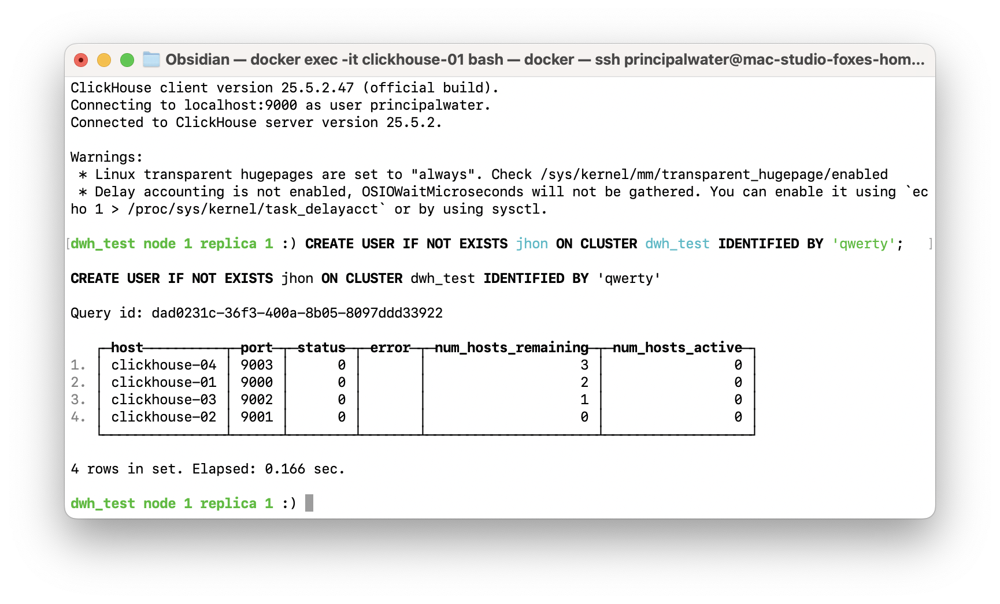
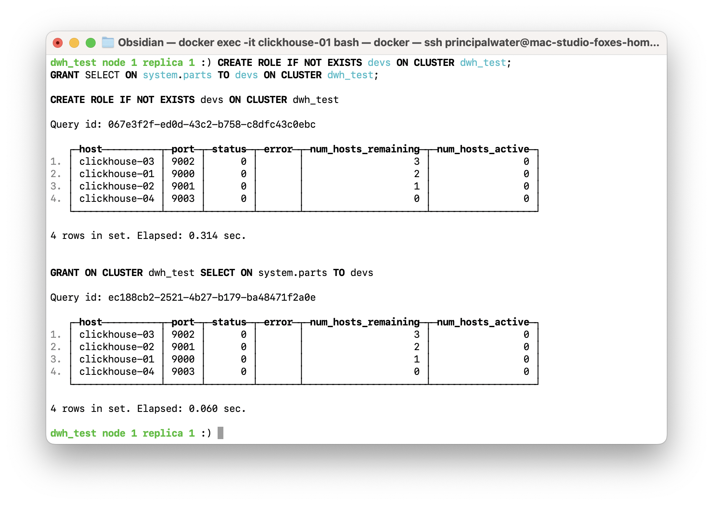
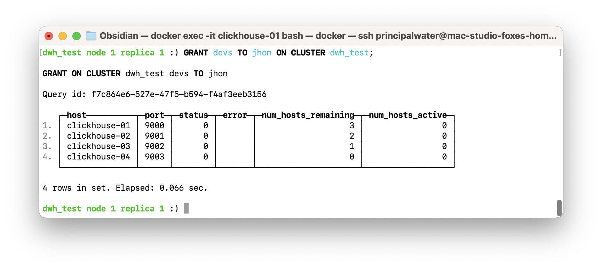
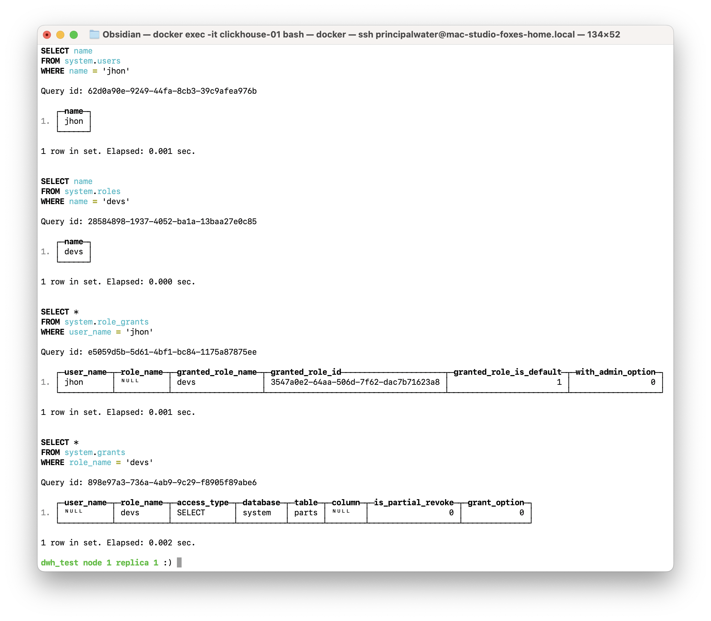
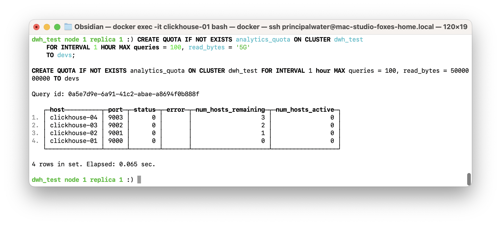

# Homework #12: RBAC контроль доступа, квоты и ограничения

---

## Оглавление
- [Описание задания и цели](#описание-задания-и-цели)
- [Теоретическая справка](#теоретическая-справка)
- [Часть 1. Реализация обязательного задания: RBAC](#часть-1-реализация-обязательного-задания-rbac)
  - [1.1. Подготовка окружения](#11-подготовка-окружения)
  - [1.2. Создание пользователя](#12-создание-пользователя)
  - [1.3. Создание роли и выдача привилегий](#13-создание-роли-и-выдача-привилегий)
  - [1.4. Назначение роли пользователю](#14-назначение-роли-пользователю)
  - [1.5. Проверка созданных сущностей](#15-проверка-созданных-сущностей)
  - [1.6. Автоматизация и тиражирование настроек](#16-автоматизация-и-тиражирование-настроек)
- [Часть 2. Дополнительные манипуляции: управление ресурсами](#часть-2-дополнительные-манипуляции-управление-ресурсами)
  - [2.1. Создание профиля настроек](#21-создание-профиля-настроек)
  - [2.2. Создание квоты](#22-создание-квоты)
  - [2.3. Применение профиля к роли](#23-применение-профиля-к-роли)
  - [2.4. Проверка конфигурации](#24-проверка-конфигурации)
- [Общие выводы по заданию](#общие-выводы-по-заданию)
- [Список источников](#список-источников)

---

## Описание задания и цели

В данном домашнем задании будет рассмотрена концепция Role-Based Access Control (RBAC), а также механизмы квот и ограничений в ClickHouse. Эти инструменты являются основой для построения безопасной и управляемой системы доступа к данным.

**Цели занятия:**
-   Ознакомиться с концепцией RBAC для управления доступом к данным.
-   Изучить возможности установки квот и ограничений для контроля использования ресурсов.
-   Наработать практические навыки настройки RBAC, установки квот и ограничений.

**Компетенции, которые будут отработаны:**
-   Создание и управление пользователями и ролями.
-   Назначение привилегий на различные объекты базы данных.
-   Проверка прав доступа и конфигураций через системные таблицы.

---

## Теоретическая справка
**RBAC (Role-Based Access Control)** — это модель управления доступом, основанная на ролях, которые назначаются пользователям. Вместо того чтобы выдавать права каждому пользователю индивидуально, администратор создает роли (например, `developer`, `analyst`, `readonly_user`), определяет для каждой роли набор привилегий (например, `SELECT` на одни таблицы, `INSERT` на другие), а затем назначает эти роли пользователям. Это значительно упрощает управление доступом в системах с большим количеством пользователей и объектов.

**Квоты и ограничения** в ClickHouse позволяют контролировать потребление ресурсов пользователями или ролями. Можно установить лимиты на время выполнения запросов, количество потребляемой памяти, скорость чтения данных и многое другое, чтобы предотвратить "шумных соседей" и обеспечить стабильную работу кластера.

---

## Часть 1. Реализация обязательного задания: RBAC

### 1.1. Подготовка окружения
Для выполнения задания будет использоваться кластер ClickHouse, развернутый с помощью Terraform из каталога `base-infra`.
```sh
cd base-infra/clickhouse
terraform apply -auto-approve
```
> ⚠️ Перед запуском необходимо задать переменные окружения `TF_VAR_super_user_name`, `TF_VAR_super_user_password` и `TF_VAR_bi_user_password` для аутентификации.

> **Примечание:** все последующие DDL/DML запросы будут выполняться с первого узла (`clickhouse-01`).

### 1.2. Создание пользователя
Будет создан пользователь `jhon` с паролем `qwerty`. Команда `ON CLUSTER` обеспечивает создание пользователя на всех узлах кластера.
```sql
CREATE USER jhon ON CLUSTER dwh_test IDENTIFIED BY 'qwerty';
```
*Результат создания пользователя:*



### 1.3. Создание роли и выдача привилегий
Будет создана роль `devs` и ей будут выданы права на чтение (`SELECT`) из таблицы `system.parts`.
```sql
-- Создание роли на всех узлах кластера
CREATE ROLE devs ON CLUSTER dwh_test;

-- Выдача привилегий роли на всех узлах кластера
GRANT SELECT ON system.parts TO devs ON CLUSTER dwh_test;
```
*Результат создания роли и выдачи прав:*



### 1.4. Назначение роли пользователю
Пользователю `jhon` будет назначена роль `devs`.
```sql
GRANT devs TO jhon ON CLUSTER dwh_test;
```
*Результат назначения роли:*



### 1.5. Проверка созданных сущностей
Для проверки можно использовать системные таблицы `system.users`, `system.roles` и `system.grants`.

1.  **Проверка пользователя:**
    ```sql
    SELECT name FROM system.users WHERE name = 'jhon';
    ```
2.  **Проверка роли:**
    ```sql
    SELECT name FROM system.roles WHERE name = 'devs';
    ```
3.  **Проверка выданных ролей пользователю:**
    ```sql
    SELECT * FROM system.role_grants WHERE user_name = 'jhon';
    ```
4.  **Проверка привилегий, выданных роли:**
    ```sql
    SELECT * FROM system.grants WHERE role_name = 'devs';
    ```
*Результаты проверочных запросов:*



### 1.6. Автоматизация и тиражирование настроек
Чтобы не выполнять все шаги вручную для каждого нового сотрудника, можно автоматизировать процесс. Например, для команды DWH можно создать единую роль `dwh_team`, настроить для нее все необходимые права, профили и квоты, а затем просто добавлять новых пользователей в эту роль.

1.  **Создание комплексной роли `dwh_team`:**
    ```sql
    CREATE ROLE dwh_team ON CLUSTER dwh_test;
    GRANT SELECT, INSERT, ALTER, CREATE TABLE ON otus_default.* TO dwh_team ON CLUSTER dwh_test;
    ALTER ROLE dwh_team ON CLUSTER dwh_test SETTINGS PROFILE 'analytics';
    ```
2.  **Создание и добавление нового пользователя `jane`:**
    ```sql
    CREATE USER jane ON CLUSTER dwh_test IDENTIFIED BY 'password123';
    GRANT dwh_team TO jane ON CLUSTER dwh_test;
    ```
> **💡 Преимущество:** Теперь для любого нового DWH-инженера достаточно выполнить всего две команды (`CREATE USER` и `GRANT dwh_team`). Все права и ограничения применяются автоматически через роль, что значительно упрощает онбординг и управление доступами.

*Результат назначения комплексной роли новому пользователю:*


---

## Часть 2. Дополнительные манипуляции: управление ресурсами

В рамках дополнительной части задания будут рассмотрены механизмы контроля потребления ресурсов, которые являются неотъемлемой частью управления production-кластером. Это позволит продемонстрировать, как обезопасить систему от неэффективных запросов и гарантировать стабильную работу для всех пользователей.

### 2.1. Создание профиля настроек
Будет создан профиль `analytics`, который ограничивает максимальное время выполнения запроса (`max_execution_time`) и потребление памяти (`max_memory_usage`).

```sql
CREATE SETTINGS PROFILE analytics ON CLUSTER dwh_test
    SETTINGS max_execution_time = 30, max_memory_usage = '2G';
```
*Результат создания профиля:*


### 2.2. Создание квоты
Будет создана квота `analytics_quota`, которая ограничивает общее количество запросов и ошибок за час.

```sql
CREATE QUOTA analytics_quota ON CLUSTER dwh_test
    FOR INTERVAL 1 HOUR MAX queries = 1000, errors = 100
    TO devs;
```
> **Примечание:** Квота сразу назначается роли `devs`. Все пользователи с этой ролью будут подпадать под ее действие.

*Результат создания квоты:*



### 2.3. Применение профиля к роли
Профиль `analytics` будет применен к роли `devs`.
```sql
ALTER ROLE devs ON CLUSTER dwh_test SETTINGS PROFILE 'analytics';
```
*Результат применения профиля:*


### 2.4. Проверка конфигурации
1.  **Проверка профиля:**
    ```sql
    SELECT * FROM system.settings_profiles;
    ```
2.  **Проверка квоты:**
    ```sql
    SELECT * FROM system.quotas;
    ```
3.  **Проверка назначения квоты:**
    ```sql
    SELECT * FROM system.quota_limits WHERE quota_name = 'analytics_quota';
    ```

*Результаты проверочных запросов для профилей и квот:*


---

## Общие выводы по заданию
В ходе этого задания были освоены базовые операции по управлению доступом в ClickHouse с использованием модели RBAC. Были созданы пользователь и роль, настроены привилегии и проверены все изменения через системные таблицы. Этот механизм является фундаментальным для обеспечения безопасности и управляемости данных в любой production-системе.

## Список источников
- [Официальная документация ClickHouse: Управление доступом и аккаунтами](https://clickhouse.com/docs/ru/operations/access-rights)
- [Официальная документация ClickHouse: CREATE USER](https://clickhouse.com/docs/ru/sql-reference/statements/create/user)
- [Официальная документация ClickHouse: CREATE ROLE](https://clickhouse.com/docs/ru/sql-reference/statements/create/role)
- [Официальная документация ClickHouse: GRANT](https://clickhouse.com/docs/ru/sql-reference/statements/grant)
