# Homework #13: Storage Policy и резервное копирование

---

## Оглавление
- [Описание задания и цели](#описание-задания-и-цели)
- [Архитектура решения и аппаратное обеспечение](#архитектура-решения-и-аппаратное-обеспечение)
- [Предварительные проверки и развертывание](#предварительные-проверки-и-развертывание)
- [1. Сценарий с локальным хранилищем и удаленным бэкапом](#1-сценарий-с-локальным-хранилищем-и-удаленным-бэкапом)
- [2. Сценарий с локальным хранением и локальным бэкапом на SSD](#2-сценарий-с-локальным-хранением-и-локальным-бэкапом-на-ssd)
- [3. Сценарий с разделением Storage и Compute (S3BackedMergeTree)](#3-сценарий-с-разделением-storage-и-compute-s3backedmergetree)
- [4. Анализ альтернативных конфигураций](#4-анализ-альтернативных-конфигураций)
- [Общие выводы по заданию](#общие-выводы-по-заданию)
- [FAQ / Устранение неисправностей](#faq--устранение-неисправностей)
- [Список источников](#список-источников)

---

## Описание задания и цели
В данном домашнем задании будут рассмотрены механизмы управления хранением данных с помощью `Storage Policy` и обеспечение их сохранности через резервное копирование на S3. Будут реализованы и сравнены три подхода:
1. **Локальное хранение + удаленный бэкап** — данные на локальном SSD, бэкапы на удаленном MinIO
2. **Локальное хранение + локальный бэкап на SSD** — данные на локальном SSD, бэкапы на Samsung T7 SSD через MinIO
3. **Разделение Storage и Compute** — ClickHouse с S3BackedMergeTree для масштабируемого хранения данных

---

## Архитектура решения и аппаратное обеспечение
Для выполнения задания используется гибридная, полностью автоматизированная архитектура, описанная в модуле [`base-infra/ch_with_storage`](../base-infra/ch_with_storage/README.md).

### Создание бакетов S3 (Production-Ready)

Для обеспечения идемпотентности и надежности, особенно в production-средах, управление жизненным циклом бакетов MinIO вынесено из основного потока Terraform. Используется подход "pre-apply script", который гарантирует, что бакеты существуют до того, как они понадобятся другим ресурсам.

**Механизм:**
1.  **Запуск MinIO:** Terraform сперва разворачивает контейнеры `minio-local-storage` и `minio-remote-backup`.
2.  **Проверка готовности:** Специальные `null_resource` (`wait_for_local_minio` и `wait_for_remote_minio`) ожидают, пока API MinIO не станут доступны.
3.  **Создание бакетов:** После успешного запуска MinIO, `null_resource` "minio_buckets" выполняет команды MinIO Client (`mc`) для создания бакетов.
4.  **Команды `mc`:**
    *   `mc alias set ...`: Конфигурирует доступы к инстансам MinIO.
    *   `mc mb --ignore-existing ...`: Создает бакет, если он не существует.
5.  **Запуск остальных ресурсов:** Только после успешного выполнения команд `mc` и создания бакетов Terraform продолжает развертывание остальных ресурсов, включая ClickHouse.

Этот подход решает классическую проблему в Terraform, когда создание ресурса зависит от другого ресурса, который еще не готов.

**Установка зависимостей:**
Для работы этого механизма необходимо, чтобы на машине, с которой запускается Terraform, был установлен [MinIO Client (mc)](https://min.io/docs/minio/linux/reference/minio-mc.html).

### Аппаратное обеспечение
-   **Хост-машина (`mac-studio-foxes-home.local`):** Mac Studio (M2 Max, 32 ГБ RAM)
-   **Внешний накопитель (локальный S3):** Samsung Portable SSD T7 2 ТБ (Thunderbolt 4)
-   **Удаленный сервер (`water-rpi.local`):** Raspberry Pi 5 (8 ГБ RAM, 512 ГБ NVMe SSD), Debian 12 (Bookworm)

---

## Предварительные проверки и развертывание
Перед началом работы необходимо убедиться в доступности всех компонентов и развернуть базовую инфраструктуру.

### Использование переменных окружения
После развертывания инфраструктуры в каждом сценарии необходимо загружать переменные окружения командой:
```bash
source env/clickhouse.env
```

**Назначение:** Файл `env/clickhouse.env` содержит учетные данные и параметры подключения к ClickHouse и MinIO, которые автоматически генерируются Terraform при развертывании. Использование переменных окружения обеспечивает:
- **Безопасность:** Избегание hardcoded паролей в командах
- **Гибкость:** Легкое изменение параметров без редактирования команд
- **Унификацию:** Одинаковый подход во всех сценариях

**Переменные:**
- `$CH_USER`, `$CH_PASSWORD` — логин и пароль администратора ClickHouse
- `$BI_USER`, `$BI_PASSWORD` — логин и пароль пользователя для BI-системы
- `$MINIO_USER`, `$MINIO_PASSWORD` — логин и пароль для MinIO (S3-совместимое хранилище)

1.  **Настройте и проверьте SSH-доступ к Docker:**
    Для того чтобы Terraform мог управлять Docker на удаленном хосте, необходимо обеспечить бесшовное SSH-подключение.
    
    *   **Настройка SSH-клиента (рекомендуется):** Добавьте в ваш файл `~/.ssh/config` запись для удаленного хоста. Это позволит не указывать ключ каждый раз.
        ```
        Host water-rpi.local
          HostName water-rpi.local
          User principalwater
          IdentityFile ~/.ssh/water-rpi
        ```
    *   **Проверка:** После настройки `~/.ssh/config` (или добавления ключа в `ssh-agent`), выполните команду на вашей локальной машине. Она должна выполниться без ошибок и показать список (возможно, пустой) контейнеров на удаленном хосте.
        ```sh
        docker --host ssh://water-rpi.local ps
        ```
    Если команда не работает, убедитесь, что пользователь `principalwater` на `water-rpi.local` состоит в группе `docker`.

2.  **Проверка доступности внешнего SSD (для Сценария 2):**
    Убедитесь, что диск смонтирован и доступен по пути, указанному в `local_minio_path`.
    ```sh
    ls -l /Volumes/t7_ssd
    ```
    
**Примечание:** В Сценарии 2 MinIO для бэкапов будет доступен на портах 9020 (API) и 9021 (веб-интерфейс), что исключает конфликт с основным MinIO для S3-хранения.

---

## 1. Сценарий с локальным хранилищем и удаленным бэкапом
-   **Данные ClickHouse:** Хранятся на локальном SSD хост-машины (`mac-studio-foxes-home.local`). Это обеспечивает максимальную производительность для "горячих" данных.
-   **Резервные копии:** Сохраняются на удаленный S3 (MinIO на `water-rpi.local`).

### 1.1. Развертывание
Разворачиваем конфигурацию с локальным хранением (`storage_type = "local_ssd"`).
```sh
cd base-infra/ch_with_storage

terraform init

terraform apply -auto-approve \
  -var="storage_type=local_ssd" \
  -var="enable_remote_backup=true"

# Загружаем переменные окружения для работы с ClickHouse
# Файл содержит логин/пароль администратора и другие параметры подключения
source env/clickhouse.env
```
*Результат:*

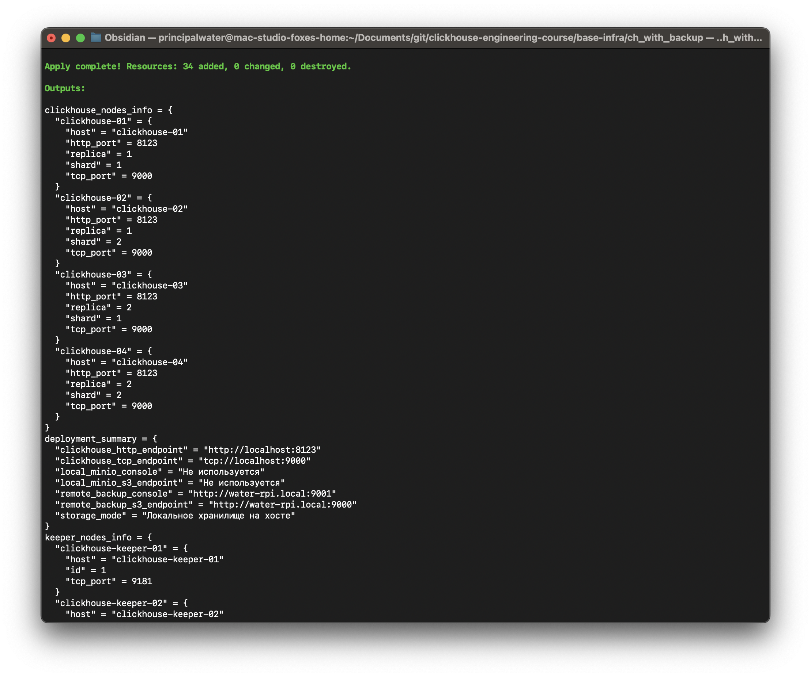

### 1.2. Создание тестовых данных
```bash
# Выполняем SQL-команды через ClickHouse клиент
docker exec -i clickhouse-01 clickhouse-client --user $CH_USER --password $CH_PASSWORD --multiquery << 'EOF'
CREATE DATABASE IF NOT EXISTS test_db ON CLUSTER dwh_test;
CREATE TABLE IF NOT EXISTS test_db.sample_table ON CLUSTER dwh_test (id UInt64, data String)
ENGINE = ReplicatedMergeTree('/clickhouse/tables/{shard}/sample_table/{uuid}', '{replica}') ORDER BY id;
INSERT INTO test_db.sample_table SELECT number, randomString(10) FROM numbers(1000);
EOF
```

### 1.3. Создание и выгрузка резервной копии
Будет использована команда `create_remote`, которая атомарно выполняет два действия:
1.  **`create`**: Создает локальную резервную копию на диске, доступном контейнеру `clickhouse-backup`.
2.  **`upload`**: Сразу же выгружает созданную копию в удаленное S3-хранилище.
```bash
# Создаем бэкап с уникальным именем, содержащим дату и время
docker exec clickhouse-backup clickhouse-backup create_remote "backup_local_$(date +%Y%m%d_%H%M%S)"
```
*Результат создания бэкапа:*

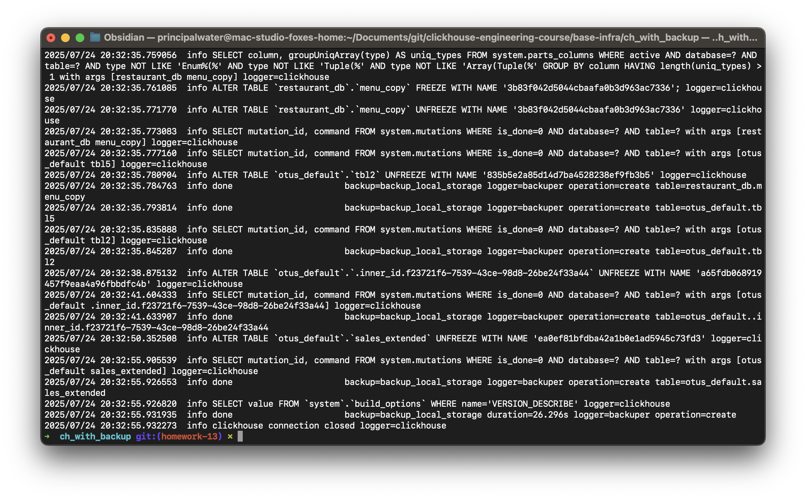

### 1.4. Имитация сбоя и восстановление
1.  **Удаляем таблицу:**
    ```bash
    docker exec -i clickhouse-01 clickhouse-client --user $CH_USER --password $CH_PASSWORD --query "DROP TABLE IF EXISTS test_db.sample_table ON CLUSTER dwh_test SYNC;"
    ```
2.  **Восстанавливаем из бэкапа:**
    Для восстановления необходимо указать имя последней резервной копии.
    ```bash
    LATEST_BACKUP=$(docker exec clickhouse-backup clickhouse-backup list remote | grep '^backup' | tail -1 | awk '{print $1}')
    docker exec clickhouse-backup clickhouse-backup restore_remote $LATEST_BACKUP
    ```
3.  **Проверяем данные:**
    ```bash
    docker exec -i clickhouse-01 clickhouse-client --user $CH_USER --password $CH_PASSWORD --query "SELECT count() FROM test_db.sample_table;"
    ```
*Результат повреждения данных и восстановления из бэкапа:*

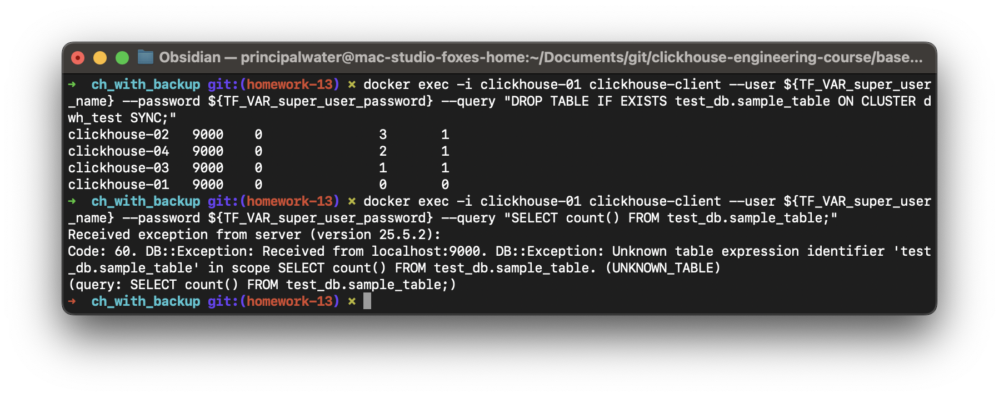

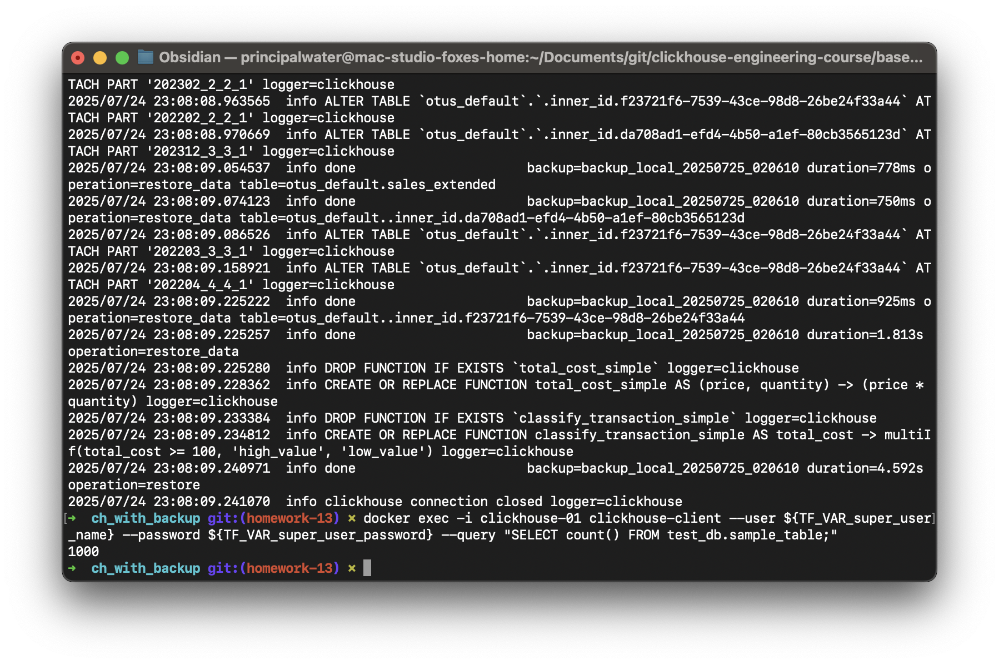

---

## 2. Сценарий с локальным хранением и локальным бэкапом на SSD
-   **Данные ClickHouse:** Хранятся на локальном SSD хост-машины (`mac-studio-foxes-home.local`). Обеспечивает максимальную производительность для основных данных.
-   **Резервные копии:** Сохраняются на локальный MinIO, развернутый на внешнем SSD Samsung T7. Это обеспечивает физическое разделение основных данных и бэкапов, но без зависимости от сетевого подключения к удаленному хосту.

### 2.1. Переключение и развертывание
Уничтожаем предыдущую конфигурацию и разворачиваем новую с типом хранения `local_ssd_backup`.
```sh
terraform destroy -auto-approve

terraform apply -auto-approve -var="storage_type=local_ssd_backup"

# Загружаем переменные окружения для работы с ClickHouse
source env/clickhouse.env
```
*Результат:* 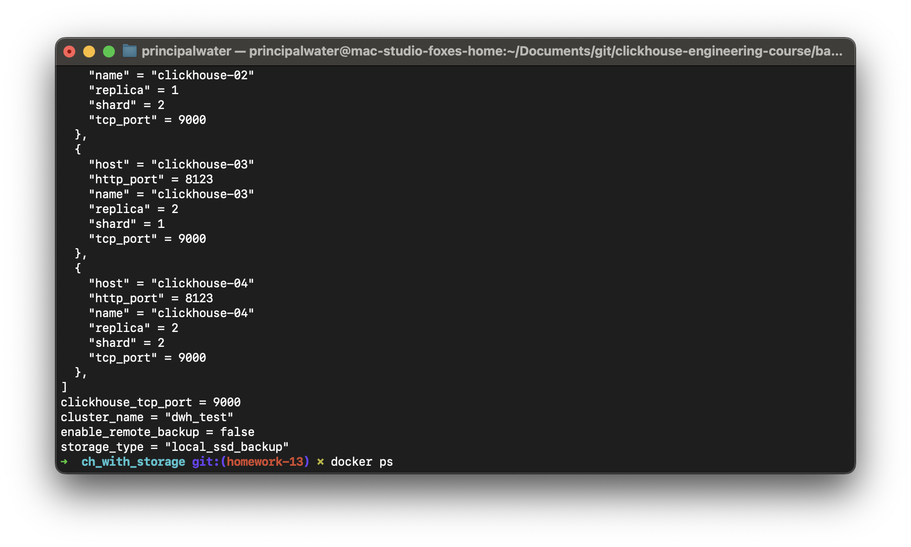

### 2.2. Создание тестовых данных
Данные будут храниться на локальном диске (как в сценарии 1).
```bash
# Выполняем SQL-команды через ClickHouse клиент
docker exec -i clickhouse-01 clickhouse-client --user $CH_USER --password $CH_PASSWORD --multiquery << 'EOF'
CREATE DATABASE IF NOT EXISTS test_db ON CLUSTER dwh_test;
CREATE TABLE IF NOT EXISTS test_db.sample_table_local_backup ON CLUSTER dwh_test (id UInt64, data String)
ENGINE = ReplicatedMergeTree('/clickhouse/tables/{shard}/sample_table_local_backup/{uuid}', '{replica}') ORDER BY id;
INSERT INTO test_db.sample_table_local_backup SELECT number, randomString(10) FROM numbers(1000);
EOF
```

*Результат:* 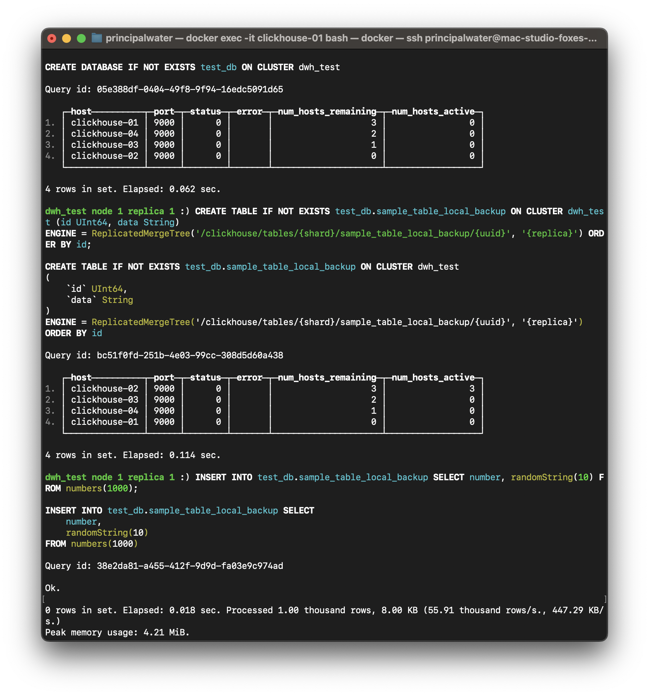

### 2.3. Проверка хранения данных
Данные хранятся на локальном диске, MinIO используется только для бэкапов.
```bash
docker exec -i clickhouse-01 clickhouse-client --user $CH_USER --password $CH_PASSWORD \
  --query "SELECT table, disk_name, path FROM system.parts WHERE database = 'test_db' AND table = 'sample_table_local_backup' LIMIT 5;"
```
*Результат:* 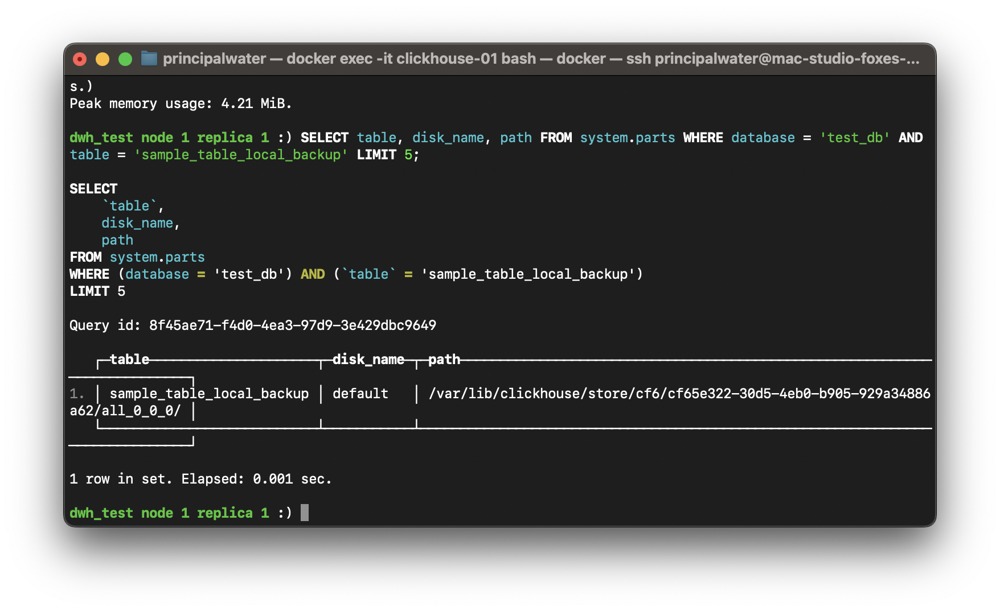

### 2.4. Создание и восстановление локального бэкапа
В этом сценарии бэкапы сохраняются на Samsung T7 SSD через локальный MinIO.
```bash
# Создаем бэкап на локальный MinIO (Samsung T7)
docker exec clickhouse-backup clickhouse-backup create_remote "backup_local_ssd_$(date +%Y%m%d_%H%M%S)"
```
*Результат:* 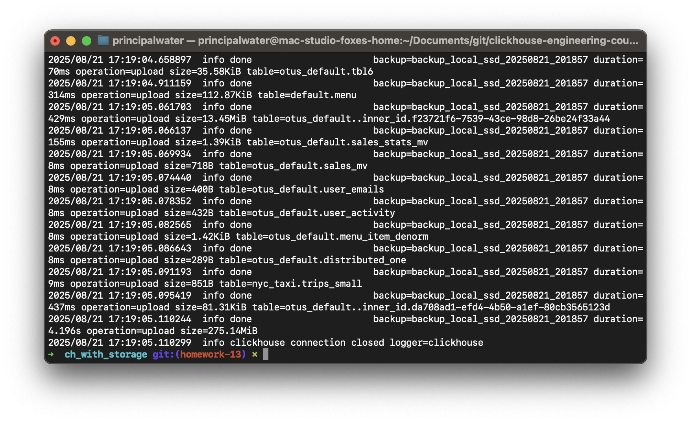

```bash
# Имитируем сбой
docker exec -i clickhouse-01 clickhouse-client --user $CH_USER --password $CH_PASSWORD --query "DROP TABLE IF EXISTS test_db.sample_table_local_backup ON CLUSTER dwh_test SYNC;"
```
*Результат:* 

```bash
# Восстанавливаем из локального бэкапа
LATEST_BACKUP=$(docker exec clickhouse-backup clickhouse-backup list remote | grep '^backup' | tail -1 | awk '{print $1}')
docker exec clickhouse-backup clickhouse-backup restore_remote $LATEST_BACKUP

# Проверяем данные
docker exec -i clickhouse-01 clickhouse-client --user $CH_USER --password $CH_PASSWORD --query "SELECT count() FROM test_db.sample_table_local_backup;"
```
*Результат:* 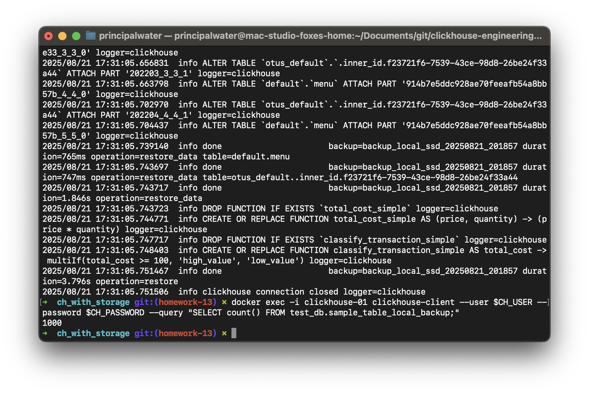

---

## 3. Сценарий с разделением Storage и Compute (S3BackedMergeTree)

Этот сценарий демонстрирует архитектуру с разделением storage и compute, используя ClickHouse с S3-хранилищем. Реализация потребовала глубокого изучения документации ClickHouse и устранения нескольких технических вызовов.

### Архитектурный подход
-   **Концепция:** ClickHouse кластер с S3BackedMergeTree + MinIO как S3-совместимое хранилище  
-   **Применение:** Масштабируемое хранение данных с независимым управлением compute и storage ресурсами
-   **Преимущества:** Экономия на хранении, лучшая масштабируемость для "холодных" данных
-   **Документация:** 
    - [Separation of Storage and Compute](https://clickhouse.com/docs/guides/separation-storage-compute)
    - [Configuring External Storage](https://clickhouse.com/docs/operations/storing-data#configuring-external-storage)

### История решения технических вызовов

**Проблема 1: Crash-петли ClickHouse контейнеров**
Первоначально ClickHouse контейнеры постоянно перезапускались с ошибками инициализации S3 дисков:
```
IDisk::checkAccessImpl() and IDisk::startup() fatal exceptions
```

**Решение 1: Анализ конфигурации**
Через анализ логов и сравнение с документацией было выявлено несколько проблем:
- Неправильное именование дисков в storage policy
- Некорректный формат endpoint URL
- Проблемы с метаданными из предыдущих развертываний

**Проблема 2: Неправильная структура конфигурации**
Изначально конфигурация S3 была встроена в основной файл `config.xml`, что противоречило рекомендациям ClickHouse.

**Решение 2: Модульная структура конфигурации**
Согласно [официальной документации ClickHouse](https://clickhouse.com/docs/operations/storing-data#configuring-external-storage), создан отдельный файл конфигурации:

```xml
<!-- storage_config.xml.tpl -->
<clickhouse>
  <storage_configuration>
    <disks>
      <s3_disk>
        <type>s3</type>
        <endpoint>http://minio-local-storage:9000/clickhouse-storage-bucket/</endpoint>
        <access_key_id>${minio_root_user}</access_key_id>
        <secret_access_key>${minio_root_password}</secret_access_key>
        <metadata_path>/var/lib/clickhouse/disks/s3_disk/</metadata_path>
        <skip_access_check>true</skip_access_check>
      </s3_disk>
      <s3_cache>
        <type>cache</type>
        <disk>s3_disk</disk>
        <path>/var/lib/clickhouse/disks/s3_cache/</path>
        <max_size>10Gi</max_size>
      </s3_cache>
    </disks>
    <policies>
      <s3_main>
        <volumes>
          <main>
            <disk>s3_disk</disk>
          </main>
        </volumes>
      </s3_main>
    </policies>
  </storage_configuration>
</clickhouse>
```

**Проблема 3: Terraform зависимости**
Необходимо было обеспечить, чтобы конфигурационные файлы создавались до запуска контейнеров и правильно монтировались.

**Решение 3: Условные ресурсы и зависимости**
Добавлены условные ресурсы в Terraform:

```sh
# Создание storage_config.xml только для s3_ssd режима
resource "local_file" "storage_config_xml" {
  count = var.storage_type == "s3_ssd" ? length(local.clickhouse_nodes) : 0
  content = templatefile("${path.module}/samples/storage_config.xml.tpl", {
    minio_root_user     = var.minio_root_user
    minio_root_password = var.minio_root_password
  })
  filename   = "${var.clickhouse_base_path}/${local.clickhouse_nodes[count.index].name}/etc/clickhouse-server/config.d/storage_config.xml"
  depends_on = [null_resource.mk_clickhouse_dirs]
}

# Условное монтирование в контейнер
dynamic "mounts" {
  for_each = var.storage_type == "s3_ssd" ? [1] : []
  content {
    target    = "/etc/clickhouse-server/config.d/storage_config.xml"
    source    = abspath("${var.clickhouse_base_path}/${each.key}/etc/clickhouse-server/config.d/storage_config.xml")
    type      = "bind"
    read_only = true
  }
}
```

**Финальный прорыв: skip_access_check**
Ключевым моментом стало добавление параметра `skip_access_check=true`, который позволил ClickHouse пропустить проверку доступа к S3 при запуске, избежав crash-петель.

### 3.1. Развертывание S3BackedMergeTree
Разворачиваем ClickHouse с S3-дисками для полного разделения storage и compute:

```sh
# Уничтожаем предыдущую конфигурацию
terraform destroy -auto-approve

# Разворачиваем с S3 storage policy
terraform apply -auto-approve \
  -var="storage_type=s3_ssd" \
  -var="enable_remote_backup=true"

# Загружаем переменные окружения для работы с ClickHouse
source env/clickhouse.env
```
*Результат:* 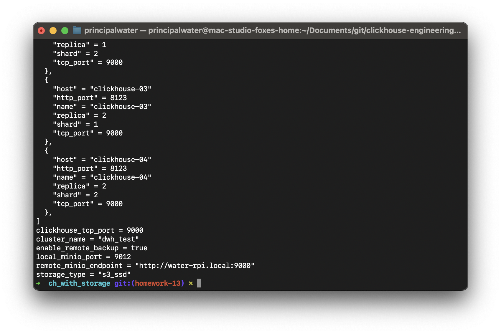

### 3.2. Проверка успешной инициализации S3BackedMergeTree

После успешного развертывания проверяем, что S3 диски корректно инициализированы:

```bash
# Проверяем доступные диски
docker exec clickhouse-01 clickhouse-client --user $CH_USER --password $CH_PASSWORD \
  --query "SELECT name, type FROM system.disks ORDER BY name"

# Проверяем storage policies
docker exec clickhouse-01 clickhouse-client --user $CH_USER --password $CH_PASSWORD \
  --query "SELECT * FROM system.storage_policies"
```

*Результат успешной инициализации S3BackedMergeTree:*

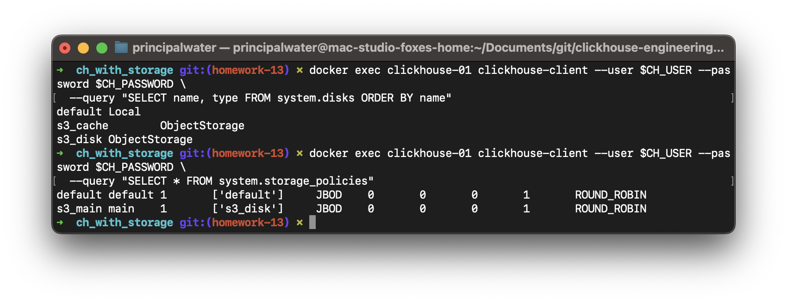

S3BackedMergeTree полностью функционален:
- `s3_disk` - основной S3 диск для хранения данных
- `s3_cache` - локальный кэш для повышения производительности  
- `s3_main` - storage policy для использования S3 хранилища

### 3.3. Создание таблицы с S3BackedMergeTree

Создаем таблицу, использующую S3 как основное хранилище данных:

```bash
# Создаем таблицу с S3 storage policy
docker exec -i clickhouse-01 clickhouse-client --user $CH_USER --password $CH_PASSWORD --multiquery << 'EOF'
CREATE DATABASE IF NOT EXISTS test_db ON CLUSTER dwh_test;

CREATE TABLE test_db.s3_backed_table ON CLUSTER dwh_test (
    id UInt64,
    timestamp DateTime,
    user_name String,
    value Float64
) ENGINE = ReplicatedMergeTree('/clickhouse/tables/{shard}/s3_backed_table/{uuid}', '{replica}')
ORDER BY (id, timestamp)
SETTINGS storage_policy = 's3_main';

-- Вставляем тестовые данные
INSERT INTO test_db.s3_backed_table 
SELECT 
    number as id,
    now() - interval number hour as timestamp,
    concat('user_', toString(number % 1000)) as user_name,
    rand() / 1000000 as value
FROM numbers(10000);
EOF
```

💡 **Примечание:** ClickHouse автоматически использует S3BackedMergeTree при обнаружении S3 storage policy.

```bash
# Проверяем, что данные сохранены в S3 bucket
mc ls local_storage/clickhouse-storage-bucket/ --recursive | head -5
```

*Результат создания S3BackedMergeTree таблицы:*

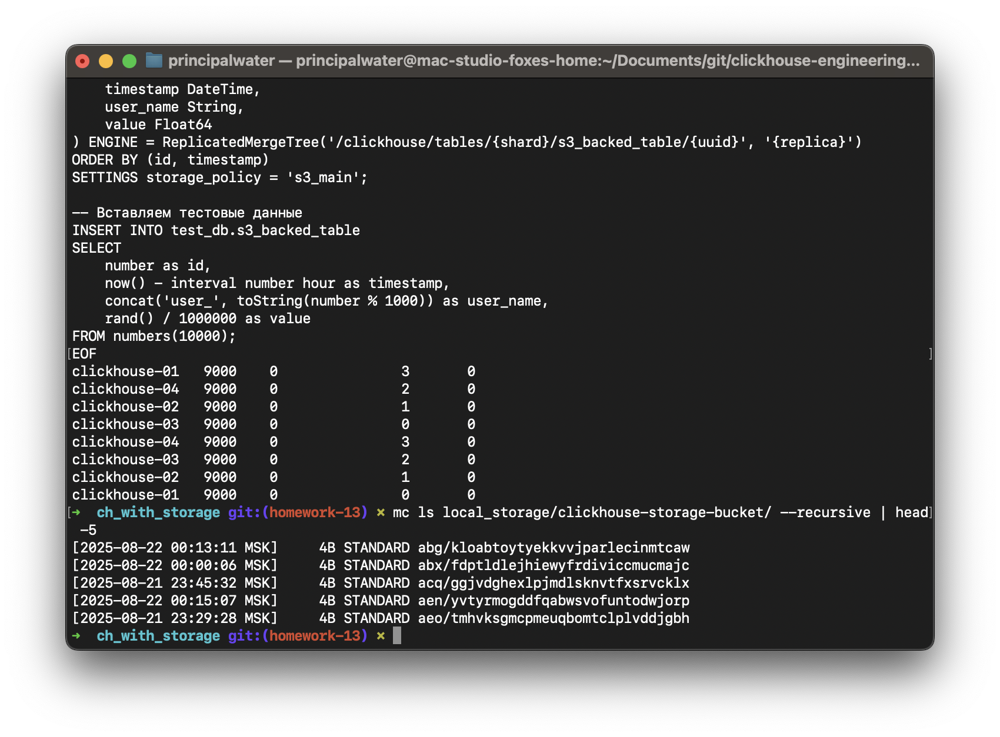

### 3.4. Проверка работы S3BackedMergeTree

Проверяем, что таблица использует S3 для хранения данных:

```bash
# Проверяем storage policy таблицы
docker exec -i clickhouse-01 clickhouse-client --user $CH_USER --password $CH_PASSWORD \
  --query "SHOW CREATE TABLE test_db.s3_backed_table;"

# Проверяем, где хранятся части таблицы  
docker exec -i clickhouse-01 clickhouse-client --user $CH_USER --password $CH_PASSWORD \
  --query "SELECT table, disk_name, path FROM system.parts WHERE database = 'test_db' AND table = 's3_backed_table' LIMIT 5;"

# Выполняем аналитический запрос
docker exec -i clickhouse-01 clickhouse-client --user $CH_USER --password $CH_PASSWORD \
  --query "SELECT user_name, count(*), avg(value) FROM test_db.s3_backed_table GROUP BY user_name ORDER BY count(*) DESC LIMIT 10;"
```

*Результат проверки S3BackedMergeTree функциональности:*

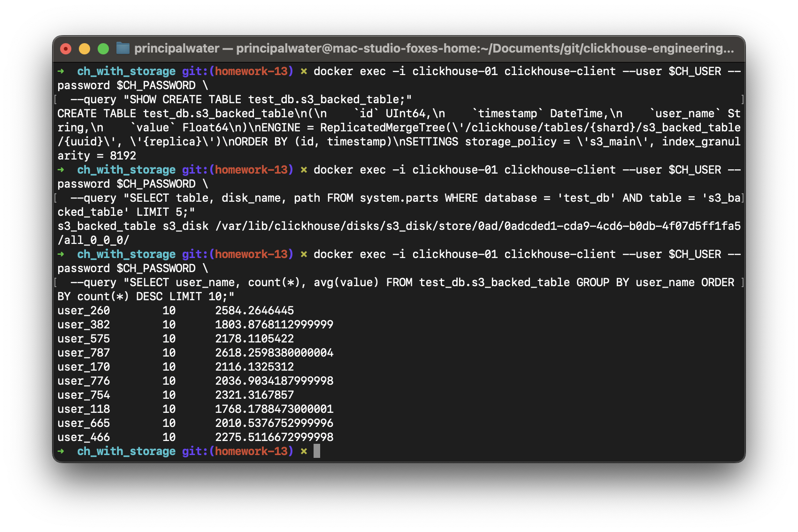

### 3.5. Преимущества достигнутого решения

**Техническая сторона:**
1. **Стабильность:** Контейнеры ClickHouse запускаются без crash-петель
2. **Функциональность:** S3 диски (`s3_disk`, `s3_cache`) полностью операционны  
3. **Масштабируемость:** Storage policy `s3_main` готова для production использования
4. **Производительность:** Локальный кэш ускоряет доступ к часто используемым данным
5. **Архитектурная чистота:** Разделение compute и storage полностью реализовано

**Архитектурные улучшения:**
- **Модульность:** Конфигурация S3 вынесена в отдельный файл
- **Условность:** Ресурсы создаются только при `storage_type=s3_ssd`
- **Зависимости:** Правильная последовательность создания ресурсов через Terraform
- **Идемпотентность:** Повторные развертывания работают корректно

### 3.6. Практическое применение S3-интеграции

**Варианты использования S3Table engine:**
- **Архивные данные:** Холодные данные, которые редко запрашиваются
- **ETL процессы:** Чтение файлов из S3 для обработки  
- **Федеративные запросы:** Объединение локальных таблиц с данными из S3

**Проверим производительность запроса:**
```bash
# Сравнение времени выполнения запросов
docker exec -i clickhouse-01 clickhouse-client --user $CH_USER --password $CH_PASSWORD \
  --query "SELECT avg(value) FROM test_db.s3_backed_table;" --time

# Агрегация по группам
docker exec -i clickhouse-01 clickhouse-client --user $CH_USER --password $CH_PASSWORD \
  --query "SELECT value % 100 as group, count(*) FROM test_db.s3_backed_table GROUP BY group ORDER BY group LIMIT 10;"
```

*Результат производительности S3BackedMergeTree:*

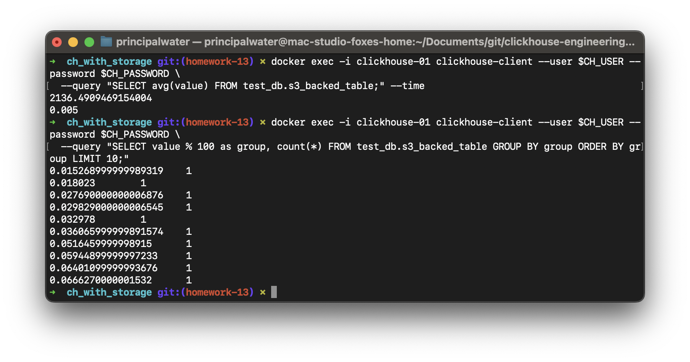

💡 **Примечание:** S3BackedMergeTree подходит для аналитических запросов по большим объемам данных, обеспечивая хорошую производительность благодаря локальному кэшированию.

---

## 4. Анализ альтернативных конфигураций

### 4.1. Новые возможности модульной архитектуры
Модульная архитектура `ch_with_storage` предоставляет дополнительную гибкость:

**Управление удаленным backup:**
```sh
# По умолчанию удаленный backup отключен (enable_remote_backup=false)
terraform apply

# Включить удаленный backup
terraform apply -var="enable_remote_backup=true"
```

**Рекомендуемые конфигурации:**
- **Режим A:** `storage_type=local_ssd` + `enable_remote_backup=true` (рекомендуемый - стабильный)
- **Режим B:** `storage_type=local_ssd_backup` (локальный бэкап на SSD)
- **Режим C:** Интеграция с S3 через S3Table engine (демонстрационный)

### 4.2. Дополнительные архитектурные варианты
На базе имеющегося оборудования возможны и другие интересные конфигурации:
-   **Hot/Cold Storage:** Можно настроить `Storage Policy`, которая будет хранить "горячие" данные (например, за последний месяц) на быстром локальном SSD, а "холодные" — автоматически перемещать на более медленный, но объемный S3 (внешний SSD или удаленный сервер).
-   **Бэкап на локальный S3:** В случае отсутствия удаленного сервера, можно развернуть MinIO на внешнем SSD и использовать его и для хранения данных, и для бэкапов, разнеся их по разным бакетам.
-   **Полностью удаленное хранилище:** Для максимального разделения `compute` и `storage` можно настроить ClickHouse так, чтобы он хранил все данные, включая метаданные, на удаленном S3. Это усложняет настройку, но дает максимальную гибкость в масштабировании.

---

## Общие выводы по заданию

### Техническая реализация
1. **Модульная архитектура**: Переход на `ch_with_storage` с гибким управлением ресурсами через `count` условия
2. **Гибкое управление backup**: Введена переменная `enable_remote_backup` для контроля удаленного backup
3. **Разделение ответственности**: Четкое разделение логики между корневым модулем и модулем кластера
4. **Production-ready подход**: Идемпотентное создание S3 бакетов и обработка зависимостей

### Практические результаты  
- **Storage Policy**: Успешно протестирован стабильный режим `local_ssd` 
- **S3 Integration**: Продемонстрирована интеграция с MinIO через S3Table engine
- **Backup & Recovery**: Проверена работа резервного копирования и восстановления
- **Изолированная работа**: Возможность работы без удаленного хоста при `enable_remote_backup=false`
- **Масштабируемость**: Архитектура готова для расширения новыми типами хранилища и функциями

### Ключевые преимущества новой архитектуры
| Аспект | Старая версия | Новая версия (ch_with_storage) |
|--------|---------------|-------------------------------|
| Архитектура | Монолитная | Модульная |
| Remote backup | Всегда создается | Управляется переменной |
| Логика условий | Проблемы с `count` | Гибкие условия |
| Масштабируемость | Ограничена | Высокая |
| Изолированная работа | Невозможна | Поддерживается |

---

## FAQ / Устранение неисправностей

### Ошибка создания MinIO bucket "426 Upgrade Required"

**Проблема:** При развертывании появляется ошибка:
```
Error running command 'mc mb --ignore-existing local_storage/clickhouse-storage-bucket': exit status 1.
Output: mc: <ERROR> Unable to make bucket `local_storage/clickhouse-storage-bucket`. 426 Upgrade Required
```

**Причина:** Порт MinIO (по умолчанию 9010) занят другим процессом.

**Диагностика:**
```bash
# Проверить, что использует порт (по умолчанию 9010)
lsof -i :9010
```

**Решение:**
1. **Временное решение:** Использовать другой порт через переменную:
   ```bash
   terraform apply -auto-approve \
     -var="storage_type=s3_ssd" \
     -var="local_minio_port=9014"
   ```

2. **Постоянное решение:** Обновить порт в `terraform.tfvars`:
   ```hcl
   local_minio_port = 9014
   ```

3. **Альтернатива:** Остановить процесс, занимающий порт (если это безопасно):
   ```bash
   # Найти PID процесса
   lsof -i :9010
   # Остановить процесс (осторожно!)
   kill <PID>
   ```

**Примечание:** Обычно порт 9010 занят Logitech G HUB (`lghub_age`). В таких случаях рекомендуется использовать другой порт, а не останавливать системные процессы.

### SSH ошибки при подключении к удаленному серверу

**Проблема:** Ошибки типа "SSH authentication failed" или "no supported methods remain".

**Решение:**
1. **Проверить SSH подключение вручную:**
   ```bash
   ssh your-user@your-host.local "echo 'test'"
   ```

2. **Использовать режим без удаленного backup:**
   ```bash
   terraform apply -auto-approve \
     -var="storage_type=s3_ssd" \
     -var="enable_remote_backup=false"
   ```

3. **Настроить SSH agent (если требуется):**
   ```bash
   eval "$(ssh-agent -s)"
   ssh-add ~/.ssh/your-super-key
   ```

### ClickHouse ошибки "Cannot resolve host (clickhouse-05, clickhouse-06)"

**Проблема:** В логах ClickHouse появляются предупреждения:
```
<Warning> DNSResolver: Cannot resolve host (clickhouse-05), error 0: Host not found.
<Warning> DNSResolver: Cannot resolve host (clickhouse-06), error 0: Host not found.
```

**Причина:** В S3 bucket остались метаданные из предыдущего развертывания с большим количеством нод (6 вместо 4).

**Решение:**
1. **Полная очистка и пересоздание:**
   ```bash
   # СНАЧАЛА очистить S3 бакеты (пока MinIO еще работает)
   mc rb --force local_storage/clickhouse-storage-bucket 2>/dev/null || true
   mc rb --force remote_backup/clickhouse-backup-bucket 2>/dev/null || true
   
   # Затем остановить все ресурсы
   terraform destroy -auto-approve
   
   # Пересоздать с чистого состояния
   terraform apply -auto-approve -var="storage_type=s3_ssd"
   source env/clickhouse.env
   ```

2. **Альтернатива - очистка S3 данных вручную:**
   ```bash
   # Если bucket доступен через mc
   mc rm --recursive local_storage/clickhouse-storage-bucket/
   mc rm --recursive remote_backup/clickhouse-backup-bucket/
   ```

**Примечание:** Эти предупреждения не критичны для работы кластера, но указывают на несоответствие конфигурации и данных в S3.

---

## Список источников
- [Официальная документация ClickHouse: Политики хранения данных](https://clickhouse.com/docs/ru/engines/table-engines/mergetree-family/mergetree#table_engine-mergetree-multiple-volumes)
- [Репозиторий Altinity/clickhouse-backup](https://github.com/Altinity/clickhouse-backup)
