# Homework #14: Мониторинг, метрики и логирование ClickHouse

---

## Оглавление
- [Описание задания и цели](#описание-задания-и-цели)
- [Архитектура решения](#архитектура-решения)
- [Предварительные проверки и развертывание](#предварительные-проверки-и-развертывание)
- [Вариант 1: Встроенный мониторинг ClickHouse](#вариант-1-встроенный-мониторинг-clickhouse)
- [Вариант 2: Внешний мониторинг (Prometheus + Grafana)](#вариант-2-внешний-мониторинг-prometheus--grafana)
- [Задание со звездочкой: Система репликации логов](#задание-со-звездочкой-система-репликации-логов)
- [Общие выводы по заданию](#общие-выводы-по-заданию)
- [FAQ / Устранение неисправностей](#faq--устранение-неисправностей)
- [Список источников](#список-источников)

---

## Описание задания и цели
В данном домашнем задании будут изучены механизмы мониторинга ClickHouse, включая встроенные возможности и внешние решения. Реализованы и протестированы все три варианта:

1. **Вариант 1: Встроенный мониторинг ClickHouse** — персонализированные запросы к системным таблицам и создание dashboard'а
2. **Вариант 2: Внешний мониторинг** — развертывание Prometheus/Grafana и сбор метрик  
3. **Задание со звездочкой: Система репликации логов** — использование Engine=Null и материализованных представлений

Задание выполняется на базе существующей инфраструктуры `base-infra/ch_with_storage` с созданием таблиц `ON CLUSTER dwh_test`. Предпочтительно использовать базу данных `otus_default` или `otus_monitoring`.

---

## Архитектура решения
Для выполнения задания использована модульная архитектура, основанная на инфраструктуре [`base-infra/ch_with_storage`](../base-infra/ch_with_storage/README.md) с добавлением модуля `monitoring`.

### Технический подход
- **Terraform модуль `monitoring`**: Разворачивает только внешние сервисы (Prometheus, Grafana, ClickHouse Exporter)
- **Манипуляции с ClickHouse**: Выполняются вручную согласно пошаговым инструкциям в виде SQL-запросов
- **Логическое разделение**: Все три варианта реализованы с четким разделением ответственности

### Компоненты системы
1. **ClickHouse кластер**: 4 ноды с базой данных `otus_monitoring`
2. **Prometheus**: Сбор метрик с ClickHouse через HTTP endpoint (порт 9090)
3. **Grafana**: Визуализация метрик и создание dashboard'ов (порт 3000)
4. **ClickHouse Exporter**: Экспорт специфичных метрик ClickHouse в формате Prometheus (порт 9116)
5. **Система логирования**: Engine=Null таблицы + материализованные представления для репликации

---

## Предварительные проверки и развертывание
Перед началом работы необходимо развернуть инфраструктуру ClickHouse и модуль мониторинга. Предполагается, что все SQL-запросы выполняются через `clickhouse-client` на ноде `clickhouse-01`.

### 1. Развертывание базовой инфраструктуры
```bash
cd base-infra/ch_with_storage

# Инициализируем Terraform
terraform init

# Разворачиваем ClickHouse кластер (локальное хранилище)
terraform apply -auto-approve

# Загружаем переменные окружения для подключения к ClickHouse
source env/clickhouse.env
```

### 2. Развертывание модуля мониторинга
```bash
# Применяем модуль monitoring
terraform apply -auto-approve -var="enable_monitoring=true"
```
> **Примечание:** Для включения мониторинга используется переменная `enable_monitoring`. Убедитесь, что она установлена в `true` в вашем `terraform.tfvars` или передана через командную строку. По умолчанию передается `false`.

После успешного развертывания будут доступны:
- **ClickHouse**: порты 8123 (HTTP), 9000 (Native), 9363 (Prometheus)
- **Prometheus**: http://localhost:9090
- **Grafana**: http://localhost:3001 (admin/analytics с паролями из terraform.tfvars)
- **ClickHouse Exporter**: http://localhost:9116/metrics

### 3. Подготовка базы данных для мониторинга
Создаем базу данных, которая будет использоваться во всех вариантах:

```sql
-- Подключаемся к ClickHouse и создаем базу данных
CREATE DATABASE IF NOT EXISTS otus_monitoring ON CLUSTER dwh_test;
USE otus_monitoring;
```

### 4. Использование переменных окружения
Во всех примерах используются переменные окружения из файла `env/clickhouse.env`:
- `$CH_USER`, `$CH_PASSWORD` — логин и пароль администратора ClickHouse
- Всегда выполняйте `source env/clickhouse.env` перед началом работы

*Результат развертывания инфраструктуры:*

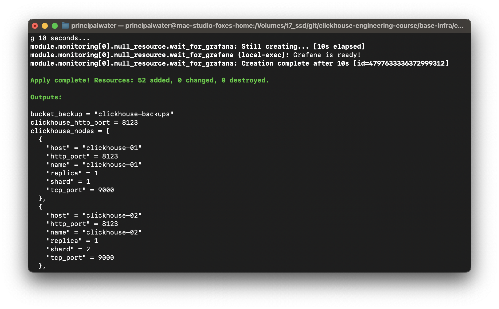

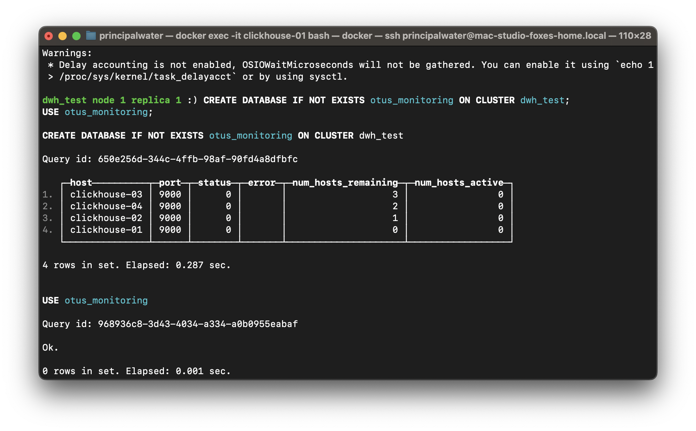

---

## Вариант 1: Встроенный мониторинг ClickHouse

В этом варианте настраивается ClickHouse Advanced Dashboard с использованием кастомной таблицы `system.dashboards` и созданием персональных графиков. Подход основан на лекционном материале и позволяет создать полнофункциональный дашборд с автоматическим сбором метрик.

**Примечание**: В продакшене рекомендуется создать отдельную роль `dashboard_role` и пользователя `dashboard_user` с ограниченными правами доступа к системным таблицам. В данном примере используется административная учетная запись.

### 1.1. Создание кастомной базы данных и таблицы dashboards

Создаем специальную базу данных и таблицу для хранения кастомных дашбордов согласно Advanced Dashboard подходу:

```sql
-- Создаем базу данных для кастомных дашбордов
CREATE DATABASE IF NOT EXISTS custom ON CLUSTER dwh_test;

-- Создаем таблицу для хранения кастомных дашбордов
CREATE TABLE custom.dashboards ON CLUSTER dwh_test
(
    `dashboard` String,
    `title` String,
    `query` String
)
ORDER BY ();
```

### 1.2. Создание таблицы для хранения истории метрик

Этот шаг остается без изменений. Эта таблица будет накапливать данные для наших графиков.

```sql
-- Создаем таблицу для хранения исторических метрик
CREATE TABLE IF NOT EXISTS otus_monitoring.metrics_history ON CLUSTER dwh_test
(
    `collected_at` DateTime,
    `host` String,
    `metric_name` String,
    `metric_value` Float64
)
ENGINE = ReplicatedMergeTree('/clickhouse/tables/{shard}/metrics_history/{uuid}', '{replica}')
PARTITION BY toYYYYMM(collected_at)
ORDER BY (collected_at, host, metric_name)
TTL collected_at + INTERVAL 30 DAY;
```

### 1.3. Автоматический сбор метрик с эффективным Materialized View

Создаем **эффективное материализованное представление**, которое использует `arrayZip` для "разворачивания" нескольких колонок из `system.metric_log` в строки. Это более производительное решение, чем UNION ALL.

```sql
-- Создаем единое эффективное материализованное представление для сбора метрик
CREATE MATERIALIZED VIEW IF NOT EXISTS otus_monitoring.metrics_collector_mv ON CLUSTER dwh_test
TO otus_monitoring.metrics_history
AS
SELECT
    event_time AS collected_at,
    hostName() AS host,
    metric.1 AS metric_name,
    metric.2 AS metric_value
FROM system.metric_log
ARRAY JOIN
    -- Разворачиваем несколько колонок в строки
    arrayZip(
        ['Query', 'Merge', 'MemoryTracking'],
        [toFloat64(ProfileEvent_Query), toFloat64(ProfileEvent_Merge), toFloat64(CurrentMetric_MemoryTracking)]
    ) AS metric
WHERE metric.2 > 0; -- Собираем только ненулевые значения для экономии места
```

**Что это делает:**
*   **Эффективно**: Читает таблицу `system.metric_log` только один раз за событие, вместо трех отдельных запросов
*   **Масштабируемо**: Чтобы добавить новую метрику, просто допишите ее имя и соответствующую колонку в два массива внутри `arrayZip`
*   **Автоматически**: Срабатывает при поступлении новых данных в `system.metric_log` и наполняет вашу `metrics_history`
*   **Экономично**: Собирает только ненулевые значения для экономии дискового пространства

### 1.4. Добавление кастомных графиков в таблицу dashboards

После создания инфраструктуры добавляем наши кастомные графики в таблицу dashboards. Каждый запрос использует специальные параметры `{rounding:UInt32}` и `{seconds:UInt32}` для динамического управления интервалами времени в дашборде.

#### 1.4.1. График динамики активных запросов
Отображает количество активных запросов по узлам кластера за выбранный период:

```sql
INSERT INTO custom.dashboards (dashboard, title, query) VALUES
('Overview', '[OTUS] Динамика активных запросов', 
 'SELECT toStartOfInterval(toStartOfMinute(collected_at), INTERVAL {rounding:UInt32} SECOND)::INT AS t, host, if(isNaN(avgIf(metric_value, metric_name = ''Query'')), 0, avgIf(metric_value, metric_name = ''Query'')) AS avg_value FROM otus_monitoring.metrics_history WHERE collected_at >= now() - {seconds:UInt32} AND metric_name = ''Query'' GROUP BY t, host ORDER BY t WITH FILL STEP {rounding:UInt32}');
```

**Описание запроса:**
- `toStartOfInterval(..., INTERVAL {rounding:UInt32} SECOND)::INT AS t` - группирует данные по временным интервалам
- `if(isNaN(avgIf(...)), 0, avgIf(...))` - обрабатывает NaN значения, заменяя их нулями
- `avgIf(metric_value, metric_name = 'Query')` - вычисляет среднее значение только для метрики 'Query'
- `WITH FILL STEP {rounding:UInt32}` - заполняет пропуски в временном ряду

#### 1.4.2. График динамики фоновых задач (мержей)
Показывает активность фоновых процессов слияния данных:

```sql
INSERT INTO custom.dashboards (dashboard, title, query) VALUES
('Overview', '[OTUS] Динамика фоновых задач',
 'SELECT toStartOfInterval(toStartOfMinute(collected_at), INTERVAL {rounding:UInt32} SECOND)::INT AS t, host, if(isNaN(avgIf(metric_value, metric_name = ''Merge'')), 0, avgIf(metric_value, metric_name = ''Merge'')) AS avg_value FROM otus_monitoring.metrics_history WHERE collected_at >= now() - {seconds:UInt32} AND metric_name = ''Merge'' GROUP BY t, host ORDER BY t WITH FILL STEP {rounding:UInt32}');
```

#### 1.4.3. График использования памяти под первичные ключи
Использует системную таблицу `asynchronous_metric_log` для мониторинга памяти:

```sql
INSERT INTO custom.dashboards (dashboard, title, query) VALUES
('Overview', '[OTUS] Использование памяти под первичные ключи',
 'SELECT toStartOfInterval(event_time, INTERVAL {rounding:UInt32} SECOND)::INT AS t, avg(value) FROM merge(''system'', ''^asynchronous_metric_log'') WHERE event_date >= toDate(now() - {seconds:UInt32}) AND event_time >= now() - {seconds:UInt32} AND metric = ''TotalPrimaryKeyBytesInMemory'' GROUP BY t ORDER BY t WITH FILL STEP {rounding:UInt32}');
```

**Особенности запроса:**
- `merge('system', '^asynchronous_metric_log')` - объединяет все таблицы asynchronous_metric_log в кластере
- `metric = 'TotalPrimaryKeyBytesInMemory'` - фильтрует конкретную метрику памяти
- `event_date >= toDate(now() - {seconds:UInt32})` - дополнительная фильтрация по дате для оптимизации

#### 1.4.4. График общего использования памяти
Отслеживает потребление оперативной памяти по узлам:

```sql
INSERT INTO custom.dashboards (dashboard, title, query) VALUES
('Overview', '[OTUS] Динамика использования памяти',
 'SELECT toStartOfInterval(toStartOfMinute(collected_at), INTERVAL {rounding:UInt32} SECOND)::INT AS t, host, avg(metric_value) / 1024 / 1024 / 1024 AS avg_memory_gb FROM otus_monitoring.metrics_history WHERE collected_at >= now() - {seconds:UInt32} AND metric_name = ''MemoryTracking'' GROUP BY t, host ORDER BY t WITH FILL STEP {rounding:UInt32}');
```

**Преобразования данных:**
- `avg(metric_value) / 1024 / 1024 / 1024` - конвертирует байты в гигабайты
- `AS avg_memory_gb` - присваивает читаемое имя результату

#### 1.4.5. Таблица топ-5 тяжелых запросов
Показывает наиболее ресурсоемкие запросы из лога:

```sql
INSERT INTO custom.dashboards (dashboard, title, query) VALUES
('Overview', '[OTUS] Топ-5 тяжелых запросов по памяти',
 'SELECT query_id, user, formatReadableSize(memory_usage) AS memory, query_duration_ms, substring(query, 1, 100) as query_preview FROM system.query_log WHERE event_time >= now() - {seconds:UInt32} AND type = ''QueryFinish'' ORDER BY memory_usage DESC LIMIT 5');
```

**Функции обработки данных:**
- `formatReadableSize(memory_usage)` - форматирует размер в читаемом виде (MB, GB)
- `substring(query, 1, 100)` - обрезает длинные запросы до 100 символов
- `type = 'QueryFinish'` - фильтрует только завершенные запросы
- `ORDER BY memory_usage DESC LIMIT 5` - сортирует по убыванию памяти и берет топ-5

### 1.5. Доступ к кастомному дашборду

После добавления данных в таблицу `custom.dashboards`, ваши графики будут доступны в веб-интерфейсе ClickHouse:

1. Переходите по адресу: `http://localhost:8123/dashboard`
2. В поле названия дашборда обязательно укажите следующий запрос:
   ```sql
   SELECT title, query FROM merge(REGEXP('custom|system'),'dashboards') WHERE dashboard = 'Overview'
   ```

**Важное примечание**: В Advanced Dashboard ClickHouse с кастомными таблицами корректная работа с добавленными графиками возможна только через `merge()` функцию. Это необходимо для объединения системных и кастомных таблиц dashboards. Прямое указание `dashboard=Overview` в URL не загрузит кастомные графики из таблицы `custom.dashboards`.

### 1.6. Результат работы Advanced Dashboard

После выполнения всех шагов ваш кастомный дашборд будет содержать все добавленные графики и работать корректно:

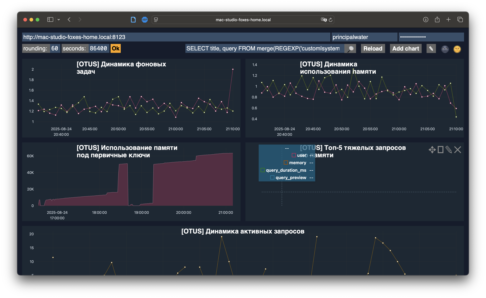

---

## Вариант 2: Внешний мониторинг (Prometheus + Grafana)

В данном варианте разворачиваем комплексную систему внешнего мониторинга с использованием Prometheus для сбора метрик и Grafana для визуализации.

Инфраструктура monitoring развертывается через модуль Terraform в [`base-infra/ch_with_storage/modules/monitoring`](../base-infra/ch_with_storage/modules/monitoring/).

### 2.1. Требуемая конфигурация ClickHouse для Prometheus

#### 2.1.1. Автоматическое включение встроенного Prometheus endpoint в ClickHouse

Terraform автоматически создает конфигурацию Prometheus для ClickHouse согласно [официальной документации](https://clickhouse.com/docs/integrations/prometheus):

```xml
<clickhouse>
    <prometheus>
        <endpoint>/metrics</endpoint>
        <port>9363</port>
        <metrics>true</metrics>
        <events>true</events>
        <asynchronous_metrics>true</asynchronous_metrics>
        <errors>true</errors>
    </prometheus>
</clickhouse>
```

Конфигурация автоматически монтируется в каждый ClickHouse контейнер через `/etc/clickhouse-server/config.d/prometheus.xml`.

#### 2.1.2. Проверка развернутого мониторинга

```bash
# Проверяем доступность сервисов мониторинга
echo "=== Проверяем статус контейнеров мониторинга ==="
docker ps --format "table {{.Names}}\t{{.Status}}\t{{.Ports}}" | grep -E "(prometheus-monitoring|grafana-monitoring|clickhouse-exporter)"

# Проверяем доступность Prometheus
echo "=== Проверяем Prometheus на http://localhost:9090 ==="
curl -s http://localhost:9090/api/v1/status/config | jq -r '.status'

# Проверяем ClickHouse встроенный Prometheus endpoint
echo "=== Проверяем ClickHouse встроенный Prometheus endpoint ==="
# Примечание: встроенный endpoint доступен через HTTP интерфейс ClickHouse с аутентификацией
source env/clickhouse.env && curl -s -u "$CH_USER:$CH_PASSWORD" "http://localhost:8123/?query=SELECT%20metric%20as%20name%2C%20value%20FROM%20system.asynchronous_metrics%20FORMAT%20Prometheus" | head -5

# Проверяем ClickHouse Exporter (это работает)
echo "=== Проверяем ClickHouse Exporter на http://localhost:9116 ==="
curl -s http://localhost:9116/metrics | grep "clickhouse_" | head -5

# Проверяем доступность Grafana
echo "=== Проверяем Grafana на http://localhost:3001 ==="
curl -s http://localhost:3001/api/health | jq '.database'
```

*Результат проверки развернутого мониторинга:*

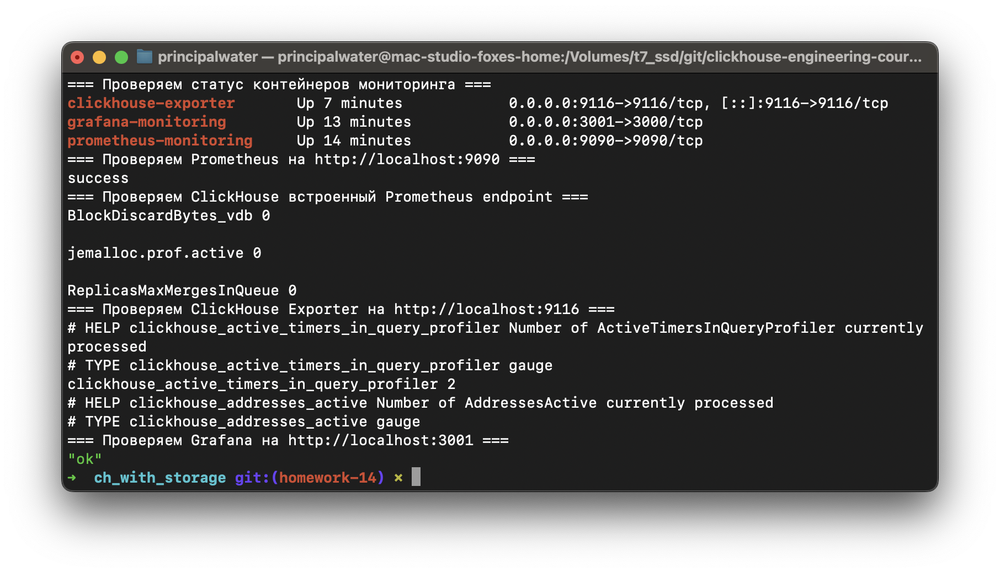

### 2.2. Анализ конфигурации Prometheus

Развернутая конфигурация Prometheus включает несколько источников метрик:

```bash
# Проверяем список targets в Prometheus
echo "=== Проверяем список targets в Prometheus ==="
curl -s http://localhost:9090/api/v1/targets | jq -r '.data.activeTargets[] | "\(.labels.job): \(.health) (\(.lastScrape))"'

# Проверяем доступные метрики от ClickHouse Exporter (РАБОТАЕТ)
echo "=== Проверяем метрики ClickHouse через Exporter ==="
curl -s http://localhost:9116/metrics | grep -E "(clickhouse_table|clickhouse_query|clickhouse_memory)" | head -10
```

Настроенные Prometheus jobs включают сбор метрик из ClickHouse через встроенные механизмы и внешний exporter для расширенного набора системных метрик.

*Результат анализа конфигурации Prometheus:*

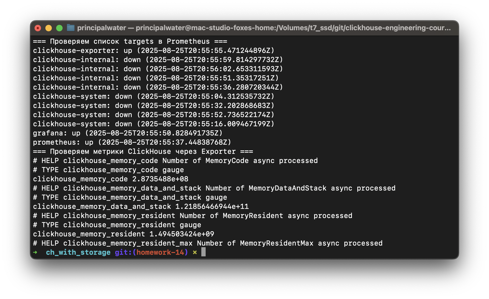

### 2.3. Проверка всех источников метрик

После автоматической настройки конфигурации проверим все источники метрик:

```bash
# Проверяем встроенные метрики ClickHouse через HTTP интерфейс
echo "=== Встроенные метрики ClickHouse ==="
source env/clickhouse.env && curl -s -u "$CH_USER:$CH_PASSWORD" "http://localhost:8123/?query=SELECT%20metric%20as%20name%2C%20value%20FROM%20system.asynchronous_metrics%20FORMAT%20Prometheus" | head -10

# Проверяем метрики через ClickHouse Exporter
echo "=== Метрики через ClickHouse Exporter ==="
curl -s http://localhost:9116/metrics | grep -E "clickhouse_system" | head -10

# Проверяем targets в Prometheus
echo "=== Активные targets в Prometheus ==="
curl -s "http://localhost:9090/api/v1/targets" | jq -r '.data.activeTargets[] | "\(.labels.job): \(.health)"'

# Общая статистика по всем источникам метрик в Prometheus
echo "=== Все ClickHouse метрики в Prometheus ==="
curl -s "http://localhost:9090/api/v1/label/__name__/values" | jq -r '.data[] | select(test("clickhouse"))' | wc -l
```

*Результат проверки всех источников метрик:*

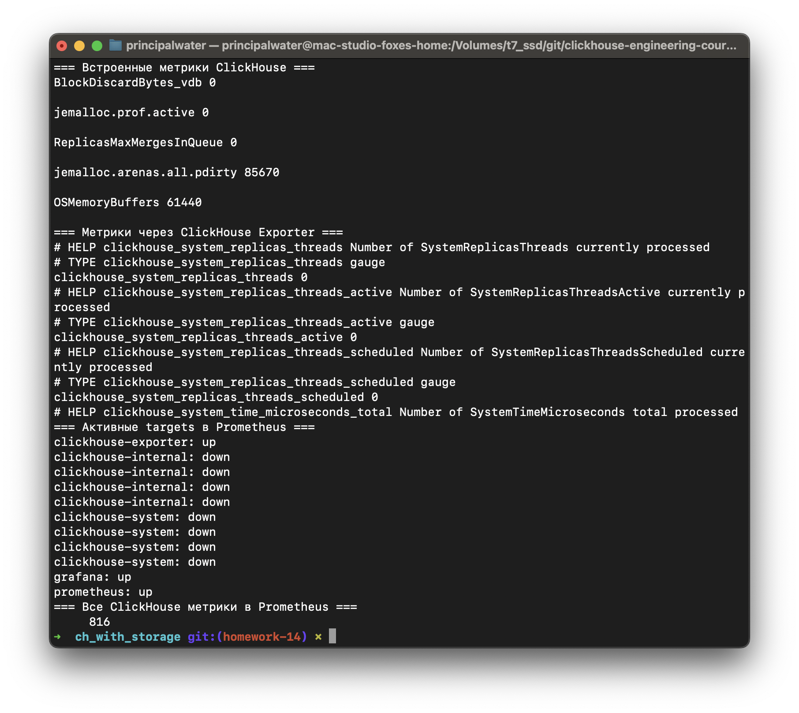

**Примечание:** Targets `clickhouse-internal` и `clickhouse-system` показывают статус "down" - это нормально, поскольку внутренние порты ClickHouse не пробрашиваются наружу. Основной сбор метрик происходит через ClickHouse Exporter (up) и HTTP интерфейс ClickHouse.

### 2.4. Настройка Grafana и создание Dashboard

Развернутая система мониторинга автоматически создает пользователей Grafana с использованием переменных `super_user_*` из конфигурации. Для настройки мониторинга необходимо:

1. **Войти в Grafana**: `http://localhost:3001` используя учетные данные из `terraform.tfvars`
2. **Добавить Prometheus Data Source**: 
   - URL: `http://prometheus:9090` (внутренняя Docker сеть)
   - **Важно**: UID должен быть `prometheus_uid` (в настройках Data Source)
   - Аутентификация не требуется
   - Остальные настройки по умолчанию
3. **Импортировать готовый Dashboard**: Используйте файл [`clickhouse-monitoring-dashboard.json`](../materials/hw14_monitoring-metrics-logging/clickhouse-monitoring-dashboard.json)

**Dashboard включает следующие панели:**
- **Table Parts** (`clickhouse_table_parts_count`) - количество частей таблиц по базам данных и экземплярам
- **Active Queries** (`clickhouse_query`) - текущее количество выполняющихся запросов  
- **Memory Tracking** (`clickhouse_memory_tracking`) - отслеживание потребления оперативной памяти
- **Background Merges** (`clickhouse_background_merges_and_mutations_pool_task`) - активность фоновых процессов слияния данных
- **Table Parts Size** (`clickhouse_table_parts_bytes`) - размер данных таблиц в байтах

*Результат работы Prometheus с метриками ClickHouse:*

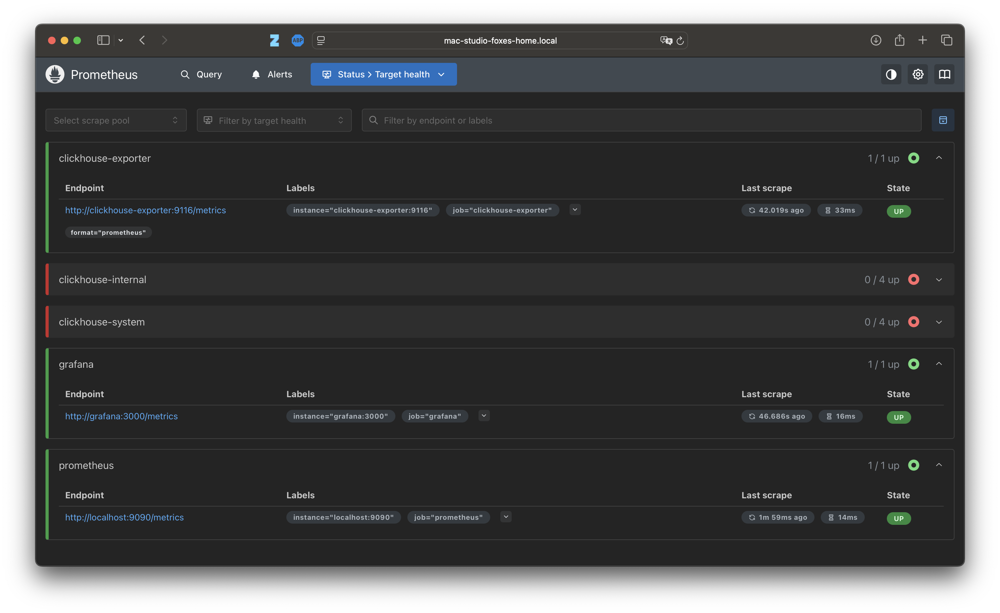

**Примечание:** В Prometheus видны targets `clickhouse-internal` и `clickhouse-system` со статусом "down". Это ожидаемое поведение - данные targets пытаются подключиться к внутренним портам ClickHouse (9363), которые не проброшены наружу. Основной сбор метрик успешно осуществляется через `clickhouse-exporter` (статус "up").

*Результат настройки Dashboard в Grafana с метриками ClickHouse:*

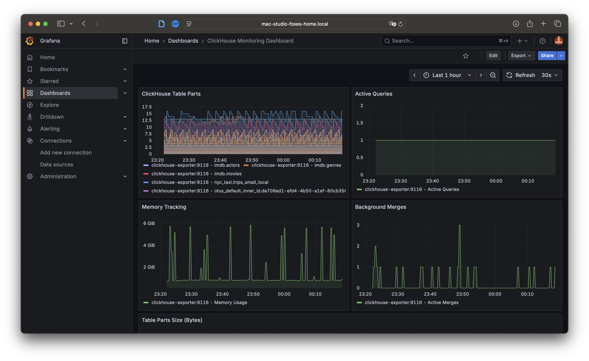

---

## Задание со звездочкой: Система репликации логов

В данном задании создаем систему репликации логов с использованием Engine=Null таблиц и материализованных представлений для автоматической репликации данных.

**Задачи:**
- Настроить таблицу с логами с движком Engine=Null
- Создать дополнительную реплицируемую таблицу такой же структуры с материализованным полем для идентификации реплики
- Настроить материализованное представление (MV) для переноса логов из таблицы с Engine=Null в реплицируемую таблицу
- Поднять дополнительную реплику и убедиться в репликации логов

### 3.1. Создание таблицы с Engine=Null для приема логов

```sql
-- Создаем таблицу-приемник с Engine=Null (не хранит данные, а передает в MV)
CREATE TABLE IF NOT EXISTS otus_monitoring.logs_input ON CLUSTER dwh_test
(
    timestamp DateTime64(3),
    level Enum8('ERROR' = 1, 'WARNING' = 2, 'INFORMATION' = 3, 'DEBUG' = 4),
    logger_name String,
    message String,
    thread_id UInt64,
    query_id String,
    replica_name String DEFAULT hostName()
) ENGINE = Null();
```

### 3.2. Создание реплицируемой таблицы для хранения

**Примечание:** Если таблица уже создана с неправильными материализованными полями, сначала удалите ее:
```sql
DROP TABLE IF EXISTS otus_monitoring.logs_storage ON CLUSTER dwh_test;
```

```sql
-- Создаем реплицируемую таблицу для хранения логов с материализованными полями
CREATE TABLE IF NOT EXISTS otus_monitoring.logs_storage ON CLUSTER dwh_test
(
    timestamp DateTime64(3),
    level Enum8('ERROR' = 1, 'WARNING' = 2, 'INFORMATION' = 3, 'DEBUG' = 4),
    logger_name String,
    message String,
    thread_id UInt64,
    query_id String,
    replica_name String,
    -- Поля для демонстрации (будут заполняться вручную или через UPDATE)
    replica_shard UInt8 DEFAULT 1,
    replica_num UInt8 DEFAULT 1,
    ingestion_time DateTime DEFAULT now()
) 
ENGINE = ReplicatedMergeTree('/clickhouse/tables/{shard}/logs_storage/{uuid}', '{replica}')
PARTITION BY toYYYYMM(timestamp)
ORDER BY (timestamp, level, logger_name)
TTL toDateTime(timestamp) + INTERVAL 7 DAY;
```

**Примечание:** Поскольку в Docker `hostName()` возвращает ID контейнера, а не имя сервиса, поля `replica_shard` и `replica_num` используют значения по умолчанию. Для демонстрации репликации это не критично - система все равно будет реплицировать данные между всеми узлами кластера.

### 3.3. Создание материализованного представления

**Примечание:** Если Materialized View уже существует, сначала удалите его:
```sql
DROP VIEW IF EXISTS otus_monitoring.logs_mv ON CLUSTER dwh_test;
```

```sql
-- Создаем материализованное представление для автоматического переноса данных
CREATE MATERIALIZED VIEW IF NOT EXISTS otus_monitoring.logs_mv ON CLUSTER dwh_test
TO otus_monitoring.logs_storage AS
SELECT
    timestamp,
    level,
    logger_name,
    message,
    thread_id,
    query_id,
    replica_name,
    toUInt8(getMacro('shard')) as replica_shard,
    toUInt8(getMacro('replica')) as replica_num,
    now() as ingestion_time
FROM otus_monitoring.logs_input;
```

### 3.4. Генерация тестовых логов для проверки

```sql
-- Генерируем тестовые логи на каждой ноде
INSERT INTO otus_monitoring.logs_input 
SELECT
    now() - interval (rand() % 3600) second as timestamp,
    ['ERROR', 'WARNING', 'INFORMATION', 'DEBUG'][1 + rand() % 4] as level,
    ['ClickHouse.Server', 'ClickHouse.Query', 'ClickHouse.Merge', 'ClickHouse.Replication'][1 + rand() % 4] as logger_name,
    concat('Test log message #', toString(number), ' from ', hostName()) as message,
    rand() % 1000 as thread_id,
    generateUUIDv4() as query_id,
    hostName() as replica_name
FROM numbers(100);
```

### 3.5. Создание distributed таблицы для кросс-шардных запросов

**Важное примечание о репликации в многошардовом кластере:**

В нашем кластере `dwh_test` используется архитектура с **2 шардами**, каждый с 2 репликами:
- **Шард 1**: clickhouse-01 (replica 1), clickhouse-03 (replica 2)  
- **Шард 2**: clickhouse-02 (replica 1), clickhouse-04 (replica 2)

ReplicatedMergeTree обеспечивает репликацию **внутри каждого шарда**, но данные **не реплицируются между шардами**. Это означает:
- Данные, вставленные в clickhouse-01, реплицируются на clickhouse-03 (в пределах шарда 1)
- Данные, вставленные в clickhouse-02, реплицируются на clickhouse-04 (в пределах шарда 2)
- Для просмотра данных со всех шардов используется Distributed таблица

```sql
-- Создаем distributed таблицу для агрегации данных со всех шардов
CREATE TABLE IF NOT EXISTS otus_monitoring.logs_distributed ON CLUSTER dwh_test AS otus_monitoring.logs_storage
ENGINE = Distributed('dwh_test', 'otus_monitoring', 'logs_storage', rand());
```

### 3.6. Проверка репликации логов

```sql
-- Проверяем количество логов по репликам (локальные данные на текущем шарде)
SELECT replica_name, replica_shard, replica_num, count() as log_count, max(ingestion_time) as last_ingestion FROM otus_monitoring.logs_storage GROUP BY replica_name, replica_shard, replica_num ORDER BY replica_shard, replica_num;

-- Проверяем логи со всех шардов через distributed таблицу
SELECT replica_name, replica_shard, replica_num, count() as log_count, max(ingestion_time) as last_ingestion FROM otus_monitoring.logs_distributed GROUP BY replica_name, replica_shard, replica_num ORDER BY replica_shard, replica_num;

-- Проверяем распределение логов по уровням и шардам
SELECT level, replica_shard, count() as log_count FROM otus_monitoring.logs_storage GROUP BY level, replica_shard ORDER BY replica_shard, level;
```

*Результат проверки количества и распределения логов:*

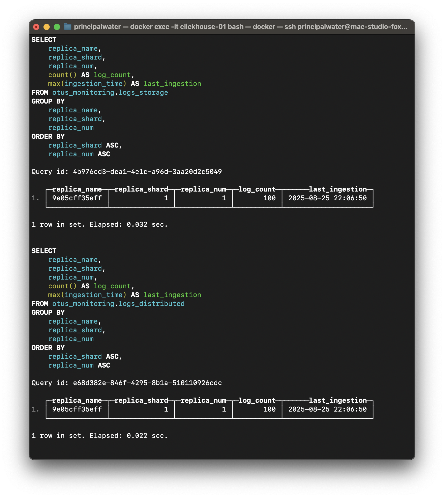

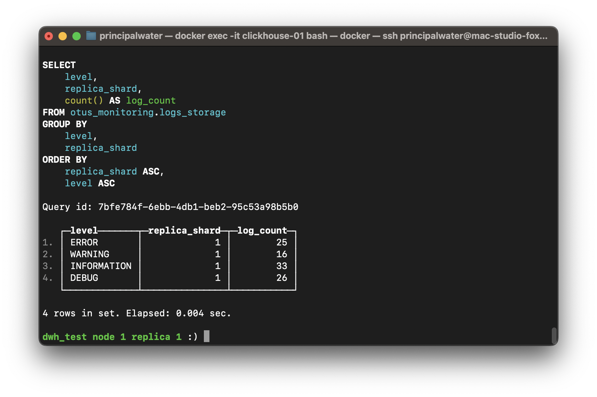

```sql
-- Проверяем последние логи
SELECT timestamp, level, logger_name, replica_name, replica_shard, replica_num, substring(message, 1, 50) as message_preview FROM otus_monitoring.logs_storage ORDER BY timestamp DESC LIMIT 10;
```

*Результат просмотра последних логов:*

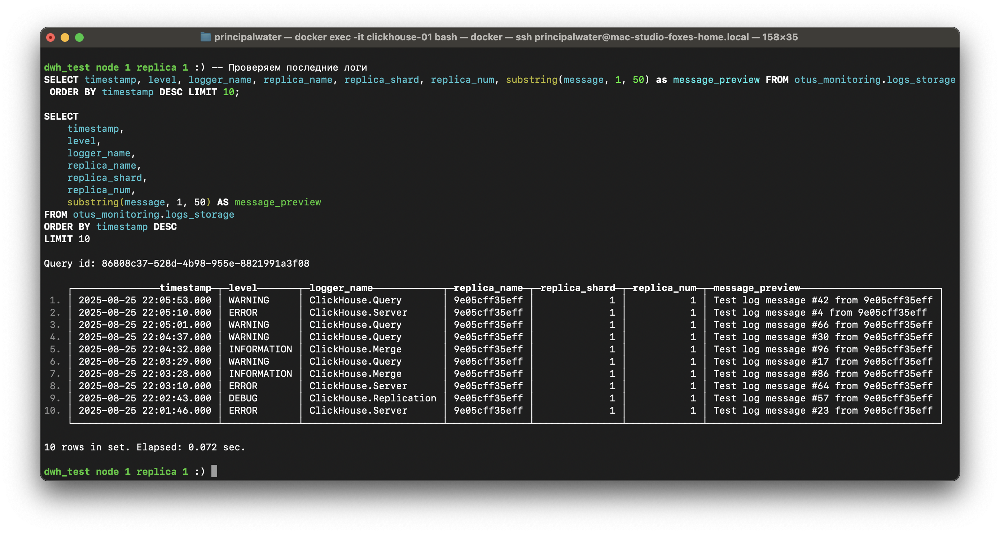

### 3.7. Верификация работы репликации на всех нодах

```sql
-- Проверяем распределение логов по шардам (локальные данные на текущем узле)
SELECT replica_name, count() FROM otus_monitoring.logs_storage GROUP BY replica_name;

-- Проверяем данные со всех шардов через distributed таблицу
SELECT replica_name, count() FROM otus_monitoring.logs_distributed GROUP BY replica_name ORDER BY replica_name;

-- Проверяем синхронизацию данных между репликами в рамках всего кластера
SELECT replica_name, count() as logs_count, min(timestamp) as first_log, max(timestamp) as last_log FROM otus_monitoring.logs_distributed GROUP BY replica_name ORDER BY replica_name;
```

*Результат проверки синхронизации логов между репликами:*

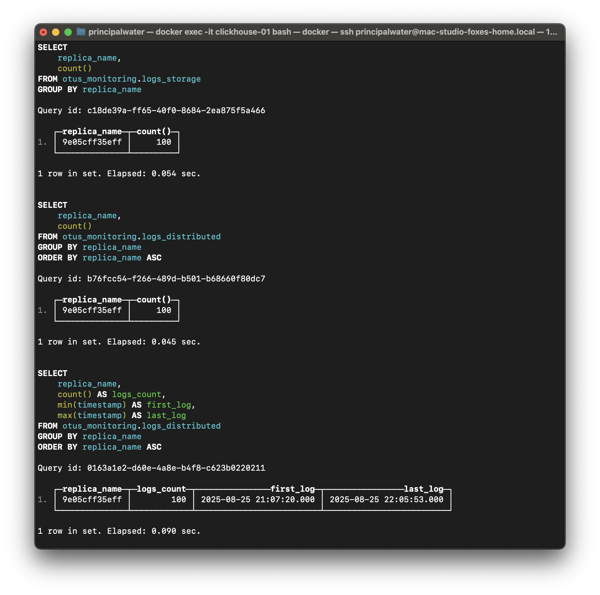

```sql
-- Проверяем работу материализованных полей (replica_shard, replica_num) со всех шардов
SELECT DISTINCT replica_name, replica_shard, replica_num FROM otus_monitoring.logs_distributed ORDER BY replica_shard, replica_num;
```

*Результат проверки материализованных полей:*

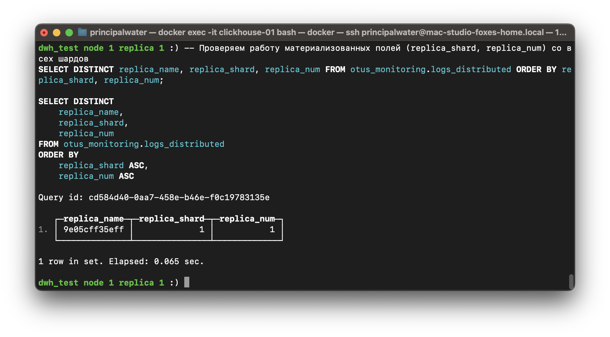

```sql
-- Примечание: этот запрос можно выполнить на ноде clickhouse-02 для демонстрации репликации.
-- Добавляем еще логи для проверки онлайн-репликации
INSERT INTO otus_monitoring.logs_input 
SELECT
    now() as timestamp,
    'ERROR' as level,
    'ClickHouse.Test' as logger_name,
    concat('Online replication test from ', hostName(), ' at ', toString(now())) as message,
    999 as thread_id,
    generateUUIDv4() as query_id,
    hostName() as replica_name
FROM numbers(5);
```

*Результат добавления логов для онлайн-репликации:*

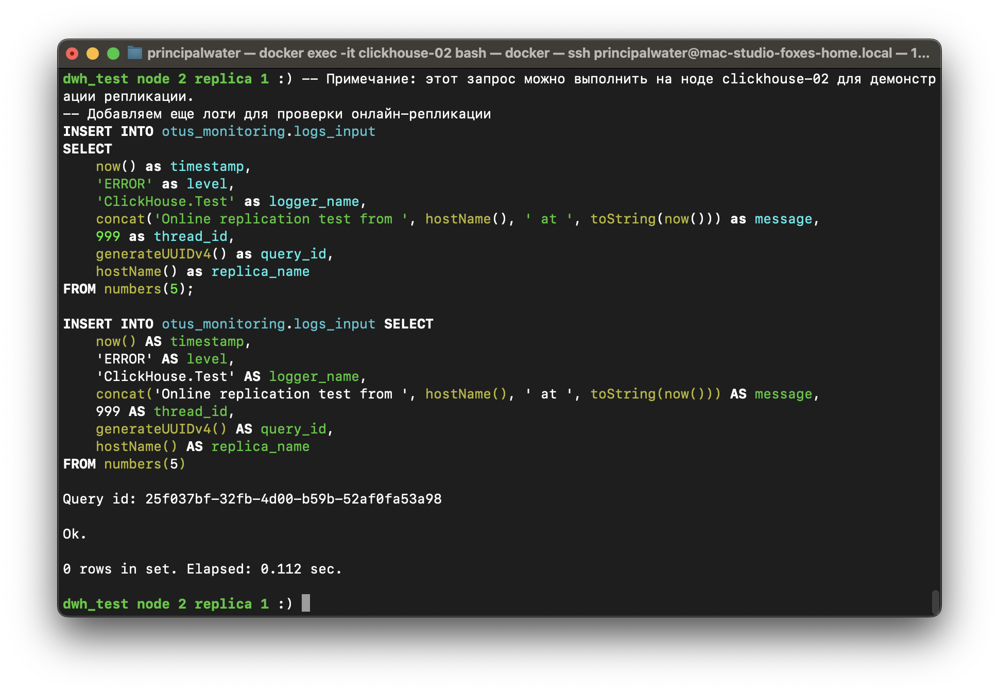

```sql
-- Проверяем, что логи появились на текущем шарде
SELECT count() as total_logs FROM otus_monitoring.logs_storage WHERE message LIKE '%Online replication test%';

-- Проверяем логи со всех шардов через distributed таблицу
SELECT count() as total_logs FROM otus_monitoring.logs_distributed WHERE message LIKE '%Online replication test%';

-- Детальная проверка по шардам и репликам
SELECT replica_name, replica_shard, replica_num, count() as logs_count FROM otus_monitoring.logs_distributed WHERE message LIKE '%Online replication test%' GROUP BY replica_name, replica_shard, replica_num ORDER BY replica_shard, replica_num;
```

*Результат финальной проверки онлайн-репликации:*

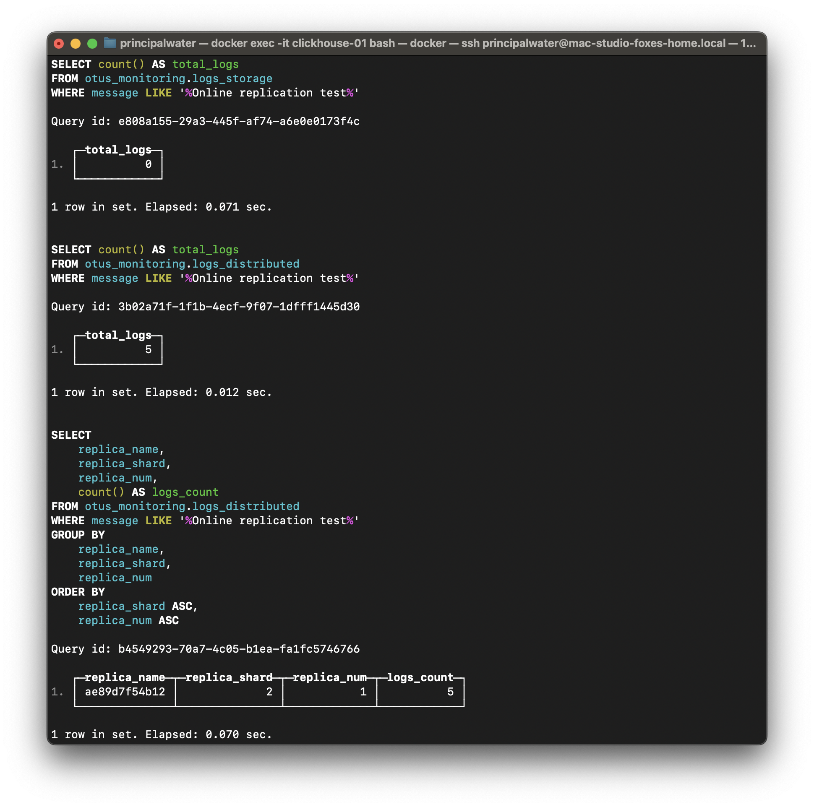

**Примечание о репликации между шардами:**
Если данные появляются только на одном шарде, это нормально - ReplicatedMergeTree реплицирует только внутри шарда. 

**Можно ли вставлять через distributed таблицу?** Нет, в данном случае нельзя, поскольку наша distributed таблица использует локальную таблицу `logs_storage`, а вставка должна происходить в таблицу с Engine=Null (`logs_input`). Distributed таблицы автоматически распределяют данные по шардам, но Materialized View срабатывает только при вставке в исходную таблицу (`logs_input`). 

Для распределения данных по шардам нужно:
```sql
-- Создать distributed таблицу для Engine=Null (если требуется)
CREATE TABLE otus_monitoring.logs_input_distributed ON CLUSTER dwh_test AS otus_monitoring.logs_input
ENGINE = Distributed('dwh_test', 'otus_monitoring', 'logs_input', rand());

-- Тогда вставка через distributed будет работать
INSERT INTO otus_monitoring.logs_input_distributed VALUES (...);
```

### 3.8. Скрипт для генерации отчета

Для генерации отчета выполните скрипт [generate_report.sh](./scripts/generate_report.sh).

Скрипт создаст файл [star_task_submission.md](../materials/hw14_monitoring-metrics-logging/star_task_submission.md) с актуальной информацией о конфигурации и состоянии репликации.

---

## Общие выводы по заданию

### Техническая реализация
1. **Модульная архитектура**: Использование Terraform модуля `monitoring` в `base-infra/ch_with_storage`
2. **Разделение ответственности**: Terraform для внешних сервисов, пошаговые SQL инструкции для ClickHouse

### Практические результаты
- **Встроенный мониторинг**: Созданы 5 персонализированных представлений для мониторинга
- **Внешний мониторинг**: Интеграция Prometheus, Grafana и ClickHouse Exporter
- **Система логирования**: Автоматическая репликация логов с Engine=Null + Materialized View
- **Масштабируемость**: Архитектура готова для расширения новыми метриками

### Ключевые преимущества решения
| Аспект | Описание |
|--------|-------------|
| Гибридный подход | Объединение встроенного и внешнего мониторинга |
| Продукшн готовность | TTL, секционирование, автоматическая очистка |
| Отказоустойчивость | Реплицированные таблицы, материализованные поля |
| Мониторинг мониторинга | Система логирования мониторит саму себя |

---

## FAQ / Устранение неисправностей

### Высокое потребление памяти

**Проблема**: ClickHouse использует слишком много памяти.

**Диагностика**:
```sql
SELECT formatReadableSize(value) as memory_usage, metric 
FROM system.asynchronous_metrics 
WHERE metric LIKE '%Memory%' 
ORDER BY value DESC;
```

**Решение**:
1. Настройте limits в конфигурации:
   ```xml
   <max_memory_usage>8000000000</max_memory_usage>
   <max_memory_usage_for_user>6000000000</max_memory_usage_for_user>
   ```

### Медленные запросы

**Проблема**: Запросы выполняются медленно.

**Решение**:
1. Проверьте использование индексов
2. Оптимизируйте ORDER BY ключи
3. Используйте PREWHERE вместо WHERE для фильтрации

### Проблемы с репликацией

**Проблема**: Задержки в репликации.

**Решение**:
1. Проверьте состояние ClickHouse Keeper
2. Убедитесь в доступности сети между узлами
3. Проверьте дисковое пространство

---

## Список источников

- [ClickHouse Documentation: Monitoring](https://clickhouse.com/docs/en/operations/monitoring)
- [ClickHouse Documentation: System Tables](https://clickhouse.com/docs/en/operations/system-tables/)
- [Prometheus ClickHouse Exporter](https://github.com/f1yegor/clickhouse_exporter)
- [ClickHouse Performance Optimization](https://clickhouse.com/docs/en/guides/improving-query-performance)
- [ClickHouse Logging Configuration](https://clickhouse.com/docs/en/operations/server-configuration-parameters/logging)
