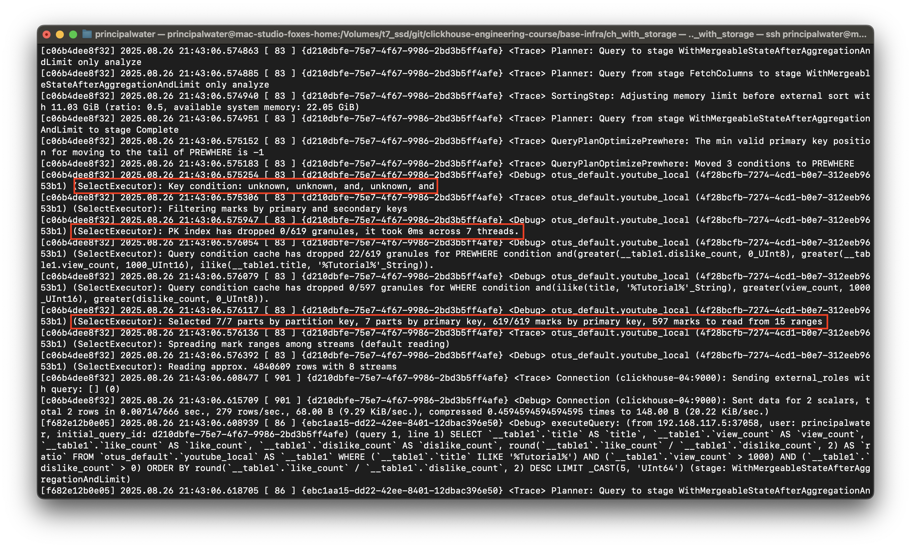

# Homework #15: Профилирование запросов

---

## Оглавление
- [Цель](#цель)
- [Описание](#описание)
- [Предварительные проверки и развертывание](#предварительные-проверки-и-развертывание)
- [1. Подготовка окружения и создание таблиц](#1-подготовка-окружения-и-создание-таблиц)
  - [1.1. Создание локальной таблицы](#11-создание-локальной-таблицы)
  - [1.2. Создание распределенной таблицы](#12-создание-распределенной-таблицы)
- [2. Загрузка данных](#2-загрузка-данных)
- [3. Анализ производительности запросов](#3-анализ-производительности-запросов)
  - [3.1. Запрос без использования первичного ключа](#31-запрос-без-использования-первичного-ключа)
  - [3.2. Запрос с использованием первичного ключа](#32-запрос-с-использованием-первичного-ключа)
- [4. Генерация отчета](#4-генерация-отчета)
- [Выводы](#выводы)
- [Список источников](#список-источников)

---

## Цель

- изучить использование индексов при запросах;
- научиться анализировать текстовые логи запросов;
- овладеть инструментами профилирования запросов в ClickHouse.

## Описание

В этом домашнем задании мы будем использовать датасет [YouTube dataset of dislikes](https://clickhouse.com/docs/en/getting-started/example-datasets/youtube-dislikes) для анализа производительности запросов в ClickHouse. Мы выполним два типа запросов: один с использованием первичного ключа и другой без него. Затем мы сравним их производительность, проанализировав текстовые логи и вывод команды `EXPLAIN`.

---

## Предварительные проверки и развертывание

Для выполнения задания используется инфраструктура `base-infra/ch_with_storage`. Все SQL-запросы выполняются через `clickhouse-client` на ноде `clickhouse-01`.

Сначала развернем наш ClickHouse кластер.

```bash
cd base-infra/ch_with_storage

# Инициализируем Terraform
terraform init

# Разворачиваем ClickHouse кластер
terraform apply -auto-approve

# Загружаем переменные окружения для подключения к ClickHouse
source env/clickhouse.env
```

Теперь подключимся к ноде `clickhouse-01` и запустим `clickhouse-client`. Важно отметить, что здесь мы передаем переменные окружения с хоста в команду `docker exec`.

```bash
docker exec -it clickhouse-01 clickhouse-client -u "$CH_USER" --password "$CH_PASSWORD"
```

> **Важное примечание о конфигурации кластера:**
> В рамках этой работы мы внесли изменение в [конфигурацию кластера (`config.xml.tpl`)](../base-infra/ch_with_storage/modules/clickhouse-cluster/samples/config.xml.tpl), добавив параметр `<internal_replication>true</internal_replication>` для каждого шарда.
>
> **Зачем это нужно?**
> Этот параметр определяет, как `Distributed` таблицы управляют записью и репликацией данных.
>
> -   **`internal_replication = false` (поведение по умолчанию):** `Distributed` таблица сама отправляет данные на **все** реплики указанного шарда. Этот режим используется, если базовые таблицы не реплицируются (например, обычные `MergeTree`).
> -   **`internal_replication = true` (наш случай):** `Distributed` таблица отправляет данные только на **одну** случайную реплику в шарде, а дальнейшее распространение данных на другие реплики этого шарда берет на себя движок `ReplicatedMergeTree`.
>
> Установка этого флага в `true` не только является **рекомендуемой практикой** для работы с `Replicated` таблицами, но и оптимизирует `SELECT` запросы. ClickHouse понимает, что данные на репликах идентичны, и для выполнения запроса обращается только к одной случайной живой реплике каждого шарда, а не ко всем сразу. Это предотвращает дублирование результатов при агрегации (например, при вызове `count()`) и снижает нагрузку на кластер.
>
> 
>
> Подробнее об этом можно прочитать в [официальной документации ClickHouse](https://clickhouse.com/docs/en/engines/table-engines/special/distributed) и [блогах разработчиков](https://orginux.github.io/posts/internal-replication/).

---

### 1. Подготовка окружения и создание таблиц

Будем использовать базу данных `otus_default`, которая уже создана в нашем кластере.

#### 1.1. Создание локальной таблицы

Создадим локальную таблицу `youtube_local` на каждом узле кластера. Она будет использовать `ReplicatedMergeTree` для обеспечения отказоустойчивости в пределах шарда.

```sql
CREATE TABLE IF NOT EXISTS otus_default.youtube_local ON CLUSTER dwh_test
(
    `id` String,
    `fetch_date` DateTime,
    `upload_date_str` String,
    `upload_date` Date,
    `title` String,
    `uploader_id` String,
    `uploader` String,
    `uploader_sub_count` Int64,
    `is_age_limit` Bool,
    `view_count` Int64,
    `like_count` Int64,
    `dislike_count` Int64,
    `is_crawlable` Bool,
    `has_subtitles` Bool,
    `is_ads_enabled` Bool,
    `is_comments_enabled` Bool,
    `description` String,
    `rich_metadata` Array(Tuple(call String, content String, subtitle String, title String, url String)),
    `super_titles` Array(Tuple(text String, url String)),
    `uploader_badges` String,
    `video_badges` String
)
ENGINE = ReplicatedMergeTree('/clickhouse/tables/{shard}/otus_default/youtube_local/{uuid}', '{replica}')
ORDER BY (uploader, upload_date);
```

*Результат выполнения:*


#### 1.2. Создание распределенной таблицы

Теперь создадим распределенную таблицу `youtube`, которая будет смотреть на локальные таблицы на всех шардах кластера. В качестве ключа шардирования будем использовать `toYYYYMM(upload_date)`, чтобы обеспечить логическое разделение данных по месяцам.

```sql
CREATE TABLE IF NOT EXISTS otus_default.youtube ON CLUSTER dwh_test AS otus_default.youtube_local
ENGINE = Distributed('dwh_test', 'otus_default', 'youtube_local', toYYYYMM(upload_date));
```

*Результат выполнения:*


### 2. Загрузка данных

Теперь загрузим данные в распределенную таблицу `youtube`. Мы ограничимся 10 миллионами записей, чтобы избежать возможного превышения настроенных лимитов по памяти.

> **Примечание:** Если вы столкнетесь с ошибкой `MEMORY_LIMIT_EXCEEDED`, это означает, что запрос требует больше оперативной памяти, чем выделено. В этом случае вы можете либо еще уменьшить значение `LIMIT`, либо увеличить лимит памяти для пользователя в `users.xml` или для всего контейнера в пайплайне (через переменную `memory_limit` в Terraform).

Чтобы `LIMIT` применился корректно на этапе чтения из S3, а не после обработки всех данных, оборачиваем `SELECT` в подзапрос.

```sql
INSERT INTO otus_default.youtube
SELECT * FROM (
    SELECT
        id,
        parseDateTimeBestEffortUSOrZero(toString(fetch_date)) AS fetch_date,
        upload_date AS upload_date_str,
        toDate(parseDateTimeBestEffortUSOrZero(upload_date::String)) AS upload_date,
        ifNull(title, '') AS title,
        uploader_id,
        ifNull(uploader, '') AS uploader,
        uploader_sub_count,
        is_age_limit,
        view_count,
        like_count,
        dislike_count,
        is_crawlable,
        has_subtitles,
        is_ads_enabled,
        is_comments_enabled,
        ifNull(description, '') AS description,
        rich_metadata,
        super_titles,
        ifNull(uploader_badges, '') AS uploader_badges,
        ifNull(video_badges, '') AS video_badges
    FROM s3(
        'https://clickhouse-public-datasets.s3.amazonaws.com/youtube/original/files/*.zst',
        'JSONLines'
    )
    LIMIT 10000000
)
SETTINGS input_format_null_as_default = 1, max_insert_block_size=100000;
```

*Результат выполнения:*


#### Альтернативный способ загрузки: по частям (чанками)

Чтобы избежать ошибок `MEMORY_LIMIT_EXCEEDED` при работе с очень большими объемами данных, рекомендуется загружать их не одним большим `INSERT` запросом, а небольшими порциями (чанками). Это снижает пиковую нагрузку на память как на стороне клиента, так и на стороне сервера.

Это можно реализовать с помощью простого shell-скрипта, который в цикле выполняет `INSERT ... SELECT` с `LIMIT` и `OFFSET`.

**Пример скрипта для загрузки 10 млн записей чанками по 1 млн:**

```bash
#!/bin/bash

TOTAL_ROWS=10000000
CHUNK_SIZE=1000000
TABLE_NAME="otus_default.youtube"
S3_PATH="'https://clickhouse-public-datasets.s3.amazonaws.com/youtube/original/files/*.zst', 'JSONLines'"

# Подключение к ClickHouse
CH_CLIENT="clickhouse-client -u $CH_USER --password $CH_PASSWORD"

for (( offset=0; offset<TOTAL_ROWS; offset+=CHUNK_SIZE )); do
  echo "Загрузка чанка: смещение $offset, размер $CHUNK_SIZE"
  
  QUERY="
  INSERT INTO ${TABLE_NAME}
  SELECT * FROM (
      SELECT
          id, parseDateTimeBestEffortUSOrZero(toString(fetch_date)), upload_date,
          toDate(parseDateTimeBestEffortUSOrZero(upload_date::String)), ifNull(title, ''),
          uploader_id, ifNull(uploader, ''), uploader_sub_count, is_age_limit,
          view_count, like_count, dislike_count, is_crawlable, has_subtitles,
          is_ads_enabled, is_comments_enabled, ifNull(description, ''),
          rich_metadata, super_titles, ifNull(uploader_badges, ''), ifNull(video_badges, '')
      FROM s3(${S3_PATH})
      LIMIT ${CHUNK_SIZE} OFFSET ${offset}
  )
  SETTINGS input_format_null_as_default = 1;
  "
  
  # Выполняем запрос
  echo "$QUERY" | $CH_CLIENT
  
  if [ $? -ne 0 ]; then
    echo "Ошибка при загрузке чанка со смещением $offset. Прерывание."
    exit 1
  fi
done

echo "Загрузка данных завершена."
```
Этот подход более надежен для производственных сред, так как он более предсказуем с точки зрения использования ресурсов.

### 3. Анализ производительности запросов

Теперь сравним производительность двух аналитических запросов.

#### 3.1. Запрос без использования первичного ключа

**Задача:** Найти топ-5 видео-уроков (со словом "Tutorial" в названии) с наилучшим соотношением лайков к дизлайкам, среди видео с более чем 1000 просмотров.

```sql
SELECT
    title,
    view_count,
    like_count,
    dislike_count,
    round(like_count / dislike_count, 2) AS ratio
FROM otus_default.youtube
WHERE (title ILIKE '%Tutorial%') AND (view_count > 1000) AND (dislike_count > 0)
ORDER BY ratio DESC
LIMIT 5;
```

*Результат выполнения:*


##### Текстовый лог

Для получения лога выполним команду с хост-машины (из директории `base-infra/ch_with_storage`), обернув ее в `docker exec`.

```bash
docker exec -i clickhouse-01 bash -c "echo \"SELECT title, view_count, like_count, dislike_count, round(like_count / dislike_count, 2) AS ratio FROM otus_default.youtube WHERE (title ILIKE '%Tutorial%') AND (view_count > 1000) AND (dislike_count > 0) ORDER BY ratio DESC LIMIT 5;\" | clickhouse-client -u \"$CH_USER\" --password \"$CH_PASSWORD\" --send_logs_level=trace"
```

*Результат выполнения и текстовый лог:*



**Анализ лога:**
Предоставленный лог полностью подтверждает наши ожидания. Ключевые моменты:

-   `Key condition: unknown`: Эта строка прямо говорит, что ClickHouse не смог построить условие для фильтрации по первичному ключу.
-   `PK index has dropped 0/619 granules`: Индекс первичного ключа не отбросил ни одной гранулы из 619. Это значит, что для поиска нужных данных пришлось проверить их все.
-   `Selected 7/7 parts ... 619/619 marks`: Были выбраны **все** куски данных и **все** гранулы. Это и есть **полное сканирование (full scan)**, самая ресурсоемкая операция чтения в ClickHouse.

В итоге, для выполнения запроса сервер был вынужден прочитать почти 10 миллионов строк и 853 МБ данных, хотя в результате нам нужно было всего 5 строк.

##### EXPLAIN

```sql
EXPLAIN SELECT title, view_count, like_count, dislike_count, round(like_count / dislike_count, 2) AS ratio FROM otus_default.youtube WHERE (title ILIKE '%Tutorial%') AND (view_count > 1000) AND (dislike_count > 0) ORDER BY ratio DESC LIMIT 5;
```

*Результат выполнения:*


**Анализ EXPLAIN:**
План выполнения наглядно демонстрирует неэффективность запроса. Давайте разберем его по шагам (читая снизу вверх):

1.  **`ReadFromMergeTree` / `ReadFromRemote`**: ClickHouse инициирует чтение данных как с локальной таблицы, так и с удаленных реплик на других шардах. На этом этапе нет никакой фильтрации по первичному ключу.
2.  **`Expression` (сразу после чтения)**: Именно здесь происходит вся "грязная работа" — фильтрация по `WHERE (title ILIKE ...)` и `view_count > 1000`. Это происходит **после** того, как данные уже были прочитаны с диска.
3.  **`Sorting` и `Limit`**: Только после полного сканирования и фильтрации ClickHouse сортирует небольшой оставшийся набор данных и применяет `LIMIT`.

Ключевой вывод: отсутствие шага фильтрации **до или во время** `ReadFromMergeTree` подтверждает, что первичный ключ не был использован, что и привело к полному сканированию.

#### 3.2. Запрос с использованием первичного ключа

**Задача:** Для одного из самых популярных авторов ('T-Series') рассчитать помесячную динамику за 2021 год: общее количество загруженных видео, суммарное количество просмотров и медианное количество лайков.

```sql
SELECT
    toStartOfMonth(upload_date) AS month,
    count() AS video_count,
    sum(view_count) AS total_views,
    quantileExact(0.5)(like_count) AS median_likes
FROM otus_default.youtube
WHERE (uploader = 'T-Series') AND (toYear(upload_date) = 2021)
GROUP BY month
ORDER BY month;
```

*Результат выполнения:*


##### Текстовый лог

```bash
docker exec -i clickhouse-01 bash -c "echo \"SELECT toStartOfMonth(upload_date) AS month, count() AS video_count, sum(view_count) AS total_views, quantileExact(0.5)(like_count) AS median_likes FROM otus_default.youtube WHERE (uploader = 'T-Series') AND (toYear(upload_date) = 2021) GROUP BY month ORDER BY month;\" | clickhouse-client -u \"$CH_USER\" --password \"$CH_PASSWORD\" --send_logs_level=trace"
```

*Результат выполнения и текстовый лог:*


**Анализ лога:**
Этот лог кардинально отличается от предыдущего и демонстрирует эффективную работу индекса. Ключевые моменты:

-   `Key condition: (column 0 in ['T-Series', 'T-Series']), (column 1 in [18628, +Inf)), ...`: Это самое главное. ClickHouse построил **условие по первичному ключу**. Он будет искать только те строки, где `uploader` (column 0) равен 'T-Series' и `upload_date` (column 1) попадает в диапазон дат 2021 года.
-   `PK index has dropped 611/618 granules`: Индекс первичного ключа **отбросил почти все гранулы**. Это означает, что ~99% данных даже не рассматривались для чтения.
-   `Selected ... 2 parts by primary key, 7/618 marks by primary key, 2 marks to read from 2 ranges`: В итоге для чтения было выбрано всего **2 гранулы** из 618.
-   `Processed 114.69 thousand rows`: Вместо 10 миллионов, как в прошлом запросе, здесь обработано всего ~115 тысяч строк.

Это наглядный пример того, как правильно подобранный первичный ключ и условия в `WHERE` позволяют сократить объем работы на порядки.

##### EXPLAIN

```sql
EXPLAIN SELECT toStartOfMonth(upload_date) AS month, count() AS video_count, sum(view_count) AS total_views, quantileExact(0.5)(like_count) AS median_likes FROM otus_default.youtube WHERE (uploader = 'T-Series') AND (toYear(upload_date) = 2021) GROUP BY month ORDER BY month;
```

*Результат выполнения:*


**Анализ EXPLAIN:**
План выполнения для эффективного запроса также сильно отличается.

1.  **`ReadFromMergeTree`**: Чтение данных из локальных таблиц. В отличие от неэффективного запроса, здесь фильтрация по первичному ключу происходит **внутри этого шага**, до передачи данных дальше по конвейеру. Мы не видим явного шага `Filter` после чтения, потому что он не нужен.
2.  **`Aggregating`**: После эффективного чтения небольшого объема данных происходит агрегация (`GROUP BY`).
3.  **`MergingAggregated`**: Промежуточные результаты агрегации с разных потоков и реплик объединяются.
4.  **`Sorting`**: Финальный результат сортируется.

Этот план подтверждает, что использование индекса позволило ClickHouse избежать чтения и обработки лишних данных, выполнив основную фильтрацию на самом низком уровне.

### 4. Генерация отчета

Для генерации отчета с анализами запросов выйдем из `clickhouse-client` и выполним скрипт `scripts/generate_report.sh` из корневой директории проекта.

```bash
exit # Выход из clickhouse-client
bash ../../hw15_query-profiling/scripts/generate_report.sh
```

*Результат выполнения:*


Сгенерированный отчет со всеми запросами, текстовыми логами и выводами `EXPLAIN` доступен по ссылке: [materials/hw15_query-profiling/report.md](../materials/hw15_query-profiling/report.md).

---

## Выводы

На основе проведенного анализа производительности запросов к датасету YouTube с объемом ~10 миллионов записей, можно сделать следующие ключевые выводы:

### 1. Критическое влияние первичного ключа на производительность

**Запрос без использования первичного ключа:**
- **Key condition: unknown** - ClickHouse не смог построить условие для фильтрации по первичному ключу
- **PK index has dropped 0/619 granules** - индекс не отбросил ни одной гранулы, что означает полное сканирование всех данных
- **Selected 619/619 marks** - были выбраны все гранулы для чтения (~99% данных)
- **Read 9,629,792 rows, 777.97 MiB** - прочитано почти 10 млн строк и 778 МБ данных для получения всего 5 результирующих строк
- **Время выполнения: 3.62 секунды**

**Запрос с использованием первичного ключа:**
- **Key condition: (column 0 in ['T-Series', 'T-Series']), (column 1 in [18628, +Inf))** - ClickHouse успешно построил условие по первичному ключу (uploader + upload_date)
- **PK index has dropped 612/619 granules** - индекс отбросил 99% гранул (~612 из 619)
- **Selected 7/619 marks** - для чтения выбрано всего 7 гранул из 619 (~1% данных)
- **Read 16,384 rows, 472.91 KiB** - прочитано всего 16К строк и 473 КБ данных
- **Время выполнения: 0.03 секунды**

**Разница в производительности: 120x** по времени и **1600x** по объему обработанных данных.

### 2. Ключевые метрики из анализа логов

Логи ClickHouse предоставляют детальную информацию для диагностики производительности:

- **`Key condition`** - показывает, смог ли ClickHouse использовать первичный ключ для построения условий фильтрации
- **`PK index has dropped X/Y granules`** - количество исключенных гранул показывает эффективность индекса
- **`Selected X/Y marks by primary key`** - количество выбранных гранул для чтения
- **`Reading approx. X rows`** - приблизительное количество строк для обработки
- **`Query peak memory usage`** - пиковое потребление памяти (28.78 МБ против 1.65 МБ)

### 3. Анализ планов выполнения (EXPLAIN)

**Запрос без ПК:**
- Простая структура: `ReadFromMergeTree` → `Expression` → `Sorting` → `Limit`
- Фильтрация происходит **после** чтения данных на этапе `Expression`

**Запрос с ПК:**
- Оптимизированная структура: `ReadFromMergeTree` → `Aggregating` → `MergingAggregated` → `Sorting`
- Фильтрация происходит **внутри** `ReadFromMergeTree` до передачи данных дальше

### 4. Практические рекомендации

1. **Проектирование первичного ключа**: Ключ `(uploader, upload_date)` оказался оптимальным для запросов по автору и временному диапазону
2. **Использование логов**: Параметр `--send_logs_level=trace` является незаменимым инструментом для диагностики производительности
3. **PREWHERE оптимизация**: ClickHouse автоматически переместил условия в PREWHERE для более раннего применения фильтров
4. **Кластерная архитектура**: Настройка `internal_replication=true` обеспечила правильную работу с Distributed таблицами без дублирования результатов

### 5. Выводы для производственных систем

Результаты демонстрируют, что правильное проектирование первичного ключа в ClickHouse не просто улучшает производительность, а делает разницу между приемлемым временем ответа (30мс) и неприемлемым (3.6с). В производственных системах с большими объемами данных эта разница может составлять порядки величин в ресурсах и времени выполнения запросов.

---

## Список источников

- [ClickHouse Docs: Example Datasets - YouTube Dislikes](https://clickhouse.com/docs/en/getting-started/example-datasets/youtube-dislikes)
- [ClickHouse Docs: Replicated](https://clickhouse.com/docs/engines/database-engines/replicated)
- [ClickHouse Docs: Distributed table engine](https://clickhouse.com/docs/engines/table-engines/special/distributed)
- [ClickHouse Docs: EXPLAIN Statement](https://clickhouse.com/docs/en/sql-reference/statements/explain)
- [Habr: В ClickHouse одна плоская таблица лучше, чем несколько соединенных таблиц](https://habr.com/ru/articles/884932/)
- [Habr: Погружение в ClickHouse: делаем первые и успешные шаги](https://habr.com/ru/articles/901018/)
- [Habr: Краеугольные камни ClickHouse](https://habr.com/ru/companies/wildberries/articles/821865/)
