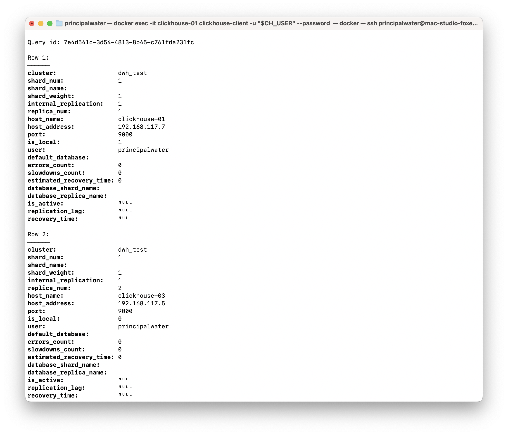

# Homework #16: Загрузка данных в ClickHouse

---

## Оглавление
- [Цель](#цель)
- [Описание](#описание)
- [Архитектура решения](#архитектура-решения)
- [Предварительные проверки и развертывание](#предварительные-проверки-и-развертывание)
- [1. Развертывание инфраструктуры](#1-развертывание-инфраструктуры)
- [2. Настройка подключений в Airflow](#2-настройка-подключений-в-airflow)
- [3. Создание и выполнение ETL пайплайна](#3-создание-и-выполнение-etl-пайплайна)
- [4. Проверка результатов](#4-проверка-результатов)
- [5. Мониторинг выполнения](#5-мониторинг-выполнения)
- [6. Работа с DAG'ами и интеграция с ClickHouse](#6-работа-с-dagами-и-интеграция-с-clickhouse)
- [Выводы](#выводы)
- [Список источников](#список-источников)

---

## Цель

- настроить инструмент ETL для загрузки данных в ClickHouse;
- создать пайплайн для одноразовой или регулярной загрузки данных из внешнего источника;
- изучить интеграцию Apache Airflow с ClickHouse.

## Описание

В этом домашнем задании мы настроим Apache Airflow как ETL инструмент для автоматизированной загрузки данных в ClickHouse. Мы используем готовый модуль Terraform из репозитория `clickhouse-energyhub` и создадим демонстрационный пайплайн, который будет генерировать и загружать тестовые данные в ClickHouse.

Данный подход демонстрирует как организовать автоматизированные процессы ETL в современной аналитической инфраструктуре.

---

## Архитектура решения

Для выполнения задания используется модульная архитектура, основанная на существующей инфраструктуре [`base-infra/ch_with_storage`](../base-infra/ch_with_storage/README.md) с добавлением модулей `postgres` и `airflow`.

### Компоненты системы
1. **ClickHouse кластер**: 4 ноды (clickhouse-01 до clickhouse-04) с базой данных `otus_default`
2. **PostgreSQL модуль**: Отдельный модуль для метабаз BI инструментов с поддержкой Airflow, Metabase, Superset
3. **Apache Airflow**: Полная система включая webserver, scheduler, worker, triggerer и dag-processor  
4. **Redis**: Используется как message broker для Celery executor
5. **Docker Networks**: Обеспечивает сетевое взаимодействие между компонентами с условным подключением

### ETL процесс
- **Extract**: Генерация демонстрационных данных (товары с разными категориями и ценами)
- **Transform**: Обработка и подготовка данных для загрузки
- **Load**: Вставка данных в ClickHouse через `clickhouse-connect` библиотеку

---

## Предварительные проверки и развертывание

Перед началом работы необходимо развернуть инфраструктуру ClickHouse и модуль Airflow. Предполагается, что все SQL-запросы выполняются через `clickhouse-client` на ноде `clickhouse-01`.

### Подготовка конфигурации

Все секретные данные должны быть настроены через файл `terraform.tfvars`. **Никакие пароли и секретные ключи не должны быть зашиты в код!**

#### Шаг 1: Копирование примера конфигурации

```bash
cd base-infra/ch_with_storage
cp terraform.tfvars.example terraform.tfvars
```

#### Шаг 2: Генерация секретных ключей

**2.1. Генерация Fernet Key для Airflow**

Fernet key - это 32-байтовый ключ для шифрования паролей и конфиденциальных данных в Airflow. Он должен быть уникальным для каждой установки:

```bash
# Способ 1: Через Python (рекомендуемый)
python3 -c "from cryptography.fernet import Fernet; print(Fernet.generate_key().decode())"

# Способ 2: Через OpenSSL (альтернативный)
openssl rand -base64 32

# Способ 3: В Docker контейнере (если Python не установлен)
docker run --rm python:3.9-slim python -c "from cryptography.fernet import Fernet; print(Fernet.generate_key().decode())"
```

Пример вывода: `ZmDfcTF7_60GrrY167zsiPd67pEvs0aGOv2oasOM1Pg=`

**2.2. Генерация надежных паролей**

Создайте надежные пароли для всех сервисов:

```bash
# Генерация случайных паролей
openssl rand -base64 16  # для ClickHouse super user
openssl rand -base64 16  # для ClickHouse BI user  
openssl rand -base64 16  # для MinIO
openssl rand -base64 16  # для Airflow admin
```

#### Шаг 3: Редактирование terraform.tfvars

Откройте файл `terraform.tfvars` в текстовом редакторе и заполните **ВСЕ** секретные поля:

```hcl
# ============================================================================
# ОБЯЗАТЕЛЬНЫЕ ПАРАМЕТРЫ - должны быть заполнены!
# ============================================================================

# ClickHouse пользователи
super_user_name     = "su"
super_user_password = "ваш_надежный_пароль_clickhouse"
bi_user_name        = "bi_user" 
bi_user_password    = "ваш_надежный_пароль_bi"

# MinIO (S3-совместимое хранилище)
minio_root_user     = "minioadmin"
minio_root_password = "ваш_надежный_пароль_minio"

# Airflow ETL система
enable_airflow = true
airflow_admin_user     = "admin"
airflow_admin_password = "ваш_надежный_пароль_airflow"
airflow_fernet_key     = "ваш_сгенерированный_fernet_key="

# ============================================================================
# ОПЦИОНАЛЬНЫЕ ПАРАМЕТРЫ
# ============================================================================

# Тип хранилища
storage_type = "local_ssd"

# Мониторинг (по желанию)
enable_monitoring = false
# grafana_admin_username = "admin"  
# grafana_admin_password = "ваш_пароль_grafana"
# grafana_admin_email    = "admin@yourcompany.com"
```

#### Шаг 4: Проверка конфигурации

Проверьте, что все обязательные поля заполнены:

```bash
# Проверяем что нет пустых паролей или примеров
grep -E "(your_|password_here|key_here)" terraform.tfvars
```

Если команда возвращает результат, значит некоторые поля не заполнены!

**Контрольный список обязательных полей:**
- `super_user_password` - пароль суперпользователя ClickHouse
- `bi_user_password` - пароль BI пользователя ClickHouse  
- `minio_root_password` - пароль администратора MinIO
- `airflow_admin_password` - пароль администратора Airflow
- `airflow_fernet_key` - ключ шифрования Airflow (44 символа)

> **⚠️ КРИТИЧЕСКИ ВАЖНО:**
> - Все пароли должны быть уникальными и сложными (минимум 16 символов)
> - Fernet key должен быть точно 44 символа (включая `=` в конце)
> - Никогда не коммитьте файл `terraform.tfvars` в git
> - Сохраните пароли в безопасном месте (менеджер паролей)

---

### 1. Развертывание инфраструктуры

#### 1.1. Развертывание ClickHouse кластера

Сначала разворачиваем базовый кластер ClickHouse с использованием существующего Terraform модуля [`clickhouse-cluster`](../base-infra/ch_with_storage/modules/clickhouse-cluster/):

```bash
cd base-infra/ch_with_storage

# Инициализируем Terraform
terraform init

# Разворачиваем ClickHouse кластер
terraform apply -auto-approve

# Загружаем переменные окружения для подключения к ClickHouse
source env/clickhouse.env
```

После успешного развертывания будут запущены следующие контейнеры:
- **ClickHouse nodes**: clickhouse-01, clickhouse-02, clickhouse-03, clickhouse-04
- **ClickHouse Keeper**: clickhouse-keeper-01, clickhouse-keeper-02, clickhouse-keeper-03
- **PostgreSQL**: postgres (отдельный модуль для метабаз BI инструментов)
- **Airflow services**: api-server, scheduler, worker, triggerer, dag-processor, flower
- **Redis**: message broker для Celery

#### 1.2. Развертывание с Airflow

Инфраструктура разворачивается одной командой благодаря модульной архитектуре с модулями [`postgres`](../base-infra/ch_with_storage/modules/postgres/) и [`airflow`](../base-infra/ch_with_storage/modules/airflow/):

```bash
# Разворачиваем Airflow модуль
terraform apply -auto-approve -var="enable_airflow=true"
```

> **Примечание:** Для включения Airflow используется переменная `enable_airflow`. Убедитесь, что она установлена в `true` в вашем `terraform.tfvars` или передана через командную строку.

Модули развернут следующие компоненты:

**Модуль PostgreSQL:**
- **PostgreSQL Container**: база данных для метаданных Airflow
- **Database Management**: автоматическое создание БД и пользователей
- **Network Isolation**: отдельная сеть `postgres_network`

**Модуль Airflow:**
- **Redis**: message broker для Celery
- **Airflow API Server**: веб-интерфейс и REST API  
- **Airflow Scheduler**: планировщик задач
- **Airflow Worker**: исполнитель задач через Celery
- **Airflow Triggerer**: для асинхронных задач
- **Airflow DAG Processor**: процессор DAG файлов
- **Airflow Flower**: мониторинг Celery workers

После успешного развертывания будут доступны следующие сервисы:
- **ClickHouse**: порты 8123 (HTTP), 9000 (Native)
- **Airflow Webserver**: http://localhost:8080 (admin/пароль_из_tfvars)
- **Airflow Flower**: http://localhost:5555 (мониторинг Celery workers)

*Результат выполнения:*


### 2. Настройка подключений в Airflow

После развертывания, Terraform модуль [`airflow`](../base-infra/ch_with_storage/modules/airflow/main.tf) автоматически настроит подключение к ClickHouse через отдельную сеть и создаст основу для будущих интеграций. Проверим это:

1. Откройте веб-интерфейс Airflow по адресу http://localhost:8080
2. Войдите с учетными данными из `terraform.tfvars` (по умолчанию `admin`/пароль_из_переменной)
3. Перейдите в `Admin → Connections`
4. Найдите автоматически созданные подключения

**Основное подключение для домашнего задания:**

- **clickhouse_default** (обязательное):
  - Connection Type: `HTTP`
  - Host: `clickhouse-01`
  - Port: `8123`
  - Login/Password: Из переменных ClickHouse
  - Используется для всех операций с ClickHouse в рамках ETL процесса

**Дополнительные подключения (опциональные):**

Модуль Airflow также автоматически создает подключения для будущих расширений функциональности:

- **kafka_default** (для интеграции с Apache Kafka):
  - Connection Type: `Kafka`
  - Extra: `{"bootstrap.servers": "kafka:9092"}`
  - Может использоваться для стриминговой загрузки данных

- **telegram_default** (для уведомлений, если указаны переменные):
  - Connection Type: `Telegram`
  - Создается только при наличии `telegram_bot_token` в конфигурации
  - Используется для отправки уведомлений о статусе ETL задач

> **Примечание:** В рамках данного домашнего задания мы фокусируемся исключительно на интеграции **Airflow + ClickHouse**. Kafka и Telegram подключения настраиваются автоматически для возможного использования в будущих проектах.

*Результат выполнения:*


### 3. Создание и выполнение ETL пайплайна

#### 3.1. Обзор DAG для загрузки данных

В рамках настоящего домашнего задания был разработан специальный DAG [`hw16_data_loading_pipeline`](../additional/airflow/dags/hw16_data_loading_pipeline.py) для демонстрации ETL процесса. DAG включает в себя следующие задачи:

**Структура пайплайна:**
```
create_demo_tables → load_sample_data → validate_loaded_data
```

**Описание задач:**

1. **create_demo_tables** (ClickHouseOperator):
   - Создает реплицированную локальную таблицу `hw16_demo_products_local` на всех узлах кластера
   - Движок: `ReplicatedMergeTree` с использованием `{uuid}` и `{replica}` макросов
   - Создает распределенную таблицу `hw16_demo_products` поверх локальной
   - Ключ шардирования: `cityHash64(id)` для равномерного распределения
   - Партиционирование по месяцам: `toYYYYMM(created_at)`

2. **load_sample_data** (PythonOperator):
   - Генерирует 100 демонстрационных товаров с разными датами создания
   - Случайные категории: Electronics, Books, Clothing, Home, Sports
   - Случайные цены от $10 до $1000
   - **Важно**: Загружает данные в **распределенную** таблицу для корректного шардирования
   - Проверяет распределение данных по узлам кластера

3. **validate_loaded_data** (PythonOperator):
   - Проверяет количество записей в распределенной таблице
   - Вычисляет статистику по категориям
   - Рассчитывает среднюю цену товаров
   - **Дополнительно**: Анализирует состояние репликации по узлам
   - **Дополнительно**: Проверяет партиционирование данных

#### 3.2. Запуск пайплайна

DAG настроен на ручной запуск (`schedule=None`). Для выполнения:

1. В интерфейсе Airflow найдите DAG `hw16_data_loading_pipeline`
2. Включите DAG переключателем слева от названия
3. Нажмите кнопку "Trigger DAG" для запуска
4. Перейдите в Graph View для отслеживания выполнения задач

Альтернативно, можно запустить DAG через командную строку:

```bash
# Подключение к контейнеру Airflow
docker exec -it airflow-api-server airflow dags trigger hw16_data_loading_pipeline

# Проверка статуса выполнения
docker exec -it airflow-api-server airflow dags list
```

*Результат выполнения:*


### 4. Проверка результатов

После успешного выполнения пайплайна проверим загруженные данные в ClickHouse:

```bash
# Подключение к ClickHouse (из директории base-infra/ch_with_storage)
source env/clickhouse.env
docker exec -it clickhouse-01 clickhouse-client -u "$CH_USER" --password "$CH_PASSWORD"
```

Выполним SQL-запросы для проверки загруженных данных:

**4.1. Проверка структуры таблиц и распределения данных**

```sql
-- Проверяем структуру созданных таблиц
SHOW CREATE TABLE otus_default.hw16_demo_products_local;
SHOW CREATE TABLE otus_default.hw16_demo_products;
```

*Результат выполнения:*


```sql
-- Проверяем количество записей в распределенной таблице (общее по кластеру)
SELECT count() FROM otus_default.hw16_demo_products;

-- Проверяем распределение данных по узлам кластера
SELECT 
    hostName() as host,
    count() as records_count
FROM otus_default.hw16_demo_products_local 
GROUP BY hostName() 
ORDER BY host;
```

*Результат выполнения:*


**4.2. Анализ загруженных данных**

```sql
-- Смотрим примеры данных из распределенной таблицы
SELECT * FROM otus_default.hw16_demo_products LIMIT 5;

-- Статистика по категориям (запрос к распределенной таблице)
SELECT 
    category, 
    count() as products_count,
    round(avg(price), 2) as avg_price,
    min(price) as min_price,
    max(price) as max_price
FROM otus_default.hw16_demo_products 
GROUP BY category 
ORDER BY products_count DESC;
```

*Результат выполнения:*


```sql
-- Проверяем партиционирование (по месяцам)
SELECT 
    toYYYYMM(created_at) as month,
    count() as products_count
FROM otus_default.hw16_demo_products 
GROUP BY month 
ORDER BY month;
```

*Результат выполнения:*


**4.3. Мониторинг кластера и репликации**

```sql
-- Проверяем состояние репликации и партиций
SELECT 
    hostName() as host,
    database,
    table,
    partition,
    count() as parts_count,
    sum(rows) as total_rows
FROM system.parts 
WHERE database = 'otus_default' 
    AND table = 'hw16_demo_products_local' 
    AND active = 1
GROUP BY hostName(), database, table, partition 
ORDER BY host, partition;
```

*Результат выполнения:*


```sql
-- Проверяем работу кластера (информация о шардах и репликах)
SELECT * FROM system.clusters WHERE cluster = 'dwh_test';
```

*Результат выполнения:*




### 5. Мониторинг выполнения

Airflow предоставляет множество инструментов для мониторинга выполнения ETL пайплайнов:

**В веб-интерфейсе Airflow (http://localhost:8080):**
- **Graph View**: Визуализация зависимостей между задачами и их текущее состояние
- **Tree View**: История выполнения DAG по времени
- **Gantt Chart**: Временная диаграмма выполнения задач
- **Task Logs**: Детальные логи каждой задачи с возможностью live просмотра
- **Task Duration**: Статистика времени выполнения задач
- **Landing Times**: Анализ производительности DAG

**Через Flower - мониторинг Celery workers (http://localhost:5555):**
- Мониторинг активных workers и их загрузки
- Статистика выполненных задач
- Очереди задач и их состояние
- Детальная информация о каждом worker'е

**Полезные команды для мониторинга:**

```bash
# Просмотр состояния DAG
docker exec -it airflow-api-server airflow dags state hw16_data_loading_pipeline

# Просмотр логов конкретной задачи
docker exec -it airflow-api-server airflow tasks logs hw16_data_loading_pipeline load_sample_data

# Список активных задач
docker exec -it airflow-api-server airflow tasks list hw16_data_loading_pipeline
```

*Результаты мониторинга:*


---

## 6. Работа с DAG'ами и интеграция с ClickHouse

### 6.1. Создание новых DAG файлов

Все DAG файлы должны размещаться в директории [`additional/airflow/dags/`](../additional/airflow/dags/). При развертывании Terraform автоматически монтирует эту директорию в контейнер Airflow.

**Структура нового DAG файла:**

```python
from datetime import datetime, timedelta
from airflow import DAG
from airflow.providers.clickhouse.operators.clickhouse import ClickHouseOperator
from airflow.operators.python import PythonOperator
import clickhouse_connect
import os

# Обязательные default_args для корректной работы
default_args = {
    'owner': 'your-team-name',
    'depends_on_past': False,
    'start_date': datetime(2025, 1, 1),
    'email_on_failure': False,
    'email_on_retry': False,
    'retries': 2,
    'retry_delay': timedelta(minutes=5),
}

# Создание DAG
my_dag = DAG(
    'my_custom_dag_name',
    default_args=default_args,
    description='Описание вашего DAG',
    schedule=None,  # Запуск вручную или cron expression
    catchup=False,  # Не запускать пропущенные выполнения
    tags=['clickhouse', 'etl', 'your-tags'],
)
```

### 6.2. Методы работы с ClickHouse

Для взаимодействия с ClickHouse из Airflow в рамках проекта выбран основной способ: использование библиотеки `clickhouse-connect` внутри `PythonOperator`.

#### 6.2.1. Основной подход: PythonOperator + clickhouse-connect

Этот метод обеспечивает максимальную гибкость и полный контроль над процессом выполнения запросов, обработки данных и логики. Он идеально подходит для сложных ETL-операций. Все необходимые зависимости уже включены в сборку Airflow.

**Преимущества:**
- **Гибкость**: Позволяет выполнять любую логику на Python до и после запроса (трансформация данных, условная логика, вызов внешних API).
- **Полный контроль**: Прямое управление подключением и выполнением запросов.
- **Простота отладки**: Код легко тестировать и отлаживать как обычный Python-скрипт.

**Пример реализации в DAG:**
```python
from airflow.operators.python import PythonOperator
import clickhouse_connect
import os

def my_clickhouse_task(**context):
    client = clickhouse_connect.get_client(
        host=os.getenv('CLICKHOUSE_HOST', 'clickhouse-01'),
        port=int(os.getenv('CLICKHOUSE_PORT', '8123')),
        username=os.getenv('CLICKHOUSE_USER'),
        password=os.getenv('CLICKHOUSE_PASSWORD'),
        database='otus_default'
    )
    # Ваша логика здесь: client.query(...), client.insert(...)
    client.close()

load_task = PythonOperator(
    task_id='my_task',
    python_callable=my_clickhouse_task,
    dag=my_dag,
)
```
> **Официальная документация по библиотеке:** [clickhouse-connect](https://clickhouse.com/docs/integrations/python)

#### 6.2.2. Альтернативный подход: airflow-clickhouse-plugin

Существует также возможность интеграции через специализированные плагины, например, `airflow-clickhouse-plugin`.

> **Репозиторий плагина:** [bryzgaloff/airflow-clickhouse-plugin](https://github.com/bryzgaloff/airflow-clickhouse-plugin)

Этот плагин предоставляет `ClickHouseOperator`, который упрощает выполнение простых SQL-запросов.

**Потенциальные плюсы:**
- **Простота для DDL/DML**: Идеально подходит для простых операций, таких как `CREATE TABLE`, `ALTER TABLE`, `TRUNCATE`, где не требуется обработка данных.
- **Читаемость DAG**: Для простых SQL-операций код DAG может выглядеть чище и декларативнее.
- **Меньше кода**: Не нужно писать обвязку на Python для установки соединения и выполнения запроса.

**Пример использования оператора:**
```python
from airflow_clickhouse_plugin.operators.clickhouse import ClickHouseOperator

create_table = ClickHouseOperator(
    task_id='create_table_example',
    clickhouse_conn_id='clickhouse_default',
    sql="CREATE TABLE IF NOT EXISTS my_table (id UInt32) ENGINE = MergeTree() ORDER BY id",
    dag=my_dag,
)
```

---
**Итоговое решение:**

Несмотря на преимущества `ClickHouseOperator` для простых задач, в рамках текущего проекта **принято решение остановиться на `PythonOperator` + `clickhouse-connect` как на основном и едином способе работы с ClickHouse**. Это обеспечивает консистентность кода, гибкость для будущих усложнений и упрощает поддержку пайплайнов, так как вся логика работы с данными инкапсулируется внутри Python-функций. Именно этот подход реализован в DAG `hw16_data_loading_pipeline`.

### 6.3. Обязательные атрибуты и переменные окружения

**Переменные окружения для ClickHouse** (автоматически настраиваются модулем):
- `CLICKHOUSE_HOST` - хост ClickHouse (clickhouse-01)
- `CLICKHOUSE_PORT` - HTTP порт ClickHouse (8123)
- `CLICKHOUSE_USER` - пользователь из terraform.tfvars
- `CLICKHOUSE_PASSWORD` - пароль из terraform.tfvars
- `CLICKHOUSE_DATABASE` - база данных по умолчанию (otus_default)

**Обязательные атрибуты DAG:**
- `dag_id` - уникальное имя DAG
- `default_args` - базовые настройки для всех задач
- `schedule` - расписание запуска (cron или None для ручного)
- `catchup=False` - не запускать пропущенные выполнения
- `tags` - теги для группировки в интерфейсе

### 6.4. Добавление нового DAG в систему

1. **Создайте файл в директории dags:**
```bash
# Создайте новый файл DAG
nano additional/airflow/dags/my_new_dag.py
```

2. **Airflow автоматически обнаружит новый DAG** (время сканирования ~30 секунд)

3. **Проверьте DAG в веб-интерфейсе:**
   - Откройте http://localhost:8080
   - Найдите новый DAG в списке
   - Проверьте отсутствие ошибок парсинга

4. **Протестируйте DAG:**
```bash
# Проверка синтаксиса DAG
docker exec -it airflow-api-server airflow dags list-import-errors

# Тестирование конкретной задачи
docker exec -it airflow-api-server airflow tasks test my_new_dag task_name 2025-01-01
```

### 6.5. Лучшие практики для ClickHouse DAG'ов

- **Используйте транзакции** для критичных операций
- **Обрабатывайте ошибки** с retry механизмами
- **Логируйте прогресс** для отладки
- **Используйте XCom** для передачи данных между задачами
- **Оптимизируйте размер батчей** при массовой вставке
- **Мониторьте производительность** через метрики Airflow

### 6.6. Полезные ресурсы

**Официальная документация:**
- [Apache Airflow Documentation](https://airflow.apache.org/docs/)
- [Airflow ClickHouse Plugin](https://github.com/bryzgaloff/airflow-clickhouse-plugin)
- [clickhouse-connect Python Library](https://clickhouse.com/docs/en/integrations/python)

**Блоги и статьи:**
- [Habr: Apache Airflow: делаем ETL проще](https://habr.com/ru/articles/512386/)
- [Habr: Основы ETL на примере работы с Superset, Airflow и ClickHouse](https://habr.com/ru/companies/beget/articles/928712/)
- [Habr: Интеграция с ClickHouse: 1С vs Apache Airflow. Плюсы и минусы](https://habr.com/ru/companies/w_code/articles/864088/)
- [Habr: ClickHouse как DWH: Производительность без боли и ловушки merge-таблиц](https://habr.com/ru/articles/912454/)
- [Best Practices для Airflow DAGs](https://airflow.apache.org/docs/apache-airflow/stable/best-practices.html)

---

## Выводы

В ходе выполнения этого домашнего задания мы успешно:

### 1. Настроили модульную ETL инфраструктуру
- **Модульная архитектура**: Отдельные модули PostgreSQL и Airflow для масштабируемости
- **Apache Airflow** с архитектурой: webserver + scheduler + worker + triggerer + dag-processor
- **Redis** как message broker для координации задач
- **PostgreSQL модуль** как универсальная метабаза для BI инструментов (Airflow, Metabase, Superset)
- **Docker networks** с условным подключением для гибкого взаимодействия компонентов

### 2. Создали автоматизированный пайплайн загрузки данных
- **Модульная архитектура**: Задачи создания таблицы, загрузки данных и валидации разделены
- **Обработка ошибок**: Retry механизмы и детальное логирование
- **Гибкость**: Легко масштабируемый подход к добавлению новых источников данных

### 3. Изучили интеграцию Airflow с ClickHouse
- **ClickHouseOperator** для выполнения DDL операций
- **PythonOperator** с `clickhouse-connect` для сложной логики ETL
- **Автоматическая настройка подключений** через Terraform

### 4. Продемонстрировали best practices
- **Infrastructure as Code**: Полное управление инфраструктурой через Terraform
- **Контейнеризация**: Изоляция компонентов и простота развертывания  
- **Мониторинг**: Встроенные инструменты для отслеживания выполнения
- **URL-encoding**: Правильная обработка специальных символов в паролях

### 5. Подготовили архитектуру для расширений
Модульная архитектура готова для добавления:
- **Metabase и Superset**: PostgreSQL модуль уже поддерживает создание БД и пользователей
- **Kafka**: Переменные и подключения уже настроены для будущей интеграции
- **Monitoring**: Совместимость с существующим модулем мониторинга
- **Дополнительные BI инструменты**: Через расширение PostgreSQL модуля

### 6. Практические применения
Созданная архитектура может быть легко адаптирована для:
- **Регулярной загрузки** данных из внешних API
- **Обработки файлов** из S3/MinIO storage
- **Сложных трансформаций** данных перед загрузкой в ClickHouse
- **Мониторинга качества данных** и отправки уведомлений

### 7. Производительность и надежность
- **Горизонтальное масштабирование**: Возможность добавления Celery workers
- **Отказоустойчивость**: Retry механизмы и восстановление после сбоев
- **Версионирование DAG**: GitOps подход к управлению пайплайнами
- **Container Labels**: Единообразная маркировка контейнеров для мониторинга

Данное решение демонстрирует современный подход к построению ETL систем с использованием открытых технологий и может служить основой для реальных проектов аналитики больших данных.

---

## Список источников

- [Apache Airflow Documentation](https://airflow.apache.org/docs/)
- [Airflow ClickHouse Plugin](https://github.com/bryzgaloff/airflow-clickhouse-plugin)
- [clickhouse-connect Python Library](https://github.com/ClickHouse/clickhouse-connect)
- [Terraform Docker Provider](https://registry.terraform.io/providers/kreuzwerker/docker/latest)
- [Celery Distributed Task Queue](https://docs.celeryq.dev/en/stable/)
- [ClickHouse Documentation](https://clickhouse.com/docs/en/intro)
