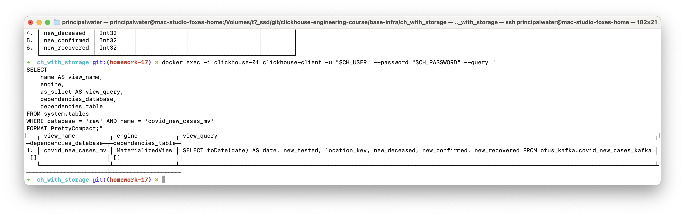

# Homework #17: Интеграция с Apache Kafka

---

## Оглавление
- [Цель](#цель)
- [Архитектура решения](#архитектура-решения)
- [Пошаговая инструкция выполнения](#пошаговая-инструкция-выполнения)
  - [Этап 1: Подготовка инфраструктуры](#этап-1-подготовка-инфраструктуры)
  - [Этап 2: Создание Kafka топиков через DAG](#этап-2-создание-kafka-топиков-через-dag)
  - [Этап 3: Создание ClickHouse таблиц через DAG](#этап-3-создание-clickhouse-таблиц-через-dag)
  - [Этап 4: Запуск автоматических продьюсеров данных](#этап-4-запуск-автоматических-продьюсеров-данных)
  - [Этап 5: Проверка работы пайплайна](#этап-5-проверка-работы-пайплайна)
  - [Этап 6: Мониторинг пайплайна](#этап-6-мониторинг-пайплайна)
- [Задания со звездочкой*](#задания-со-звездочкой)
  - [1. Запись данных в Kafka через ClickHouse Kafka Engine (не через DAG)](#1-запись-данных-в-kafka-через-clickhouse-kafka-engine-не-через-dag)
  - [2. Пайплайн без использования Kafka Engine](#2-пайплайн-без-использования-kafka-engine)
- [Проверка корректности выполнения заданий](#проверка-корректности-выполнения-заданий)
- [Компетенции](#компетенции)
- [Результат](#результат)

---

## Цель

Изучить интеграцию ClickHouse с Kafka и настроить пайплайн для записи и чтения данных с использованием COVID-19 Open-Data датасета через готовые Airflow DAG'и.

## Описание

В этом домашнем задании мы изучим интеграцию ClickHouse с Apache Kafka. Мы настроим полностью автоматизированный пайплайн для потоковой обработки данных с использованием готовых DAG'ов в Apache Airflow. В качестве источника данных будет использоваться датасет COVID-19 Open-Data.

Этот пайплайн будет демонстрировать создание Kafka топиков, настройку таблиц с движком Kafka в ClickHouse, и перенос данных в конечные таблицы через Materialized Views. Данный подход является стандартной практикой для организации real-time аналитики в современных DWH.

## Архитектура решения

### Схема интеграции Kafka + ClickHouse через DAG'и


## Пошаговая инструкция выполнения

### Этап 1: Подготовка инфраструктуры

1. **Развертывание кластера ClickHouse + Kafka + Airflow**

В этом задании вся работа по созданию топиков в Kafka и настройке пайплайнов в ClickHouse будет автоматизирована, поэтому вместе с базовой инфраструктурой мы сразу разворачиваем Apache Airflow.

Перейдите в директорию с базовой инфраструктурой и выполните `terraform init`.

```bash
cd base-infra/ch_with_storage
terraform init
```

Затем выполните `terraform apply`, используя флаги `-var`, чтобы активировать модули Kafka и Airflow, которые по умолчанию отключены.

```bash
terraform apply -auto-approve -var="enable_kafka=true" -var="enable_airflow=true"
```

Эта команда автоматически создаст все необходимые для задания компоненты:
- ClickHouse кластер из 4 узлов с 3 keeper'ами
- Kafka и Zookeeper контейнеры
- Airflow с PostgreSQL в качестве мета-базы
- Все необходимые Docker сети и volumes

После завершения, загрузите переменные окружения для дальнейшей работы:
```bash
source env/clickhouse.env
```


2. **Проверка развертывания**

```bash
# Проверка ClickHouse
# Убедитесь, что вы выполнили source env/clickhouse.env

docker exec -i clickhouse-01 clickhouse-client -u "$CH_USER" --password "$CH_PASSWORD" --query "SELECT version()"

# Проверка Airflow
curl -u "$AIRFLOW_ADMIN_USER:$AIRFLOW_ADMIN_PASSWORD" "http://localhost:8080/api/v2/monitor/health"
```


```bash
# Проверка Kafka - убедимся, что брокер доступен
docker exec kafka kafka-broker-api-versions --bootstrap-server localhost:9092
```


### Этап 2: Создание Kafka топиков через DAG

#### 2.1 Использование DAG `kafka_topic_create`

DAG расположен по пути: [`additional/airflow/dags/kafka_topic_create.py`](../additional/airflow/dags/kafka_topic_create.py)

**Логика работы DAG:**
1. **get_topic_config** - получает JSON конфигурацию топика из параметров запуска
2. **check_kafka_connection** - проверяет подключение к Kafka брокеру
3. **check_topic_exists** - проверяет существование топика
4. **create_topic** - создает топик с указанными параметрами
5. **verify_topic_creation** - проверяет успешность создания

#### 2.2 Создание топика для новых случаев COVID-19

1. Откройте Airflow UI: `http://localhost:8080`
2. Найдите DAG `kafka_topic_create`
3. Нажмите "Trigger" и затем "Advanced Options"
4. Вставьте следующую JSON конфигурацию в поле "Configuration JSON":

```json
{
  "topic_name": "covid_new_cases_1min",
  "partitions": 3,
  "replication_factor": 1,
  "retention_ms": 86400000,
  "cleanup_policy": "delete",
  "compression_type": "snappy",
  "description": "COVID-19 new cases data every minute",
  "schema_description": {
    "date": "Date in YYYY-MM-DD format",
    "location_key": "Country/region code",
    "new_confirmed": "New confirmed cases",
    "new_deceased": "New deaths",
    "new_recovered": "New recoveries", 
    "new_tested": "New tests performed"
  },
  "kafka_broker": "kafka:9092"
}
```


##### Шаг 1: get_topic_config


##### Шаг 2: check_kafka_connection


##### Шаг 3: check_topic_exists


##### Шаг 4: create_kafka_topic


##### Шаг 5: verify_topic_creation


##### Шаг 6: generate_topic_summary


#### 2.3 Пересоздание топика (расширенный пример)

Для пересоздания существующего топика с новыми параметрами используйте флаг `recreate_topic: true`:

**Конфигурация с пересозданием:**
```json
{
  "topic_name": "covid_new_cases_1min",
  "partitions": 5,
  "replication_factor": 1,
  "retention_ms": 172800000,
  "cleanup_policy": "delete",
  "compression_type": "lz4",
  "recreate_topic": true,
  "description": "COVID-19 new cases data every minute (recreated with new config)",
  "schema_description": {
    "date": "Date in YYYY-MM-DD format",
    "location_key": "Country/region code",
    "new_confirmed": "New confirmed cases",
    "new_deceased": "New deaths",
    "new_recovered": "New recoveries", 
    "new_tested": "New tests performed"
  },
  "kafka_broker": "kafka:9092"
}
```


**Логика пересоздания:**
1. Проверяется существование топика
2. Если `recreate_topic: true` и топик существует → удаляется
3. Ожидание полного удаления (5 секунд)
4. Создание нового топика с обновленными параметрами

<p><b>Внимание:</b> Пересоздание топика приведет к потере всех сообщений!</p>


#### 2.4 Создание топика для накопительных данных

Повторите процесс с конфигурацией:

```json
{
  "topic_name": "covid_cumulative_data_5min",
  "partitions": 3,
  "replication_factor": 1,
  "retention_ms": 604800000,
  "cleanup_policy": "delete", 
  "compression_type": "snappy",
  "description": "COVID-19 cumulative data every 5 minutes",
  "schema_description": {
    "date": "Date in YYYY-MM-DD format",
    "location_key": "Country/region code",
    "cumulative_confirmed": "Total confirmed cases",
    "cumulative_deceased": "Total deaths",
    "cumulative_recovered": "Total recoveries",
    "cumulative_tested": "Total tests performed"
  },
  "kafka_broker": "kafka:9092"
}
```


<p><i>Шаги выполнения аналогичны созданию топика covid_new_cases_1min. Ниже представлен только итоговый результат.</i></p>

##### Итоговый результат: generate_topic_summary


<p><i>При повторном запуске DAG для уже существующего топика, задача `create_kafka_topic` корректно определит, что топик уже создан, и пропустит его создание. Результат будет аналогичен успешному созданию, но со статусом "exists".</i></p>

##### Результат повторного запуска для существующего топика


#### 2.5 Проверка созданных Kafka топиков

После создания топиков проверьте их существование и конфигурацию:

```bash
# Проверка всех созданных топиков
docker exec kafka kafka-topics --list --bootstrap-server localhost:9092

# Детальная информация о топиках COVID-19
docker exec kafka kafka-topics --describe \
  --topic covid_new_cases_1min \
  --bootstrap-server localhost:9092
  
docker exec kafka kafka-topics --describe \
  --topic covid_cumulative_data_5min \
  --bootstrap-server localhost:9092
```


### Этап 3: Создание ClickHouse таблиц через DAG

#### 3.1 Использование DAG `kafka_to_ch_table_create`

DAG расположен по пути: [`additional/airflow/dags/kafka_to_ch_table_create.py`](../additional/airflow/dags/kafka_to_ch_table_create.py)

**Логика работы DAG:**
1. **get_table_config** - получает конфигурацию таблицы из параметров
2. **check_connections** - проверяет подключения к ClickHouse и Kafka
3. **generate_sql_script** - генерирует SQL для создания всех компонентов пайплайна
4. **execute_sql_script** - выполняет SQL-скрипт в ClickHouse
5. **verify_data_flow** - проверяет поток данных
6. **health_check** - проверяет здоровье созданных таблиц

#### 3.1.1 Автоматическое преобразование типов данных

<p><b>Важно:</b> DAG автоматически преобразует типы данных из Kafka (String) в соответствующие типы ClickHouse для корректной работы с партиционированием и функциями.</p>

**Конфигурируемые переменные в начале DAG файла:**

```python
# Поля для автоматического преобразования типов
DATE_FIELDS = ['date', 'event_date', 'created_date', 'updated_date']  # String -> Date
DATETIME_FIELDS = ['timestamp', 'created_at', 'updated_at', 'event_time']  # String -> DateTime
```

**Логика преобразования:**
- Поля из `DATE_FIELDS` автоматически преобразуются из `String` в `Date` в ClickHouse таблицах
- Поля из `DATETIME_FIELDS` преобразуются из `String` в `DateTime`
- В Materialized View используются `toDate()` и `parseDateTimeBestEffort()` соответственно
- Это особенно важно для партиционирования по дате (например, `toYYYYMM(date)`)

#### 3.1.2 Расширенные параметры конфигурации

Конфигурация DAG поддерживает дополнительные параметры для оптимизации:

```json
{
  "kafka_topic": "covid_new_cases_1min",
  "target_table_name": "covid_new_cases",
  "dwh_layer": "raw",
  "schema": { ... },
  
  // Необязательные параметры:
  "create_projection": true,           // создавать проекцию для оптимизации
  "projection_order_by": null,         // кастомная сортировка для проекции
  "create_indexes": true,              // создавать доп. индексы
  "index_fields": ["date", "location_key"], // поля для индексов
  "table_settings": {},                // доп. настройки таблицы
  "skip_alter_on_error": true,         // пропускать ALTER при ошибках
  "recreate_tables": false             // пересоздавать таблицы (осторожно!)
}
```

#### 3.1.3 Улучшенная обработка ошибок

<p><b>Важный момент:</b> DAG корректно обрабатывает ошибки и завершается со статусом FAILED, если:</p>

- Любой основной SQL-запрос (создание баз, таблиц, MV) не выполнился
- Отсутствуют необходимые таблицы после выполнения
- Не удалось проверить статус созданных объектов

<p><i>При этом ALTER-запросы (индексы, проекции) могут не выполняться без прерывания основного процесса.</i></p>

#### 3.2 SQL-запросы, генерируемые DAG'ом

DAG автоматически генерирует следующие SQL-запросы:

**1. Создание баз данных:**
```sql
CREATE DATABASE IF NOT EXISTS otus_kafka ON CLUSTER dwh_test;
CREATE DATABASE IF NOT EXISTS raw ON CLUSTER dwh_test;
CREATE DATABASE IF NOT EXISTS ods ON CLUSTER dwh_test;
CREATE DATABASE IF NOT EXISTS dds ON CLUSTER dwh_test;
CREATE DATABASE IF NOT EXISTS cdm ON CLUSTER dwh_test;
```

**2. Kafka-таблица для новых случаев:**
```sql
CREATE TABLE IF NOT EXISTS otus_kafka.covid_new_cases_kafka ON CLUSTER dwh_test (
    date String,
    location_key String,
    new_confirmed Int32,
    new_deceased Int32,
    new_recovered Int32,
    new_tested Int32
) ENGINE = Kafka
SETTINGS
    kafka_broker_list = 'kafka:9092',
    kafka_topic_list = 'covid_new_cases_1min',
    kafka_group_name = 'clickhouse-covid_new_cases-consumer',
    kafka_format = 'JSONEachRow',
    kafka_num_consumers = 1,
    kafka_skip_broken_messages = 1000,
    kafka_row_delimiter = '\n';
```

**3. ReplicatedMergeTree таблица:**
```sql
CREATE TABLE IF NOT EXISTS raw.covid_new_cases_local ON CLUSTER dwh_test (
    date Date,
    location_key LowCardinality(String),
    new_confirmed Int32,
    new_deceased Int32,
    new_recovered Int32,
    new_tested Int32
) ENGINE = ReplicatedMergeTree('/clickhouse/tables/{shard}/raw/covid_new_cases_local/{uuid}/', '{replica}')
PARTITION BY toYYYYMM(date)
ORDER BY (date, location_key)
PRIMARY KEY (date, location_key);
```

**4. Distributed таблица:**
```sql
CREATE TABLE IF NOT EXISTS raw.covid_new_cases ON CLUSTER dwh_test (
    date Date,
    location_key LowCardinality(String),
    new_confirmed Int32,
    new_deceased Int32,
    new_recovered Int32,
    new_tested Int32
) ENGINE = Distributed('dwh_test', 'raw', 'covid_new_cases_local', xxHash64(location_key));
```

**5. Materialized View для трансфера данных:**
```sql
CREATE MATERIALIZED VIEW IF NOT EXISTS raw.covid_new_cases_mv ON CLUSTER dwh_test 
TO raw.covid_new_cases AS
SELECT
    parseDateTimeBestEffort(date) AS date,
    location_key,
    new_confirmed,
    new_deceased,
    new_recovered,
    new_tested
FROM otus_kafka.covid_new_cases_kafka
WHERE date != '';
```

#### 3.3 Создание таблиц для новых случаев COVID-19

1. Откройте Airflow UI: `http://localhost:8080`
2. Найдите DAG `kafka_to_ch_table_create`
3. Нажмите "Trigger" и затем "Advanced Options"
4. Вставьте следующую JSON конфигурацию в поле "Configuration JSON":

**Минимальная конфигурация:**
```json
{
  "kafka_topic": "covid_new_cases_1min",
  "target_table_name": "covid_new_cases",
  "dwh_layer": "raw",
  "kafka_database": "otus_kafka",
  "sort_key": "date, location_key",
  "partition_key": "toYYYYMM(date)",
  "shard_key": "xxHash64(location_key)",
  "schema": {
    "date": "String",
    "location_key": "String",
    "new_confirmed": "Int32",
    "new_deceased": "Int32",
    "new_recovered": "Int32",
    "new_tested": "Int32"
  }
}
```

**Полная конфигурация с дополнительными параметрами:**
```json
{
  "kafka_topic": "covid_new_cases_1min",
  "target_table_name": "covid_new_cases",
  "dwh_layer": "raw",
  "kafka_database": "otus_kafka",
  "sort_key": "date, location_key",
  "partition_key": "toYYYYMM(date)",
  "shard_key": "xxHash64(location_key)",
  "create_projection": true,
  "projection_order_by": "date, new_confirmed",
  "create_indexes": true,
  "index_fields": ["date", "location_key"],
  "skip_alter_on_error": true,
  "schema": {
    "date": "String",
    "location_key": "String",
    "new_confirmed": "Int32",
    "new_deceased": "Int32",
    "new_recovered": "Int32",
    "new_tested": "Int32"
  }
}
```


##### Шаг 1: get_table_config


##### Шаг 2: check_connections


##### Шаг 3: generate_sql_script


##### Шаг 4: execute_sql_script


##### Шаг 5: verify_data_flow


##### Шаг 6: health_check


##### Шаг 7: Проверка созданных таблиц в ClickHouse

После успешного выполнения DAG проверьте созданные таблицы с помощью SQL-запросов:

```bash
# Проверка всех созданных таблиц (структурированный вывод)
docker exec -i clickhouse-01 clickhouse-client -u "$CH_USER" --password "$CH_PASSWORD" --query "
SELECT 
    concat(database, '.', table) AS table_name,
    engine AS engine_type,
    toString(total_rows) AS row_count,
    formatReadableSize(total_bytes) AS table_size,
    toString(metadata_modification_time) AS last_modified
FROM system.tables 
WHERE database IN ('raw', 'otus_kafka') 
AND table LIKE '%covid_new_cases%'
ORDER BY database, table
FORMAT Vertical;"
```


```bash
# Проверка структуры локальной таблицы
docker exec -i clickhouse-01 clickhouse-client -u "$CH_USER" --password "$CH_PASSWORD" --query "
SELECT 
    name AS column_name,
    type AS data_type,
    default_kind,
    default_expression,
    comment
FROM system.columns 
WHERE database = 'raw' AND table = 'covid_new_cases_local'
ORDER BY position
FORMAT PrettyCompact;"
```


```bash
# Проверка Materialized View
docker exec -i clickhouse-01 clickhouse-client -u "$CH_USER" --password "$CH_PASSWORD" --query "
SELECT 
    name AS view_name,
    engine,
    as_select AS view_query,
    dependencies_database,
    dependencies_table
FROM system.tables 
WHERE database = 'raw' AND name = 'covid_new_cases_mv'
FORMAT PrettyCompact;"
```



#### 3.4 Пересоздание существующих таблиц (расширенный пример)

Для пересоздания таблиц с новой схемой или конфигурацией используйте флаг `recreate_tables: true`:

**Конфигурация с пересозданием:**
```json
{
  "kafka_topic": "covid_new_cases_1min",
  "target_table_name": "covid_new_cases",
  "dwh_layer": "raw",
  "kafka_database": "otus_kafka",
  "sort_key": "date, location_key",
  "partition_key": "toYYYYMM(date)",
  "shard_key": "xxHash64(location_key)",
  "recreate_tables": true,
  "create_projection": true,
  "projection_order_by": "date, new_confirmed",
  "create_indexes": true,
  "index_fields": ["date", "location_key"],
  "schema": {
    "date": "String",
    "location_key": "String",
    "new_confirmed": "Int32",
    "new_deceased": "Int32",
    "new_recovered": "Int32",
    "new_tested": "Int32"
  }
}
```


**Логика пересоздания:**
1. Сначала выполняются `DROP TABLE IF EXISTS` для всех связанных таблиц
2. Удаление происходит в правильном порядке: MV → Distributed → Local → Kafka
3. Затем выполняется обычное создание таблиц
4. Все команды выполняются на всем кластере `ON CLUSTER dwh_test`


#### 3.5 Создание таблиц для накопительных данных

Повторите процесс с конфигурацией:

```json
{
  "kafka_topic": "covid_cumulative_data_5min",
  "target_table_name": "covid_cumulative",
  "dwh_layer": "ods",
  "kafka_database": "otus_kafka",
  "sort_key": "date, location_key",
  "partition_key": "toYYYYMM(date)",
  "shard_key": "xxHash64(location_key)",
  "schema": {
    "date": "String",
    "location_key": "String",
    "cumulative_confirmed": "Int32",
    "cumulative_deceased": "Int32",
    "cumulative_recovered": "Int32",
    "cumulative_tested": "Int32"
  }
}
```


<p><i>Шаги выполнения аналогичны созданию таблиц для новых случаев COVID-19. Ниже представлен только итоговый результат.</i></p>

##### Шаг 1: Запуск DAG с новой конфигурацией


##### Шаг 2: Итоговый результат


<p><i>При повторном запуске DAG для уже существующих таблиц, задача `execute_sql_script` корректно определит, что таблицы уже созданы, и пропустит их создание. Результат будет аналогичен успешному созданию, но со статусом "skipped" или "exists".</i></p>

##### Результат повторного запуска для существующих таблиц


### Этап 4: Запуск автоматических продьюсеров данных

#### 4.1 DAG продьюсера новых случаев

DAG расположен по пути: [`additional/airflow/dags/covid_new_cases_1min.py`](../additional/airflow/dags/covid_new_cases_1min.py)

**Логика работы:**
- Запускается каждую минуту
- Загружает реальные или симуляционные данные COVID-19
- Отправляет батч из 8 сообщений в топик `covid_new_cases_1min`
- Использует фильтр по странам для контроля объема данных

Включите DAG в Airflow UI:


#### 4.2 DAG продьюсера накопительных данных

DAG расположен по пути: [`additional/airflow/dags/covid_cumulative_data_5min.py`](../additional/airflow/dags/covid_cumulative_data_5min.py)

**Логика работы:**
- Запускается каждые 5 минут
- Отправляет батч из 5 сообщений в топик `covid_cumulative_data_5min`
- Данные включают накопительную статистику по COVID-19

Включите DAG в Airflow UI:


### Этап 5: Проверка работы пайплайна

#### 5.1 Проверка данных в Kafka топиках

```bash
# Проверка топика новых случаев
docker exec kafka kafka-console-consumer \
  --topic covid_new_cases_1min \
  --from-beginning \
  --max-messages 5 \
  --bootstrap-server kafka:9092
```


#### 5.2 Проверка созданных таблиц в ClickHouse

```sql
-- Список всех созданных таблиц
SELECT 
    database,
    table,
    engine,
    total_rows,
    total_bytes
FROM system.tables 
WHERE database IN ('raw', 'ods', 'otus_kafka')
AND (table LIKE '%covid_new_cases%' OR table LIKE '%covid_cumulative%')
ORDER BY database, table;
```


#### 5.3 Проверка потока данных через Kafka Engine

```sql
-- Проверка финальных таблиц
SELECT count() FROM raw.covid_new_cases;
SELECT count() FROM ods.covid_cumulative;
```


```sql
-- Проверка недавних данных
SELECT * FROM raw.covid_new_cases ORDER BY date DESC LIMIT 5;
SELECT * FROM ods.covid_cumulative ORDER BY date DESC LIMIT 5;
```


> **Примечание**: Прямой SELECT из Kafka-таблиц невозможен при подключенных Materialized Views. ClickHouse не позволяет читать из `StorageKafka` с подключенными MV для предотвращения конфликтов в потреблении сообщений. Подробнее в [документации ClickHouse по Kafka Engine](https://clickhouse.com/docs/en/engines/table-engines/integrations/kafka).

#### 5.4 Анализ данных в ClickHouse

**Последние поступившие записи:**
```sql
SELECT * FROM raw.covid_new_cases 
ORDER BY date DESC, location_key
LIMIT 10;
```

**Статистика по странам:**
```sql
SELECT 
    location_key,
    count() as records_count,
    sum(new_confirmed) as total_new_confirmed,
    max(new_confirmed) as max_daily_confirmed,
    max(date) as latest_date
FROM raw.covid_new_cases 
GROUP BY location_key
ORDER BY total_new_confirmed DESC
LIMIT 10;
```


### Этап 6: Мониторинг пайплайна

#### 6.1 Мониторинг через Airflow

Все DAG'и имеют встроенное логирование и мониторинг:


#### 6.2 Системные запросы ClickHouse

**Мониторинг Kafka Engine таблиц:**
```sql
-- Статус Kafka-подключений
SELECT 
    concat(database, '.', table) AS kafka_table,
    engine AS engine_type,
    extractTextFromHTML(engine_full) AS kafka_settings
FROM system.tables
WHERE engine = 'Kafka'
FORMAT Vertical;
```


```sql
-- Статистика Kafka-консьюмеров
SELECT 
    concat(database, '.', table) AS kafka_table,
    length(assignments) AS partitions_assigned,
    length(exceptions) AS error_count
FROM system.kafka_consumers
FORMAT Vertical;
```


**Мониторинг Materialized Views:**
```sql
-- Производительность MV
SELECT 
    database,
    table,
    engine,
    metadata_modification_time,
    dependencies_database,
    dependencies_table
FROM system.tables 
WHERE engine = 'MaterializedView'
AND database IN ('raw', 'ods');
```


## Задания со звездочкой*

### 1. Запись данных в Kafka через ClickHouse Kafka Engine (не через DAG)

Для этого задания создадим исходящую Kafka-таблицу в ClickHouse, чтобы отправлять алерты о высокой заболеваемости.

Сначала создадим топик для алертов в Kafka:

```bash
docker exec kafka kafka-topics \
  --create \
  --topic covid_alerts \
  --bootstrap-server "$KAFKA_BROKER" \
  --partitions 3 \
  --replication-factor 1
```


Теперь создадим саму таблицу с движком `Kafka`. Мы используем `ON CLUSTER`, чтобы команда выполнилась на всех узлах кластера, создавая на каждом из них локальную "точку входа" в Kafka.

```sql
-- Создаем таблицу с движком Kafka на всем кластере
CREATE TABLE IF NOT EXISTS raw.covid_alerts_outgoing ON CLUSTER dwh_test (
    alert_time DateTime,
    location_key LowCardinality(String),
    alert_type LowCardinality(String),
    threshold_value Int32,
    actual_value Int32,
    message String
) ENGINE = Kafka
SETTINGS
    kafka_broker_list = 'kafka:9092',
    kafka_topic_list = 'covid_alerts',
    kafka_group_name = 'clickhouse-covid-alerts-outgoing',
    kafka_format = 'JSONEachRow',
    kafka_row_delimiter = '\n';
```


**Особенности записи в Kafka Engine в кластере:**

Запись данных в Kafka возможна двумя основными способами:

**Способ 1: Прямая вставка (требует подключения к конкретному узлу)**

Как указано в официальной документации, можно выполнить `INSERT` напрямую в таблицу с движком `Kafka`. Однако этот запрос сработает корректно только в том случае, если вы подключены к тому узлу, на котором физически будет выполняться эта вставка. В кластерной среде это не всегда удобно.

**Способ 2: Использование Distributed таблицы (рекомендуемый для кластера)**

Чтобы иметь возможность отправлять данные в Kafka с **любого узла кластера**, лучшей практикой является создание `Distributed` таблицы поверх `Kafka` таблицы. `Distributed` таблица сама перенаправит `INSERT` запрос на один из узлов, у которого есть локальная `Kafka` таблица. Это делает процесс записи прозрачным для пользователя.

```sql
-- Создание Distributed таблицы для записи с любого узла
CREATE TABLE raw.covid_alerts_outgoing_dist ON CLUSTER dwh_test 
AS raw.covid_alerts_outgoing
ENGINE = Distributed('dwh_test', 'raw', 'covid_alerts_outgoing', rand());

-- Теперь можно писать с любого узла кластера, и ClickHouse сам направит данные
-- в локальную Kafka-таблицу на одном из узлов.
INSERT INTO raw.covid_alerts_outgoing_dist
SELECT
    now() as alert_time,
    location_key,
    'HIGH_CASES' as alert_type,
    1000 as threshold_value,
    sum(new_confirmed) as actual_value,
    concat('High daily cases in ', location_key, ': ', toString(sum(new_confirmed))) as message
FROM raw.covid_new_cases
WHERE date >= today() - 1
GROUP BY location_key
HAVING sum(new_confirmed) > 1000;
```


Проверим, что данные появились в топике Kafka:

> **Примечание**: Поскольку мы использовали Kafka Engine для записи, данные могли быть сразу записаны в топик и потребляны (если есть подключенные консьюмеры). Для проверки отправки новых данных, выполните INSERT еще раз, а затем сразу проверьте топик.

```bash
# Отправим новые данные и сразу проверим топик
# Сначала отправляем данные:
docker exec clickhouse-01 clickhouse-client -u "$CH_USER" --password "$CH_PASSWORD" --query "INSERT INTO raw.covid_alerts_outgoing_dist VALUES (now(), 'TEST', 'HIGH_CASES', 1000, 1500, 'Test alert message')"

# Затем сразу проверяем топик:
docker exec kafka kafka-console-consumer \
  --topic covid_alerts \
  --from-beginning \
  --bootstrap-server kafka:9092 \
  --max-messages 10 \
  --timeout-ms 5000
```


> **Ожидаемый результат**: Команда успешно выполняется и показывает JSON сообщения в топике Kafka. Consumer получает несколько сообщений и завершается с timeout error - это нормально. Каждое сообщение содержит: `alert_time`, `location_key`, `alert_type`, `threshold_value`, `actual_value`, `message`. Это подтверждает успешную запись данных в Kafka через ClickHouse Kafka Engine с использованием Distributed таблицы.


### 2. Пайплайн без использования Kafka Engine

#### 2.1 Использование DAG `covid_manual_kafka_consumer`

DAG расположен по пути: [`additional/airflow/dags/covid_manual_kafka_consumer.py`](../additional/airflow/dags/covid_manual_kafka_consumer.py)

**Логика работы DAG:**
- **setup_manual_consumer_table** - создает специальную таблицу `raw.covid_manual_consumption` без Kafka Engine
- **consume_kafka_batch** - подключается напрямую к Kafka через `kafka-python`, потребляет батч сообщений и вставляет в ClickHouse
- **get_consumption_statistics** - сравнивает производительность ручного консьюмера с Kafka Engine

**Особенности реализации:**
- Прямое подключение к Kafka без использования встроенного Kafka Engine ClickHouse
- Батчевая обработка сообщений с контролем размера батча и таймаута
- Детальная статистика: время обработки, задержки, throughput
- Дополнительные метаданные: batch_id, kafka_partition, kafka_offset
- Автоматическое сравнение с производительностью Kafka Engine

**Преимущества подхода:**
- Полный контроль над процессом потребления
- Возможность сложной обработки данных перед вставкой
- Детальное логирование и мониторинг
- Гибкие настройки батчирования и retry логики

**Структура создаваемых таблиц:**

DAG автоматически создает специальную таблицу с дополнительными метаданными для мониторинга:

```sql
-- Таблицы создаются DAG'ом автоматически
-- Структура для ручного потребления Kafka (справочно)

-- Локальная таблица
CREATE TABLE IF NOT EXISTS raw.covid_manual_consumption ON CLUSTER dwh_test (
    -- Основные поля данных
    date Date,
    location_key LowCardinality(String),
    new_confirmed Int32,
    new_deceased Int32,
    new_recovered Int32,
    new_tested Int32,
    
    -- Метаданные для мониторинга ручного потребления
    batch_id String,
    kafka_partition Int32,
    kafka_offset Int64,
    processing_time DateTime DEFAULT now(),
    consumer_group_id String
) ENGINE = ReplicatedMergeTree('/clickhouse/tables/{shard}/raw/covid_manual_consumption/{uuid}', '{replica}')
PARTITION BY toYYYYMM(date)
ORDER BY (date, location_key)
SETTINGS index_granularity = 8192;

-- Distributed таблица
CREATE TABLE IF NOT EXISTS raw.covid_manual_consumption_dist ON CLUSTER dwh_test 
AS raw.covid_manual_consumption
ENGINE = Distributed('dwh_test', 'raw', 'covid_manual_consumption', xxHash64(location_key));
```

**Запуск DAG:**
1. Включите DAG в Airflow UI - он будет запускаться каждые 10 минут
2. Или запустите вручную с параметрами:

```json
{
  "batch_size": 100,
  "timeout_seconds": 120,
  "topic": "covid_new_cases_1min"
}
```


#### 2.2 Проверка результатов

```sql
-- Проверяем данные в ручной таблице с детальной статистикой
SELECT
    count() as total_records,
    uniq(location_key) as unique_locations,
    min(date) as earliest_date,
    max(date) as latest_date,
    uniq(batch_id) as total_batches,
    max(processing_time) as last_insertion
FROM raw.covid_manual_consumption_dist;

-- Анализ производительности по батчам
SELECT
    batch_id,
    count() as records_in_batch,
    min(processing_time) as batch_start,
    max(processing_time) as batch_end,
    (max(processing_time) - min(processing_time)) as batch_duration_seconds
FROM raw.covid_manual_consumption_dist
GROUP BY batch_id
ORDER BY batch_start DESC
LIMIT 10;

-- Сравнение методов потребления
SELECT 'Kafka Engine' as method, count() as records FROM raw.covid_new_cases
UNION ALL
SELECT 'Manual Consumer' as method, count() as records FROM raw.covid_manual_consumption
ORDER BY method;
```


DAG автоматически выполняет это сравнение в задаче `get_consumption_statistics` и выводит результаты в логи.


## Проверка корректности выполнения заданий

### 1. Основные задания

**✅ Установка Apache Kafka** - выполнено через Terraform

**✅ Установка ClickHouse** - кластер из 4 узлов развернут 

**✅ Настройка пайплайна Kafka → ClickHouse** - реализовано через DAG'и:
-- `kafka_topic_create` - создание топиков
- `kafka_to_ch_table_create` - создание таблиц и Materialized Views
- `covid_new_cases_1min` / `covid_cumulative_data_5min` - продьюсеры данных

**✅ Проверка корректности чтения** - данные успешно поступают через Kafka Engine в MergeTree таблицы

### 2. Задания со звездочкой

**✅ Запись в Kafka через ClickHouse** - создана исходящая Kafka-таблица для алертов

**✅ Пайплайн без Kafka Engine** - реализован Python-консьюмер с прямым подключением к ClickHouse

### 3. Финальная проверка всего пайплайна

```sql
-- Финальная сводка по всем компонентам
SELECT 
    'Kafka Topics' as component,
    uniqExact(topic) as count,
    'Created via DAG' as method
FROM (
    SELECT 'covid_new_cases_1min' as topic
    UNION ALL 
    SELECT 'covid_cumulative_data_5min' as topic
    UNION ALL
    SELECT 'covid_alerts' as topic
)

UNION ALL

SELECT 
    'ClickHouse Tables' as component,
    count() as count,
    'Auto-generated SQL' as method
FROM system.tables 
WHERE database IN ('raw', 'ods', 'otus_kafka') 
AND (table LIKE '%covid%')

UNION ALL

SELECT 
    'Data Records' as component,
    sum(records) as count,
    'Streaming via Kafka' as method
FROM (
    SELECT count() as records FROM raw.covid_new_cases
    UNION ALL
    SELECT count() as records FROM ods.covid_cumulative  
    UNION ALL
    SELECT count() as records FROM raw.covid_manual_consumption
);
```


## Компетенции

- **Интеграция базы данных с другими системами**
  - Знание популярных интеграций ClickHouse с системами потоковой обработки
  - Настройка интеграции ClickHouse с Apache Kafka через Kafka Engine
  - Работа с Materialized Views для автоматической обработки потоков данных
  - Управление схемами данных и форматами сообщений (JSONEachRow)
  - Создание автоматизированных пайплайнов обработки данных с помощью Airflow DAG'ов
  - Мониторинг и оптимизация потоковых пайплайнов через системные таблицы
  - Анализ эпидемиологических данных COVID-19 в реальном времени
  - Сравнение производительности Kafka Engine vs ручных консьюмеров
  - Реализация двунаправленной интеграции: чтение из Kafka и запись в Kafka

## Результат
Полностью автоматизированный пайплайн интеграции Kafka + ClickHouse с использованием готовых DAG'ов, обеспечивающий потоковую обработку данных COVID-19 через Kafka Engine и Materialized Views с возможностью мониторинга и масштабирования.