# Homework #19: Интеграция ClickHouse с PostgreSQL

---

## Оглавление
- [Цель](#цель)
- [Описание](#описание)
- [Пошаговая инструкция выполнения](#пошаговая-инструкция-выполнения)
  - [Этап 1: Инициализация базы данных PostgreSQL](#этап-1-инициализация-базы-данных-postgresql)
  - [Этап 2: Загрузка тестового датасета в PostgreSQL](#этап-2-загрузка-тестового-датасета-в-postgresql)
  - [Этап 3: Запрос данных из PostgreSQL через функцию postgresql](#этап-3-запрос-данных-из-postgresql-через-функцию-postgresql)
  - [Этап 4: Создание таблицы с движком Postgres в ClickHouse](#этап-4-создание-таблицы-с-движком-postgres-в-clickhouse)
  - [Этап 5: Создание базы данных для интеграции с PostgreSQL](#этап-5-создание-базы-данных-для-интеграции-с-postgresql)
- [Критерии оценки](#проверка-выполнения-критериев-по-заданию)
- [Компетенции](#компетенции)
- [Полезные источники](#полезные-источники)

---

## Цель

Настроить базовую интеграцию ClickHouse с PostgreSQL, используя функции и движок Postgres для работы с внешними данными.

## Описание

В этом домашнем задании мы изучим интеграцию ClickHouse с PostgreSQL - одной из самых популярных реляционных баз данных. Мы настроим подключение к PostgreSQL, загрузим тестовый датасет и продемонстрируем различные способы работы с внешними данными через ClickHouse.

**Используемый датасет**: YouTube dataset of dislikes - коллекция дизлайков YouTube видео, содержащая более 4.5 миллиардов записей о взаимодействиях пользователей с видеоконтентом.

---

## Пошаговая инструкция выполнения

### Этап 1: Инициализация базы данных PostgreSQL

#### 1.1 Использование существующего модуля PostgreSQL

В нашей инфраструктуре уже развернут модуль PostgreSQL через Terraform. Этот модуль является частью комплексной архитектуры и используется для хранения метаданных различных сервисов (Airflow, Superset, Metabase).

**Модуль PostgreSQL расположен**: [`base-infra/ch_with_storage/modules/postgres/`](../base-infra/ch_with_storage/modules/postgres/)

**Основные компоненты модуля:**
- **PostgreSQL 16 контейнер** с предустановленными расширениями
- **Автоматическое создание баз данных** для сервисов инфраструктуры
- **Настройка пользователей и прав доступа**
- **Persistent storage** через Docker volumes
- **Health checks** для мониторинга состояния

#### 1.2 Конфигурация PostgreSQL модуля

Модуль PostgreSQL конфигурируется следующими параметрами:

```hcl
# Основные переменные модуля postgres
variable "postgres_user" {
  description = "PostgreSQL admin user"
  type        = string
  default     = "postgres"
}

variable "postgres_password" {
  description = "PostgreSQL admin password"
  type        = string
  default     = "postgres"
}

variable "postgres_databases" {
  description = "List of databases to create"
  type        = list(string)
  default     = ["airflow_db", "superset_db", "metabase_db"]
}
```

> **Примечание о сетевой конфигурации:**
> В исходной конфигурации Terraform контейнеры ClickHouse и PostgreSQL запускались в разных, изолированных сетях Docker (`clickhouse-engineering-course-network` и `postgres_network` соответственно). Это не позволяло им общаться друг с другом напрямую по имени хоста.
>
> Для решения этой проблемы в конфигурацию Terraform были внесены изменения: контейнер PostgreSQL был дополнительно подключен к сети ClickHouse. Это позволяет ClickHouse обращаться к PostgreSQL по его имени контейнера (`postgres`), что является стандартной практикой для межконтейнерного взаимодействия в Docker.

#### 1.3 Проверка состояния PostgreSQL

Убедимся, что PostgreSQL контейнер запущен и доступен:

```bash
# Проверка статуса PostgreSQL контейнера
docker ps --filter "name=postgres" --format "table {{.Names}}\t{{.Status}}\t{{.Ports}}"

# Проверка подключения к PostgreSQL
docker exec postgres psql -U postgres -c "SELECT version();"

# Просмотр существующих баз данных
docker exec postgres psql -U postgres -c "\l"
```

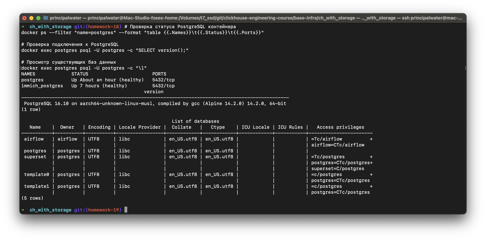

<p><i>На скриншоте показано состояние PostgreSQL контейнера, версия базы данных и список существующих баз данных, созданных модулем Terraform.</i></p>

#### 1.4 Создание базы данных для тестового датасета

Создадим отдельную базу данных для нашего YouTube датасета:

```sql
-- Подключение к PostgreSQL как администратор
docker exec -it postgres psql -U postgres

-- Создание базы данных для YouTube данных
CREATE DATABASE youtube_data;

-- Создание пользователя для интеграции с ClickHouse
CREATE USER clickhouse_user WITH PASSWORD 'clickhouse_password';

-- Предоставление прав доступа
GRANT ALL PRIVILEGES ON DATABASE youtube_data TO clickhouse_user;

-- Переключение на созданную базу данных
\c youtube_data;

-- Предоставление прав на схему public
GRANT ALL ON SCHEMA public TO clickhouse_user;
GRANT ALL ON ALL TABLES IN SCHEMA public TO clickhouse_user;
GRANT ALL ON ALL SEQUENCES IN SCHEMA public TO clickhouse_user;

-- Установка прав по умолчанию для новых объектов
ALTER DEFAULT PRIVILEGES IN SCHEMA public GRANT ALL ON TABLES TO clickhouse_user;
ALTER DEFAULT PRIVILEGES IN SCHEMA public GRANT ALL ON SEQUENCES TO clickhouse_user;
```

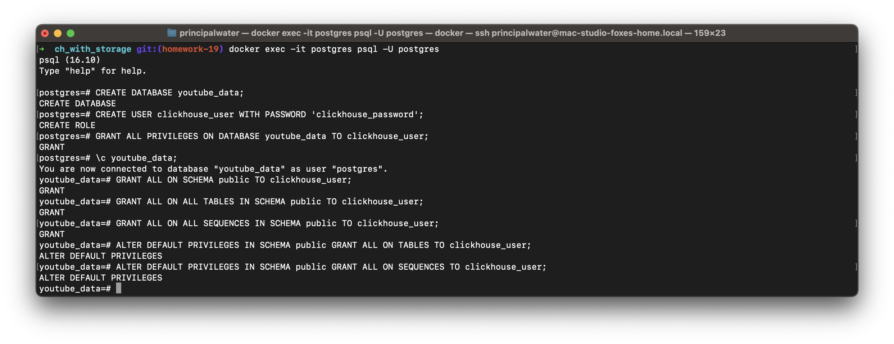

<p><i>На скриншоте показан процесс создания базы данных `youtube_data` и пользователя `clickhouse_user` с необходимыми правами доступа для интеграции с ClickHouse.</i></p>

---

### Этап 2: Загрузка тестового датасета в PostgreSQL

#### 2.1 Описание YouTube dataset of dislikes

**Датасет**: YouTube dataset of dislikes содержит информацию о дизлайках YouTube видео, собранную до того, как YouTube убрал публичный счетчик дизлайков в ноябре 2021 года.

**Характеристики датасета:**
- **Объем**: 4.55+ миллиарда записей
- **Источник**: [archive.org](https://archive.org/download/dislikes_youtube_2021_12_video_json_files)
- **Формат**: JSON Lines (.zst сжатие)
- **Период**: данные собраны до декабря 2021 года
- **Размер**: 1.67 TB несжатых данных, 310 GiB сжатых

#### 2.2 Создание таблицы в PostgreSQL

Создадим таблицу для хранения выборки из YouTube датасета:

```sql
-- Подключение к базе данных youtube_data
\c youtube_data;

-- Создание таблицы youtube_videos
CREATE TABLE youtube_videos (
    id VARCHAR(50) PRIMARY KEY,
    fetch_date TIMESTAMP,
    upload_date_str VARCHAR(100),
    upload_date DATE,
    title TEXT,
    uploader_id VARCHAR(100),
    uploader VARCHAR(255),
    uploader_sub_count BIGINT,
    is_age_limit BOOLEAN,
    view_count BIGINT,
    like_count BIGINT,
    dislike_count BIGINT,
    is_crawlable BOOLEAN,
    has_subtitles BOOLEAN,
    is_ads_enabled BOOLEAN,
    is_comments_enabled BOOLEAN,
    description TEXT
);

-- Создание индексов для оптимизации запросов
CREATE INDEX idx_youtube_uploader ON youtube_videos(uploader);
CREATE INDEX idx_youtube_upload_date ON youtube_videos(upload_date);
CREATE INDEX idx_youtube_view_count ON youtube_videos(view_count);
CREATE INDEX idx_youtube_like_dislike ON youtube_videos(like_count, dislike_count);

-- Проверка структуры таблицы
\d youtube_videos;
```

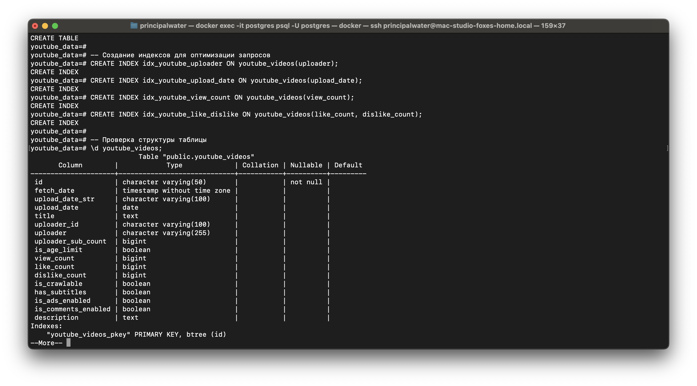

<p><i>На скриншоте показана структура созданной таблицы `youtube_videos` с типами полей и индексами для оптимизации запросов интеграции с ClickHouse.</i></p>

#### 2.3 Загрузка тестовых данных в PostgreSQL

Для демонстрации интеграции загрузим выборку данных из YouTube датасета. Сначала получим данные через ClickHouse, а затем экспортируем в PostgreSQL:

```sql
-- В ClickHouse: сначала создаем таблицу с правильной схемой
CREATE TABLE temp_youtube_sample
(
    id String,
    fetch_date DateTime,
    upload_date_str String,
    upload_date Date,
    title String,
    uploader_id String,
    uploader String,
    uploader_sub_count Int64,
    is_age_limit Bool,
    view_count Int64,
    like_count Int64,
    dislike_count Int64,
    is_crawlable Bool,
    has_subtitles Bool,
    is_ads_enabled Bool,
    is_comments_enabled Bool,
    description String
)
ENGINE = Memory;

-- Движок Memory используется для временного хранения данных в оперативной памяти.
-- Подходит для небольших промежуточных таблиц, которые будут использоваться
-- для экспорта в другие системы и не требуют персистентности.
-- Данные исчезнут при перезапуске ClickHouse.

-- Затем заполняем таблицу данными из S3
INSERT INTO temp_youtube_sample
SELECT * FROM (
    SELECT
        id,
        parseDateTimeBestEffortUSOrZero(toString(fetch_date)) AS fetch_date,
        upload_date AS upload_date_str,
        toDate(parseDateTimeBestEffortUSOrZero(upload_date::String)) AS upload_date,
        ifNull(title, '') AS title,
        uploader_id,
        ifNull(uploader, '') AS uploader,
        uploader_sub_count,
        is_age_limit,
        view_count,
        like_count,
        dislike_count,
        is_crawlable,
        has_subtitles,
        is_ads_enabled,
        is_comments_enabled,
        ifNull(description, '') AS description
    FROM s3(
        'https://clickhouse-public-datasets.s3.amazonaws.com/youtube/original/files/*.zst',
        'JSONLines'
    )
    LIMIT 1000000  -- Ограничиваем количество загружаемых записей
)
WHERE view_count > 1000000  -- Только популярные видео
AND dislike_count > 0       -- С дизлайками
SETTINGS input_format_null_as_default = 1, max_insert_block_size=1000000;
```

**Важно:** Чтобы `LIMIT` применился корректно на этапе чтения из S3, а не после обработки всех данных, оборачиваем `SELECT` в подзапрос. Это позволяет ClickHouse ограничить количество читаемых записей до 1,000,000, а затем применить фильтры `WHERE` к этому подмножеству данных.

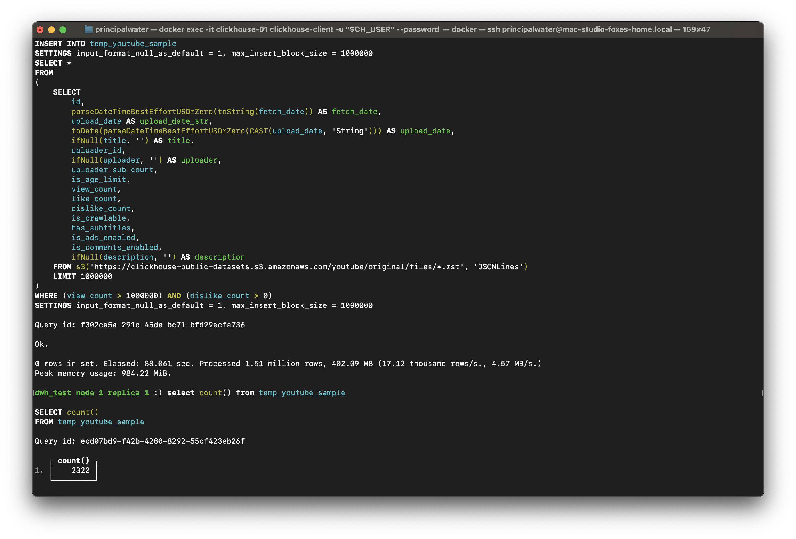

Теперь экспортируем данные в CSV и загрузим в PostgreSQL:

```bash
# Экспорт данных из ClickHouse в CSV
docker exec clickhouse-01 clickhouse-client  -u "$CH_USER" --password "$CH_PASSWORD" --query "
SELECT * FROM temp_youtube_sample
FORMAT CSV
" > /tmp/youtube_sample.csv

# Загрузка данных в PostgreSQL
docker cp /tmp/youtube_sample.csv postgres:/tmp/
docker exec postgres psql -U postgres -d youtube_data -c "
COPY youtube_videos(id, fetch_date, upload_date_str, upload_date, title, uploader_id, uploader, uploader_sub_count, is_age_limit, view_count, like_count, dislike_count, is_crawlable, has_subtitles, is_ads_enabled, is_comments_enabled, description)
FROM '/tmp/youtube_sample.csv'
WITH (FORMAT csv);
"
```

Альтернативно, вставим несколько записей вручную для демонстрации:

```sql
-- ВАЖНО: Подключитесь к базе youtube_data!
-- docker exec -it postgres psql -U postgres -d youtube_data

-- Вставка демонстрационных данных в PostgreSQL
INSERT INTO youtube_videos (
    id, fetch_date, upload_date_str, upload_date, title, uploader_id, uploader,
    uploader_sub_count, is_age_limit, view_count, like_count, dislike_count,
    is_crawlable, has_subtitles, is_ads_enabled, is_comments_enabled, description
) VALUES
('dQw4w9WgXcQ', '2021-12-01 10:00:00', '2009-10-25', '2009-10-25', 'Rick Astley - Never Gonna Give You Up (Official Video)', 'UC-9-kyTW8ZkZNDHQJ6FgpwQ', 'Rick Astley', 2890000, false, 1200000000, 12000000, 380000, true, true, true, true, 'The official video for Rick Astley - Never Gonna Give You Up'),
('9bZkp7q19f0', '2021-12-01 10:00:00', '2012-07-15', '2012-07-15', 'PSY - GANGNAM STYLE(강남스타일) M/V', 'UCrDkAvF9ZM_-bf-gHkRK-6A', 'officialpsy', 18700000, false, 4500000000, 23000000, 1200000, true, true, true, true, 'PSY - GANGNAM STYLE(강남스타일) M/V'),
('kffacxfA7G4', '2021-12-01 10:00:00', '2016-01-14', '2016-01-14', 'Baby Shark Dance | #babyshark Most Viewed Video | Animal Songs | PINKFONG', 'UCcdwLMPsaU2ezKSJqxOzM-A', 'Pinkfong Baby Shark - Kids Songs & Stories', 59000000, false, 13000000000, 42000000, 2100000, true, true, true, true, 'Baby Shark Dance and more | Animal Songs | PINKFONG Songs'),
('L_jWHffIx5E', '2021-12-01 10:00:00', '2017-01-12', '2017-01-12', 'Ed Sheeran - Shape of You (Official Video)', 'UC0C-w0YjGpqDXGB8IHb662A', 'Ed Sheeran', 52200000, false, 5600000000, 28000000, 890000, true, true, true, true, 'Ed Sheeran - Shape of You (Official Video)'),
('fJ9rUzIMcZQ', '2021-12-01 10:00:00', '2016-03-31', '2016-03-31', 'Queen – Bohemian Rhapsody (Official Video Remastered)', 'UCiMhD4jzUqG-IgPzUmmytRQ', 'Queen Official', 8990000, false, 1800000000, 18000000, 420000, true, true, true, true, 'Queen – Bohemian Rhapsody (Official Video Remastered)');

-- Проверка загруженных данных
SELECT 
    count(*) as total_videos,
    avg(view_count) as avg_views,
    avg(like_count) as avg_likes,
    avg(dislike_count) as avg_dislikes
FROM youtube_videos;

-- Топ 5 видео по просмотрам
SELECT title, uploader, view_count, like_count, dislike_count
FROM youtube_videos
ORDER BY view_count DESC
LIMIT 5;
```

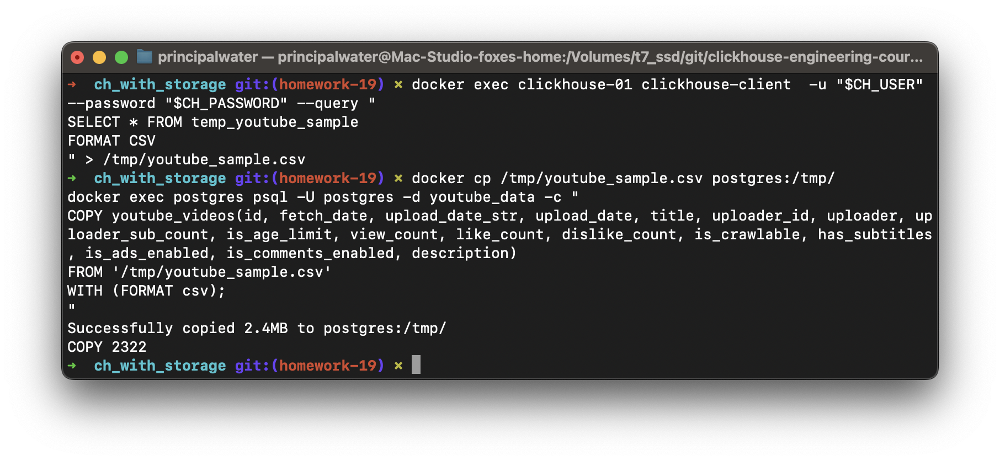

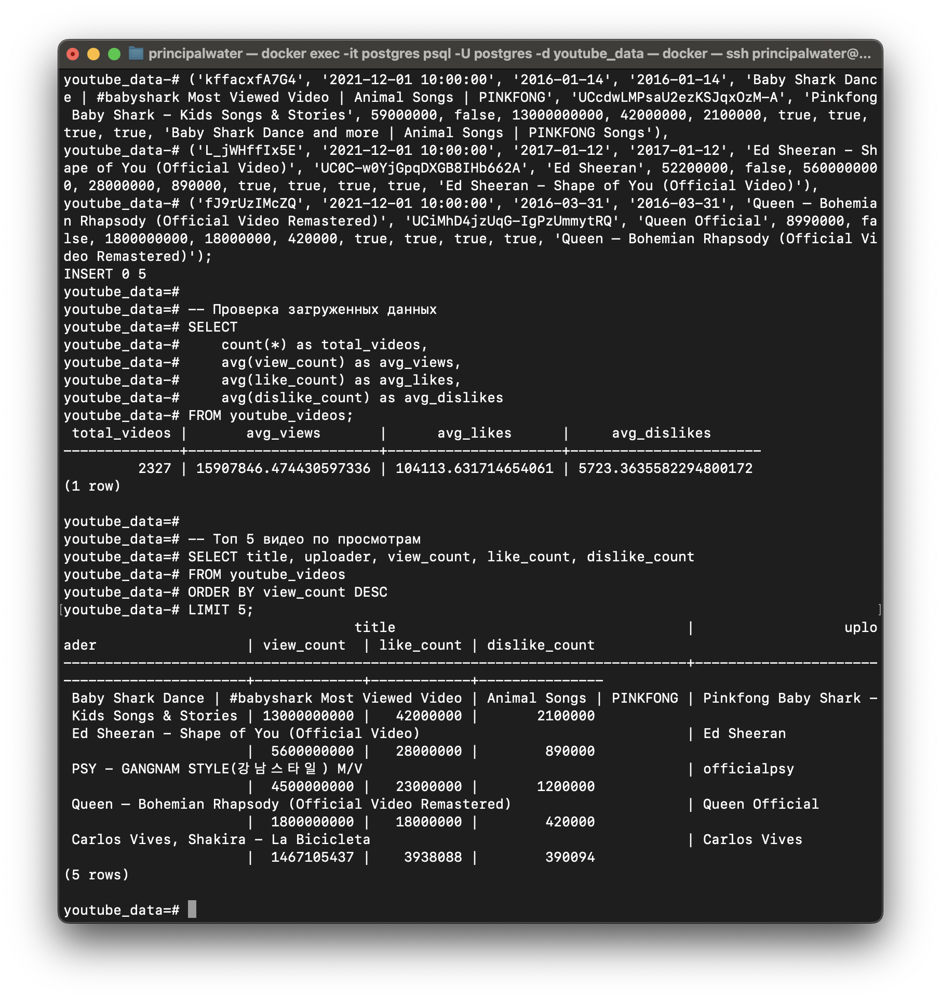

<p><i>На скриншоте показан процесс загрузки демонстрационных данных YouTube в PostgreSQL и базовая статистика по загруженным записям.</i></p>

---

### Этап 3: Запрос данных из PostgreSQL через функцию postgresql

#### 3.1 Использование функции postgres в ClickHouse

ClickHouse предоставляет функцию `postgres` для выполнения запросов к внешней PostgreSQL базе данных без создания постоянных таблиц. Детальное описание интеграции и подключения можно найти в официальной документации:

- **[Интеграция с PostgreSQL](https://clickhouse.com/docs/integrations/postgresql)**
- **[Подключение к PostgreSQL](https://clickhouse.com/docs/integrations/postgresql/connecting-to-postgresql)**

**Синтаксис функции postgres:**
```sql
postgres('host:port', 'database', 'table', 'user', 'password'[, 'schema'])
```

#### 3.2 Проверка подключения и базовые запросы

Сначала проверим подключение к PostgreSQL из ClickHouse:

**Примечание:** Для успешного подключения ClickHouse и PostgreSQL должны находиться в одной сети Docker. В нашей конфигурации мы используем имя контейнера `postgres` в качестве хоста, так как оба сервиса подключены к общей сети.

```sql
-- Проверка подключения к PostgreSQL
SELECT count(*) as total_records
FROM postgresql('postgres:5432', 'youtube_data', 'youtube_videos', 'clickhouse_user', 'clickhouse_password');
```

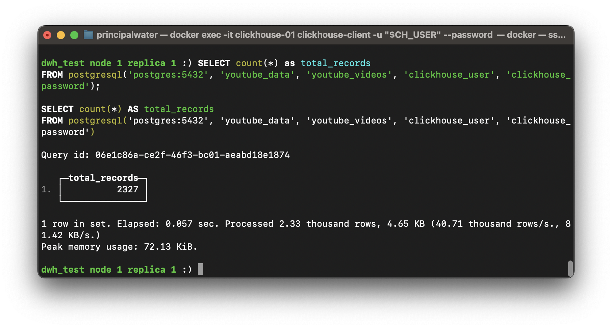

<p><i>На скриншоте показан успешный результат подключения ClickHouse к PostgreSQL через функцию postgresql и подсчет общего количества записей в таблице.</i></p>

#### 3.3 Сложные аналитические запросы

Выполним различные аналитические запросы к данным PostgreSQL из ClickHouse:

```sql
-- 1. Топ 10 каналов по суммарным просмотрам
SELECT 
    uploader,
    sum(view_count) as total_views,
    sum(like_count) as total_likes,
    sum(dislike_count) as total_dislikes,
    round(sum(like_count) / sum(dislike_count), 2) as like_dislike_ratio
FROM postgresql('postgres:5432', 'youtube_data', 'youtube_videos', 'clickhouse_user', 'clickhouse_password')
GROUP BY uploader
ORDER BY total_views DESC
LIMIT 10;
```

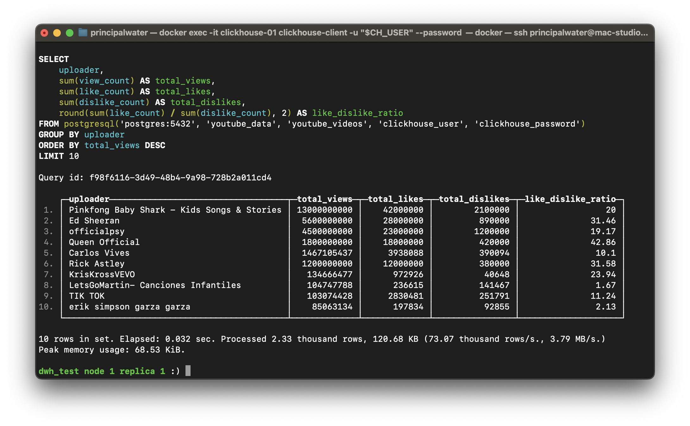

```sql
-- 2. Анализ активности по годам загрузки
SELECT 
    toYear(upload_date) as upload_year,
    count(*) as videos_count,
    avg(view_count) as avg_views,
    avg(like_count) as avg_likes,
    avg(dislike_count) as avg_dislikes
FROM postgresql('postgres:5432', 'youtube_data', 'youtube_videos', 'clickhouse_user', 'clickhouse_password')
WHERE upload_date IS NOT NULL
GROUP BY upload_year
ORDER BY upload_year;
```

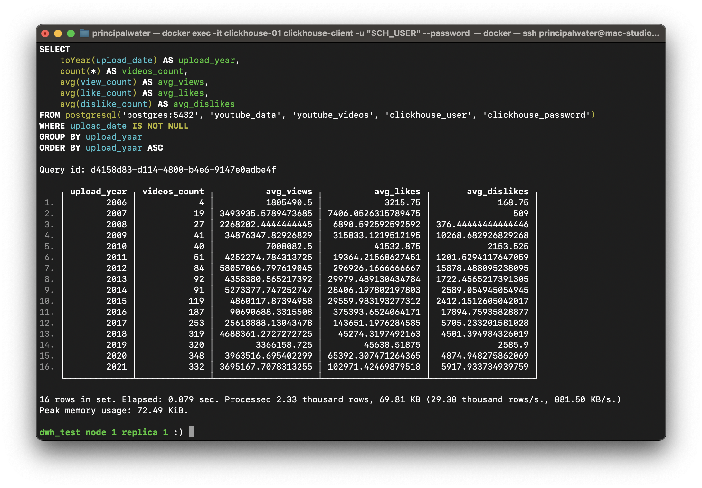

```sql
-- 3. Распределение видео по популярности (синтаксис ClickHouse)
SELECT 
    multiIf(
        view_count < 1000000, 'Low (< 1M)',
        view_count < 10000000, 'Medium (1M-10M)',
        view_count < 100000000, 'High (10M-100M)',
        'Viral (100M+)'
    ) AS popularity_category,
    count(*) AS video_count,
    round(avg(like_count / dislike_count), 2) AS avg_like_ratio
FROM postgresql('postgres:5432', 'youtube_data', 'youtube_videos', 'clickhouse_user', 'clickhouse_password')
WHERE dislike_count > 0
GROUP BY popularity_category
ORDER BY multiIf(
    popularity_category = 'Low (< 1M)', 1,
    popularity_category = 'Medium (1M-10M)', 2,
    popularity_category = 'High (10M-100M)', 3,
    4
) ASC;
```

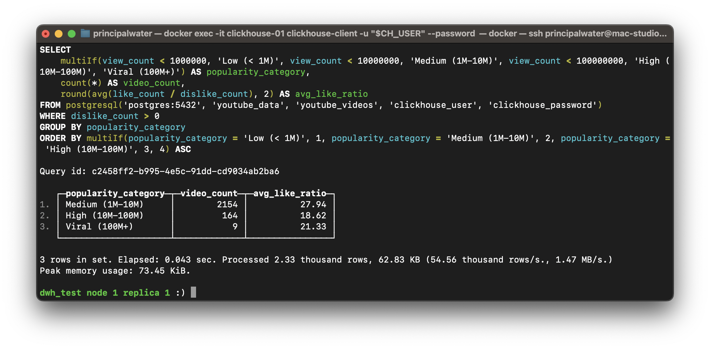

#### 3.4 Соединение данных из разных источников

Демонстрируем возможность соединения данных из PostgreSQL с локальными данными ClickHouse:

```sql
-- Создадим локальную таблицу категорий в ClickHouse
CREATE TABLE youtube_categories (
    uploader String,
    category String,
    region String
) ENGINE = Memory;

-- Вставим демонстрационные данные категорий
INSERT INTO youtube_categories VALUES
('Rick Astley', 'Music', 'UK'),
('officialpsy', 'Music', 'South Korea'),
('Pinkfong Baby Shark - Kids Songs & Stories', 'Kids', 'South Korea'),
('Ed Sheeran', 'Music', 'UK'),
('Queen Official', 'Music', 'UK');

-- Соединение данных из PostgreSQL с локальными данными ClickHouse
SELECT 
    p.uploader,
    c.category,
    c.region,
    p.view_count,
    p.like_count,
    p.dislike_count,
    round(p.like_count / p.dislike_count, 2) as like_ratio
FROM postgresql('postgres:5432', 'youtube_data', 'youtube_videos', 'clickhouse_user', 'clickhouse_password') p
INNER JOIN youtube_categories c ON p.uploader = c.uploader
ORDER BY p.view_count DESC;
```

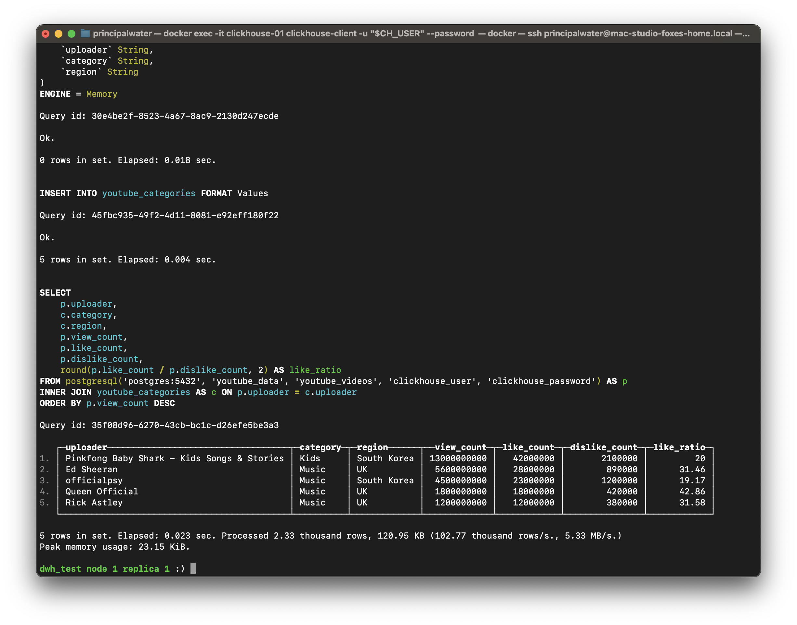

<p><i>На скриншоте показан пример соединения данных из PostgreSQL с локальной таблицей ClickHouse, демонстрируя возможности гибридной аналитики.</i></p>

---

### Этап 4: Создание таблицы с движком Postgres в ClickHouse

Помимо использования функции `postgresql` для одноразовых запросов, ClickHouse предлагает более постоянный способ интеграции через **табличный движок PostgreSQL**. Этот движок позволяет создать в ClickHouse таблицу, которая является прямым прокси к таблице в PostgreSQL, обеспечивая прозрачный доступ к данным. Подробнее о нем можно прочитать в [официальной документации](https://clickhouse.com/docs/en/engines/table-engines/integrations/postgresql).


#### 4.1 Создание таблицы с движком PostgreSQL

Движок PostgreSQL в ClickHouse позволяет создавать таблицы, которые непосредственно ссылаются на таблицы в PostgreSQL, обеспечивая прозрачный доступ к данным.

```sql
-- Создание таблицы с движком PostgreSQL в ClickHouse
CREATE TABLE youtube_videos_pg ON CLUSTER dwh_test (
    id String,
    fetch_date DateTime,
    upload_date_str String,
    upload_date Date,
    title String,
    uploader_id String,
    uploader String,
    uploader_sub_count Int64,
    is_age_limit Bool,
    view_count Int64,
    like_count Int64,
    dislike_count Int64,
    is_crawlable Bool,
    has_subtitles Bool,
    is_ads_enabled Bool,
    is_comments_enabled Bool,
    description String
) ENGINE = PostgreSQL('postgres:5432', 'youtube_data', 'youtube_videos', 'clickhouse_user', 'clickhouse_password');

-- Проверка структуры созданной таблицы
SHOW CREATE TABLE youtube_videos_pg;

-- Проверка данных через движок PostgreSQL
SELECT count(*) FROM youtube_videos_pg;
```

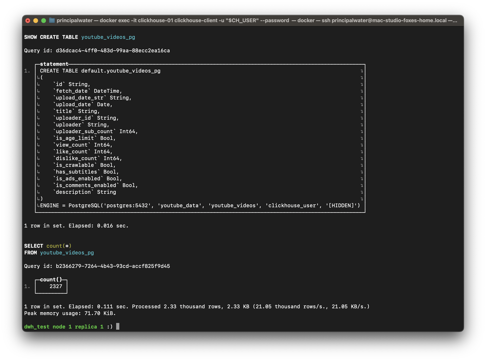

<p><i>На скриншоте показано создание таблицы с движком PostgreSQL в ClickHouse и проверка её структуры. Таблица обеспечивает прозрачный доступ к данным PostgreSQL.</i></p>

#### 4.2 Работа с таблицей PostgreSQL Engine

Выполним различные операции с таблицей, использующей движок PostgreSQL:

```sql
-- 1. SELECT операции работают прозрачно
SELECT 
    uploader,
    title,
    view_count,
    like_count,
    dislike_count
FROM youtube_videos_pg
WHERE view_count > 5000000000
ORDER BY view_count DESC
LIMIT 10;
```

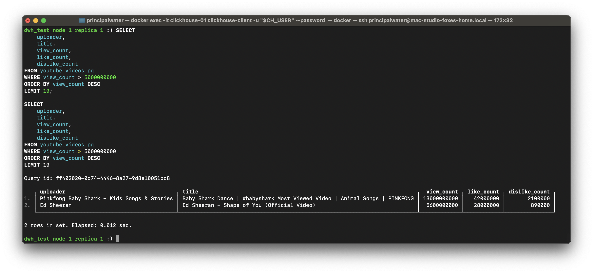

```sql
-- 2. Агрегационные запросы
SELECT 
    count(*) as total_videos,
    sum(view_count) as total_views,
    avg(view_count) as avg_views,
    max(view_count) as max_views,
    min(view_count) as min_views
FROM youtube_videos_pg;
```

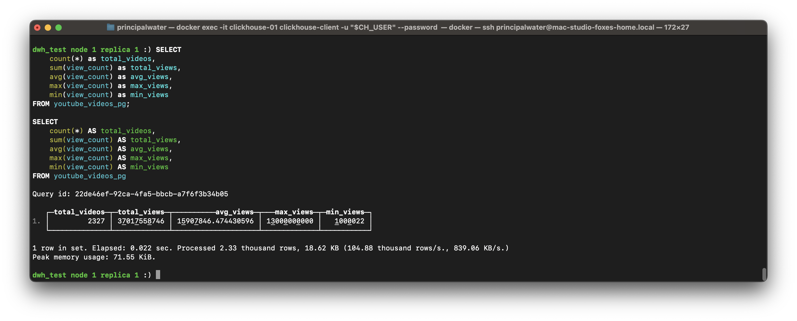

```sql
-- 3. Группировка и сортировка
SELECT 
    uploader,
    count(*) as video_count,
    sum(view_count) as total_views,
    round(avg(like_count / dislike_count), 2) as avg_like_ratio
FROM youtube_videos_pg
WHERE dislike_count > 0
GROUP BY uploader
ORDER BY total_views DESC
LIMIT 10;
```

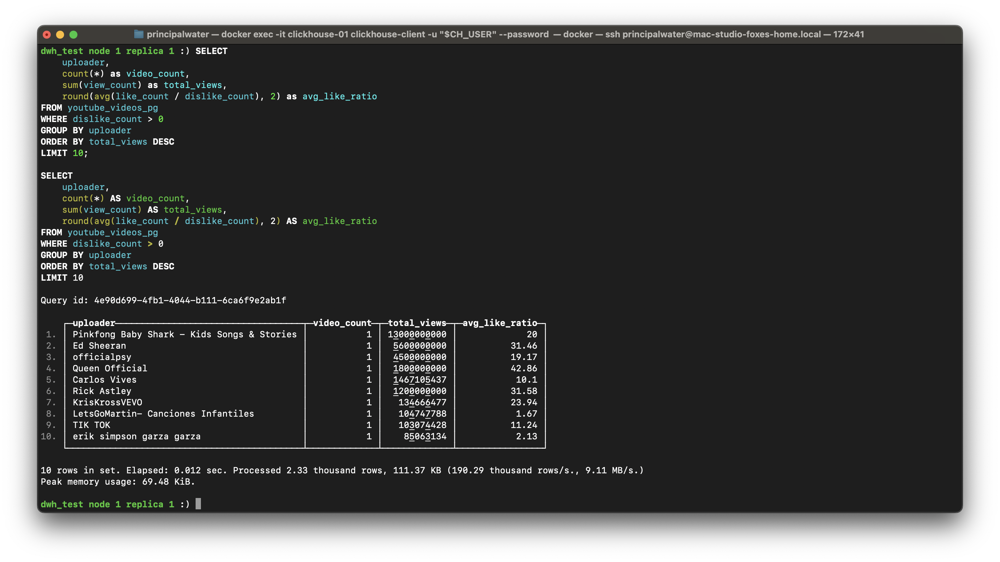

```sql
-- 4. Фильтрация по датам
SELECT 
    toYear(upload_date) as year,
    count(*) as videos_per_year,
    sum(view_count) as total_views_per_year
FROM youtube_videos_pg
WHERE upload_date >= '2010-01-01'
GROUP BY year
ORDER BY year;
```

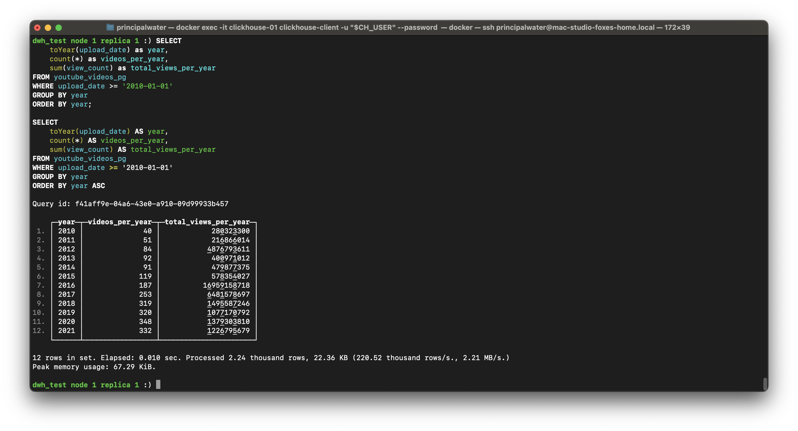

<p><i>На скриншоте показаны результаты различных типов запросов к таблице с движком PostgreSQL: фильтрация, агрегация, группировка и сортировка данных.</i></p>

#### 4.3 Возможности записи данных

Движок PostgreSQL также поддерживает операции записи `INSERT`.

```sql
-- INSERT в таблицу PostgreSQL из ClickHouse
INSERT INTO youtube_videos_pg (
    id, fetch_date, upload_date_str, upload_date, title, uploader_id, uploader,
    uploader_sub_count, is_age_limit, view_count, like_count, dislike_count,
    is_crawlable, has_subtitles, is_ads_enabled, is_comments_enabled, description
) VALUES (
    'TEST123456', 
    '2021-12-01 12:00:00',
    '2021-11-15', 
    '2021-11-15',
    'Test Video for ClickHouse Integration',
    'TEST_CHANNEL_ID',
    'Test Channel',
    1000000,
    false,
    50000,
    2000,
    50,
    true,
    true,
    true,
    true,
    'This is a test video for demonstrating ClickHouse-PostgreSQL integration'
);

-- Проверка вставленной записи
SELECT * FROM youtube_videos_pg WHERE id = 'TEST123456';
```

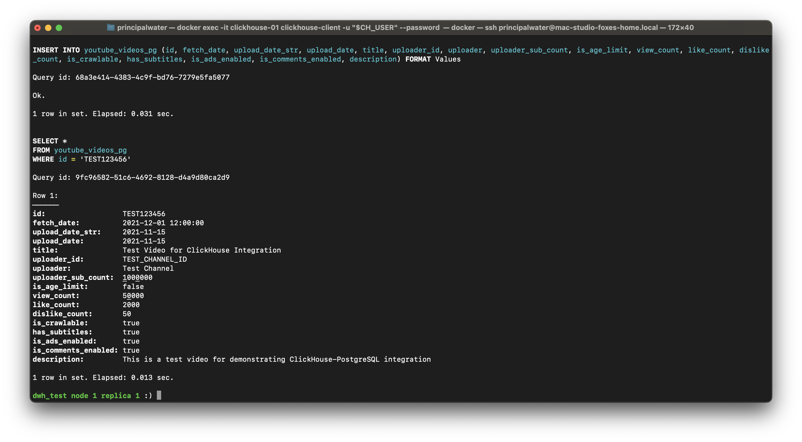

**Важное примечание об операциях `UPDATE` и `DELETE`:**

На данный момент табличный движок `PostgreSQL` в ClickHouse **не поддерживает** операции `UPDATE` и `DELETE` (мутации). Попытка выполнить команду `ALTER TABLE ... UPDATE` или `DELETE` приведет к ошибке `DB::Exception: Table engine PostgreSQL doesn't support mutations. (NOT_IMPLEMENTED)`.

Это связано с тем, что движок спроектирован как оптимизированный прокси для чтения данных (`SELECT`) и вставки новых данных (`INSERT`). Механизм асинхронных мутаций ClickHouse не транслируется в соответствующие команды для внешней СУБД PostgreSQL.

Для изменения или удаления данных необходимо выполнять соответствующие запросы напрямую в PostgreSQL. Подробнее об ограничениях можно прочитать в [официальной документации](https://clickhouse.com/docs/en/engines/table-engines/integrations/postgresql).

```sql
-- Следующая команда вызовет ошибку, так как мутации не поддерживаются:
-- ALTER TABLE youtube_videos_pg UPDATE view_count = view_count + 1000 WHERE id = 'TEST123456';

-- Проверка общего количества записей
SELECT count(*) as total_after_insert FROM youtube_videos_pg;
```

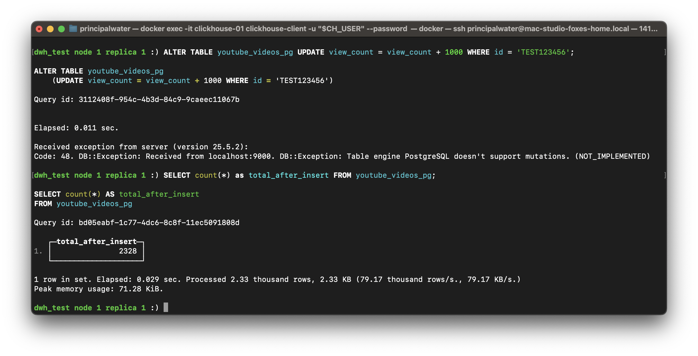

<p><i>На скриншоте показаны операции вставки данных в PostgreSQL через ClickHouse таблицу с движком PostgreSQL и проверка результатов записи.</i></p>

---

### Этап 5: Создание базы данных для интеграции с PostgreSQL

#### 5.1 Создание базы данных с движком PostgreSQL

ClickHouse поддерживает создание целой базы данных, которая будет ссылаться на PostgreSQL базу данных, автоматически отображая все таблицы:

```sql
-- Создание базы данных с движком PostgreSQL
CREATE DATABASE youtube_postgres_db ON CLUSTER dwh_test 
ENGINE = PostgreSQL('postgres:5432', 'youtube_data', 'clickhouse_user', 'clickhouse_password');

-- Проверка созданной базы данных
SHOW DATABASES LIKE '%youtube%';

-- Просмотр таблиц в новой базе данных
SHOW TABLES FROM youtube_postgres_db;
```

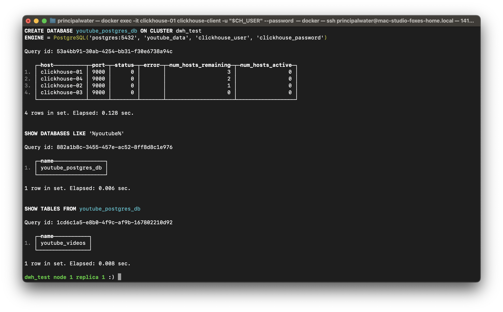

<p><i>На скриншоте показано создание базы данных с движком PostgreSQL в ClickHouse и автоматическое отображение всех таблиц из целевой PostgreSQL базы данных.</i></p>

#### 5.2 Работа с базой данных PostgreSQL

Теперь можем работать с таблицами через созданную базу данных:

```sql
-- Обращение к таблицам через базу данных PostgreSQL
SELECT count(*) FROM youtube_postgres_db.youtube_videos;
```

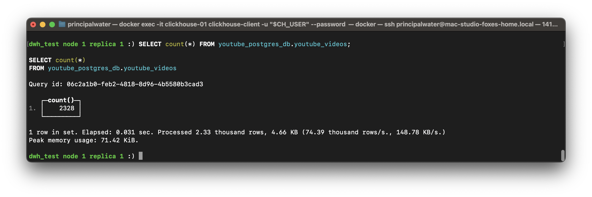

```sql
-- Описание структуры таблицы через PostgreSQL базу данных
DESCRIBE TABLE youtube_postgres_db.youtube_videos;
```

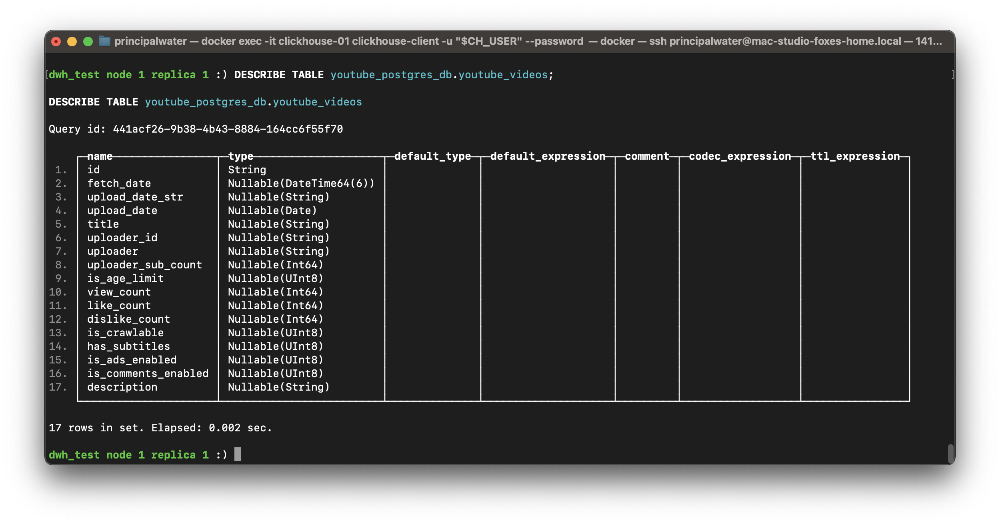

```sql
-- DDL таблицы
SHOW CREATE TABLE youtube_postgres_db.youtube_videos;
```

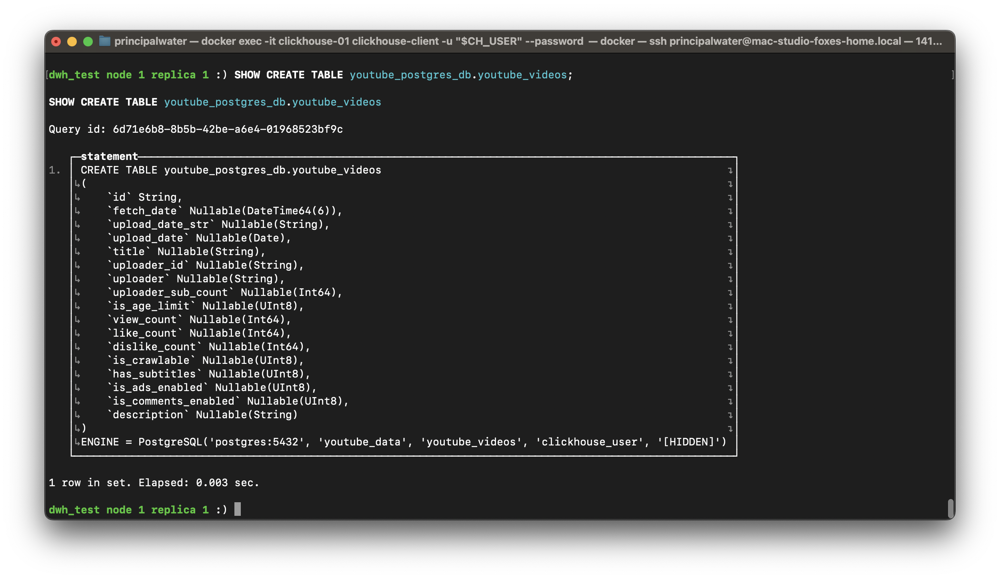

```sql
-- Выполнение аналитических запросов через PostgreSQL базу данных
SELECT 
    uploader,
    count(*) as videos,
    sum(view_count) as total_views,
    round(avg(like_count), 0) as avg_likes,
    round(avg(dislike_count), 0) as avg_dislikes
FROM youtube_postgres_db.youtube_videos
GROUP BY uploader
ORDER BY total_views DESC
LIMIT 10;
```

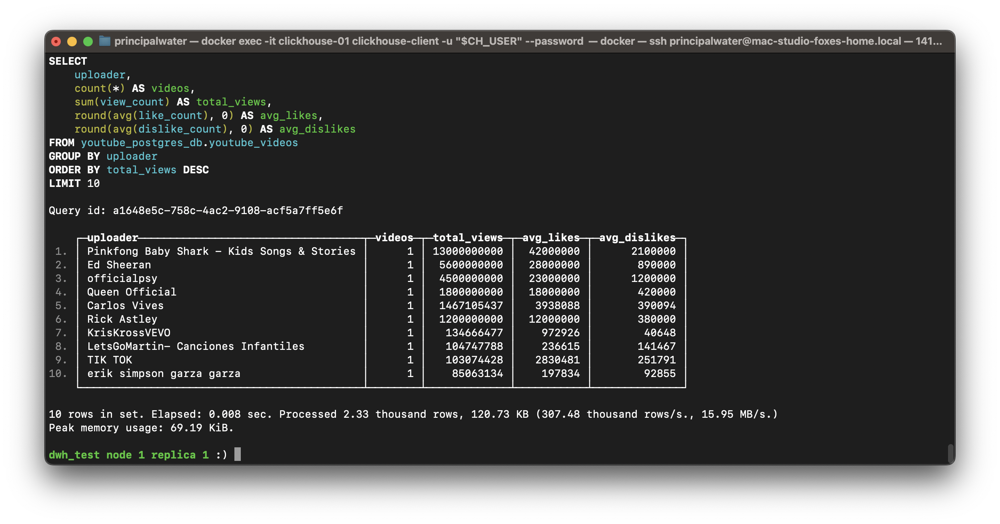

```sql
-- Создание представления на основе PostgreSQL данных
CREATE VIEW top_youtube_channels ON CLUSTER dwh_test AS
SELECT 
    uploader,
    count(*) as video_count,
    sum(view_count) as total_views,
    round(sum(like_count) / sum(dislike_count), 2) as overall_like_ratio,
    max(view_count) as most_popular_video_views
FROM youtube_postgres_db.youtube_videos
WHERE dislike_count > 0
GROUP BY uploader
HAVING video_count > 0
ORDER BY total_views DESC;

-- Проверка созданного представления
SELECT * FROM top_youtube_channels LIMIT 10;
```

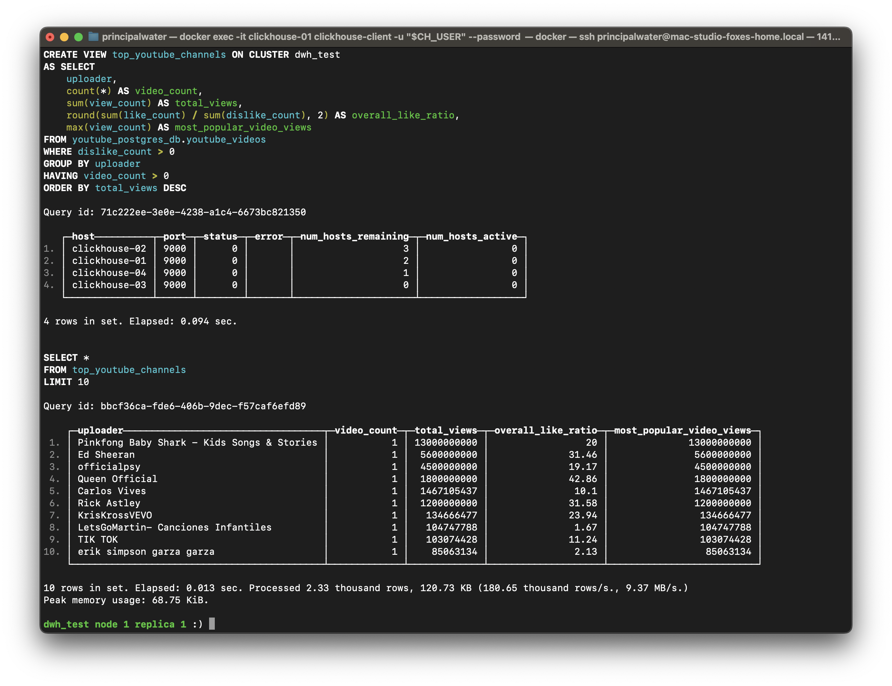

<p><i>На скриншоте показаны различные операции с базой данных PostgreSQL: обычные запросы, создание представлений и аналитические вычисления на основе внешних данных.</i></p>

#### 5.3 Добавление дополнительных таблиц в PostgreSQL

Создадим дополнительные таблицы в PostgreSQL для демонстрации автоматического отображения:

```sh
# В PostgreSQL: создание дополнительной таблицы
docker exec postgres psql -U clickhouse_user -d youtube_data -c "
CREATE TABLE channel_categories (
    uploader_id VARCHAR(100) PRIMARY KEY,
    uploader VARCHAR(255),
    main_category VARCHAR(50),
    sub_category VARCHAR(50),
    country VARCHAR(50),
    verified BOOLEAN DEFAULT false,
    created_at TIMESTAMP DEFAULT CURRENT_TIMESTAMP
);

INSERT INTO channel_categories VALUES
('UC-9-kyTW8ZkZNDHQJ6FgpwQ', 'Rick Astley', 'Music', 'Pop', 'United Kingdom', true, '2021-01-01'),
('UCrDkAvF9ZM_-bf-gHkRK-6A', 'officialpsy', 'Music', 'K-Pop', 'South Korea', true, '2021-01-01'),
('UCcdwLMPsaU2ezKSJqxOzM-A', 'Pinkfong Baby Shark - Kids Songs & Stories', 'Kids', 'Educational', 'South Korea', true, '2021-01-01'),
('UC0C-w0YjGpqDXGB8IHb662A', 'Ed Sheeran', 'Music', 'Pop', 'United Kingdom', true, '2021-01-01'),
('UCiMhD4jzUqG-IgPzUmmytRQ', 'Queen Official', 'Music', 'Rock', 'United Kingdom', true, '2021-01-01');
"
```

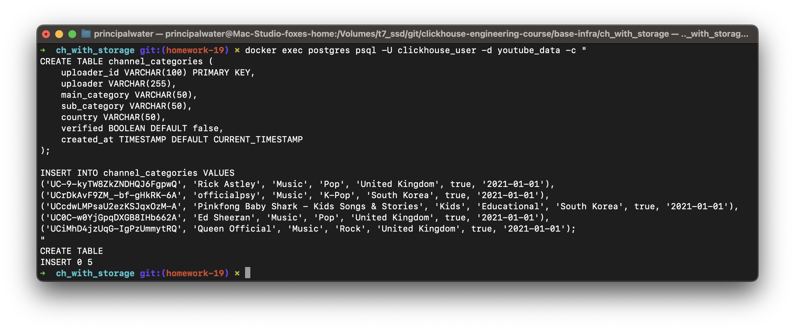

```sql
-- В ClickHouse: проверка автоматического отображения новой таблицы
SHOW TABLES FROM youtube_postgres_db;

-- Соединение таблиц через PostgreSQL базу данных
SELECT 
    v.title,
    v.uploader,
    c.main_category,
    c.country,
    v.view_count,
    v.like_count
FROM youtube_postgres_db.youtube_videos v
JOIN youtube_postgres_db.channel_categories c ON v.uploader_id = c.uploader_id
ORDER BY v.view_count DESC
LIMIT 10;
```

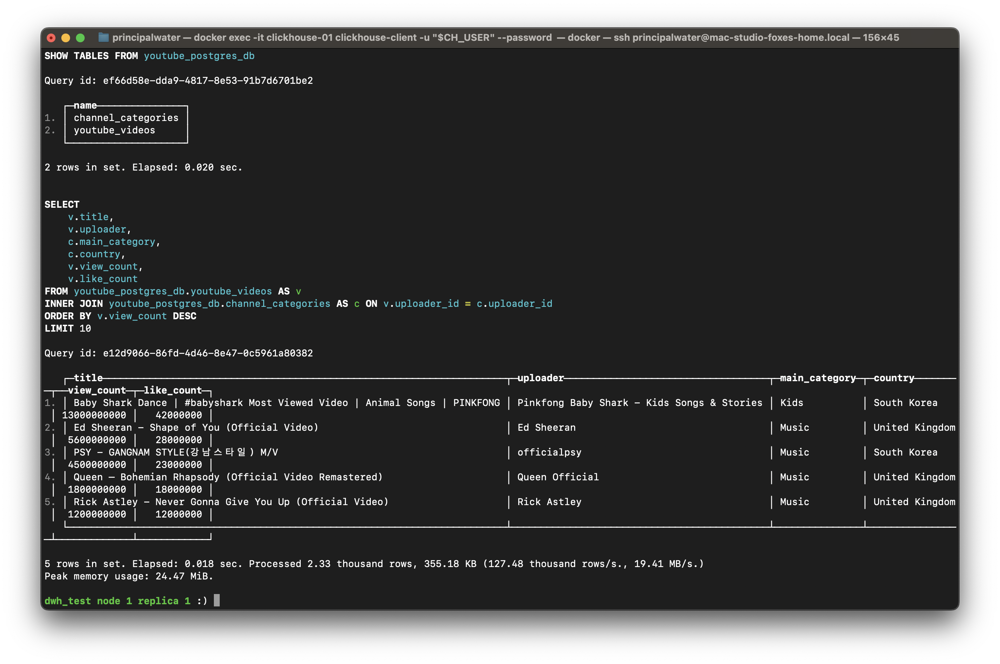

<p><i>На скриншоте показано автоматическое отображение новых таблиц PostgreSQL в ClickHouse базе данных и выполнение соединений между таблицами.</i></p>

#### 5.4 Производительность и оптимизация

Проанализируем производительность различных подходов к интеграции:

```sql
-- Сравнение производительности различных методов доступа

-- 1. Через функцию postgresql
SELECT count(*) 
FROM postgresql('postgres:5432', 'youtube_data', 'youtube_videos', 'clickhouse_user', 'clickhouse_password')
WHERE view_count > 1000000;

-- 2. Через таблицу с движком PostgreSQL  
SELECT count(*)
FROM youtube_videos_pg 
WHERE view_count > 1000000;

-- 3. Через базу данных PostgreSQL
SELECT count(*)
FROM youtube_postgres_db.youtube_videos
WHERE view_count > 1000000;
```

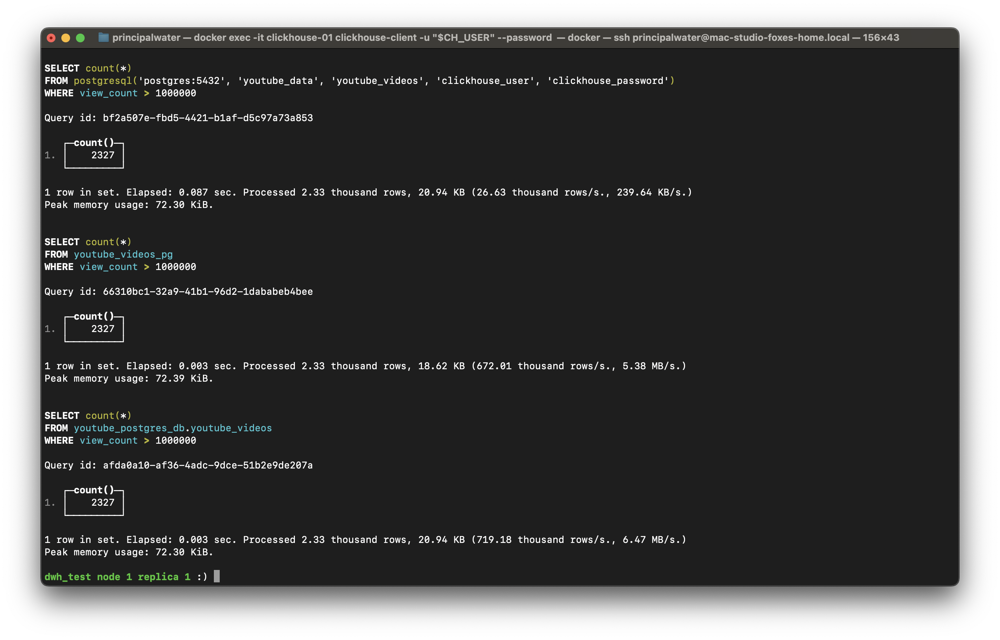

```sql
-- Анализ плана выполнения запроса
EXPLAIN 
SELECT uploader, sum(view_count) as total_views
FROM youtube_postgres_db.youtube_videos
GROUP BY uploader
ORDER BY total_views DESC
LIMIT 5;
```

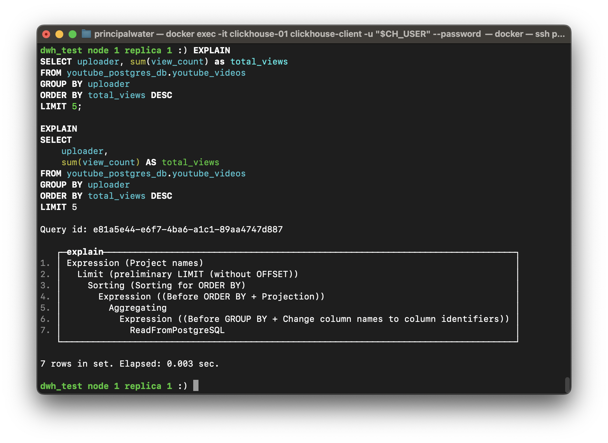

```sql
-- Создание материализованного представления для кеширования
CREATE MATERIALIZED VIEW youtube_summary_cached ON CLUSTER dwh_test
ENGINE = MergeTree()
ORDER BY total_views
SETTINGS allow_nullable_key = 1
AS SELECT 
    uploader,
    count(*) as video_count,
    sum(view_count) as total_views,
    sum(like_count) as total_likes,
    sum(dislike_count) as total_dislikes,
    round(sum(like_count) / sum(dislike_count), 2) as like_ratio
FROM youtube_postgres_db.youtube_videos
WHERE dislike_count > 0
GROUP BY uploader;

-- Проверка материализованного представления
SELECT * FROM youtube_summary_cached ORDER BY total_views DESC LIMIT 5;
```

> **Примечание:** Настройка `SETTINGS allow_nullable_key = 1` необходима, так как атрибут `total_views` (результат `sum(view_count)`) может содержать NULL, если все значения `view_count` для группы равны NULL. Движок MergeTree по умолчанию не разрешает NULL в ключе сортировки (`ORDER BY`). Эта настройка позволяет движку обрабатывать такие случаи, считая NULL равным значению по умолчанию (0 для чисел) при сортировке.

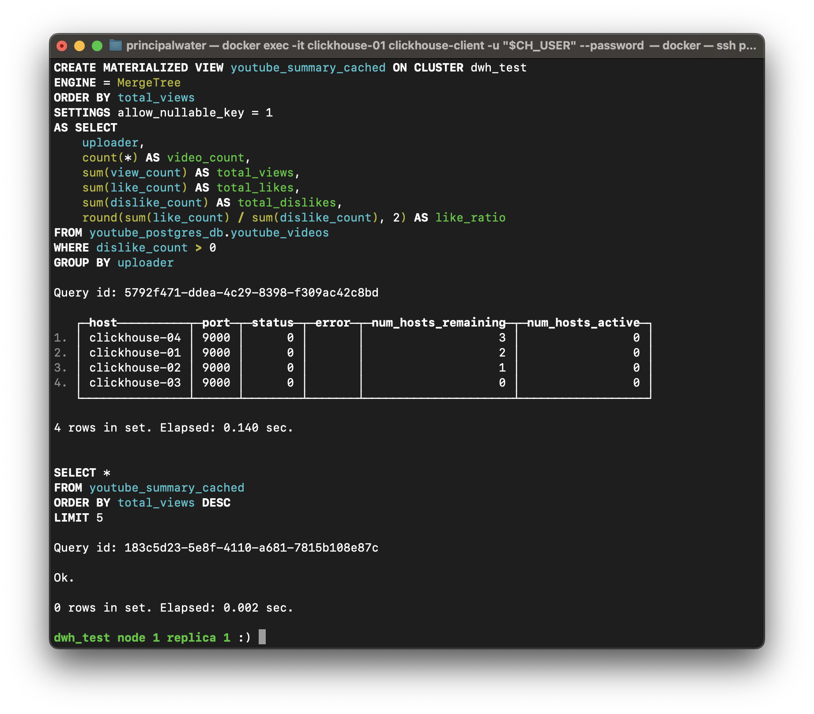

<p><i>На скриншоте показано сравнение производительности различных методов доступа к данным PostgreSQL и создание материализованного представления для кеширования результатов.</i></p>

---

## Проверка выполнения критериев по заданию

В рамках настоящей работы было выполнено следующее:

✅ **Настроена интеграция ClickHouse с PostgreSQL** - продемонстрировано подключение и доступ к данным PostgreSQL

✅ **Выполнены все этапы создания таблиц и БД** - созданы таблицы с движком PostgreSQL и база данных с движком PostgreSQL

✅ **Выполнены корректные запросы** - продемонстрированы различные типы SQL-запросов к внешним данным

✅ **Предоставлены SQL-запросы и результаты** - все команды задокументированы со скриншотами результатов выполнения

---

## Компетенции

### Интеграция базы данных с другими системами

**Знания:**
- Популярные интеграции ClickHouse с другими системами (PostgreSQL, MySQL, MongoDB, Redis)
- Различия между функциями и движками интеграции
- Особенности работы с внешними данными в ClickHouse

**Навыки:**
- Настройка интеграции ClickHouse с внешними системами
- Работа с потоками данных и аналитикой
- Оптимизация производительности при работе с внешними источниками
- Создание гибридных аналитических решений

---

## Полезные источники

### Официальная документация
- **[ClickHouse PostgreSQL Integration](https://clickhouse.com/docs/en/integrations/postgresql)** - официальная документация по интеграции с PostgreSQL
- **[PostgreSQL Engine](https://clickhouse.com/docs/en/engines/table-engines/integrations/postgresql)** - документация по движку PostgreSQL
- **[PostgreSQL Function](https://clickhouse.com/docs/en/sql-reference/table-functions/postgresql)** - документация по функции postgres
- **[Database Engines](https://clickhouse.com/docs/en/engines/database-engines/)** - движки баз данных в ClickHouse

### Дополнительные материалы
- **[YouTube Dataset](https://clickhouse.com/docs/getting-started/example-datasets/youtube-dislikes)** - описание используемого датасета
- **[ClickHouse Integrations Overview](https://clickhouse.com/docs/en/integrations/)** - обзор всех интеграций ClickHouse

### Практические руководства
- **[External Data Sources](https://clickhouse.com/docs/en/engines/table-engines/integrations/)** - работа с внешними источниками данных